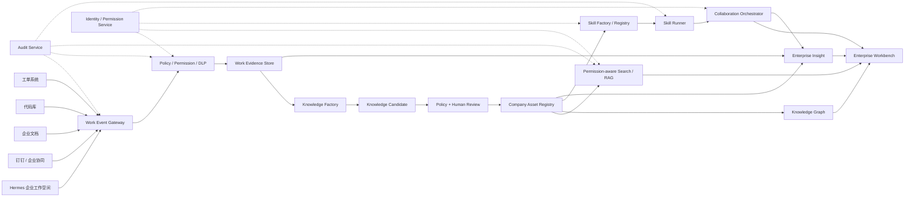
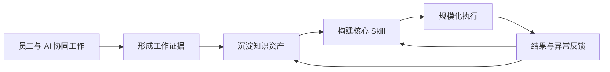

# Hermes 企业 AI 工作台扩展设计

- 状态：未来产品扩展设计基线
- 日期：2026-07-28
- 依赖：[Hermes Connector 商用首发架构](2026-07-28-hermes-connector-commercial-architecture-design.md)
- 目标客户：中国大陆企业客户
- 采集范围：Hermes 企业工作空间 + 企业明确授权的业务系统
- 交付范围：共享 SaaS、专属数据平面、联网私有化、完全离线私有化

面向未来的“可信数据与能力底座、员工动态工作台、双层 Hermes Agent 迭代循环”
设计见
[`2026-07-28-hermes-agent-native-enterprise-operating-model-design.md`](2026-07-28-hermes-agent-native-enterprise-operating-model-design.md)。

工作过程信息、文件、内部与外部系统数据，以及 Agent 协作中的权限、血缘、保留、
删除传播和先进技术栈的详细基线见
[`2026-07-29-hermes-agent-native-data-governance-and-ai-data-platform-design.md`](2026-07-29-hermes-agent-native-data-governance-and-ai-data-platform-design.md)。

## 1. 产品定位

Hermes 企业 AI 工作台不是员工设备监控软件，而是企业工作过程、知识资产和
可复用执行能力的统一平台。

平台在员工可见、企业制度授权、用途明确和最小必要的前提下，将日常工作中的
任务、决策、文档、代码、工单、AI 会话、工具结果和交付物转化为：

1. 可追溯的工作证据；
2. 可审核的知识候选；
3. 可复用的公司知识资产；
4. 可执行的公司核心 Skill；
5. 可协同的人机工作流；
6. 可治理的企业能力地图。

产品目标不是记录员工做过的每一步，而是回答以下问题：

- 公司已经形成了哪些可复用能力；
- 哪些关键知识只存在于少数员工或单个项目中；
- 哪些流程存在重复劳动、交接断点和长期异常；
- 哪些经验可以被固化为 Skill；
- 哪些知识已经过期、冲突或缺少责任人；
- AI 和员工如何在明确权限下共同完成工作。

## 2. 已确认边界

| 决策项 | 已确认选择 |
|---|---|
| 工作来源 | Hermes 企业工作空间 + 授权企业系统 |
| 外部系统接入 | 管理员授权的 API、Webhook、企业应用和服务账号 |
| 设备级监控 | 不采集屏幕、键盘、私人账号和非工作时间活动 |
| 资产治理 | 低风险策略发布并抽检；重要资产必须人工审批 |
| 管理可见性 | 角色、项目和用途分层可见 |
| 员工原始内容 | 不默认向经理或全公司开放 |
| 员工评价 | 不按在线时长、提示词数量或键盘活动排名 |
| 人事决策 | 不允许系统单独作出晋升、淘汰或薪酬决定 |
| 企业交付 | SaaS、专属数据平面、联网私有化、完全离线私有化 |

## 3. 目标与非目标

### 3.1 目标

1. 建立统一 Work Event Contract，接收 Hermes 与企业系统的工作事件。
2. 保留来源权限和证据链，不因进入知识库而扩大访问范围。
3. 将原始工作内容分层转化为知识和 Skill。
4. 建立公司核心 Skill 的定义、审核、发布、执行和持续优化机制。
5. 建立员工、AI Agent、经理、专家和安全人员之间的工作协同对象。
6. 建立权限感知的全文、向量和关系检索。
7. 为管理者提供流程、资产和风险洞察，不建设隐蔽员工监控。
8. 在四种部署模式中使用相同协议、数据模型和产品内核。

### 3.2 非目标

1. 不截取员工屏幕、键盘、摄像头或麦克风。
2. 不采集私人聊天、私人邮箱和非企业账号。
3. 不将所有采集内容自动变成公司公开知识。
4. 不让向量数据库或搜索引擎绕过业务权限。
5. 不用单一 AI 评分替代管理判断。
6. 不以提示词数量、在线时间或消息数量代表员工价值。
7. 不把个人空间内容自动迁移到企业空间。
8. 不因为内容属于公司知识产权而忽略其中的个人信息权益。

## 4. 产品模块

企业 AI 工作台由七个产品模块组成：

| 模块 | 职责 |
|---|---|
| Enterprise Workspace | 企业、部门、项目、工作空间和成员关系 |
| Work Collaboration | 任务、分工、审批、交接、异常和复盘 |
| Knowledge Hub | 证据、知识候选、正式资产、搜索和知识图谱 |
| Skill Center | Skill 设计、测试、审批、发布、执行和运营 |
| Data Governance | 数据分类、权限、DLP、保留、删除和审计 |
| Enterprise Insight | 流程瓶颈、资产复用、知识缺口和运行风险 |
| Integration Center | Hermes、钉钉、企业文档、代码库和工单接入 |

## 5. 总体架构



## 6. 企业空间与个人空间

### 6.1 空间模型

```text
Tenant
  ├─ Personal Workspace
  └─ Enterprise Workspace
       ├─ Department Workspace
       ├─ Project Workspace
       └─ Restricted Workspace
```

企业空间和个人空间必须具备不同的：

- 数据控制者；
- 成员关系；
- 密钥；
- 保留策略；
- 模型路由；
- 外部连接器；
- 审计策略；
- 数据导出和删除流程。

员工在企业空间创建的工作内容按企业制度和合同处理，但系统仍需要识别其中的
个人信息、第三方信息和受限数据。员工离职后：

- 企业正式资产继续由企业保留；
- 资产 Steward 转交给新的责任人；
- 员工访问权立即撤销；
- 原始工作证据按保留规则处理；
- 个人空间不得自动转移给企业；
- 员工可以查看离职前适用的数据处理说明和行权渠道。

## 7. Work Event Contract

### 7.1 工作事件

所有来源统一转换为 Work Event：

```json
{
  "event_id": "wev_01...",
  "tenant_id": "ten_01...",
  "workspace_id": "wsp_01...",
  "project_id": "prj_01...",
  "source_type": "hermes|dingtalk|document|git|ticket",
  "source_object_id": "source-native-id",
  "event_type": "task.completed",
  "actor_id": "usr_01...",
  "occurred_at": "2026-07-28T10:00:00Z",
  "purpose": "project_delivery",
  "classification": "internal",
  "acl_snapshot_id": "acl_01...",
  "content_ref": "obj_01...",
  "content_hash": "sha256:...",
  "retention_policy_id": "ret_01...",
  "notice_version": "notice_v3"
}
```

### 7.2 必须保留的来源证据

- 来源系统和原始对象 ID；
- 作者和组织身份；
- 发生时间和采集时间；
- Workspace、Project 和业务用途；
- 来源 ACL 快照；
- 内容摘要和证据哈希；
- 数据分类和保留策略；
- 适用的员工告知版本；
- 后续脱敏、转换和审批记录。

Work Event 不直接等同于公司知识资产。

### 7.3 企业系统接入

外部系统只能使用：

- 企业管理员创建的官方应用；
- 最小权限 API Scope；
- Webhook 或增量同步游标；
- 企业服务账号；
- 可撤销的连接授权。

禁止使用：

- 员工私人账号密码；
- 浏览器 Cookie 抓取；
- 页面爬虫替代正式接口；
- 屏幕识别替代业务事件；
- 超出已告知用途的历史数据补采。

每个连接器必须具备独立的：

- Scope 清单；
- 字段映射；
- ACL 映射；
- 增量游标；
- 限流和重试；
- 删除传播；
- 数据质量报告；
- 停用和清除程序。

## 8. 数据分类与权限

### 8.1 数据分类

| 级别 | 示例 | 默认处理 |
|---|---|---|
| Public | 已批准公开内容 | 可在公开范围检索 |
| Internal | 一般企业工作资料 | 企业身份和 Workspace 权限 |
| Confidential | 客户、财务、研发和合同信息 | 项目/部门限制，严格审计 |
| Restricted | 密钥、核心算法、高敏感个人信息 | 本地或专属环境，禁止未经批准的外部模型 |

### 8.2 权限模型

系统采用组合权限：

```text
RBAC + ABAC + Resource ACL + Data Classification + Purpose + Time
```

- RBAC：员工、经理、项目负责人、知识管理员、Skill Owner、数据 Owner、
  安全审计员、平台管理员；
- ABAC：部门、项目、地域、设备状态、数据分类和工作目的；
- Resource ACL：来源文档、代码库、工单和 Workspace 的原始权限；
- Purpose：查看、协同、知识提取、安全审计、法务调查等用途；
- Time：临时授权、审批窗口和紧急访问有效期。

### 8.3 权限判定原则

1. 默认拒绝。
2. 拒绝规则优先于允许规则。
3. 知识提取不能扩大来源 ACL。
4. 资产发布只能缩小或保持来源权限；扩大权限必须重新审批。
5. 向量召回前执行权限过滤，召回后再次执行资源校验。
6. AI Agent 使用独立服务身份，不继承管理员权限。
7. 紧急访问必须有原因、有效期、审批和事后复核。
8. 每次原文访问都记录用途和审计事件。

### 8.4 权限感知检索

检索顺序：

```text
用户身份
  -> Tenant / Workspace / Project 范围
  -> Classification / Purpose 策略
  -> ACL 过滤
  -> 关键词 / 向量 / 图谱召回
  -> 资源二次鉴权
  -> 生成答案
  -> 引用与访问审计
```

Embedding 不能成为权限旁路。无权查看原文的用户不能通过相似度搜索获得摘要、
标题、片段或统计推断。

## 9. 工作证据、知识候选和正式资产

### 9.1 三层资产模型

```text
Work Evidence
  -> Knowledge Candidate
  -> Published Company Asset
```

#### Work Evidence

- 保存原始事件或受控对象引用；
- 默认短期保留；
- 保留来源 ACL；
- 不默认进入全公司全文检索；
- 用于纠错、追溯、复盘和审计。

#### Knowledge Candidate

- 由 AI 或员工提出；
- 合并重复内容；
- 包含来源、证据和置信度；
- 指定责任人、分类和建议有效期；
- 允许原作者纠错、补充和提出异议。

#### Published Company Asset

- 具有明确 Owner 和 Steward；
- 具有版本、状态、生效时间和废止时间；
- 具有证据、审批链和使用范围；
- 可被知识检索、Skill 和协同流程引用；
- 必须支持更正、撤回、废止和版本回滚。

### 9.2 资产类型

- SOP / Playbook；
- 决策记录；
- 项目案例；
- FAQ；
- Prompt 模板；
- Skill；
- 代码模板；
- 规则与数据口径；
- 客户问题处理方案；
- 异常处理和复盘；
- 培训材料；
- 术语和实体定义。

### 9.3 资产生命周期

```text
DRAFT
  -> CANDIDATE
  -> IN_REVIEW
  -> PUBLISHED
  -> SUPERSEDED
  -> ARCHIVED / DELETED
```

低风险资产可以按策略自动发布，但必须：

- 满足来源权限；
- 通过 DLP 和秘密扫描；
- 没有冲突资产；
- 指定 Owner；
- 设置复审时间；
- 进入抽检队列。

SOP、重大决策、代码模板、客户内容和受限信息必须人工审批。

## 10. 权限感知知识库

### 10.1 知识服务

知识库不是单一向量数据库，而是四类服务：

1. Metadata Store：资产、版本、Owner、分类和 ACL；
2. Object Store：正文、附件和证据；
3. Search Index：关键词和结构化检索；
4. Vector / Graph Index：语义和关系检索。

PostgreSQL 保存权威元数据。对象存储保存正文和附件。搜索、向量和图谱索引
都是可重建投影，不承担最终权限事实。

### 10.2 回答要求

企业知识回答必须：

- 只使用当前用户有权访问的内容；
- 返回来源和资产版本；
- 标记资产是否过期或待复审；
- 区分正式资产和工作证据；
- 对冲突来源给出差异说明；
- 无充分证据时明确拒绝编造；
- 将使用情况回写资产运营指标。

### 10.3 知识质量

核心指标：

- 有效资产覆盖率；
- 资产复用率；
- 无 Owner 资产比例；
- 过期资产比例；
- 冲突资产比例；
- 回答有引用率；
- 员工纠错关闭时间；
- 知识候选转正式资产比例。

## 11. 公司核心 Skill

### 11.1 定义

公司核心 Skill 不是一段 Prompt，而是经过治理的可执行企业能力包：

```text
Skill
  = 流程
  + 知识依赖
  + 工具
  + 数据权限
  + 人工审批
  + 输入输出契约
  + 测试与评估
  + Owner 与版本
```

### 11.2 Skill Manifest

```yaml
skill_id: customer-risk-review
version: 1.2.0
owner: risk-management
purpose: customer_risk_review
triggers:
  - manual
  - task.created
input_schema: customer-risk-review.input.v1
output_schema: customer-risk-review.output.v1
workflow:
  - collect_authorized_evidence
  - analyze_risk
  - request_human_review
knowledge_requirements:
  - risk-policy: ">=3.0 <4.0"
tools:
  - crm.read
  - document.read
permissions:
  classifications:
    - internal
    - confidential
  scopes:
    - project
human_gates:
  - before_external_delivery
evaluation_suite: customer-risk-review-eval-v2
rollback_version: 1.1.3
```

### 11.3 Skill 组成

- Manifest：标识、版本、Owner、用途和状态；
- Trigger：人工、事件、定时或工作流调用；
- Input/Output Schema：稳定契约；
- Workflow：步骤、分支、异常和补偿；
- Knowledge Binding：允许使用的资产和版本范围；
- Tool Binding：工具、动作和参数范围；
- Permission Policy：分类、Workspace、Project 和目的；
- Human Gate：审批、确认和交接；
- Evaluation Suite：Golden Case、安全和回归测试；
- Runtime Policy：超时、预算、并发和模型路由；
- Rollback：上一稳定版本和迁移规则。

### 11.4 Skill 生命周期

```text
DISCOVERED
  -> DESIGNED
  -> SANDBOX
  -> IN_REVIEW
  -> PUBLISHED
  -> OBSERVED
  -> IMPROVED
  -> DEPRECATED
```

Skill Factory 从重复工作模式中发现候选，但不能自动发布核心 Skill。

发布前必须验证：

- 输入和输出契约；
- 数据权限和工具最小权限；
- 知识版本和引用；
- Prompt Injection 与数据外泄；
- 人工审批位置；
- 成功、失败和异常补偿；
- 成本、时延和模型降级；
- 可重复测试和回滚。

### 11.5 Skill 执行

1. Collaboration Orchestrator 创建 Work Item；
2. Permission Service 生成目的限定的执行授权；
3. Skill Runner 解析 Manifest；
4. Knowledge Service 返回权限感知证据；
5. Tool Gateway 发放最小权限工具能力；
6. Hermes Agent 执行本地或远程步骤；
7. 人工审批节点暂停并等待；
8. 执行结果、证据和异常写回 Work Item；
9. 资产使用和反馈进入 Skill 运营。

Cloud 和 Agent Local Gateway 都必须校验 Skill 授权。Skill 包不能携带长期密钥。

### 11.6 核心 Skill 示例

- 客户研究与风险审查；
- 报价和合同审批；
- 新员工入职；
- 生产事故分级与复盘；
- 客诉分析和回复审核；
- 月度经营分析；
- 产品需求评审；
- 代码发布检查；
- 供应商准入；
- 数据口径变更。

## 12. 工作协同

### 12.1 Work Item

人和 AI 通过统一 Work Item 协作：

```json
{
  "work_item_id": "wrk_01...",
  "objective": "完成客户风险审查",
  "owner_id": "usr_01...",
  "participants": [
    {"type": "human", "id": "usr_02...", "role": "reviewer"},
    {"type": "agent", "id": "agt_01...", "role": "analyst"}
  ],
  "workspace_id": "wsp_01...",
  "inputs": [],
  "deliverables": [],
  "dependencies": [],
  "approvals": [],
  "state": "in_progress",
  "sla": {},
  "classification": "confidential"
}
```

### 12.2 状态机

```text
PLANNED
  -> READY
  -> IN_PROGRESS
  -> BLOCKED
  -> IN_REVIEW
  -> APPROVED
  -> DONE
  -> ARCHIVED
```

每个状态必须记录：

- 责任人；
- 参与者；
- 输入和交付物；
- 依赖；
- 截止时间和 SLA；
- 审批；
- 阻塞原因；
- 证据；
- 交接记录。

### 12.3 人机分工

AI Agent 可以承担：

- 资料收集；
- 初步分析；
- 内容草拟；
- 规则校验；
- 重复任务执行；
- 异常识别；
- 资产候选提取。

人必须保留：

- 目标和优先级；
- 重大决策；
- 外部承诺；
- 高风险审批；
- 受限数据授权；
- Skill 发布；
- 异常责任判断。

### 12.4 协同能力

- 任务分工；
- 子任务依赖；
- 人工审批；
- AI 审批请求；
- 交接与接管；
- 阻塞与升级；
- 评论和引用；
- 会议/对话转任务；
- 任务转知识候选；
- 完成后复盘；
- 钉钉通知和待办同步。

## 13. 企业洞察与管理驾驶舱

### 13.1 允许的洞察

- 项目进度和交付风险；
- 工作流周期和阻塞环节；
- 重复劳动和可自动化机会；
- 知识缺口和单点依赖；
- 资产复用、失效和冲突；
- Skill 成功率、人工接管率和异常率；
- 权限拒绝和数据治理风险；
- 部门和项目的聚合趋势。

### 13.2 禁止的洞察

- 以在线时长评价工作价值；
- 以提示词、消息或键盘数量排名；
- 通过私人或非工作活动推断员工状态；
- 向无业务权限的经理开放原始内容；
- 仅凭算法自动作出人事决定；
- 将安全告警直接等同于员工违规结论。

### 13.3 可见性

| 角色 | 默认可见 |
|---|---|
| 员工 | 自己的采集记录、候选资产、访问记录和纠错入口 |
| 经理 | 团队聚合流程、项目资产、交付状态和知识缺口 |
| 项目负责人 | 项目范围内的 Work Item、证据和资产 |
| 知识管理员 | 脱敏候选、来源证据、审批和资产质量 |
| Skill Owner | Skill 版本、评估、使用和异常 |
| 安全审计员 | 风险事件和经工单授权的原文 |
| 平台管理员 | 配置和运行状态，不默认获得业务正文 |

原文访问必须有业务权限或审计工单，并记录用途、时间和操作者。

## 14. 企业资产飞轮



飞轮必须保留：

- 资产来源；
- Skill 使用了哪些知识版本；
- 哪些执行结果支持或反驳了资产；
- 谁批准了变更；
- 哪个版本在何时生效；
- 如何回滚。

## 15. 数据模型

建议新增：

- `organizations`
- `departments`
- `enterprise_workspaces`
- `projects`
- `workspace_memberships`
- `integration_connections`
- `integration_cursors`
- `capture_policies`
- `employee_notices`
- `policy_acknowledgements`
- `work_events`
- `acl_snapshots`
- `evidence_objects`
- `knowledge_candidates`
- `knowledge_assets`
- `knowledge_asset_versions`
- `knowledge_relations`
- `asset_reviews`
- `skill_packages`
- `skill_versions`
- `skill_evaluations`
- `skill_runs`
- `work_items`
- `work_item_participants`
- `work_item_dependencies`
- `work_item_approvals`
- `work_item_handoffs`
- `access_grants`
- `access_reviews`
- `data_retention_rules`
- `data_subject_requests`
- `enterprise_audit_events`

所有对象必须包含 Tenant、Workspace、分类、Owner、状态、版本和审计字段。

## 16. 事件主题

```text
work.event.ingested
work.event.rejected
evidence.created
knowledge.candidate.created
knowledge.candidate.reviewed
knowledge.asset.published
knowledge.asset.superseded
skill.discovered
skill.published
skill.run.started
skill.run.completed
skill.run.failed
work.item.created
work.item.blocked
work.item.handoff
work.item.approved
policy.access.denied
policy.dlp.detected
audit.original_content.accessed
```

事件沿用 Connector 商用架构中的 NATS、Outbox 和幂等规则。

## 17. 四种交付模式

### 17.1 共享 SaaS

- 共享控制和数据平面；
- Tenant RLS；
- Tenant DEK；
- 共享搜索和模型服务中的权限隔离；
- 统一运营和升级。

### 17.2 企业专属数据平面

- 共享产品控制平面；
- 独立 VPC、ACK、NATS、RDS、OSS、KMS 和搜索服务；
- 中央只保存租户、订阅和运行元数据；
- 企业业务内容不进入共享数据平面。

### 17.3 联网私有化

- 完整 Control Plane 和 Data Plane 部署到客户阿里云账号；
- 业务数据、日志和密钥不离开客户 VPC；
- 仅出站获取许可证、签名更新和安全公告；
- 遥测默认关闭；
- 诊断包由客户脱敏后主动导出。

### 17.4 完全离线私有化

- 运行时没有中央依赖；
- 本地 IdP、Registry、KMS/HSM、对象存储、搜索、模型和监控；
- 使用签名离线许可证；
- 更新包包含 OCI 镜像、Helm、Migration、模型、SBOM、校验和回滚；
- 离线许可证提供明确宽限期；
- 许可证到期不能突然中断正在执行的工作；
- 持续允许管理员登录、备份、导出和修复。

### 17.5 可移植性

产品内核使用：

- Kubernetes / Helm；
- PostgreSQL；
- NATS Core / JetStream；
- S3 Adapter；
- KMS/HSM Adapter；
- Search / Vector / Graph Adapter；
- OIDC / SAML / LDAP Adapter；
- Model Gateway；
- OpenTelemetry。

不能维护四套业务代码分支。

## 18. 阿里云初步映射

| 能力 | 阿里云候选 |
|---|---|
| 运行环境 | ACK Pro |
| 数据库 | ApsaraDB RDS for PostgreSQL |
| 对象存储 | OSS |
| 密钥与秘密 | KMS / Secrets Manager |
| 公网接入 | WAF 3.0 / ALB |
| 容器制品 | ACR Enterprise Edition |
| 日志与 Trace | SLS / ARMS |
| 云操作审计 | ActionTrail |
| 搜索与向量 | 通过 Search Adapter 选型，不写入业务契约 |
| 云模型 | 通过 Model Gateway 选型，不写入 Skill 契约 |

完全离线版必须有对应的客户本地适配实现。

## 19. 员工权益与合规治理

企业启用工作采集前必须完成：

- 明确的处理目的、范围、方式和数据类型；
- 员工可访问的采集清单；
- 最短必要保存期限；
- 个人查阅、复制、更正、删除、限制处理和申诉渠道；
- 敏感个人信息和高风险处理的影响评估；
- 自动化分析的透明度、公平性和人工复核；
- 企业内部制度、职责、培训和投诉流程；
- 原始内容访问审计；
- 政策变更的重新告知。

员工工作台必须提供“我的数据”：

- 当前企业采集了什么；
- 数据来自哪里；
- 保存多久；
- 谁访问过；
- 哪些内容已成为知识候选或正式资产；
- 如何纠错、申诉和请求限制处理。

法律依据、员工制度和具体告知文本必须由企业法务、人力资源和个人信息保护
负责人结合实际场景确认，产品设计不能替代正式法律意见。

参考：

- [中华人民共和国个人信息保护法](https://sdca.miit.gov.cn/zwgk/fgbz/art/2026/art_3e2ad39014b743d58bab7a6815640aee.html)
- [个人信息保护合规审计管理办法](https://www.cac.gov.cn/2025-02/14/c_1741233507681519.htm)

## 20. 安全与测试

### 20.1 权限测试

- 跨 Tenant、部门、项目和 Workspace 越权；
- 来源 ACL 变更后的索引权限更新；
- 被删除来源仍可通过向量召回；
- 标题、摘要和统计侧信道泄露；
- 临时权限过期；
- 紧急访问审计；
- 平台管理员读取业务正文；
- AI Agent 权限扩大；
- Skill 使用未授权知识或工具。

### 20.2 资产测试

- 来源证据完整；
- 候选去重和冲突识别；
- 低风险自动发布策略；
- 重要资产审批；
- 资产废止和引用更新；
- Owner 离职转交；
- 删除传播；
- 回答引用和版本正确。

### 20.3 Skill 测试

- Manifest Schema；
- Golden Case；
- 权限和工具最小化；
- Prompt Injection；
- 数据外泄；
- 模型降级；
- 人工审批；
- 异常补偿；
- 成本和超时；
- 版本升级与回滚；
- 离线环境运行。

### 20.4 私有化测试

- 客户 IdP、KMS、Registry、对象存储和模型适配；
- 无公网条件下完整安装；
- 离线许可证和宽限期；
- 离线升级与回滚；
- 客户本地备份恢复；
- 脱敏诊断包；
- 所有外联阻断后的运行验证。

## 21. 产品扩展顺序

### E1：企业空间与数据权限

- Organization、Department、Project、Workspace；
- 企业身份接入；
- Work Event Contract；
- Capture Policy；
- Data Classification；
- RBAC + ABAC + ACL；
- 员工“我的数据”。

### E2：知识资产化

- Work Evidence；
- Knowledge Candidate；
- Review Workflow；
- Asset Registry；
- 版本、Owner、有效期和引用；
- 权限感知检索。

### E3：公司核心 Skill

- Skill Manifest；
- Skill Factory；
- Evaluation Suite；
- Skill Registry；
- Skill Runner；
- 人工审批和回滚。

### E4：工作协同

- Work Item；
- 人机参与者；
- 分工、依赖、审批、交接和复盘；
- 钉钉待办和通知；
- 任务转知识和 Skill 反馈。

### E5：企业洞察

- 流程瓶颈；
- 重复劳动；
- 知识缺口；
- 资产复用；
- Skill 质量；
- 安全和治理风险。

### E6：企业交付

- 企业专属数据平面；
- 联网私有化；
- 完全离线私有化；
- 客户适配器和验收矩阵。

每个阶段必须复用前一阶段的权限、证据和审计模型，不允许为快速上线建立
第二套旁路数据模型。

## 22. 上线门禁

1. 员工可查看采集范围和访问记录。
2. 来源权限不会因知识提取或向量索引扩大。
3. 跨 Tenant、部门、项目和 Workspace 越权为 0。
4. 正式资产均有 Owner、来源、版本和有效期。
5. 公司核心 Skill 均有权限、测试、审批和回滚。
6. 高风险资产不能自动发布。
7. 管理驾驶舱不提供员工行为排名。
8. 完成个人信息保护影响评估和制度审查。
9. 私有化和离线环境通过独立安装、升级和恢复验收。
10. 删除、纠错、限制处理和申诉流程可以执行。

## 23. 开放风险

1. 首批钉钉、文档、代码库和工单产品的具体清单。
2. 搜索、向量和知识图谱的产品选型。
3. 云模型、客户模型和离线模型的首批兼容矩阵。
4. 不同行业对工作证据和正式记录的保留要求。
5. 企业专属与离线交付的商务定价和支持 SLA。
6. 客户员工制度、工会/职工代表程序和正式法律意见。

这些事项必须在实施计划中选定，但不能改变本文的权限、证据、员工透明度和
数据不越权原则。

## 24. 设计结论

### Summary

Hermes 企业 AI 工作台将员工和 AI 的日常工作转化为可追溯证据、正式知识资产
和可执行核心 Skill，并通过统一 Work Item 实现人机协同。

### Chosen approach

采用 Work Event、Policy/DLP、三层资产模型、权限感知知识库、Skill Registry、
Collaboration Orchestrator 和企业洞察的分层架构。管理工作流、资产和风险，
不默认监控员工原始行为。

### Open risks

外部系统、搜索/图谱、模型和行业保留规则仍需完成具体选型。四种交付模式会
显著扩大测试和运维范围，但共用同一协议、数据模型和产品内核。

### Next skill

`$superpower-writing-plans`
