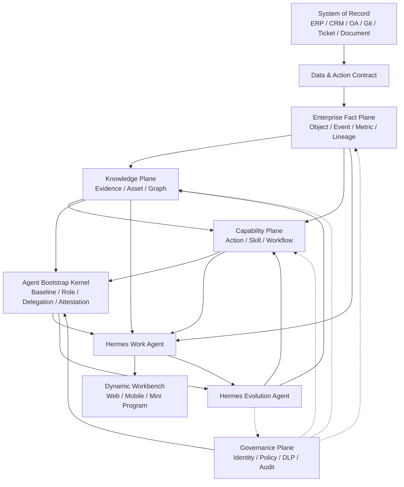

# Hermes Agent 原生企业工作模式设计

- 状态：未来产品方向详细设计基线
- 文档版本：2.4
- 日期：2026-07-29
- 适用范围：Hermes 企业 AI 工作台及后续产品扩展
- 依赖：
  - [Hermes Connector 商用首发架构](2026-07-28-hermes-connector-commercial-architecture-design.md)
  - [Hermes 企业 AI 工作台扩展设计](2026-07-28-enterprise-ai-workbench-expansion-design.md)
  - [Hermes AI 原生企业工作台投资论证与经营价值实现方案](2026-07-29-hermes-ai-native-enterprise-investment-business-case.md)
  - [Hermes Agent 原生企业数据治理与 AI 数据平台技术设计](2026-07-29-hermes-agent-native-data-governance-and-ai-data-platform-design.md)
- 核心命题：从“企业建设固定业务页面”转向“企业建设可信数据与可执行能力，
  员工通过 Agent 按任务组织工作界面”

老板视角的经营心智、双层 ILPO、外部增长、内部能力和组织 AI 化理论见
[`2026-07-29-hermes-ai-native-enterprise-owner-operating-philosophy.md`](2026-07-29-hermes-ai-native-enterprise-owner-operating-philosophy.md)。

工作过程信息、文件、外部与内部系统数据的权威来源、权限传播、删除传播，以及
前后端 AI、动态可视化、数据集成、处理和分发的正式技术基线见
[`2026-07-29-hermes-agent-native-data-governance-and-ai-data-platform-design.md`](2026-07-29-hermes-agent-native-data-governance-and-ai-data-platform-design.md)。
本文负责定义企业工作模式和经营对象；涉及数据治理对象、生命周期或技术组件边界时，
以该数据平台设计为准。

## 1. 执行结论

Hermes 的长期产品方向不应局限为远程使用 Agent 的 H5，也不应继续沿用“每个
业务问题建设一套独立系统和固定页面”的传统路径。

未来企业软件更可能形成以下结构：

```text
企业建设：
可信业务事实
  + 数据语义
  + 权限与政策
  + 可执行 Action / Skill
  + 审批与审计

员工获得：
按本人角色、目标和上下文动态组织的工作台
```

页面不再是系统本体，而是企业数据和能力在当前任务中的一次受控呈现。员工可以
组织自己的页面、数据阅读方式和任务流程，但不能绕过企业的数据口径、权限、
业务规则和正式审批。

Hermes 在这一方向上的产品定位应升级为：

> 企业可信数据与业务能力之上的 Agent 工作操作系统。

产品采用双层 Hermes Agent：

1. **Hermes Work Agent**：服务员工和项目，动态组织工作界面并执行任务；
2. **Hermes Evolution Agent**：服务企业能力建设，把经治理的共性经验转化为
   数据产品、知识资产、页面模板和公司核心 Skill。

两层 Agent 运行在同一产品内核和协议体系上，但使用不同身份、权限、数据范围、
发布节奏和治理流程。不得形成两套不可兼容的 Agent 代码分支。

所有员工 Work Agent 由 **Enterprise Agent Bootstrap Kernel** 初始化。它将企业
基线、角色能力包、员工身份与委托、团队和项目授权、个人配置解析为签名的
Agent Bootstrap Manifest。Bootstrap Kernel 是企业控制面的逻辑能力，不是第三个
超级 Agent，也不拥有所有员工个人记忆。

不同员工的 Work Agent 通过 Collaboration Service 横向协作。Agent 使用独立
身份和员工委托，通过结构化 Collaboration Request、Work Item 和 Action 交换
任务与交付物，不通过自由、无限制的 Agent 对话形成业务承诺。

## 2. 核心理论

### 2.1 不是“只建设数据”

“企业未来只需要建设数据”这个判断方向接近，但定义不完整。

原始数据不能直接替代业务系统。企业真正需要建设的是：

```text
可信业务事实
  + 可解释的数据语义
  + 可调用的业务动作
  + 可执行的业务流程
  + 可验证的权限政策
  + 可追溯的责任与证据
```

缺少语义时，Agent 不知道“收入”“客户”“有效订单”和“项目完成”的正式
定义。缺少 Action 时，Agent 只能阅读，不能安全地完成工作。缺少权限和审计时，
动态页面会成为新的数据泄露和越权入口。

因此，未来企业减少的是重复页面和烟囱式应用，不是业务事实、规则和责任。

### 2.2 企业软件重心迁移

企业软件长期经历以下变化：

| 阶段 | 核心资产 | 员工使用方式 |
|---|---|---|
| 页面中心 | 固定表单和菜单 | 员工适应系统 |
| 应用中心 | ERP、CRM、OA 等业务应用 | 员工跨系统工作 |
| 平台中心 | API、数据平台、低代码 | IT 组织共享能力 |
| Agent 中心 | 数据契约、Skill、Policy、Evidence | 系统适应员工任务 |

Agent 中心并不等于取消所有应用，而是把应用拆成三个部分：

1. System of Record：保存权威事实和交易状态；
2. Capability Service：提供稳定、受控的业务动作；
3. Agent Workbench：按人、任务和情境生成使用体验。

前两部分长期稳定，第三部分允许快速变化。

### 2.3 这一变化为什么开始具备可行性

四类能力正在同时成熟：

1. 大模型可以理解任务、规划步骤并调用工具；
2. 工具协议开始使用结构化输入输出契约；
3. Agent 可以输出可跨终端渲染的结构化界面；
4. 企业开始把人机协同作为工作组织方式，而不只是聊天助手。

[Google A2UI](https://developers.googleblog.com/en/a2ui-v0-9-generative-ui/)
已经把 Agent 生成界面定义为与前端框架解耦的声明式表达，并提供 Web 与移动端
渲染方向。

[Model Context Protocol 工具规范](https://modelcontextprotocol.io/specification/2025-11-25/server/tools)
使用输入和输出 Schema 描述工具能力，为 Agent 安全调用企业动作提供了协议参考。

[OpenAI Agent 工具体系](https://openai.com/index/new-tools-for-building-agents/)
将工具调用、编排、追踪和评估作为 Agent 应用的基础能力，而不是只提供聊天输出。

[Microsoft 2025 Work Trend Index](https://www.microsoft.com/en-us/worklab/work-trend-index/2025-the-year-the-frontier-firm-is-born)
提出从个人助手、人机团队到“人类主导、Agent 执行流程”的组织演进。该报告是
趋势信号，不是 Hermes 的产品需求来源；Hermes 仍需通过客户试点验证实际价值。

### 2.4 不会消失的复杂性

未来企业软件的复杂性不会消失，而会从页面迁移到以下位置：

- 业务对象和事件；
- 数据口径和语义；
- 状态机和不变量；
- 权限与数据分级；
- Action 输入输出契约；
- 审批和责任；
- 幂等、补偿和回滚；
- 证据、版本和审计；
- Skill 测试与评估。

如果企业只减少页面，却没有建设这些能力，最终会形成“由 Agent 驱动的影子
系统”，风险高于传统业务系统。

## 3. 哪些系统会变化

### 3.1 优先被动态工作台吸收

以下类型主要解决“如何展示、筛选和组合信息”，适合逐步进入 Hermes 工作台：

- 经营报表门户；
- 部门驾驶舱；
- 知识查询入口；
- 项目状态页面；
- 轻量级内部 CRUD；
- 数据汇总和周报工具；
- 部门级信息收集页面；
- 重复建设的角色门户；
- 低风险审批入口；
- 多系统只读聚合页面。

这些系统的原始数据源可以继续保留，但固定页面逐步退化为兼容入口。

### 3.2 保留为 System of Record

以下系统必须继续承担权威事实、事务一致性或监管责任：

- 财务总账；
- 订单、库存和供应链账本；
- 支付与结算；
- 身份、组织和权限；
- 合同与电子签署；
- 人事正式记录；
- 高并发交易核心；
- 法律法规要求留痕的正式系统；
- 生产控制和高安全等级系统。

Hermes 可以替换它们的部分员工界面，但不得绕过其正式 API、业务校验和交易
记录。

### 3.3 迁移后的目标形态

```text
原系统数据库 / 正式服务
        ↓
Data Contract + Action Contract
        ↓
Hermes Data / Capability Plane
        ↓
员工按任务生成的 Workbench
```

系统的“页面价值”下降，系统的“事实源和能力服务价值”上升。

## 4. 产品设计原则

1. **页面可变，事实稳定。**
2. **阅读可组合，写入必须受控。**
3. **个人体验可自由，企业能力必须治理。**
4. **Agent 可以提出能力候选，不能自行发布企业能力。**
5. **数据进入工作台不能扩大来源权限。**
6. **所有正式动作必须可审计、可幂等、可补偿或可回滚。**
7. **知识和 Skill 必须有 Owner、版本、证据和有效期。**
8. **运行时升级与业务能力升级分离。**
9. **企业 Agent 不是拥有全量明文权限的超级账号。**
10. **现有核心系统采用渐进式无头化，不进行一次性推倒重建。**
11. **员工 Agent 共享企业基线，不共享个人记忆。**
12. **Agent 初始化必须可签名、可评估、可撤销、可重放和可审计。**

## 5. Hermes 产品定位

### 5.1 产品不再以页面数量定义能力

传统产品以模块、菜单和页面数量组织功能。Hermes 应以以下对象组织产品：

- Business Object；
- Data Product；
- Metric；
- Knowledge Asset；
- Action；
- Skill；
- Work Item；
- View；
- Policy；
- Evidence；
- Agent Bootstrap Manifest。

一个新的业务场景优先通过组合这些对象实现，而不是先新建菜单和页面。

### 5.2 H5/PWA 的长期角色

H5/PWA 仍然重要，但它只是统一 Workbench Shell：

- 身份登录；
- 会话和任务入口；
- 动态界面渲染；
- 组件目录；
- 权限提示；
- 人工审批；
- 证据和引用查看；
- 离线与弱网缓存；
- 通知和回到任务。

H5 不直接拥有业务规则，也不直接拼接数据库查询。相同的 View Schema 可以被
Web、移动端、小程序或桌面客户端使用各自的可信组件进行渲染。

## 6. 核心业务对象

### 6.1 Business Object

业务对象是企业事实的稳定标识，例如客户、合同、订单、项目、产品、工单和员工。

每个对象必须定义：

- 全局 ID；
- Tenant 和 Workspace；
- 来源系统；
- 当前状态；
- 数据分类；
- ACL；
- Owner；
- Schema 版本；
- 事件历史；
- 可用 Action；
- 正式详情链接。

### 6.2 Data Product

Data Product 不是一张裸表，而是可被员工和 Agent 安全使用的数据能力：

- 业务定义；
- Owner；
- Schema；
- 质量规则；
- 更新频率；
- 访问政策；
- 血缘；
- SLA；
- 示例查询；
- 允许使用的目的。

### 6.3 Metric

企业指标必须独立于页面保存：

- 指标名称和业务定义；
- 计算公式；
- 时间窗口；
- 单位；
- 维度；
- 排除项；
- 数据来源；
- Owner；
- 生效版本；
- 适用范围。

员工可以改变图表和筛选方式，不能私自改变正式指标口径。

### 6.4 Action

Action 是可执行的最小业务动作：

```text
Action
  = Input Schema
  + Preconditions
  + Permission Policy
  + Execution Adapter
  + Output Schema
  + Idempotency
  + Audit
  + Compensation / Rollback
```

示例：

- 创建项目任务；
- 更新客户风险状态；
- 发起合同审批；
- 提交知识候选；
- 请求数据访问；
- 生成并保存正式报告。

### 6.5 Skill

Skill 是对 Data Product、Knowledge、Action 和人工节点的流程化组合。Skill
解决完整工作目标，Action 只完成单个业务动作。

### 6.6 View

View 是对当前任务所需数据、组件和 Action 的声明式组合。它可以是一次性的，也
可以保存为个人视图、团队模板或企业模板。

### 6.7 Work Item

Work Item 连接员工、Agent、输入、交付物、审批、异常和证据，是动态工作台中的
正式协同对象。

### 6.8 对象关系与事实归属

核心对象不能互相替代。设计和实施时按以下关系处理：

```text
Business Object
  ├─ 通过 Data Product 提供可读数据
  ├─ 通过 Action 提供可写能力
  ├─ 被 View 组织和展示
  └─ 在 Work Item 中参与具体工作

Knowledge Asset
  ├─ 由 Evidence 支撑
  └─ 被 Skill 按版本引用

Skill
  ├─ 编排 Data Product、Knowledge Asset 和 Action
  ├─ 运行后更新 Work Item
  └─ 产生新的 Evidence 和 Outcome
```

事实归属必须明确：

| 信息 | 权威事实源 |
|---|---|
| 客户、订单、库存、合同等业务状态 | 对应 System of Record |
| Tenant、Workspace 和成员关系 | Enterprise Workspace Service |
| Data Product、Metric、Action、View、Skill 定义 | 各自 Registry |
| Enterprise Baseline 和 Role Capability Package | Bootstrap / Capability Registry |
| 已签发 Agent Bootstrap Manifest 和激活状态 | Agent Bootstrap Service |
| Work Item 当前状态 | Collaboration Service |
| 权限政策 | Policy Registry |
| 一次权限判断结果 | Policy Decision Log |
| 原始交付物和附件 | Object Store + Metadata |
| 正式知识资产 | Knowledge Asset Registry |
| Agent 执行过程 | Trace Store |
| 不可抵赖审计 | Audit Store |

Hermes 的搜索、向量、图谱、缓存和管理驾驶舱都是投影，不得成为业务事实源。

### 6.9 对象公共信封

所有可治理对象使用统一信封，避免每个模块重复发明租户、权限和版本字段：

```json
{
  "id": "obj_01...",
  "type": "project.delivery_risk",
  "tenant_id": "ten_01...",
  "workspace_id": "wsp_01...",
  "owner_id": "usr_01...",
  "classification": "internal",
  "acl_ref": "acl_01...",
  "purpose_tags": ["project_delivery"],
  "schema_version": "1.0",
  "resource_version": 7,
  "status": "active",
  "source": {
    "system": "ticket",
    "object_id": "TICKET-1001"
  },
  "created_at": "2026-07-28T10:00:00Z",
  "updated_at": "2026-07-28T11:00:00Z"
}
```

公共信封只定义治理字段，业务正文仍由对象自己的 Schema 定义。

### 6.10 Agent Bootstrap Manifest

Agent Bootstrap Manifest 是员工 Work Agent 某次启动、重连或权限变化后实际生效
的初始化清单。它不是 Prompt，也不是复制到所有 Agent 的企业知识正文，而是引用
当前有效的企业基线、角色能力包、授权和评估结果。

它至少回答：

- 该 Agent 属于哪个 Tenant、员工和设备；
- 当前员工承担什么角色和项目责任；
- 可以读取哪些 Data Product 和 Knowledge；
- 可以加载哪些 Skill、Action、View 和工具；
- 使用什么协作、自主、模型、费用和留存策略；
- 哪些高风险行为必须由员工确认；
- 当前基线和各引用对象使用什么版本；
- 何时生效、何时过期、如何撤销；
- 该 Agent 是否已完成当前版本的上岗评估。

Manifest 是解析结果，不取代各 Registry 和 Policy 的权威事实。员工身份、组织关系、
权限、Skill 和知识发生变化时，Bootstrap Service 重新解析并生成新版本。

## 7. 总体产品架构



Governance Plane 对所有层生效。Evolution Agent 只能提出 Policy 候选，不能
自行放宽企业权限。

### 7.1 服务职责分解

| 服务 | 核心职责 | 不承担的职责 |
|---|---|---|
| Workbench Gateway | H5/PWA 会话、流式响应、View 交付 | 业务事实和权限决策 |
| Identity & Org Service | Tenant、组织、成员、身份映射 | 业务对象正文 |
| Agent Bootstrap Service | 解析企业基线、角色包、委托和能力，签发初始化清单 | 保存个人记忆或替 Agent 规划工作 |
| Work Event Gateway | 接入、校验、去重和规范化事件 | 知识发布 |
| Catalog Service | Data、Metric、Action、View、Skill 元数据目录 | 执行 Action |
| Query Planner | 将意图转换为 Read Plan | 绕过 Policy 读取数据 |
| Policy Service | 统一权限和用途决策 | 保存业务正文 |
| Data Product Gateway | 执行受控查询和字段脱敏 | 直接修改来源系统 |
| Knowledge Service | Evidence、资产、引用、搜索和 RAG | 改变来源 ACL |
| View Orchestrator | 生成和验证 View Schema | 下发任意前端代码 |
| Action Gateway | Prepare、Approve、Commit、Compensate | 自行决定业务授权 |
| Skill Registry | Skill 包、版本、签名和发布范围 | 在线执行 Skill |
| Skill Runner | 编排已发布 Skill | 发布或修改 Skill |
| Collaboration Gateway | 人、Agent、委托和结构化消息路由 | 代表员工决定正式承诺 |
| Collaboration Service | Work Item、审批、交接、异常和 SLA | 保存来源系统正式交易 |
| Evolution Service | 发现候选、组织评估、效果分析 | 直接发布企业能力 |
| Evaluation Service | Golden Case、回归、安全和效果评估 | 修改生产数据 |
| Audit Service | 追加式审计、查询和导出 | 充当运营日志缓存 |

每个服务对外暴露版本化契约。内部实现可以合并部署，但不能合并职责和事实归属。

### 7.2 控制平面与数据平面

控制平面保存“应该如何运行”：

- Tenant 配置；
- Enterprise Baseline；
- Role Capability Package；
- Agent Bootstrap Manifest 元数据；
- Registry 元数据；
- Policy；
- Schema；
- 发布清单；
- 签名和版本；
- 运行配额；
- 审批配置。

数据平面处理“本次工作正在发生什么”：

- Work Event；
- Read Plan；
- Query Result；
- Work Item；
- Skill Run；
- Action Command；
- Evidence；
- Trace。

企业专属数据平面和私有化部署可以共享产品控制协议，但企业业务正文、查询结果、
Evidence 和 Trace 必须留在客户选择的数据边界内。

### 7.3 请求上下文信封

所有跨服务请求携带不可由客户端自行伪造的上下文：

```json
{
  "request_id": "req_01...",
  "trace_id": "trc_01...",
  "tenant_id": "ten_01...",
  "subject": {
    "type": "human",
    "id": "usr_01..."
  },
  "delegation": {
    "agent_id": "agt_01...",
    "on_behalf_of": "usr_01..."
  },
  "workspace_id": "wsp_01...",
  "purpose": "project_delivery",
  "classification_ceiling": "confidential",
  "policy_context_version": "pcv_109",
  "expires_at": "2026-07-28T10:10:00Z"
}
```

Agent 代表员工执行时，同时记录员工身份和 Agent 身份。审计记录不能只显示
“系统执行”，也不能把 Agent 的行为错误归到无法识别的共享账号。

### 7.4 主要 API 边界

首版 API 使用资源和动作分离的方式：

| API | 用途 |
|---|---|
| `POST /v1/intents:interpret` | 将员工表达转换为 Intent Contract |
| `POST /v1/agent-bootstraps:resolve` | 按身份、角色、设备和 Purpose 解析初始化清单 |
| `GET /v1/agents/{id}/bootstrap-manifest` | 获取当前签名 Manifest 与引用版本 |
| `POST /v1/agents/{id}:attest` | 上报运行时、能力、评估和设备证明 |
| `POST /v1/agents/{id}:activate` | 在评估和 Policy 通过后激活指定自主等级 |
| `POST /v1/views:compose` | 生成 View Draft |
| `POST /v1/views:validate` | 校验 Schema、Binding、Policy 和终端能力 |
| `POST /v1/read-plans:execute` | 执行受控读取 |
| `POST /v1/actions/{id}:prepare` | 生成影响预览和 Commit Token |
| `POST /v1/actions/{id}:commit` | 执行经过确认的 Action |
| `GET /v1/commands/{id}` | 查询最终命令状态 |
| `POST /v1/work-items` | 创建正式协同任务 |
| `POST /v1/collaboration-requests` | 发起跨员工或 Agent 的结构化协作请求 |
| `POST /v1/collaboration-requests/{id}:accept` | 接受请求并绑定 Work Item |
| `POST /v1/collaboration-requests/{id}:deliver` | 提交结构化交付物 |
| `POST /v1/collaboration-requests/{id}:takeover` | 员工接管 Agent 协作 |
| `PUT /v1/agent-delegation-policies/{id}` | 配置员工 Agent 自主和委托范围 |
| `POST /v1/skill-runs` | 启动已发布 Skill |
| `POST /v1/skill-runs/{id}:resume` | 人工批准或补充后继续 |
| `POST /v1/evolution-candidates` | 提交能力候选 |
| `POST /v1/evaluations` | 启动能力评估 |
| `POST /v1/policy-decisions` | 请求统一权限决策 |

外部客户端不能直接调用内部 Data Adapter 和来源数据库。API 返回稳定错误码、
可重试标识、Trace ID 和用户可执行的下一步。

### 7.5 存储职责

| 存储 | 保存内容 | 不能保存为权威事实的内容 |
|---|---|---|
| PostgreSQL | Registry、Workspace、Bootstrap 元数据、Work Item、Command、Policy 元数据 | 大附件和搜索索引 |
| Object Storage | 原文、附件、Evidence、签名基线包、Skill 包、评估制品 | 权限最终判断 |
| Search Index | 全文、过滤字段、检索投影 | 正式资产状态 |
| Vector Index | Embedding 和语义召回投影 | ACL 和业务主键事实 |
| Graph Store | 对象和知识关系投影 | 交易状态 |
| NATS / JetStream | 事件交付、工作队列和重放 | 最终业务状态 |
| Redis | 短期缓存、限流、会话和短锁 | Command、审批和审计事实 |
| Trace Store | Agent、模型和工具运行轨迹 | 正式业务结果 |
| Audit Store | 追加式安全和内容访问审计 | 普通缓存 |

Redis 是可选基础设施，用于降低热点读取和协调成本；Redis 故障不能导致正式任务、
审批或命令永久丢失。

### 7.6 关键事件

```text
work.intent.created
agent.bootstrap.resolved
agent.bootstrap.attested
agent.bootstrap.activated
agent.bootstrap.rejected
agent.bootstrap.revoked
agent.baseline.changed
view.draft.generated
view.saved
view.template.proposed
read.plan.executed
data.quality.changed
policy.decision.denied
action.prepared
action.approval.requested
action.committed
action.outcome.unknown
collaboration.request.sent
collaboration.request.accepted
collaboration.request.needs_owner
collaboration.request.delivered
collaboration.request.expired
collaboration.human_takeover
collaboration.message.queued
collaboration.message.delivered
collaboration.message.received
collaboration.message.dead_lettered
work.item.state.changed
evidence.created
knowledge.asset.changed
evolution.candidate.created
skill.evaluation.completed
skill.release.started
skill.release.stopped
skill.run.completed
skill.run.human_takeover
acl.changed
audit.original_content.accessed
```

事件必须包含 `event_id`、Tenant、对象 ID、对象版本、发生时间、Trace ID 和
Schema 版本。生产者使用 Transactional Outbox，消费者按 `event_id` 幂等。

### 7.7 首个试点 SLO 建议

以下是设计目标，需要通过真实客户网络和数据量校准：

| 指标 | 建议目标 |
|---|---|
| Workbench Shell 可交互时间 | 典型 4G 网络 P75 不高于 2.5 秒 |
| 首个 View 骨架返回 | P75 不高于 3 秒 |
| Policy Decision | 缓存命中 P95 不高于 50 毫秒 |
| Bootstrap Manifest 解析 | 不含远程身份提供商耗时 P95 不高于 1 秒 |
| 紧急撤销传播 | 在线 Agent P95 不高于 30 秒；离线 Agent 重连前阻断 |
| 常用只读数据加载 | P95 不高于 2 秒 |
| Action Prepare | 不含来源系统耗时 P95 不高于 500 毫秒 |
| Command 状态可查询 | 100% |
| 高风险写入审计 | 100% 同步确认或阻断 |
| 跨 Tenant 越权 | 0 |
| 已提交 Command 永久丢失 | 0 |

动态 View 采用骨架、分区加载和流式更新，不等待全部数据和模型输出后才展示。

### 7.8 四种部署形态

| 形态 | 控制平面 | 数据平面 | 模型和业务数据 |
|---|---|---|---|
| Shared SaaS | Hermes 共享 | Hermes 共享、Tenant 隔离 | 按 Tenant Policy |
| Dedicated Data Plane | Hermes 共享 | 客户专属 VPC | 留在专属数据平面 |
| Connected Private | 客户环境 | 客户环境 | 不离开客户 VPC |
| Offline Private | 客户离线环境 | 客户离线环境 | 完全本地 |

四种形态共用 Data、Action、View、Skill、Policy 和 Work Event 契约。差异通过
Adapter、部署清单和发布策略处理，不维护不同业务代码。

### 7.9 本地与云端执行边界

Hermes Work Agent 的步骤可以分布在：

- Cloud Runtime：访问云端 Data Product、Knowledge 和协同服务；
- Customer Runtime：访问客户 VPC 内的数据、模型和 Action；
- Local Agent：访问员工设备明确授权的本地文件、工具和会话；
- H5/PWA：渲染 View、收集确认，不保存长期密钥。

Connector 和 Agent Local Gateway 负责稳定连接、能力发现、身份绑定和本地命令
边界，不承担 Evolution Agent 的企业分析职责。

运行位置由 Skill Step、数据分类和 Policy 共同决定。不能因为本地 Agent 在线就
把受限数据上传到云端模型，也不能因为云端规划方便而绕过客户本地 Action。

## 8. 双层 Hermes Agent

### 8.1 Hermes Work Agent

Work Agent 的服务范围是个人、团队或项目。主要职责：

- 理解员工当前目标；
- 获取当前身份可见的数据；
- 组织任务所需页面；
- 选择并调用已发布 Skill；
- 发起受控 Action；
- 管理 Work Item；
- 请求人工确认或审批；
- 记录交付结果、异常和员工纠错；
- 维护个人偏好和短期工作上下文。

Work Agent 不拥有以下权力：

- 绕过来源 ACL；
- 直接修改正式数据库；
- 发布企业级 Skill；
- 将个人内容自动转为企业公开资产；
- 修改企业指标和权限政策；
- 自行批准高风险动作。

### 8.2 Hermes Evolution Agent

Evolution Agent 的服务范围是企业能力体系。主要职责：

- 在授权范围内识别重复工作模式；
- 发现知识缺口、流程瓶颈和重复页面；
- 提出 Data Product 候选；
- 提出 Metric、View Template 和 Skill 候选；
- 组织离线评估、Golden Case 和安全测试；
- 生成变更影响分析；
- 推荐灰度范围；
- 观察发布后的效果和异常；
- 提出改进、降级或废止建议。

Evolution Agent 不是拥有所有员工原始内容的“企业超级大脑”。默认使用：

- 正式 Work Item；
- 已发布知识资产；
- 脱敏或聚合运行指标；
- 经 Policy 允许的工作证据；
- 明确授权的专项分析数据。

需要访问受限原文时，必须使用目的限定授权、有效期和审计工单。

### 8.3 同一内核、不同身份

两层 Agent 共用：

- Agent Runtime；
- Skill Manifest；
- Work Event Contract；
- View Schema；
- Action Contract；
- Tool Gateway；
- Policy Decision API；
- Trace 和 Evaluation 格式。

两层 Agent 分离：

| 维度 | Work Agent | Evolution Agent |
|---|---|---|
| 服务对象 | 员工、团队、项目 | 企业能力治理 |
| 数据范围 | 当前身份和任务 | 经治理的企业范围 |
| 主要输出 | 页面、任务结果、协同记录 | 候选资产、Skill、模板和改进建议 |
| 运行速度 | 实时、分钟级 | 批次、周期性 |
| 发布权限 | 个人视图 | 无直接发布权 |
| 人工门禁 | 高风险 Action | 所有企业能力发布 |

### 8.4 Agent 内部职责

Work Agent 和 Evolution Agent 都不是单次 Prompt。运行时至少拆成以下职责：

| 职责 | 说明 |
|---|---|
| Intent Interpreter | 提取目标、对象、时间范围、交付物和限制 |
| Context Builder | 按权限装配最小必要上下文 |
| Planner | 生成 Read、View、Skill 或 Command Plan |
| Policy Client | 在计划和执行阶段请求权限决策 |
| Executor | 调用 Data、Knowledge、Skill 和 Action |
| Verifier | 校验 Schema、引用、业务不变量和结果完整性 |
| Human Gate | 请求确认、审批、补充或接管 |
| Recorder | 记录 Work Item、Evidence、Trace 和 Outcome |

这些职责可以在首版中由同一进程实现，但 Trace 中必须区分“模型建议”“政策
决策”“工具结果”和“人工决定”，否则后续无法定位错误责任。

### 8.5 Context Builder

Context Builder 按以下顺序装配上下文：

1. 平台不可覆盖的安全政策；
2. 当前 Tenant 和 Workspace 政策；
3. 当前员工身份和委托关系；
4. 当前 Work Item 的目标、状态和交付物；
5. 已发布 Skill Manifest；
6. 经权限过滤的 Data Product Schema；
7. 经权限过滤的 Knowledge Asset 摘要和引用；
8. 当前 View 状态；
9. 当前会话必要历史；
10. 允许使用的个人偏好。

禁止默认装入：

- 企业全量知识；
- 员工全部历史对话；
- 不属于当前 Purpose 的数据；
- 管理员可见但当前员工不可见的数据；
- 未发布 Skill 草稿；
- 长期密钥和数据库凭据。

Context Builder 必须记录每一项上下文的来源、版本、权限决策和 Token 成本。

### 8.6 记忆分层

Hermes 记忆分为四层：

| 记忆层 | 内容 | 默认范围 | 晋升方式 |
|---|---|---|---|
| Session Memory | 当前对话和临时步骤 | 当前会话 | 会话结束清理或摘要 |
| Personal Memory | 个人偏好、常用 View、明确保存的工作习惯 | 仅本人 | 员工主动保存 |
| Team Memory | 项目约定、团队模板和项目复盘 | 团队/项目 | Owner 审核 |
| Enterprise Asset | 正式知识、Metric、Skill 和模板 | 授权企业范围 | 治理发布 |

个人记忆不能因为被频繁使用而自动晋升为团队或企业资产。晋升必须创建候选对象，
保留来源 ACL，并向员工提供可见的纠错或异议入口。

### 8.7 模型角色和路由

不同步骤不要求使用同一个模型：

- Intent 和 View 组合：优先低时延模型；
- 复杂规划和候选 Skill 草拟：使用高能力模型；
- 结构化校验：优先确定性规则和 Schema Validator；
- 权限决策：只能由 Policy Service 完成；
- 高敏感数据：按 Policy 路由到企业专属或本地模型；
- 结果复核：可以使用独立模型或规则，避免同一输出自我证明。

模型更换不得改变 Data、Action、View 和 Skill 契约。

### 8.8 Enterprise Agent Bootstrap Kernel

Enterprise Agent Bootstrap Kernel（企业 Agent 基础脑）负责把企业共同规则解析成
每个 Agent 可以执行的初始化状态。

它是以下控制面能力的逻辑组合：

- Agent Bootstrap Service；
- Identity & Organization；
- Policy 与 Delegation；
- Catalog / Capability Registry；
- Knowledge Registry；
- Model Gateway Policy；
- Collaboration Policy；
- Evaluation 与 Attestation；
- 签名、版本、吊销和审计。

它不是：

- 第三个负责日常任务的超级 Agent；
- 拥有企业全部数据的统一模型上下文；
- 所有员工共享的一份长期记忆；
- 绕过来源系统和 Policy 的管理员账号；
- 替员工决定目标、优先级和正式承诺的中央控制者；
- Work Agent 与 Evolution Agent 之外的新运行时分支。

首版可以由同一个 Remote Server 部署单元中的多个模块共同实现，不要求立即拆分为
独立微服务。但 Bootstrap Manifest、Policy Decision、身份事实和评估结果必须保持
独立契约和事实归属。

### 8.9 四层初始化模型

```text
Enterprise Baseline
  ├─ 企业语义、指标和业务对象
  ├─ 身份、权限、风险和审计政策
  ├─ 协作、模型、费用和留存政策
  └─ 企业批准的能力目录
          ↓
Role Capability Package
  ├─ 角色允许使用的数据和知识类别
  ├─ 默认 Skill、Action、View 和工具
  ├─ 角色任务模板和评估集
  └─ 角色自主等级上限
          ↓
Employee and Work Grants
  ├─ 员工身份、岗位和代理关系
  ├─ Tenant、Workspace、团队和项目
  ├─ 当前客户、业务对象和临时授权
  └─ 设备、地域和工作状态
          ↓
Personal and Task Context
  ├─ 本人明确保存的偏好
  ├─ Personal Memory 引用
  ├─ 当前 Work Item 和 Task Contract
  └─ 当前会话必要上下文
```

解析结果：

```text
Employee Work Agent
  = Hermes Runtime Capability
  + Enterprise Baseline
  + Role Capability Package
  + Employee Identity and Delegation
  + Team / Project Grants
  + Personal Configuration
  + Current Work Context
```

四层的事实归属和更新节奏不同，不能合并为一个长期 Prompt。

### 8.10 Enterprise Baseline

Enterprise Baseline 是某一 Tenant 当前批准的最小共同企业基线，至少引用：

- Canonical Business Model；
- Data Classification；
- Metric 与语义目录；
- 身份、委托和最小权限政策；
- Action 风险等级和人工门禁；
- Collaboration Message Schema；
- Agent 自主等级政策；
- 数据留存、DLP 和审计政策；
- Model Gateway 路由和成本上限；
- 企业默认 Skill、View 和工具目录；
- Evaluation Profile；
- 紧急停止、吊销和人工接管策略。

Enterprise Baseline 只下发规则、目录和资源引用，不默认下发：

- 企业知识库全部正文；
- 所有客户、订单、项目和员工数据；
- 数据库和第三方系统长期凭据；
- 管理员拥有但员工无权访问的内容；
- 其他员工的个人记忆；
- 未发布的 Skill、Policy 和知识草稿。

Agent 在具体 Work Item 中根据 Purpose 和当前权限读取最小必要正文。

### 8.11 Role Capability Package

Role Capability Package 描述某类角色通常需要的能力，不直接授予具体员工权限。

示例：

```text
Sales Role Package
  ├─ customer.summary Data Product
  ├─ opportunity.health Metric
  ├─ proposal.draft Skill
  ├─ product.claim.request Collaboration Template
  ├─ quote.prepare Action
  ├─ sales.pipeline View Template
  ├─ 默认 L1 Inform / L2 Collaborate
  └─ 客户承诺和价格例外必须人工确认
```

Role Package 至少包含：

- `role_package_id` 和版本；
- 适用的组织角色；
- Data Product 和 Knowledge 类别选择器；
- Skill、View、Action 和工具引用；
- Task Contract 与 Collaboration Request 模板；
- 默认自主等级和 Action 上限；
- 模型、Token、费用和时延预算；
- 必须通过的角色评估集；
- 适用地域、业务线和部署模式；
- Owner、有效期、灰度和回滚版本。

Role Package 中声明“销售角色可以申请客户数据”不等于具体员工已经获得客户数据
权限。最终授权由员工身份、Workspace、项目、Purpose 和 Policy 共同决定。

### 8.12 员工专属配置

员工专属配置只保存形成个人 Work Agent 所需的治理信息：

- `human_id` 和 `agent_id`；
- 员工与 Agent 的 `on_behalf_of` 关系；
- 当前岗位、团队、项目和 Workspace；
- 允许代理的业务 Purpose；
- 自主等级偏好，但不得超过企业上限；
- 通知、可代理状态和接收请求策略；
- 明确保存的个人 View 和工作偏好引用；
- 设备、地域和模型使用限制；
- 临时 Access Grant 和有效期；
- 员工同意版本和可见的审计入口。

Personal Memory 正文默认保存在员工选择的数据边界内。Bootstrap Manifest 可以
包含 Personal Memory 的受控引用和读取策略，不包含可被其他 Agent 使用的个人
记忆副本。

### 8.13 Agent Bootstrap Manifest

Bootstrap Service 根据当前事实生成签名 Manifest。示例：

```json
{
  "manifest_id": "abm_01...",
  "manifest_version": 12,
  "tenant_id": "ten_01...",
  "workspace_id": "wsp_01...",
  "human_id": "usr_01...",
  "agent_id": "agt_work_01...",
  "device_id": "dev_01...",
  "runtime": {
    "minimum_version": "2.4.0",
    "attested_version": "2.4.1",
    "required_capabilities": [
      "purpose_token",
      "skill_resume",
      "collaboration_receipt"
    ]
  },
  "baseline": {
    "id": "ebl_01...",
    "version": "3.2.0",
    "policy_context_version": "pcv_109",
    "semantic_model_version": "sem_24"
  },
  "role_packages": [
    {
      "id": "role_sales",
      "version": "2.1.0"
    }
  ],
  "grants": {
    "workspaces": ["wsp_sales_cn"],
    "purpose_tags": ["customer_service", "sales_delivery"],
    "classification_ceiling": "confidential",
    "temporary_grant_refs": ["agr_01..."]
  },
  "capabilities": {
    "skill_refs": ["proposal.draft@3.1"],
    "action_refs": ["quote.prepare@2.x"],
    "view_refs": ["sales.pipeline@1.4"],
    "knowledge_scope_refs": ["ksc_sales_cn"]
  },
  "collaboration": {
    "policy_ref": "acp_sales_02",
    "maximum_hops": 2,
    "maximum_rounds": 4,
    "default_request_ttl_seconds": 86400
  },
  "autonomy": {
    "default_level": "L1",
    "maximum_level": "L2",
    "human_gate_action_classes": ["R3", "R4"]
  },
  "model_policy": {
    "route_policy_ref": "mrp_cn_04",
    "daily_budget_ref": "mbg_usr_01"
  },
  "memory": {
    "personal_memory_ref": "local://personal-memory",
    "team_memory_refs": ["tm_project_01"],
    "enterprise_asset_scope_ref": "eas_sales"
  },
  "evaluation": {
    "profile_ref": "eval_sales_02",
    "result_ref": "evr_01...",
    "status": "passed"
  },
  "issued_at": "2026-07-28T09:00:00Z",
  "effective_at": "2026-07-28T09:05:00Z",
  "expires_at": "2026-07-29T09:00:00Z",
  "key_id": "bootstrap-signing-2026-q3",
  "signature": "base64..."
}
```

Manifest 不携带：

- 数据库密码；
- 模型供应商长期密钥；
- 第三方系统 Refresh Token；
- 知识和客户数据正文；
- 其他员工 Personal Memory；
- 未经过 Policy 的临时高权限凭据。

工具访问使用短期、Purpose-bound Token，在实际调用时重新授权。

### 8.14 初始化状态机

```text
UNENROLLED
  -> IDENTITY_VERIFIED
  -> BASELINE_RESOLVED
  -> RUNTIME_ATTESTED
  -> EVALUATING
  -> ACTIVE_L0
  -> ACTIVE_L1 / ACTIVE_L2 / ACTIVE_L3

任意状态
  -> REEVALUATION_REQUIRED
  -> SUSPENDED
  -> QUARANTINED
  -> REVOKED
```

状态含义：

| 状态 | 含义 |
|---|---|
| `UNENROLLED` | Agent 尚未绑定合法员工和设备 |
| `IDENTITY_VERIFIED` | 员工、Agent、设备和 Tenant 已确认 |
| `BASELINE_RESOLVED` | 已解析企业基线、角色包和授权 |
| `RUNTIME_ATTESTED` | Runtime、Connector 和必要 capability 通过证明 |
| `EVALUATING` | 正在运行角色、安全和协作评估 |
| `ACTIVE_L0` | 只允许草拟，不自动发送和执行 |
| `ACTIVE_L1–L3` | 按具体场景开放查询、协作和受控 Action |
| `REEVALUATION_REQUIRED` | 基线、角色、权限或能力变化，需要重新评估 |
| `SUSPENDED` | 临时停止执行，可保留可见历史 |
| `QUARANTINED` | 检测到安全或完整性问题，仅允许诊断和恢复 |
| `REVOKED` | 员工离职、设备吊销或代理关系终止，不可继续执行 |

不存在全局默认 `ACTIVE_L4`。外部承诺和高影响 Action 继续逐次人工批准。

### 8.15 员工 Agent 初始化流程

```text
1. 员工完成企业身份登录
2. 设备生成并注册独立设备身份
3. Agent 生成独立 Agent Identity
4. Identity & Org Service 验证成员、岗位和状态
5. Bootstrap Service 解析 Enterprise Baseline
6. 按组织角色匹配 Role Capability Package
7. Policy 计算 Workspace、项目、Purpose 和分类上限
8. Registry 解析兼容的 Skill、Action、View 和工具版本
9. Model Gateway 解析模型和费用政策
10. Collaboration Gateway 解析请求、委托和自主边界
11. Evaluation Service 生成当前角色的上岗评估
12. Agent 上报 Runtime、Connector、设备和 capability attestation
13. Bootstrap Service 签发仅允许沙箱和评估的短期 provisional Manifest
14. Agent 验签并装载评估所需的最小能力引用
15. Agent 在沙箱完成评估
16. Evaluation Service 写入签名评估结果
17. Bootstrap Service 按 Policy 签发 L0/L1 或更高场景能力的 active Manifest
18. 员工确认个人偏好、通知和可代理状态
19. Audit 记录初始化版本、来源、评估结果和激活人
```

首次初始化不能因为员工拥有高级职位就跳过评估，也不能因为其他员工同角色已经
通过而复制其 Personal Memory 和 Access Grant。

### 8.16 上岗评估与渐进自主

上岗评估至少覆盖：

| 评估类别 | 验证内容 |
|---|---|
| Identity | Agent 不能冒充员工或共享服务账号 |
| Data | 无权字段、对象、搜索和向量结果不能出现 |
| Semantics | 核心业务对象、Metric 和状态理解正确 |
| Skill | 输入输出、异常、成本和引用符合 Manifest |
| Action | 风险等级、Prepare / Commit 和人工门禁正确 |
| Collaboration | 双身份、Purpose、Receipt、TTL 和循环限制正确 |
| Memory | Personal、Team 和 Enterprise 范围不混淆 |
| Model | 数据分类、模型路由、成本和降级符合 Policy |
| Recovery | 断网、过期、吊销、回滚和人工接管可恢复 |

自主等级按 Action 和场景逐项开放：

```text
草拟通过
  -> 允许 L0 Draft
共享事实评估通过
  -> 允许指定场景 L1 Inform
协作和循环控制通过
  -> 允许指定场景 L2 Collaborate
低风险 Action 和恢复评估通过
  -> 允许指定场景 L3 Act
```

不能使用一次综合分数把所有工作同时提升到更高自主等级。

### 8.17 重连、离线和缓存

Agent 可以缓存最后一个经过验签的 Bootstrap Manifest，但必须保存：

- Manifest 版本；
- 签发和过期时间；
- 签名 Key ID；
- Policy Context Version；
- 引用能力的摘要和版本；
- 上次成功吊销同步时间；
- 当前允许的离线行为。

在线重连时：

1. 先上报当前 Manifest、Runtime、Connector 和 capability；
2. 服务端比较身份、组织、Policy、Registry 和评估版本；
3. 未变化时续签短期 Manifest；
4. 发生变化时返回增量解析结果或要求完整重新初始化；
5. 紧急吊销优先于普通版本更新；
6. 完成新 Manifest 验签后才能恢复受影响能力。

Manifest 过期或无法确认吊销状态时：

- 可以查看本地已有的低敏感草稿；
- 可以继续不涉及新数据读取的个人整理；
- 不得发起新的高风险 Action；
- 不得形成新的外部承诺；
- 不得扩大 Agent-to-Agent 协作；
- 需要在线授权的数据和工具必须阻断；
- 界面明确显示降级原因和恢复条件。

Offline Private 部署在客户离线环境内运行同一 Bootstrap Service 和签名体系，不依赖
Hermes 公有云在线续签。离线不等于取消身份、Policy、评估和吊销。

### 8.18 基线变化与重新初始化

以下事件触发重新解析：

- 员工入职、转岗、离职或停用；
- 团队、项目和 Workspace 成员变化；
- 临时 Access Grant 生效、过期或撤销；
- Enterprise Baseline 发布或回滚；
- Role Capability Package 发布或回滚；
- Policy、数据分类或 Metric 口径变化；
- Skill、Action、View 或模型兼容性变化；
- Agent Runtime 或 Connector 升级；
- 设备吊销或安全状态变化；
- 上岗评估失效；
- 员工主动降低自主等级。

变化处理分为：

| 变化类型 | 行为 |
|---|---|
| 紧急安全吊销 | 立即阻断受影响能力，在线推送，离线重连前拒绝 |
| 权限收缩 | 立即生效，不等待当前会话结束 |
| 权限扩大 | 重新 Policy Decision，必要时人工审批和重新评估 |
| 兼容性新增 | 灰度解析，新旧 Manifest 可并行 |
| 语义或 Metric 变更 | 正在执行的 Work Item 固定旧版本，新任务使用新版本 |
| Role Package 变更 | 生成差异、重新评估受影响能力 |
| Personal Preference 变更 | 仅影响本人，不能提高企业自主上限 |

已开始的 Work Item 保存其 Manifest、Task Contract、Skill、知识和 Policy 版本。
如果继续执行会违反新安全政策，必须暂停；否则允许按固定版本完成，并在下一个
Work Item 使用新基线。

### 8.19 与 Evolution Agent 的升级关系

Evolution Agent 可以根据授权的 Outcome 和 Evidence 提出：

- Enterprise Baseline 变更候选；
- Role Capability Package 变更候选；
- 新角色评估样本；
- 协作策略和 Task Contract 模板候选；
- 过期 Skill、Knowledge 和 View 的停用建议；
- 模型和费用策略的效果分析。

Evolution Agent 不能：

- 直接签发 Bootstrap Manifest；
- 自动扩大员工权限；
- 把 Personal Memory 晋升为企业基线；
- 自行提高员工自主等级；
- 修改身份、组织和任职事实；
- 跳过 Owner、Policy、Evaluation 和签名发布；
- 依据消息量或在线时长生成员工评价。

正式更新链路：

```text
Work Agent Outcome / Evidence
  -> Evolution Candidate
  -> Baseline / Role / Capability Owner 评审
  -> Policy 与安全影响分析
  -> Evaluation Suite
  -> 签名发布
  -> 灰度 Bootstrap Resolution
  -> 受影响 Agent 重新评估
  -> 激活 / 暂停 / 回滚
```

### 8.20 基础脑的数据和责任边界

| 对象 | 权威事实源 | Bootstrap Kernel 的职责 |
|---|---|---|
| 员工、组织和岗位 | Identity & Org Service | 读取，不自行修改 |
| 项目和 Workspace 成员 | Enterprise Workspace Service | 读取并解析适用范围 |
| 权限和 Purpose | Policy Registry / Decision Log | 请求决策，不复制管理员权限 |
| Data / Metric / Skill / Action / View | 各 Registry | 解析兼容版本和引用 |
| Personal Memory | 员工选择的本地或专属存储 | 只下发读取策略和引用 |
| Team Memory | Collaboration / Knowledge Service | 按成员和 Purpose 过滤 |
| Enterprise Asset | Knowledge Registry | 下发目录和范围，不默认下发正文 |
| 模型选择 | Model Gateway Policy | 解析路由、费用和降级 |
| 评估结果 | Evaluation Service | 验证当前版本是否可激活 |
| Manifest | Bootstrap Service | 生成、签名、续签和撤销 |

Bootstrap Kernel 不成为业务交易、员工记忆和知识正文的新事实源。

### 8.21 失败模式

| 失败 | 默认处理 |
|---|---|
| 员工或 Agent 身份无法验证 | 停留在 `UNENROLLED`，不加载企业能力 |
| Role Package 无兼容版本 | 激活 L0 并提示管理员，不临时猜测角色能力 |
| Policy Service 不可用 | 拒绝新授权和高风险行为，使用有限缓存拒绝规则 |
| Runtime capability 不足 | 返回 `CAPABILITY_UNAVAILABLE`，提供升级或稳定旧版本 |
| Manifest 签名错误 | 进入 `QUARANTINED`，禁止执行 |
| Manifest 过期 | 按离线降级规则运行，阻断外部和高风险动作 |
| 评估失败 | 保持 L0 或暂停对应能力，提供失败样本和修复建议 |
| 基线引用资源被撤回 | 立即失效对应能力，不使用缓存正文替代 |
| 员工离职或委托撤销 | 立即 `REVOKED`，停止 Agent 代表关系 |
| 新旧基线结果冲突 | 暂停灰度，固定旧版本并进入人工评审 |
| Bootstrap Service 暂时不可用 | 已签名有效 Manifest 可按策略继续，不影响事实源 |

失败时不能临时把 Agent 切换成共享管理员身份，也不能为了保持“在线”而忽略过期、
签名、评估和吊销。

## 9. 双层迭代升级循环

### 9.1 下层快速工作循环

```text
员工目标
  -> Work Agent 理解任务
  -> 组织 Dynamic View
  -> 调用 Data / Knowledge / Skill
  -> 员工确认或修正
  -> 执行 Action
  -> 形成结果与 Evidence
  -> 更新个人偏好和 Work Item
```

这一循环优化员工当前工作，但不自动改变企业正式能力。

### 9.2 上层企业能力循环

```text
授权 Work Event / Evidence / Outcome
  -> Evolution Agent 识别共性模式
  -> 生成 Data Product / View / Skill 候选
  -> Owner 审核
  -> Evaluation Suite
  -> 安全和权限检查
  -> 签名发布
  -> 灰度下发 Work Agent
  -> 运行反馈
  -> 改进 / 回滚 / 废止
```

这一循环把个人经验升级为企业能力，但发布前必须经过治理。

### 9.3 从个人创新到企业标准

能力晋升路径：

```text
一次性个人 View
  -> 已保存个人 View
  -> 团队共享模板
  -> 企业模板候选
  -> 已发布企业模板

个人任务方法
  -> 可复用 Workflow
  -> Skill 候选
  -> 沙箱评估
  -> 已发布公司核心 Skill
```

使用频率不能单独决定晋升。还必须验证结果质量、数据权限、适用边界、Owner 和
异常处理。

### 9.4 Evolution 候选发现机制

Evolution Agent 允许使用的发现信号包括：

- 多个 Work Item 中重复出现的 Action 序列；
- 多名员工独立保存的相似 View 结构；
- 相同问题反复检索但缺少正式知识；
- 相同异常反复进入人工接管；
- 员工对 Agent 结果的重复修正模式；
- 相似交付物中稳定出现的步骤；
- Skill 运行中的固定失败点；
- 团队 Owner 主动提交的能力建议。

禁止使用的发现信号包括：

- 键盘、鼠标、屏幕和摄像头活动；
- 非工作时间在线状态；
- 私人账号内容；
- 未告知用途的历史数据；
- 以个人提示词数量或消息数量判断能力价值。

### 9.5 候选评分

候选使用 0—5 分的多维评分，不使用单一“AI 置信度”：

| 维度 | 核心问题 |
|---|---|
| Frequency | 是否在多个正式 Work Item 中重复出现 |
| Coverage | 是否跨员工、团队或项目成立 |
| Outcome Consistency | 方法是否持续产生可验证的正确结果 |
| Time Saving | 是否减少明显重复劳动 |
| Standardization | 输入输出和异常能否形成稳定契约 |
| Data Readiness | 数据是否具备 Owner、质量和 ACL |
| Risk | 是否涉及外部承诺、敏感数据或不可逆动作 |
| Volatility | 规则是否频繁变化、难以固化 |

建议排序分可以辅助评审：

```text
Candidate Priority
  = Value(Frequency, Coverage, Outcome, Time Saving)
  - Cost(Data Readiness Gap, Risk, Volatility)
```

该分数只决定进入评审队列的优先级，不决定发布。

### 9.6 候选记录

每个 Evolution Candidate 至少保存：

```json
{
  "candidate_id": "evo_01...",
  "candidate_type": "skill",
  "title": "项目风险识别",
  "scope": ["project_delivery"],
  "evidence_refs": ["evd_01", "evd_02"],
  "source_acl_refs": ["acl_01", "acl_02"],
  "suggested_owner": "project-office",
  "scores": {
    "frequency": 4,
    "coverage": 3,
    "outcome_consistency": 4,
    "risk": 2
  },
  "expected_value": {
    "time_saved_minutes_per_run": 20
  },
  "status": "proposed"
}
```

候选关闭时必须记录原因，例如重复、价值不足、数据不成熟、风险过高或不适合
标准化。关闭结果用于改进候选发现，但不能用来训练员工评价模型。

## 10. 动态页面实现原则

### 10.1 不生成任意 HTML 和 JavaScript

生产环境中的 Agent 不直接向员工下发任意可执行代码。Agent 输出声明式
`Workbench View Schema`，客户端只渲染企业批准的组件。

```json
{
  "view_id": "view_project_risk_01",
  "schema_version": "1.0",
  "title": "项目交付风险",
  "purpose": "project_delivery",
  "scope": {
    "workspace_id": "wsp_01",
    "project_id": "prj_01"
  },
  "layout": "responsive_grid",
  "components": [
    {
      "type": "metric_card",
      "data_binding": "metric.overdue_work_items"
    },
    {
      "type": "work_item_table",
      "query_binding": "query.project_blockers",
      "actions": ["work_item.assign", "work_item.escalate"]
    }
  ]
}
```

### 10.2 Component Registry

组件目录至少包含：

- 文本和引用；
- 指标卡；
- 表格；
- 图表；
- 时间线；
- 对象详情；
- 任务列表；
- 协作请求；
- Agent 身份和委托标识；
- 审批卡；
- 表单；
- 差异比较；
- 文档预览；
- 数据来源和权限提示；
- Agent 执行状态；
- 异常和人工接管。

每个组件必须声明：

- 支持的数据类型；
- 最大数据量；
- 可用 Action；
- 数据分类上限；
- Web、移动端和小程序支持状态；
- 可访问性要求；
- 安全渲染规则。

### 10.3 View 的三级治理

| 类型 | 创建者 | 可见范围 | 是否审批 |
|---|---|---|---|
| Personal View | 员工 / Work Agent | 仅本人 | 否 |
| Team Template | 团队 Owner | 指定团队或项目 | 视数据范围决定 |
| Enterprise Template | 企业 Owner | 企业授权范围 | 必须 |

个人 View 只能引用本人已有权限的数据和 Action。保存或分享 View 不得复制数据
内容，也不得扩大访问权限。

### 10.4 View 生成流水线

```text
用户目标
  -> Intent Contract
  -> 可用 Data / Metric / Action / Component 检索
  -> Policy 预检查
  -> Agent 生成 View Draft
  -> View Schema Validator
  -> Binding Validator
  -> Policy 二次检查
  -> Renderer Capability 检查
  -> 下发客户端
  -> 异步加载数据
  -> 用户修改或保存
```

失败处理：

- 缺少正式 Metric：不能自动编造口径，提示用户选择或申请定义；
- 缺少数据权限：显示可申请的资源，不暴露资源正文；
- 终端不支持组件：降级为兼容组件或结构化列表；
- 数据超量：要求增加筛选或改用服务端聚合；
- Action 不可用：保留只读 View，不生成无效按钮；
- View Schema 不兼容：回退到上一可用版本。

### 10.5 View Binding

View 不保存查询结果，只保存声明式绑定：

```text
Component
  -> Metric Binding / Query Binding / Object Binding
  -> Data Product
  -> Policy-filtered Result
```

Binding 必须声明：

- Data Product 和版本范围；
- 字段和维度；
- 最大行数；
- 默认筛选；
- 刷新策略；
- 空数据状态；
- 错误状态；
- 数据时效；
- 来源展示方式。

团队或企业模板发布时必须验证 Binding 在目标 Workspace 中存在，不能把创建者的
个人权限固化进模板。

### 10.6 动态页面安全

Renderer 必须执行：

- 组件 Allowlist；
- Schema 深度和组件数量限制；
- 文本、Markdown、链接和附件安全处理；
- 禁止内联脚本和任意 iframe；
- 外部链接域名策略；
- 表单字段和 Action Schema 一致性；
- 敏感字段遮罩；
- 截图、复制和导出策略；
- 移动端安全存储；
- View 和数据分别缓存。

Agent 生成的标题、说明和标签也属于不可信内容，必须经过内容转义和安全渲染。

### 10.7 View 生命周期

```text
EPHEMERAL
  -> SAVED_PERSONAL
  -> SHARED_TEAM
  -> ENTERPRISE_CANDIDATE
  -> PUBLISHED
  -> SUPERSEDED
  -> ARCHIVED
```

View 版本变更分为：

- Layout Change：只改变排列和展示；
- Binding Change：改变数据和指标；
- Action Change：改变可执行动作；
- Policy Change：改变适用范围和条件。

后面三类必须重新执行权限和回归检查。

## 11. 读取与写入分离

### 11.1 Read Plan

Agent 组织读取时生成 Read Plan：

- 当前用户；
- 业务目的；
- 数据对象；
- 字段；
- 筛选条件；
- 时间范围；
- 聚合方式；
- 引用要求；
- View 绑定。

Policy Service 在查询前和结果返回前分别鉴权。

### 11.2 Command Plan

任何写入必须转换为 Command Plan：

```json
{
  "action_id": "work_item.escalate",
  "action_version": "2.1",
  "actor_id": "usr_01",
  "purpose": "project_delivery",
  "resource_ids": ["wrk_01"],
  "input": {
    "reason": "关键依赖连续阻塞"
  },
  "idempotency_key": "cmd_01",
  "required_approvals": [],
  "expected_resource_version": 7
}
```

执行链：

```text
Command Plan
  -> Schema 校验
  -> Policy 决策
  -> 前置条件检查
  -> 人工确认 / 审批
  -> Action Adapter
  -> System of Record
  -> 结果和版本
  -> Audit / Evidence
```

Agent 不能用自然语言直接拼接写库语句。

### 11.3 Action 风险等级

| 等级 | 示例 | 默认门禁 |
|---|---|---|
| R0 只读 | 查询、预览、比较 | Policy 允许后执行 |
| R1 可撤销内部写入 | 保存个人 View、添加评论 | 用户确认，可撤销 |
| R2 业务状态变更 | 分配任务、更新风险等级 | Schema、权限、幂等、审计 |
| R3 外部承诺或敏感操作 | 发信、报价、合同审批、客户回复 | 明确预览和人工批准 |
| R4 不可逆或高影响 | 支付、删除、生产变更 | 多人审批或仅人工执行 |

风险等级由 Action Owner 定义，Agent 不能自行降低。

### 11.4 Prepare / Commit 两阶段

R2 及以上 Action 默认采用：

1. `prepare`：校验输入、权限、前置条件和资源版本；
2. 返回 Preview、影响范围、风险、审批要求和短期 Commit Token；
3. 员工或审批人确认；
4. `commit`：携带 Commit Token 和 Idempotency Key 执行；
5. 写入 Outcome、Audit 和 Evidence。

Prepare 结果过期、来源状态变化或资源版本变化时必须重新 Prepare。

### 11.5 幂等和并发

Action Contract 必须声明：

- 幂等键作用域；
- 幂等记录保存时间；
- 乐观锁字段；
- 重复请求返回规则；
- 上游超时后的状态查询方式；
- 是否允许自动重试；
- 补偿动作；
- 不可补偿时的人工处理队列。

对于“请求已发出但结果未知”的情况，不能直接重试可能产生外部效果的动作。先按
外部请求 ID 查询结果，仍无法确定时进入 `OUTCOME_UNKNOWN`。

### 11.6 Command 状态机

```text
DRAFT
  -> PREPARED
  -> WAITING_APPROVAL
  -> APPROVED
  -> COMMITTING
  -> SUCCEEDED

PREPARED / WAITING_APPROVAL / APPROVED
  -> EXPIRED / REJECTED / CANCELLED

COMMITTING
  -> FAILED / OUTCOME_UNKNOWN

SUCCEEDED
  -> COMPENSATING
  -> COMPENSATED / COMPENSATION_FAILED
```

任何终态都必须可查询。客户端断线或 Agent 重启不能丢失命令状态。

### 11.7 失败责任边界

| 失败位置 | 处理责任 |
|---|---|
| 意图不清 | Work Agent 请求补充 |
| View Schema 错误 | View Orchestrator 拒绝并生成安全降级 |
| 权限拒绝 | Policy Service 返回原因代码和申请入口 |
| 数据质量失败 | Data Product Owner 处理，Agent 标记不可信 |
| Action 前置条件失败 | Action Gateway 返回当前状态和可重试条件 |
| 来源系统超时 | Adapter 查询最终状态，不盲目重试 |
| Skill 步骤失败 | Skill Runner 按补偿策略或人工接管 |
| 模型失败 | Model Gateway 降级，不改变正式业务结果 |
| 审计写入失败 | 高风险写操作阻断；低风险读取进入可靠缓冲 |

## 12. 数据与语义底座

### 12.1 Canonical Business Model

Hermes 不应尝试一次性建立覆盖所有行业的统一大模型。采用：

- 少量平台通用对象；
- 客户可扩展业务对象；
- 来源系统 Adapter；
- 版本化字段映射；
- 业务术语和 Metric Registry。

平台通用对象包括：

- Organization；
- User；
- Workspace；
- Project；
- Work Item；
- Document；
- Knowledge Asset；
- Skill；
- Action；
- Evidence。

客户业务对象通过 Namespace 扩展，例如：

- `sales.customer`
- `supply.order`
- `finance.budget_item`
- `manufacturing.work_order`

### 12.2 语义优先于向量

向量检索用于发现相关内容，不能承担：

- 权威指标计算；
- 对象身份匹配；
- 权限事实；
- 正式状态；
- 交易一致性；
- 数据血缘。

企业事实和权限保存在结构化权威存储中。向量、搜索和知识图谱是可重建投影。

### 12.3 数据契约门禁

进入 Hermes 的正式 Data Product 必须通过：

1. Schema 校验；
2. Owner 确认；
3. 数据分类；
4. ACL 映射；
5. 质量规则；
6. 血缘记录；
7. 删除传播；
8. SLA；
9. 版本兼容；
10. 使用目的说明。

### 12.4 Data Product Contract 示例

```yaml
data_product_id: project-delivery-status
version: 1.3.0
owner: project-office
source_of_record: ticket-system
entity: project.delivery_item
freshness:
  mode: event_plus_reconcile
  target_seconds: 60
schema:
  key: delivery_item_id
  fields:
    - name: project_id
      type: string
      classification: internal
    - name: blocker_reason
      type: string
      classification: confidential
quality:
  - rule: delivery_item_id_not_null
  - rule: state_in_allowed_values
access:
  purposes:
    - project_delivery
  row_policy: project_membership
  field_masks:
    blocker_reason: require_project_access
lineage:
  connector: ticket-connector
  source_object: delivery_item
```

Contract 变更遵循语义化版本：

- Patch：描述、质量规则和不改变结果的修复；
- Minor：新增可选字段或兼容能力；
- Major：删除字段、改变含义或改变主键。

### 12.5 数据同步模式

来源系统按能力选择：

| 模式 | 适用场景 | 关键控制 |
|---|---|---|
| API Query | 低频、强实时读取 | 限流、超时、权限透传 |
| Webhook / Event | 状态变化 | 签名、去重、顺序和重放 |
| CDC | 数据库级变更 | Schema 演进、删除传播、最小字段 |
| Incremental Pull | 无事件接口 | 游标、回溯窗口、对账 |
| File Import | 批次数据 | 文件签名、格式、隔离和错误报告 |

无论采用哪种模式，都必须定期 Reconcile，校验 Hermes 投影与 System of Record
是否一致。

### 12.6 数据质量状态

Data Product 对外暴露质量状态：

```text
HEALTHY
DEGRADED
STALE
BLOCKED
RECONCILING
```

View 和 Agent 必须展示数据更新时间和质量状态。`STALE` 或 `BLOCKED` 数据不能
用于高风险 Action 的自动判断。

### 12.7 逻辑数据模型

建议至少包含：

- `business_object_types`
- `business_object_refs`
- `data_products`
- `data_product_versions`
- `data_contract_fields`
- `data_quality_rules`
- `data_quality_runs`
- `metrics`
- `metric_versions`
- `action_definitions`
- `action_versions`
- `view_definitions`
- `view_versions`
- `view_bindings`
- `communication_threads`
- `thread_participants`
- `collaboration_messages`
- `collaboration_requests`
- `collaboration_request_receipts`
- `agent_delivery_sessions`
- `message_delivery_cursors`
- `message_outbox`
- `dead_letter_messages`
- `agent_delegation_policies`
- `delegation_grants`
- `agent_availability_policies`
- `evolution_candidates`
- `candidate_evidence_refs`
- `policy_decisions`
- `access_grants`
- `command_records`
- `command_attempts`
- `outcomes`
- `traces`

业务大表仍留在来源系统或客户数据平台。Hermes 元数据表保存契约、引用和治理
状态，不复制不必要的全量业务数据。

## 13. 公司核心 Skill

### 13.1 Skill 是未来业务系统的可执行单元

当页面不再固定后，公司核心流程不能散落在 Prompt 中。必须通过 Skill Manifest
表达：

- 目标；
- 输入输出；
- 数据依赖；
- Action 依赖；
- 知识版本；
- 状态和分支；
- 人工门禁；
- 权限目的；
- 评估套件；
- 成本和时延预算；
- 回滚版本；
- Owner。

### 13.2 Skill 发布流水线

```text
DISCOVERED
  -> DESIGNED
  -> SANDBOX
  -> EVALUATED
  -> SECURITY_REVIEW
  -> OWNER_APPROVED
  -> CANARY
  -> PUBLISHED
  -> OBSERVED
  -> SUPERSEDED / ROLLED_BACK
```

Evolution Agent 可以完成发现、草拟、测试准备和影响分析，但以下动作必须由人
完成：

- 指定 Owner；
- 确认业务适用范围；
- 批准高风险 Action；
- 批准数据权限；
- 批准正式发布；
- 处理责任争议。

### 13.3 Skill 不等于 Agent Runtime

Skill 通过版本化制品快速升级，不要求同步更新 Hermes Agent 二进制。这样可以
保持：

- Agent Runtime 稳定；
- Connector 协议稳定；
- 企业能力快速迭代；
- 客户环境按策略选择版本；
- 异常时单独回滚 Skill。

### 13.4 Skill 包结构

```text
customer-risk-review/
  manifest.yaml
  schemas/
    input.schema.json
    output.schema.json
  workflow/
    workflow.yaml
  prompts/
    analysis.md
  policies/
    required-purpose.yaml
  evaluations/
    golden-cases.jsonl
    safety-cases.jsonl
  migrations/
    from-1.1-to-1.2.yaml
  README.md
  checksums.txt
  signature.sig
```

Prompt 只是 Skill 包的一部分。业务规则优先使用结构化 Workflow、Action
Precondition 和确定性校验表达。

### 13.5 Skill 运行记录

每次 Skill Run 保存：

- Skill ID 和版本；
- 触发来源；
- Work Item；
- 执行主体和委托人；
- Purpose；
- 输入摘要和分类；
- 使用的知识资产版本；
- 调用的 Action 版本；
- 每一步开始和结束时间；
- 模型和路由策略；
- Token、时延和费用；
- 人工门禁；
- 输出和 Outcome；
- 错误、补偿和最终状态；
- Trace 和 Evidence 引用。

### 13.6 Evaluation Suite

评估至少覆盖：

| 类型 | 检查内容 |
|---|---|
| Contract | 输入输出、必填字段和版本兼容 |
| Golden Case | 典型正确路径 |
| Boundary | 空值、极值、跨期、重复和冲突 |
| Permission | 越权、字段脱敏和 Purpose |
| Safety | Prompt Injection、秘密和外泄 |
| Tool | 错误参数、超时、重试和幂等 |
| Human Gate | 审批、拒绝、超时和接管 |
| Regression | 新旧版本结果差异 |
| Cost | Token、模型、工具和人工成本 |
| Latency | 总时延和关键步骤时延 |

Skill 发布门槛不能只使用“模型回答评分”。必须同时满足 Contract、Permission、
Safety 和业务 Outcome 指标。

### 13.7 灰度策略

灰度维度：

- Tenant；
- Workspace；
- 团队；
- 用户；
- Work Item 类型；
- 数据分类；
- Agent capability；
- 时间窗口。

自动停止条件建议包括：

- 严重权限拒绝异常；
- R3/R4 Action 异常；
- Outcome 失败率超过版本门槛；
- 人工接管率明显高于基线；
- 成本或时延超过预算；
- 来源系统错误快速上升。

## 14. 权限与治理

### 14.1 Policy Decision

每次读取、检索、Action 和 Skill 执行都提交统一决策请求：

```text
Subject
  + Tenant
  + Workspace
  + Resource
  + Classification
  + Purpose
  + Action
  + Context
  + Time
```

决策结果包括：

- allow / deny；
- 可见字段；
- 脱敏规则；
- 允许的模型位置；
- 是否需要审批；
- 授权有效期；
- 审计等级。

### 14.2 企业 Agent 权限

Evolution Agent 使用独立服务身份，遵循：

- 默认拒绝；
- 不继承平台管理员权限；
- 优先使用聚合和脱敏数据；
- 原文访问需要专项授权；
- 所有数据使用声明 Purpose；
- 输出不能扩大来源 ACL；
- 权限政策变更必须人工批准。

### 14.3 员工可见性

员工必须能够查看：

- 哪些 Work Event 被采集；
- 数据来源和用途；
- 保存时间；
- 谁访问过原文；
- 哪些个人方法被提出为模板或 Skill 候选；
- 候选最终是否发布；
- 如何纠错、限制处理和申诉。

详细规则沿用
[Hermes 企业 AI 工作台扩展设计](2026-07-28-enterprise-ai-workbench-expansion-design.md)
中的员工权益和数据治理边界。

### 14.4 PDP 与 PEP

Policy Decision Point（PDP）负责计算决策，Policy Enforcement Point（PEP）
负责执行决策。以下位置必须有 PEP：

1. Workbench Gateway：校验身份、Tenant 和会话；
2. Query Planner：限制可计划的数据和字段；
3. Data Product Gateway：执行行列过滤和脱敏；
4. Search / Vector：召回前过滤、返回前二次鉴权；
5. View Orchestrator：移除不可用组件和 Action；
6. Action Gateway：检查 Action、对象和审批；
7. Skill Runner：逐步骤检查数据和工具；
8. Connector / Local Gateway：检查本地能力和设备授权；
9. Export Service：检查下载、复制和外发；
10. Model Gateway：决定数据可以进入哪个模型环境。

只在 API Gateway 鉴权一次不能满足企业级数据权限。

### 14.5 Policy Decision 请求示例

```json
{
  "subject": {
    "type": "human",
    "id": "usr_01",
    "roles": ["project_member"]
  },
  "delegated_agent": "agt_work_01",
  "tenant_id": "ten_01",
  "workspace_id": "wsp_01",
  "resource": {
    "type": "project.delivery_item",
    "id": "item_01",
    "classification": "confidential",
    "acl_ref": "acl_01"
  },
  "action": "read:blocker_reason",
  "purpose": "project_delivery",
  "context": {
    "project_id": "prj_01",
    "device_trust": "managed",
    "network_zone": "enterprise"
  }
}
```

决策响应：

```json
{
  "decision": "allow_with_obligations",
  "policy_version": "pol_108",
  "obligations": {
    "mask_fields": [],
    "watermark": true,
    "allow_export": false,
    "model_route": "tenant_private",
    "audit_level": "content_access"
  },
  "expires_at": "2026-07-28T10:10:00Z"
}
```

PEP 必须执行 Obligations，不能只读取 allow/deny。

### 14.6 权限变更传播

来源 ACL、组织成员、项目成员或数据分类发生变化时：

1. Identity / Connector 产生权限变更事件；
2. Policy Cache 失效；
3. Search、Vector 和 Graph 更新过滤元数据；
4. 已打开 View 在下次读取时重新鉴权；
5. 长任务和 Skill Run 在关键步骤重新鉴权；
6. 已签发短期授权按风险决定立即吊销或自然过期；
7. 审计记录传播完成时间。

删除用户权限后，不能等待下一次全量索引重建才生效。

### 14.7 Break-glass

紧急访问必须具备：

- 明确原因；
- 指定事件或工单；
- 最小资源范围；
- 双人审批或事后强制复核；
- 短有效期；
- 强提醒和水印；
- 不可删除审计；
- 使用结束自动关闭；
- 定期审查是否被滥用。

平台管理员不能以“排障”为由长期拥有 Break-glass 权限。

## 15. 工作协同与证据

动态页面不能只提供临时答案。正式工作必须回到 Work Item：

- 目标；
- Owner；
- 人和 Agent 参与者；
- 输入；
- 依赖；
- Action；
- 审批；
- 交付物；
- 异常；
- 证据；
- 结果；
- 复盘。

Workbench 可以随任务变化，但 Work Item 和 Evidence 保证工作连续性。员工切换
终端、Agent 或 View 后，仍然可以恢复完整状态。

### 15.1 Work Item 状态机

```text
PLANNED
  -> READY
  -> IN_PROGRESS
  -> IN_REVIEW
  -> APPROVED
  -> DONE
  -> ARCHIVED

READY / IN_PROGRESS / IN_REVIEW
  -> BLOCKED
  -> IN_PROGRESS

任意未完成状态
  -> CANCELLED
```

状态转换必须声明允许的角色、前置条件、必填字段和产生的事件。例如从
`IN_REVIEW` 进入 `APPROVED` 必须存在审批人、审批意见和目标交付物版本。

### 15.2 人与 Agent 的责任记录

每一步记录：

- `requested_by`：谁提出目标；
- `planned_by`：谁生成计划；
- `executed_by`：谁或哪个 Agent 执行；
- `approved_by`：谁批准；
- `verified_by`：谁或哪个规则验证；
- `accepted_by`：谁接受最终交付物。

这五类责任不能合并成一个 `operator` 字段。

### 15.3 Evidence 最小要求

正式 Evidence 包括：

- 来源对象和版本；
- 获取时间；
- 内容哈希；
- 来源 ACL 快照；
- 适用 Purpose；
- 生成或转换过程；
- 人工修改；
- 关联 Outcome；
- 保留和删除政策。

报告、决策和 Skill 候选必须能够反向定位 Evidence。Evidence 被删除或失效时，
引用它的知识和 Skill 进入复审。

### 15.4 人工接管

Agent 进入以下情况必须支持一键接管：

- 目标冲突；
- 权限不足；
- 数据质量不足；
- Action 结果未知；
- 超出 Skill 适用范围；
- 高风险异常；
- 多次重试失败；
- 员工主动要求。

接管包至少包含当前目标、已完成步骤、数据引用、未决 Action、错误、建议下一步
和恢复 Token。员工处理后可以选择继续由 Agent 执行，不能只能重新开始。

### 15.5 员工与员工 Agent 的协作模型

员工之间的 Agent 协作不能实现为自由、无限制的模型对话。Hermes 采用：

```text
独立身份
  + 员工委托
  + 结构化协作消息
  + Work Item
  + Policy
  + 人工责任门禁
```

Agent 是员工的数字工作代理，但不是员工本人。Agent 发出的每一条消息和每一个
Action 都必须区分：

- Agent 自己的执行身份；
- 它代表的员工；
- 本次委托的权限；
- 当前业务目的；
- 是否经过员工确认；
- 是否形成正式业务承诺。

### 15.6 四种交流关系

| 关系 | 典型用途 | 默认规则 |
|---|---|---|
| 员工 A → Agent A | 组织个人工作、草拟和委托 | 使用 A 的当前权限和个人策略 |
| 员工 A → Agent B | 查询共享事实、请求 B 协作 | 只能使用双方共享范围 |
| Agent A → 员工 B | 请求补充、确认、审批或接管 | 明确显示“由 A 的 Agent 发起” |
| Agent A → Agent B | 分工、查询状态、提交结构化交付物 | 通过 Collaboration Service |

Agent A 和 Agent B 不建立绕过平台的点对点信任。即使两个 Agent 都运行在员工
本地设备上，正式消息仍通过企业 Collaboration Service、Policy 和 Audit。

### 15.7 三类交流载体

#### Conversation

用于讨论、解释、提问、草拟和非正式提醒。Conversation 可以关联 Work Item，
但聊天内容本身不自动改变正式业务状态。

#### Collaboration Request

用于请求另一个员工或 Agent 完成明确工作：

- 目标；
- 输入引用；
- 期望输出；
- 截止时间；
- 权限目的；
- 责任人；
- 人工门禁；
- 验收条件。

被接受的 Collaboration Request 必须创建或关联 Work Item。

#### Action / Approval

用于修改业务状态、批准交付物、对外发送或形成承诺。Action 必须使用
Action Contract，Conversation 中的“同意”“可以”“就这样做”不能被模型自行
解释为正式批准。

### 15.8 Agent 身份与代理关系

每个 Work Agent 使用独立身份：

```text
Human Identity: usr_01
Agent Identity: agt_work_01
Delegation: agt_work_01 on_behalf_of usr_01
```

消息和 Trace 必须同时保存 `actor` 和 `on_behalf_of`。界面不能只显示员工头像，
审计也不能把 Agent 操作记录成员工亲自操作。

Agent 代表员工调用服务时使用短期 Purpose-bound Delegation Token，Token 至少
绑定：

- Tenant；
- 员工；
- Agent；
- Workspace；
- Purpose；
- 允许的资源；
- 允许的 Action；
- 风险等级上限；
- 有效期；
- 是否需要逐次确认。

员工离职、项目退出、设备吊销或委托撤销后，Delegation Token 必须立即失效。

### 15.9 员工 Agent 自主等级

每个员工可以在企业政策允许范围内配置自己的 Work Agent：

| 等级 | 能力 | 典型行为 |
|---|---|---|
| L0 Draft | 只草拟 | 员工亲自检查和发送 |
| L1 Inform | 自动回复共享事实 | 返回已有项目状态和正式知识 |
| L2 Collaborate | 接收和推进低风险 Work Item | 更新任务、提交草稿、请求补充 |
| L3 Act | 执行已授权 R1/R2 Action | 保存 View、分配任务、发起评审 |
| L4 Commit | 形成外部或高影响承诺 | 默认关闭，逐次人工批准 |

企业 Policy 可以降低员工选择的自主等级，员工不能自行提高超过企业上限。

自主等级按 Action 和场景配置，不建议使用一个覆盖所有工作的总开关。例如员工
可以允许 Agent 自动接受项目资料整理任务，但仍要求所有客户回复逐次确认。

### 15.10 Agent 可代理状态

Work Agent 对其他人只暴露经员工允许的工作代理状态：

```text
AVAILABLE_FOR_ROUTINE_REQUESTS
REQUIRE_OWNER_CONFIRMATION
FOCUS_MODE
OUT_OF_OFFICE_WITH_DELEGATION
UNAVAILABLE
```

该状态不能泄露私人日程、位置、健康或非工作活动。Agent 可以说明“需要员工本人
确认”，但不能推断或公开员工未响应的原因。

### 15.11 协作消息契约

自然语言用于人类阅读，后台使用结构化消息：

```json
{
  "message_id": "msg_01...",
  "thread_id": "thr_01...",
  "work_item_id": "wrk_01...",
  "sender": {
    "type": "agent",
    "id": "agt_a",
    "on_behalf_of": "usr_a"
  },
  "recipients": [
    {
      "type": "agent",
      "id": "agt_b",
      "owner_id": "usr_b"
    }
  ],
  "message_type": "task_request",
  "authority": "request",
  "purpose": "project_delivery",
  "classification": "internal",
  "input_refs": [
    "project://prj_01/interface-delivery"
  ],
  "expected_output": {
    "schema": "delivery-confirmation.v1"
  },
  "acceptance_criteria": [
    "给出预计完成时间",
    "列出未解决依赖"
  ],
  "deadline": "2026-07-31T18:00:00+08:00",
  "human_gate": "required_before_commitment",
  "reply_policy": {
    "max_agent_turns": 4,
    "allow_partial": true
  },
  "expires_at": "2026-07-31T18:00:00+08:00",
  "trace_id": "trc_01..."
}
```

`authority` 使用受控枚举：

- `inform`：提供信息；
- `propose`：提出建议或草稿；
- `request`：请求对方完成工作；
- `delegate`：在授权范围内分配工作；
- `approve_request`：请求人工批准；
- `commit`：正式承诺，只能在有效人工或企业授权下产生。

Agent 不能通过自然语言把 `propose` 升级为 `commit`。

### 15.12 Collaboration Request 状态机

```text
DRAFT
  -> SENT
  -> RECEIVED
  -> POLICY_CHECKED
  -> ACCEPTED
  -> IN_PROGRESS
  -> DELIVERED
  -> VERIFIED
  -> CLOSED

POLICY_CHECKED
  -> NEEDS_OWNER
  -> ACCEPTED / REJECTED

SENT / RECEIVED / ACCEPTED / IN_PROGRESS
  -> CANCELLED / EXPIRED

IN_PROGRESS
  -> BLOCKED
  -> IN_PROGRESS / NEEDS_HUMAN
```

每次转换保存操作者、代表关系、时间、原因和资源版本。Agent B 接受请求不等于
员工 B 接受外部承诺，是否需要 B 本人确认由 `human_gate` 和 Agent B 的自主策略
共同决定。

### 15.13 接收方处理规则

Agent B 收到请求后按以下顺序处理：

1. 验证发送者和签名；
2. 检查 Tenant、Workspace 和项目关系；
3. 检查消息 Purpose 和有效期；
4. 对每个输入引用执行接收方权限判断；
5. 检查 Agent B 自主等级和员工代理状态；
6. 检查任务是否与当前 Work Item 冲突；
7. 决定自动接受、请求员工确认或拒绝；
8. 创建或关联 Work Item；
9. 返回 Receipt；
10. 在完成、阻塞、过期和交付时发送状态事件。

拒绝响应只返回必要原因代码，例如无权限、超出代理范围、需要本人确认或请求已
过期，不能通过错误信息泄露受限资源。

### 15.14 数据交换规则

Agent 间优先交换资源引用，不复制正文：

```text
Agent A 发送 Resource Reference
  -> Agent B 使用自己的身份访问
  -> Policy 检查 B 的 ACL 和 Purpose
  -> 允许后读取
```

如果 B 没有权限：

- Agent A 不能把正文粘贴进消息绕过 ACL；
- Agent B 不能让 A 的 Agent 代为摘要；
- 系统可以创建 Access Request；
- Data Owner 可以授予限定资源、Purpose 和有效期的访问权；
- 授权后 B 使用自己的身份重新读取。

正式共享需要创建 `Access Grant`，不能把“员工 A 可以看”解释为“员工 A 的
Agent 可以转发给任何人”。

Personal Memory 不参与跨员工 Agent 通信。Team Memory 和 Enterprise Asset 只有
在接收方具备权限时才可引用。

### 15.15 Agent-to-Agent 循环控制

每个协作请求设置：

- 最大 Agent 轮次；
- 最大总时长；
- Token 和费用预算；
- 最大并行子任务数；
- 允许使用的 Skill；
- 允许访问的数据范围；
- 可执行 Action 风险上限；
- 无进展检测；
- 冲突检测；
- 截止时间和 TTL。

以下情况进入 `NEEDS_HUMAN`：

- 连续两轮没有新增证据；
- 双方给出冲突结论；
- 请求目标发生变化；
- 需要扩大权限；
- 预算或截止时间即将用尽；
- 涉及员工本人判断或正式承诺；
- Action 结果未知；
- 一方 Agent 无可用兼容 Skill。

Agent 不能为完成任务自行增加轮次、扩大预算或更改 Purpose。

### 15.16 冲突和优先级

当 Agent A 和 Agent B 的任务发生冲突时：

1. 不由两个 Agent 私下决定人员优先级；
2. Collaboration Service 检查项目优先级、SLA 和现有 Work Item；
3. 可以提出调整建议；
4. 涉及截止时间、资源分配或目标冲突时通知双方 Owner；
5. 最终决定写入 Work Item 和 Decision Record；
6. 后续 Agent 按正式决定执行。

### 15.17 协作界面

统一协作线程必须明确显示：

- 员工 A；
- 员工 A 的 Hermes Agent；
- 员工 B；
- 员工 B 的 Hermes Agent；
- 每条 Agent 消息代表谁；
- 自主等级和 Authority；
- 是否经过本人确认；
- 引用的数据；
- 关联 Work Item；
- 是否产生 Action；
- 当前状态和截止时间；
- 接管、拒绝、撤回和纠错入口。

Agent 消息使用不同的身份标识，不能与员工本人消息使用完全相同的头像和样式。

### 15.18 端到端协作示例

场景：员工 A 请求员工 B 确认接口能否在周五完成。

1. A 对 Agent A 提出请求；
2. Agent A 解析项目、接口、期限和预期输出；
3. Agent A 发现这是交付承诺，设置 `human_gate`；
4. Agent A 创建 Collaboration Request；
5. Collaboration Service 验证双方项目关系；
6. Agent B 根据自身身份读取项目共享状态；
7. Agent B 可以自动汇总已完成工作和未解决依赖；
8. 由于预计完成时间属于 B 的工作承诺，Agent B 请求 B 本人确认；
9. B 修改预计时间并补充依赖；
10. Agent B 以 `on_behalf_of=usr_b`、`authority=commit` 返回；
11. Agent A 把结果写入双方可见的 Work Item；
12. A 收到确认并决定是否调整项目计划；
13. Evidence 保存来源、确认人和生效时间；
14. 后续状态改变时，由 Work Item 事件通知双方，而不是重新开始聊天。

### 15.19 与 Evolution Agent 的边界

Evolution Agent 默认可以使用：

- Collaboration Request 类型和状态；
- Work Item 周期、阻塞和接管结果；
- 已确认交付物；
- 脱敏聚合的重复协作模式；
- 已进入企业治理范围的 Evidence。

Evolution Agent 默认不能使用：

- 双方全部非正式对话；
- Personal Memory；
- 未授权的消息正文；
- 员工响应速度进行个人排名；
- 被撤回或标记为私人草稿的内容。

Evolution Agent 可以发现“接口确认流程反复发生”并提出 Skill 候选，但不能得出
“员工 B 工作态度不好”等人事结论。

### 15.20 Agent-to-Agent 服务端路由原则

所有正式 Agent-to-Agent 消息必须通过服务端 Collaboration Gateway 路由。员工
设备上的 Agent 不直接建立业务 P2P 连接，也不互相暴露本地监听端口。

原因：

- 服务端统一验证 Agent、设备和员工委托身份；
- 统一执行 Tenant、Workspace、Purpose 和 ACL；
- 支持接收方离线；
- 保存消息和 Work Item 状态；
- 控制轮次、预算、超时和循环；
- 支持员工接管、撤回和审计；
- 隔离不同 Agent 和 Connector 版本；
- 避免 NAT、设备网络和 P2P 信任问题。

### 15.21 完整消息链路

```text
员工 A
  -> Hermes Work Agent A
  -> Agent Local Gateway A
  -> Hermes Connector A
  -> Hermes WSS
  -> Remote Gateway
  -> Collaboration Gateway
  -> Identity / Delegation / Policy
  -> Message Store / Work Item
  -> Outbox
  -> NATS Core / JetStream
  -> Delivery Session B
  -> Hermes Connector B
  -> Agent Local Gateway B
  -> Hermes Work Agent B
  -> 员工 B
```

发送方收到 `SENT` 不代表接收方已经收到。至少区分：

- `ACCEPTED_BY_GATEWAY`：服务端已校验并持久化；
- `QUEUED`：等待接收方连接或处理；
- `DELIVERED_TO_CONNECTOR`：已交给 Connector B；
- `RECEIVED_BY_AGENT`：Agent B 已确认；
- `SEEN_BY_HUMAN`：员工 B 已查看；
- `ACCEPTED / REJECTED`：请求被正式处理。

产品界面不得把“服务端已接收”显示成“对方已确认”。

### 15.22 服务端路由职责

Collaboration Gateway 依次执行：

1. 验证 Connector 和设备会话；
2. 验证 Agent 身份和签名；
3. 验证 `on_behalf_of` 委托；
4. 校验消息 Schema 和版本；
5. 校验 Tenant、Workspace 和参与者关系；
6. 校验 Purpose、分类、TTL 和自主等级；
7. 检查消息大小、频率、预算和循环；
8. 对输入资源引用执行预检查；
9. 持久化消息和 Receipt；
10. 通过 Outbox 发布事件；
11. 根据 Agent B 在线状态选择实时或离线投递；
12. 记录 Trace 和 Audit；
13. 处理取消、过期、接管和重新投递。

Collaboration Gateway 不替员工解释正式承诺，也不替 Policy Service 作权限决策。

### 15.23 消息持久化

PostgreSQL 保存权威消息和协作状态：

```text
communication_threads
collaboration_messages
collaboration_requests
collaboration_request_receipts
work_items
agent_delegation_policies
```

消息正文较大或包含附件时，PostgreSQL 保存元数据和对象引用，正文进入对象存储。
NATS / JetStream 只负责投递、重试和重放，不承担最终消息状态。

Redis 可以用于：

- 在线连接索引；
- 短期 Presence；
- 限流；
- 短期去重；
- 短锁；
- Policy 和路由缓存。

Redis 不能保存唯一的正式消息、审批、委托和审计事实。

### 15.24 在线投递

Agent B 在线时：

1. Collaboration Gateway 解析 B 的活动 Delivery Session；
2. 向该 Session 发布通知；
3. Connector B 拉取或接收消息；
4. Agent Local Gateway 验证本地目标 Agent；
5. Agent B 返回 Receipt；
6. 服务端更新 `RECEIVED_BY_AGENT`；
7. Agent B 按自身 Policy 决定自动处理或请求员工确认。

Connector B 断线重连后使用游标恢复，不能依赖内存中的最后消息位置。

### 15.25 离线投递

Agent B 不在线时：

```text
消息写入 PostgreSQL
  -> Transactional Outbox
  -> JetStream 持久消费者
  -> 等待 Agent B 重连
  -> Connector B 恢复 Session
  -> 按游标重新投递
  -> Agent B 幂等接收
  -> Receipt 写回服务端
```

离线队列必须具备：

- 消息 TTL；
- 最大积压量；
- 优先级；
- 过期处理；
- 重复投递幂等；
- 毒消息隔离；
- 员工可见的失败状态；
- 管理员可观测但不默认读取正文。

已过期的 Collaboration Request 不在 Agent B 上线后自动重新激活。发送方需要
重新确认目标和期限。

### 15.26 数据内容路由

Agent-to-Agent 消息优先传递：

- 资源引用；
- 对象 ID；
- Data Product 和版本；
- Work Item；
- Evidence 引用；
- 结构化交付物；
- 必要的最小消息摘要。

接收方使用自己的身份重新读取资源：

```text
Agent A 发送 Reference
  -> Collaboration Gateway 路由 Reference
  -> Agent B 请求资源
  -> Policy 使用员工 B + Agent B + Purpose 鉴权
  -> 允许后返回正文或脱敏结果
```

服务端不能因为 Agent A 有权限，就把同样权限传递给 Agent B。需要主动共享时，
必须创建有范围、Purpose 和有效期的 Access Grant。

### 15.27 消息加密与服务端可见性

基础要求：

- Connector 与 Gateway 使用双向认证和 TLS；
- 消息和附件静态加密；
- Tenant 使用独立数据密钥；
- 高敏感字段按 Policy 单独加密；
- 日志不记录消息正文；
- 原文读取进入内容访问审计。

完全端到端加密会限制服务端执行 DLP、分类、搜索和合规审计，因此不能作为所有
企业消息的默认模式。确需端到端加密的受限内容，可以只让服务端看到路由元数据、
密文和 ACL，并要求接收端在本地重新执行 Policy 和 DLP。具体模式由客户安全
政策决定。

### 15.28 大文件传输

大文件不通过 Agent 消息总线直接传输：

```text
发送方请求 Upload Grant
  -> 文件上传对象存储
  -> 病毒、秘密和 DLP 扫描
  -> 创建受控 Resource Reference
  -> Agent 消息传递 Reference
  -> 接收方重新鉴权
  -> 获取短期 Download Grant
```

在私有化环境中使用客户本地对象存储。未来即使支持局域网或 P2P 加速，控制面、
授权、完整性校验、Receipt 和 Audit 仍然经过 Collaboration Gateway。

### 15.29 四种部署模式中的路由位置

| 交付模式 | Collaboration Gateway 位置 | 消息正文位置 |
|---|---|---|
| Shared SaaS | Hermes 共享云 | 共享数据平面内按 Tenant 隔离 |
| Dedicated Data Plane | 企业专属 VPC | 企业专属数据平面 |
| Connected Private | 客户云账号/VPC | 客户环境 |
| Offline Private | 企业内网 | 企业离线环境 |

完全离线模式仍使用企业内部服务端路由，不改成设备间 P2P。四种模式共用相同消息
契约、Receipt、状态机和审计语义。

### 15.30 NATS 与 Connector 边界

NATS Core / JetStream 是 Remote Server 内部实现：

- Connector 不直接连接 NATS；
- Agent 不持有 NATS 凭据；
- NATS Subject 不成为外部协议；
- 服务端可以更换消息基础设施而不升级 Agent；
- Connector 只认识 Hermes WSS 和本地协议；
- Collaboration Gateway 负责外部消息协议与内部事件的转换。

这一边界保证 Agent、Connector 和 Remote Server 可以独立升级。

### 15.31 路由故障和恢复

| 故障 | 处理 |
|---|---|
| Gateway 短暂不可用 | Connector 重连并使用发送幂等键 |
| 消息已持久化但事件未发布 | Outbox 后台补发 |
| JetStream 重复投递 | Consumer 按 `message_id` 幂等 |
| Connector B 收到后断线 | Agent Receipt 未确认则重新投递 |
| Agent B 已执行但 Receipt 丢失 | 按 Request/Action ID 查询最终状态 |
| 消息 Schema 不兼容 | 拒绝并返回支持版本 |
| 消息超过 TTL | 标记 `EXPIRED`，不继续投递 |
| 积压超过租户配额 | 限流并通知发送方和管理员 |

服务端路由采用“至少一次投递、业务效果幂等”。不能把网络层消息恰好一次等同于
业务动作恰好一次。

### 15.32 Connector WSS 消息类型

Connector 与 Remote Gateway 之间使用版本化 Hermes WSS 消息：

| 消息类型 | 方向 | 作用 |
|---|---|---|
| `collaboration.send` | Connector A → Server | 提交带幂等键的协作消息 |
| `collaboration.accepted` | Server → Connector A | 服务端已持久化 |
| `collaboration.available` | Server → Connector B | 通知存在待收消息 |
| `collaboration.pull` | Connector B → Server | 按游标拉取消息 |
| `collaboration.message` | Server → Connector B | 交付结构化消息 |
| `collaboration.receipt` | Connector B → Server | Agent B 已接收或拒绝 |
| `collaboration.status` | Server → Connector A/B | 状态变化 |
| `collaboration.cancel` | Connector A → Server | 在允许状态下取消 |

每个消息携带：

- Protocol Schema Version；
- Message ID；
- Idempotency Key；
- Tenant；
- Agent Session；
- Sequence / Cursor；
- Trace ID；
- Payload Hash；
- Expiry；
- 签名或会话完整性信息。

Connector 可以缓存待发送消息，但服务端返回 `collaboration.accepted` 后，
PostgreSQL 才是消息权威事实源。

## 16. 版本与升级模型

### 16.1 四条独立发布轨道

| 发布轨道 | 内容 | 节奏 | 回滚单位 |
|---|---|---|---|
| Runtime | Hermes Agent 执行内核 | 慢 | Agent 版本 |
| Connector | 远程连接和本地协议适配 | 慢 | Connector 版本 |
| Capability | Skill、Action Binding、Workflow | 快 | 单个能力版本 |
| Experience | View Schema、组件和模板 | 快 | 单个 View/组件版本 |

知识资产和 Policy 也使用独立版本，但发布必须符合其审批流程。

### 16.2 兼容原则

1. Work Agent 和 Evolution Agent 不通过复制代码形成分支。
2. Agent 通过 capability discovery 判断可用能力。
3. 新 Skill 不能假定所有 Agent 已升级。
4. View Schema 必须声明最低 Renderer capability。
5. Connector 只承载稳定协议和状态，不理解具体 Skill 业务。
6. Capability 和 View 可以独立灰度、暂停和回滚。
7. 私有化客户可以冻结版本，但不能绕过安全阻断策略。

### 16.3 签名下发

企业能力包至少包含：

- Manifest；
- Schema；
- Workflow；
- Knowledge Binding；
- Policy Binding；
- Evaluation 结果；
- SBOM 或依赖清单；
- 签名；
- 发布范围；
- 回滚版本。

Work Agent 只能加载企业 Registry 中已签名且当前身份有权使用的能力包。

### 16.4 Capability Resolution

Work Agent 启动或重连时上报：

```json
{
  "agent_runtime": "2.4.1",
  "connector_protocol": "1.3",
  "view_schema_versions": ["1.0", "1.1"],
  "components": {
    "metric_card": "2.0",
    "work_item_table": "1.4"
  },
  "action_contract_versions": ["1.x", "2.x"],
  "execution_features": [
    "skill_resume",
    "purpose_token",
    "command_status_query"
  ]
}
```

Registry 根据 Tenant 发布策略、Agent capability、Policy 和灰度范围解析实际
可用版本。解析结果带有效期和签名，可以缓存但必须支持紧急吊销。

### 16.5 兼容矩阵

每个 Capability Release 声明：

- 最低 Agent Runtime；
- 最低 Connector Protocol；
- 支持的 View Schema；
- 需要的组件版本；
- 需要的 Action Contract；
- 允许的部署模式；
- 数据迁移要求；
- 降级方案。

不兼容时应返回明确的 `CAPABILITY_UNAVAILABLE`，并提供可用旧版本，不能让模型
猜测替代步骤。

### 16.6 私有化和离线升级

离线能力包包含：

- OCI 镜像；
- Helm Chart；
- 数据库 Migration；
- Registry Snapshot；
- Skill 和 View 包；
- Model 配置；
- SBOM；
- 签名和校验和；
- 兼容矩阵；
- 升级前检查；
- 回滚包；
- 验收脚本。

客户先在预生产环境生成兼容报告，再批准进入生产。离线环境不能因为无法访问
中央服务而停止已授权的本地工作。

### 16.7 Bootstrap 版本与重新初始化

Bootstrap Manifest 是对多条发布轨道和当前授权事实的解析快照，不增加第五套
Agent 代码分支。Manifest 同时记录：

- Runtime 和 Connector capability；
- Enterprise Baseline 版本；
- Role Capability Package 版本；
- Policy Context Version；
- Skill、Action、View 和 Knowledge 范围；
- Evaluation Profile 和结果；
- 签发、过期、撤销和签名信息。

版本变化遵循：

1. Runtime、Connector、Capability 和 Experience 仍独立发布；
2. Baseline 和 Role Package 使用独立语义版本；
3. Bootstrap Service 只组合兼容版本，不重新打包 Runtime；
4. 安全吊销和权限收缩立即触发新 Manifest 或阻断；
5. 一般能力新增按员工、团队和 Tenant 灰度；
6. 需要新 Runtime capability 时，旧 Agent 保留稳定能力而不是加载不兼容包；
7. 重新初始化失败时回到上一有效 Manifest 或安全 L0，不形成半更新状态；
8. 每次解析和激活都保留版本差异、评估结果和回滚点。

Manifest 版本不能代替其引用对象的版本。审计和 Evidence 必须能够还原每次工作
实际使用的 Baseline、Policy、Skill、Action、Knowledge、模型和 Runtime。

## 17. 现有系统迁移方法

### 17.1 四类处置

| 类型 | 判断标准 | 处置 |
|---|---|---|
| Keep | 核心交易、账本或监管系统 | 保留系统和正式 API |
| Headless | 后端能力稳定、页面重复 | 保留服务，界面逐步进入 Hermes |
| Absorb | 轻量查询、报表和协同页面 | 迁入 Dynamic Workbench |
| Retire | 无权威数据、低使用且功能重复 | 数据归档后退役 |

### 17.2 迁移步骤

1. 建立系统和页面资产清单；
2. 标记事实源、Owner 和数据分类；
3. 识别哪些页面只读、哪些包含写操作；
4. 为数据建立 Data Contract；
5. 为写操作建立 Action Contract；
6. 在 Hermes 中重建等价 View；
7. 双轨运行并比较结果；
8. 验证权限、性能和用户任务完成率；
9. 关闭旧页面写入口；
10. 完成归档和退役审计。

不能按“页面看起来一样”判断迁移完成。必须按业务结果、权限和证据一致性验收。

### 17.3 应用迁移评分

每个存量系统按 0—5 分评估：

| 维度 | 低分含义 | 高分含义 |
|---|---|---|
| Record Criticality | 非权威数据 | 核心账本或监管事实 |
| Transaction Complexity | 只读 | 复杂事务和不可逆写入 |
| UI Duplication | 独有体验 | 与多个系统高度重复 |
| API Readiness | 无稳定接口 | API 和事件完整 |
| Data Readiness | 无 Owner、质量差 | Contract、ACL、质量成熟 |
| Workflow Variability | 流程固定 | 因人、项目和上下文变化 |
| User Switching Cost | 独立完成工作 | 频繁跨系统 |
| Compliance Risk | 一般内部数据 | 高敏感和强监管 |

处置建议：

- Record Criticality、Transaction Complexity、Compliance Risk 高：`Keep`；
- 核心后端稳定、API Readiness 高、UI Duplication 高：`Headless`；
- 只读、Workflow Variability 和 User Switching Cost 高：`Absorb`；
- 使用低、无权威事实且功能重复：`Retire`。

评分不能自动决定退役，必须由业务 Owner、系统 Owner、安全和审计共同批准。

### 17.4 迁移验收对照

每个被吸收页面建立对照表：

| 对照项 | 旧系统 | Hermes | 验收要求 |
|---|---|---|---|
| 数据范围 | 原页面查询 | Read Plan | 行列范围一致或更严格 |
| 指标口径 | 页面内逻辑 | Metric Registry | 结果一致 |
| 权限 | 原系统角色 | Policy | 不扩大 |
| 写操作 | 原表单 | Action Contract | 状态和副作用一致 |
| 审批 | 原流程 | Work Item / Human Gate | 责任链完整 |
| 导出 | 原下载 | Export Policy | 分类和水印符合要求 |
| 审计 | 原日志 | Audit Event | 可追溯且字段完整 |
| 性能 | 原基线 | Workbench SLO | 达到约定门槛 |

## 18. 可操作落地路线

### 18.1 七条并行工作流

每个 Phase 都由以下工作流共同交付，不能只完成前端或模型演示：

| 工作流 | 主要交付 |
|---|---|
| Product & Domain | 场景、对象、指标、Action、责任和验收 |
| Data | Connector、Contract、质量、血缘和对账 |
| Agent & Model | Intent、Planner、Context、Verifier 和 Model Gateway |
| Workbench | Shell、Renderer、Component、View 和多端适配 |
| Capability | Action、Skill、Workflow、Registry 和 Evaluation |
| Governance & Security | Identity、Bootstrap、Policy、DLP、Attestation、Audit 和员工透明度 |
| Platform & Delivery | API、事件、存储、可观测、SaaS 和私有化 |

每个 Phase 的完成标准是“一个真实业务闭环可以安全运行”，不是七条工作流分别
完成孤立组件。

### 18.2 环境与发布流

至少划分：

- Local：开发者本地契约和组件测试；
- Integration：跨服务、Adapter 和事件集成；
- Sandbox：使用脱敏或合成数据运行 Agent 和 Skill；
- Pre-production：客户等价配置、权限和容量验证；
- Canary：真实小范围用户和低风险数据；
- Production：按发布策略扩展。

Skill 和 View 可以比 Runtime 更快发布，但都必须经过 Sandbox 和 Canary。

### 18.3 Definition of Done

任何 Phase 内的产品能力只有同时满足以下条件才算完成：

1. 有业务 Owner；
2. 有版本化契约；
3. 有权限和数据分类；
4. 有成功、失败和接管路径；
5. 有 Trace 和 Audit；
6. 有自动化 Contract 和权限测试；
7. 有用户验收用例；
8. 有运营指标；
9. 有灰度和回滚；
10. 有文档和支持边界。

### 18.4 Phase 0：契约与治理基础

交付：

- Enterprise Workspace；
- 统一身份；
- Work Event Contract；
- Business Object 基础模型；
- Data Classification；
- Policy Decision API；
- Audit Event；
- Data、Action、View 和 Skill Schema Registry；
- Enterprise Baseline Schema；
- Role Capability Package Schema；
- Agent Bootstrap Service；
- Bootstrap Manifest 签名、续签和吊销；
- Runtime / Connector capability attestation；
- Agent 上岗 Evaluation Profile。

验收门槛：

- 所有对象具备 Tenant、Workspace、Owner、分类和版本；
- 来源 ACL 可以映射；
- 拒绝规则优先；
- 读写均产生审计；
- 协议具备兼容性测试；
- 未绑定合法员工和设备的 Agent 不能加载企业能力；
- Manifest 签名错误、过期和吊销均按安全规则处理；
- 同角色员工不会自动共享 Personal Memory 和 Access Grant。

### 18.5 Phase 1：只读动态工作台

建议首个试点采用“项目交付工作台”，接入：

- 项目任务；
- 企业文档；
- 代码和发布状态；
- 工单与异常。

交付：

- Workbench Shell；
- Component Registry；
- View Schema；
- Read Plan；
- 权限感知查询；
- Personal View；
- Team Template；
- 来源引用；
- 员工 Work Agent 初始化和状态界面；
- 角色能力包解析；
- L0/L1 上岗评估；
- 签名 Manifest 本地缓存和重连解析。

验收门槛：

- 员工可以用自然语言生成并保存个人 View；
- 同一 View 可在 Web 和移动端安全渲染；
- 无权限数据不会出现在标题、摘要、统计和向量召回中；
- 所有回答和指标可以追溯来源；
- 不产生正式写操作；
- Agent 只能加载 Manifest 允许且版本兼容的能力；
- 无权限数据不会因为 Role Package 默认配置而被授予；
- Manifest 过期和离线状态有明确降级；
- 基线、角色和权限变化可以触发重新初始化。

### 18.6 Phase 2：受控 Action 与工作协同

交付：

- Action Registry；
- Command Plan；
- Tool Gateway；
- Work Item；
- Collaboration Gateway；
- Communication Thread；
- Collaboration Request；
- Agent Delegation Policy；
- Agent Bootstrap Manifest 校验；
- Connector WSS 协作消息；
- 服务端 Message Store、Outbox 和离线队列；
- Receipt、TTL 和 Agent 循环控制；
- 审批、交接、接管和异常；
- 幂等、补偿和结果证据。

验收门槛：

- Agent 不直接写数据库；
- 所有写操作使用版本化 Action；
- 高风险 Action 必须人工确认；
- Agent 消息不会冒充员工本人；
- 跨员工协作具备结构化请求、接收和交付状态；
- 接收方使用自己的身份读取资源；
- 委托撤销后 Agent 不能继续代表员工工作；
- 接收方 Agent 必须使用自己的有效 Manifest 和身份处理请求；
- Agent 对话达到轮次、预算或冲突门槛时转人工；
- Agent B 离线和重连后能够按游标恢复消息；
- 消息重复投递不会产生重复业务效果；
- Agent 和 Connector 不直接连接 NATS；
- 重复提交不产生重复业务效果；
- 失败可以补偿、回滚或明确进入人工处理。

### 18.7 Phase 3：知识资产与核心 Skill

交付：

- Evidence；
- Knowledge Candidate；
- Asset Registry；
- Skill Factory；
- Skill Registry；
- Skill Runner；
- Evaluation Suite；
- 签名、灰度和回滚。

验收门槛：

- 正式资产均有来源、Owner、版本和有效期；
- 核心 Skill 均有 Golden Case、权限检查和人工审批；
- Skill 可以独立于 Agent Runtime 升级；
- Skill 失败不会破坏 System of Record；
- 发布后可以按 Tenant、团队和用户灰度。

### 18.8 Phase 4：Enterprise Evolution Agent

交付：

- 重复工作模式识别；
- View 和 Skill 候选生成；
- 知识缺口分析；
- 变更影响分析；
- 评估任务自动组织；
- 能力运营看板。

验收门槛：

- Evolution Agent 无企业能力直接发布权限；
- 不使用提示词或在线时长评价员工；
- 原文访问具备目的、工单和有效期；
- 候选能力可以追溯到证据；
- 发布效果可以与旧版本对比；
- 异常版本可以自动停止灰度。

### 18.9 Phase 5：存量系统界面收敛

交付：

- 应用处置清单；
- Headless Adapter；
- 等价 View；
- 旧入口迁移；
- 归档和退役流程；
- 成本与价值台账。

验收门槛：

- 核心事实源未被错误替代；
- 新旧路径业务结果一致；
- 旧系统退役前完成数据和审计归档；
- 员工跨系统切换显著减少；
- 被吸收页面不再产生第二套业务逻辑。

### 18.10 阶段依赖

```text
Phase 0 契约与治理
  -> Phase 1 只读动态工作台
  -> Phase 2 受控写入与协同
  -> Phase 3 知识和核心 Skill
  -> Phase 4 Evolution Agent
  -> Phase 5 存量界面收敛
```

允许 Phase 1 的组件开发与 Phase 0 后半段并行，但不得绕过 Policy 和 Contract
建立临时数据接口。Phase 4 不能提前于 Phase 3，因为没有稳定 Evidence、Asset、
Skill 和 Evaluation 时，Evolution Agent 只能生成无法治理的建议。

### 18.11 每阶段退出决策

阶段结束由 Product、Domain、Security、Data 和 Platform Owner 共同作出：

- `GO`：满足门槛，进入下一阶段；
- `CONDITIONAL GO`：限定范围运行，并有关闭日期和责任人；
- `HOLD`：价值成立但依赖未完成；
- `STOP`：试点价值不足或风险不可接受；
- `ROLLBACK`：退回上一稳定能力。

不能因为演示效果好跳过安全、数据质量和业务 Outcome 验收。

## 19. 首个试点建议

推荐从“项目交付工作台”开始，而不是财务、支付或人事。

原因：

- 同时覆盖文档、任务、代码、工单和 Agent 工作；
- 数据风险低于财务与人事；
- 可以验证跨系统只读组合；
- 可以逐步加入任务分配、升级和审批；
- 完成后自然产生知识资产和 Skill 候选；
- 能完整验证双层循环。

首个闭环：

```text
员工提出“查看项目风险”
  -> Work Agent 生成项目风险 View
  -> 员工发现关键阻塞
  -> 发起受控升级 Action
  -> Work Item 更新
  -> 项目结束形成复盘 Evidence
  -> Evolution Agent 提出风险识别 Skill 候选
  -> 项目 Owner 审核和评估
  -> Skill 灰度发布
  -> 其他项目 Work Agent 获得新能力
```

### 19.1 试点角色

| 角色 | 核心任务 |
|---|---|
| 项目成员 | 查看本人任务、依赖、资料和下一步 |
| 项目经理 | 识别交付风险、分配责任和发起升级 |
| 技术负责人 | 查看代码、发布、缺陷和技术阻塞 |
| 业务 Owner | 查看里程碑、交付物和重大决策 |
| PMO / Knowledge Steward | 审核项目复盘、模板和 Skill 候选 |
| 安全审计员 | 查看经授权的风险和原文访问审计 |

### 19.2 首批 Data Product

1. `project.master`：项目、Owner、成员、阶段和里程碑；
2. `project.work_items`：任务、状态、负责人、截止时间和依赖；
3. `project.documents`：正式文档、版本、Owner 和审批状态；
4. `engineering.changes`：代码变更、评审、构建和发布；
5. `service.issues`：工单、严重等级、状态和处理人；
6. `project.decisions`：决策、依据、审批人和生效时间；
7. `project.delivery_metrics`：延期、阻塞、缺陷和交付趋势。

首批不接入员工私人聊天和非项目空间内容。

### 19.3 首批 Action

按风险递增：

| Action | 风险 | 门禁 |
|---|---|---|
| `view.save_personal` | R1 | 用户确认 |
| `work_item.comment` | R1 | 用户确认、可删除或更正 |
| `work_item.assign` | R2 | 项目成员和资源版本检查 |
| `work_item.escalate` | R2 | 原因必填、通知责任人 |
| `document.request_review` | R2 | 文档版本和 Reviewer |
| `project.risk.accept` | R3 | 项目经理批准、记录依据 |
| `report.publish` | R3 | 预览、引用完整、Owner 批准 |

首个试点不包含生产发布、客户外发、合同、付款和员工评价 Action。

### 19.4 详细用户旅程

场景：“项目经理查看本周交付风险并完成处置”。

1. 用户进入 Hermes，身份服务确认其项目经理角色；
2. 用户输入“把本周交付风险按影响排序，并告诉我需要处理什么”；
3. Intent Interpreter 生成目标、项目范围、时间窗口和交付物；
4. Context Builder 只装配该项目的 Data Product、Metric 和 Skill；
5. Query Planner 生成多个 Read Plan；
6. Policy Service 对项目、字段、Purpose 和模型路由决策；
7. Data Product Gateway 并行读取任务、文档、代码和工单；
8. Verifier 检查数据时效、缺失和指标口径；
9. View Orchestrator 生成风险摘要、阻塞表、时间线和 Action；
10. 客户端先展示骨架，再按区域加载；
11. 用户打开一个阻塞项，查看来源和当前责任人；
12. 用户点击“升级”，Action Gateway 返回影响预览；
13. 用户确认后 Commit，来源任务系统更新；
14. Collaboration Service 更新 Work Item 并通知责任人；
15. Audit 和 Evidence 记录计划、确认、执行和结果；
16. 用户保存当前布局为个人 View；
17. 项目结束后，正式复盘进入 Knowledge Candidate；
18. Evolution Agent 发现多个项目使用相似风险视图和处置步骤；
19. PMO 审核“项目风险识别 Skill”候选；
20. 评估、灰度、反馈和回滚链路完成后发布。

### 19.5 跨员工 Agent 协作旅程

场景：“项目经理 A 请求技术负责人 B 确认接口交付时间”。

1. A 委托 Agent A 发起确认；
2. Agent A 创建 `task_request`，设置项目、期限、输出 Schema 和人工门禁；
3. Collaboration Gateway 验证 Agent A 的委托和双方项目关系；
4. Agent B 收到请求并返回 Receipt；
5. Policy Service 允许 Agent B 读取共享接口状态，但不允许读取 A 的 Personal
   Memory；
6. Agent B 汇总代码、工单和依赖；
7. Agent B 判断预计完成时间属于员工承诺，进入 `NEEDS_OWNER`；
8. B 查看 Agent 草拟的事实、依赖和建议日期；
9. B 修改并确认；
10. Agent B 以独立 Agent 身份、`on_behalf_of=B` 和 `authority=commit` 返回；
11. Agent A 验证交付物 Schema 和确认状态；
12. Work Item 记录预计时间、依赖、确认人和 Evidence；
13. A 可以接受、追问或调整项目计划；
14. 请求进入 `VERIFIED` 和 `CLOSED`；
15. 后续状态变化由 Work Item 事件通知双方 Agent。

### 19.6 用户旅程异常

| 异常 | 产品响应 |
|---|---|
| 工单系统超时 | 标记该区域不可用，其他区域继续加载 |
| 数据超过时效 | 展示更新时间，禁止高风险自动判断 |
| 用户无权查看阻塞原因 | 保留对象存在性提示，不显示标题和摘要 |
| Metric 不存在 | 请求选择非正式分析或发起 Metric 候选 |
| View 组件移动端不支持 | 降级为结构化列表 |
| Action 状态变化 | Prepare 失效并要求重新确认 |
| Commit 结果未知 | 显示处理中，按外部 ID 查询，不重复提交 |
| Skill 无匹配版本 | 使用稳定旧版本或转人工，不临时生成未知流程 |
| Agent B 无权读取输入引用 | 创建 Access Request，不接收复制正文 |
| Agent B 需要员工本人判断 | 进入 `NEEDS_OWNER` |
| 双方 Agent 结论冲突 | 进入 `NEEDS_HUMAN` 并附双方证据 |
| Agent 对话达到轮次上限 | 暂停并请求双方员工处理 |
| A 撤回委托 | 未执行请求取消，已执行结果保留审计 |
| B 已退出项目 | 权限事件使请求失效并通知 A |

### 19.7 试点验收样本

试点前建立固定验收集：

- 典型正常项目；
- 数据缺失项目；
- 权限复杂项目；
- 高风险但未逾期项目；
- 已逾期但有批准豁免项目；
- 多来源状态冲突项目；
- 成员离职或权限撤销项目；
- 移动端弱网场景；
- Agent 执行中断恢复；
- Agent 不能冒充员工发送消息；
- Agent A 不能转发 B 无权读取的正文；
- 委托撤销和项目退出即时生效；
- Agent-to-Agent 无进展后转人工；
- 员工接管后可以恢复原 Work Item；
- 接收方离线、重连和游标恢复；
- Outbox 补发和 JetStream 重复投递；
- 消息 TTL 过期后不再执行；
- 大文件通过受控对象引用传递；
- Skill 新旧版本结果对比。

验收结论以真实任务完成、权限正确和结果可追溯为准，不以生成文字是否流畅为准。

## 20. 企业组织职责变化

未来 IT 和业务团队不会停止建设系统，而是改变建设对象。

| 角色 | 主要责任 |
|---|---|
| Data Owner | 数据定义、授权、质量和生命周期 |
| Metric Owner | 正式指标口径和版本 |
| Action Owner | 写操作、不变量、幂等和补偿 |
| Knowledge Steward | 知识证据、有效性和废止 |
| Skill Owner | Skill 目标、评估、发布和结果 |
| Policy Owner | 权限、用途和风险规则 |
| Component Owner | 可信组件、安全渲染和跨端一致性 |
| Agent Operator | Runtime、模型、成本、Trace 和可用性 |
| Employee | 组织个人工作台、修正结果、管理 Agent |

企业应用团队的交付物从“页面和菜单”转为“可复用数据产品、Action、Skill 和
可信组件”。

### 20.1 能力发布 RACI

| 活动 | Business Owner | Data Owner | Skill/Action Owner | Security | Platform |
|---|---|---|---|---|---|
| 定义业务目标 | A/R | C | C | I | I |
| 批准数据用途 | C | A/R | C | C | I |
| 定义 Action 不变量 | A | C | R | C | C |
| 设计 Skill | A | C | R | C | C |
| 权限和安全评审 | C | C | C | A/R | C |
| 灰度发布 | A | I | R | C | R |
| 效果复核 | A/R | C | R | C | C |
| 紧急回滚 | A | I | R | C | R |

`A` 表示最终负责，`R` 表示执行，`C` 表示协同，`I` 表示知会。每个活动至少有
一个明确 A，不能把最终责任写成“AI 平台”。

### 20.2 治理会议

不建议为所有能力建立重型委员会。按风险分层：

- 每周能力运营：查看候选、失败、接管和数据质量；
- 每两周 Skill Review：评审新 Skill、重大变更和废止；
- 每月数据治理：处理 Metric 冲突、无 Owner 数据和 ACL 问题；
- 每季度应用收敛：决定 Headless、Absorb 和 Retire；
- 重大安全事件：随时触发紧急停止、吊销和复盘。

R0/R1 个人 View 不进入企业委员会，避免治理成本吞噬员工自由组合的价值。

### 20.3 员工能力变化

企业需要培训员工：

- 如何表达目标和验收标准；
- 如何验证 Agent 引用和结果；
- 如何理解数据质量和更新时间；
- 如何使用 Action Preview；
- 如何接管和恢复任务；
- 如何保存个人 View；
- 如何提交知识、模板和 Skill 候选；
- 如何识别敏感数据和越权风险。

员工不是无条件接受 Agent 的执行者，而是目标设定者、结果验证者和能力共建者。

## 21. 衡量指标

### 21.1 员工价值

- 完成一个工作目标需要切换的系统数量；
- 从提出需求到得到可用 View 的时间；
- 重复数据整理时间；
- Work Item 周期和阻塞时间；
- 人工接管后恢复任务的成功率；
- 员工主动保存和复用 View 的比例。

### 21.2 企业能力

- Data Product 复用率；
- View Template 复用率；
- Skill 成功率和人工接管率；
- 知识候选转正式资产比例；
- 重复页面减少数量；
- 被 Headless 或退役的应用数量；
- 能力从候选到发布的周期；
- 旧版本回滚时间。

### 21.3 治理和安全

- 跨 Tenant、Workspace、Project 越权事件；
- 无来源回答比例；
- 高风险 Action 未经审批执行次数；
- 无 Owner 或过期资产比例；
- 原文访问无 Purpose 或无工单次数；
- 删除传播完成时间；
- Capability 与 Runtime 不兼容比例。

安全类目标不能用平均值掩盖严重事件。跨租户越权和未经批准的高风险写入上线
目标必须为零。

### 21.4 初始化和基线健康

- 合法员工 Work Agent 的 Manifest 解析成功率；
- 从登录到 `ACTIVE_L0/L1` 的 P50、P95 时间；
- Runtime / Connector capability attestation 通过率；
- Role Package 与 Runtime 不兼容比例；
- 上岗评估通过率和主要失败类别；
- 紧急吊销对在线 Agent 的传播时间；
- 过期 Manifest 继续执行高风险 Action 的次数；
- 权限变化到重新初始化完成的时间；
- 使用上一稳定 Manifest 回滚的成功率；
- 无 Owner、无有效期或无评估的 Baseline / Role Package 数量；
- Personal Memory 被错误装入其他员工 Manifest 的次数。

签名错误、被吊销 Manifest 继续执行、跨员工 Personal Memory 泄露的上线目标均为
零。初始化速度不能通过跳过 Policy、评估和签名获得。

### 21.5 价值核算

每个试点建立基线：

```text
Monthly Value
  = Saved Work Hours × Loaded Labor Cost
  + Retired Application Cost
  + Avoided Error / Delay Cost
  - Model Cost
  - Platform Cost
  - Human Review Cost
  - Governance Cost
```

时间节省不能只由员工主观填写。可通过旧流程任务周期、新流程 Work Item 周期和
抽样访谈共同验证。

### 21.6 能力单元经济

每个 Skill 记录：

- 月运行次数；
- 成功 Outcome；
- 平均人工节省；
- 平均人工复核；
- 模型和工具费用；
- 失败和接管成本；
- 维护投入；
- 风险事件；
- 被复用的团队数量。

低使用、高维护或持续需要大量人工修正的 Skill 应降级为团队模板或废止，不能
因为已经开发而永久保留。

### 21.7 反指标

禁止将以下数据作为单独绩效指标：

- Agent 对话次数；
- Prompt 数量；
- Token 使用量；
- 在线时间；
- 页面打开次数；
- 被系统采集的工作事件数量；
- 自动化比例。

自动化比例过高可能意味着错误地绕过人工门禁，不天然代表成熟。

## 22. 主要风险与控制

### 22.1 动态页面失控

风险：不同员工产生大量低质量 View，形成新的混乱。

控制：

- 声明式 View Schema；
- 可信 Component Registry；
- 个人、团队、企业三级治理；
- 使用和质量指标；
- 模板去重与废止。

### 22.2 数据语义冲突

风险：同一指标和对象存在多个定义，Agent 生成貌似正确但业务错误的结果。

控制：

- Metric Registry；
- Canonical Business Model；
- Owner 和版本；
- 冲突提示；
- 正式和非正式口径分层。

### 22.3 Agent 获得过大权限

风险：为了便利给 Agent 管理员权限。

控制：

- 独立服务身份；
- Purpose-bound Token；
- 短期授权；
- 字段级脱敏；
- 人工门禁；
- 全链路审计。

### 22.4 企业能力错误扩散

风险：一个错误 Skill 被快速下发给全公司。

控制：

- Golden Case；
- 安全评估；
- Owner 审批；
- 小范围灰度；
- 结果对照；
- 自动停止；
- 独立回滚。

### 22.5 过早替换核心系统

风险：把动态工作台误认为新的权威事实源。

控制：

- 明确 System of Record；
- 先只读后写入；
- 双轨验证；
- Action Adapter；
- 事务结果回写原系统；
- 按应用分类逐步迁移。

### 22.6 员工形成被监控感

风险：Evolution Agent 被理解为员工监控和评价工具。

控制：

- 采集范围可见；
- 不采集屏幕、键盘和私人活动；
- 管理者默认查看流程和聚合信息；
- 员工可查看访问记录；
- 不按提示词、消息和在线时长排名；
- 原始内容访问需要业务权限或审计工单。

### 22.7 间接 Prompt Injection

风险：文档、工单或网页内容诱导 Agent 泄露数据或调用 Action。

控制：

- 外部内容标记为不可信数据；
- 系统政策与来源内容分离；
- 文档内容不能修改工具 Allowlist；
- Action 参数重新经过 Schema 和 Policy；
- 高风险动作必须 Preview 和人工批准；
- Evaluation Suite 包含间接注入样本；
- 记录被拦截指令和来源对象。

### 22.8 跨租户缓存和索引泄露

风险：共享缓存键、Embedding Namespace 或搜索过滤错误导致跨 Tenant 数据暴露。

控制：

- 所有缓存键包含 Tenant 和 Policy Context；
- 索引物理或逻辑分区；
- 召回前过滤和返回前二次鉴权；
- 跨 Tenant 自动化测试；
- 高敏感客户使用专属数据平面；
- 线上抽样验证索引 ACL 与权威 ACL 一致。

### 22.9 能力包供应链

风险：Skill、组件、模型或 Adapter 制品被篡改。

控制：

- 制品签名；
- SBOM；
- 依赖和秘密扫描；
- Registry 最小权限；
- 发布双人控制；
- 安装前校验；
- 运行时 Allowlist；
- 紧急吊销；
- 私有化包离线验签。

### 22.10 模型和供应商变化

风险：模型升级导致结果、成本、时延或安全行为变化。

控制：

- Model Gateway 隔离供应商；
- Skill 不固定依赖单一模型名称；
- 模型路由策略版本化；
- Golden Case 和回归评估；
- 生产灰度；
- 保留上一稳定路由；
- 高风险流程使用确定性校验和人工门禁；
- 记录每次运行的模型、版本和参数。

### 22.11 基础脑变成中央超级 Agent

风险：为了统一初始化，把企业全部知识、员工记忆、权限和决策集中到一个长期模型
上下文，重新形成中央瓶颈、隐私风险和单点故障。

控制：

- Bootstrap Kernel 定义为确定性的解析和签名控制面，不负责日常任务规划；
- Manifest 下发引用和范围，不默认下发企业知识正文；
- Personal Memory 留在员工选择的数据边界；
- 身份、组织、Policy、Registry 和业务事实继续由各自事实源负责；
- Work Agent 和 Evolution Agent 保持独立身份和职责；
- 同角色 Agent 使用共同 Role Package，但分别解析员工和项目授权；
- Bootstrap Service 故障时，有效签名 Manifest 可以有限运行；
- 高风险行为在 Manifest 过期或吊销状态不明时阻断；
- Baseline、Role Package 和 Manifest 均有 Owner、版本、评估、灰度和回滚；
- 禁止使用 Agent 消息量、个人记忆和协作网络生成隐性员工评价。

## 23. 产品决策门禁

进入工程实施前必须确认：

1. Hermes 定位是否正式从“远程 Agent 客户端”升级为企业 Agent 工作操作系统；
2. Work Agent 和 Evolution Agent 是否采用同一内核、不同身份的模式；
3. Enterprise Agent Bootstrap Kernel 是否被确认是逻辑控制面而非第三个超级 Agent；
4. 首个 Enterprise Baseline、Role Package 和 Evaluation Profile 的 Owner；
5. Manifest 的签名、过期、吊销、离线和重新初始化策略；
6. 首个试点是否采用项目交付工作台；
7. 首批接入的文档、任务、代码和工单系统；
8. 首批可信组件目录；
9. 首批 Data Product 和 Metric Owner；
10. 首批允许写入的低风险 Action；
11. 企业能力发布审批责任人；
12. SaaS、专属数据平面和私有化的能力差异；
13. 客户员工制度和数据使用告知流程。

### 23.1 决策记录模板

每项门禁使用统一 ADR：

```text
Decision ID
Context
Problem
Options
Chosen Option
Why
Scope
Consequences
Security / Privacy Impact
Migration Impact
Owner
Effective Version
Review Date
```

### 23.2 实施计划输入

设计审阅通过后，实施计划必须输出：

- 项目和仓库拆分；
- 服务和模块依赖顺序；
- Schema 与 API 任务；
- 数据迁移任务；
- 前端 Renderer 和组件任务；
- Agent Runtime 和编排任务；
- Bootstrap Service、Baseline、Role Package、Manifest 和 Attestation 任务；
- Policy 和安全任务；
- 测试矩阵；
- 环境和发布任务；
- 试点客户准备；
- 每个 Phase 的人员角色和验收人。

实施计划不能直接从 Phase 0 跳到 Evolution Agent，也不能用一个“实现 AI 工作台”
任务覆盖全部模块。

## 24. 设计结论

### Summary

未来企业软件不会简单地从“复杂业务系统”退化为“一个数据仓库”。更可能的
形态是：核心系统继续保存权威事实，企业把数据语义、业务动作、知识、Skill、
权限和证据建设成共享能力，员工通过 Hermes Work Agent 按任务动态组织工作台。
不同员工的 Work Agent 在明确委托和权限下协作，并由员工承担最终目标、承诺和
审批责任。Enterprise Agent Bootstrap Kernel 将企业基线、角色能力、员工身份、
项目授权和个人配置解析为签名 Manifest，使员工 Agent 属于同一企业规则体系，
但不共享个人记忆和越过各自权限。

### Chosen approach

采用“System of Record + 可信数据与能力底座 + Dynamic Workbench”的结构，
并通过 Work Agent 快速工作循环和 Evolution Agent 企业能力循环形成双层
Hermes Agent 迭代机制。页面允许动态变化，读取受权限约束，写入只能通过
受治理 Action，企业能力必须经过评估、审批、签名、灰度和回滚。
员工 Work Agent 由逻辑控制面的 Bootstrap Kernel 初始化。Bootstrap Kernel
不是第三个 Agent，不承担业务规划；它通过 Enterprise Baseline、Role Capability
Package、Identity、Delegation、Policy、Evaluation 和 Attestation 生成短期签名
Manifest。员工 Agent 从 L0/L1 开始，在具体场景评估通过后逐步开放自主能力。
员工与 Agent 的横向协作采用独立身份、Delegation Policy、结构化消息、Work
Item、循环预算和人工接管，不建设无边界的 Agent 聊天网络。
所有正式 Agent-to-Agent 消息通过部署边界内的 Collaboration Gateway 服务端
路由，使用持久化消息、Outbox、内部消息总线和 Receipt 支持在线与离线投递；
Agent 和 Connector 不直接连接 NATS，也不使用设备间 P2P 建立业务信任。

### Open risks

首批试点系统、可信组件目录、企业语义模型、Policy Engine、模型兼容矩阵和
客户治理流程仍需在实施计划中明确。Enterprise Baseline、Role Package、
Bootstrap 签名和上岗 Evaluation Profile 也必须通过首个试点冻结。完全动态的
工作方式必须通过试点数据验证，不能仅凭趋势判断替换核心系统。

### Next skill

`$superpower-writing-plans`
