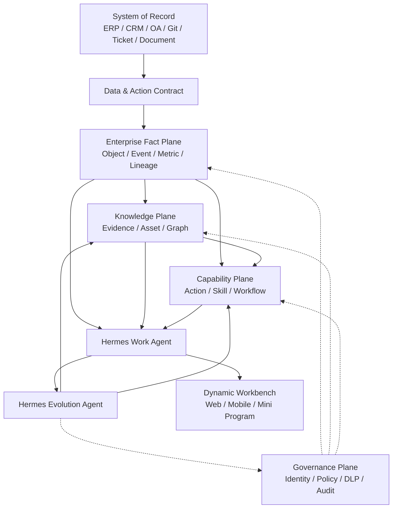

# Hermes Agent 原生企业工作模式设计

- 状态：未来产品方向设计基线
- 日期：2026-07-28
- 适用范围：Hermes 企业 AI 工作台及后续产品扩展
- 依赖：
  - [Hermes Connector 商用首发架构](2026-07-28-hermes-connector-commercial-architecture-design.md)
  - [Hermes 企业 AI 工作台扩展设计](2026-07-28-enterprise-ai-workbench-expansion-design.md)
- 核心命题：从“企业建设固定业务页面”转向“企业建设可信数据与可执行能力，
  员工通过 Agent 按任务组织工作界面”

## 1. 执行结论

Hermes 的长期产品方向不应局限为远程使用 Agent 的 H5，也不应继续沿用“每个
业务问题建设一套独立系统和固定页面”的传统路径。

未来企业软件更可能形成以下结构：

```text
企业建设：
可信业务事实
  + 数据语义
  + 权限与政策
  + 可执行 Action / Skill
  + 审批与审计

员工获得：
按本人角色、目标和上下文动态组织的工作台
```

页面不再是系统本体，而是企业数据和能力在当前任务中的一次受控呈现。员工可以
组织自己的页面、数据阅读方式和任务流程，但不能绕过企业的数据口径、权限、
业务规则和正式审批。

Hermes 在这一方向上的产品定位应升级为：

> 企业可信数据与业务能力之上的 Agent 工作操作系统。

产品采用双层 Hermes Agent：

1. **Hermes Work Agent**：服务员工和项目，动态组织工作界面并执行任务；
2. **Hermes Evolution Agent**：服务企业能力建设，把经治理的共性经验转化为
   数据产品、知识资产、页面模板和公司核心 Skill。

两层 Agent 运行在同一产品内核和协议体系上，但使用不同身份、权限、数据范围、
发布节奏和治理流程。不得形成两套不可兼容的 Agent 代码分支。

## 2. 核心理论

### 2.1 不是“只建设数据”

“企业未来只需要建设数据”这个判断方向接近，但定义不完整。

原始数据不能直接替代业务系统。企业真正需要建设的是：

```text
可信业务事实
  + 可解释的数据语义
  + 可调用的业务动作
  + 可执行的业务流程
  + 可验证的权限政策
  + 可追溯的责任与证据
```

缺少语义时，Agent 不知道“收入”“客户”“有效订单”和“项目完成”的正式
定义。缺少 Action 时，Agent 只能阅读，不能安全地完成工作。缺少权限和审计时，
动态页面会成为新的数据泄露和越权入口。

因此，未来企业减少的是重复页面和烟囱式应用，不是业务事实、规则和责任。

### 2.2 企业软件重心迁移

企业软件长期经历以下变化：

| 阶段 | 核心资产 | 员工使用方式 |
|---|---|---|
| 页面中心 | 固定表单和菜单 | 员工适应系统 |
| 应用中心 | ERP、CRM、OA 等业务应用 | 员工跨系统工作 |
| 平台中心 | API、数据平台、低代码 | IT 组织共享能力 |
| Agent 中心 | 数据契约、Skill、Policy、Evidence | 系统适应员工任务 |

Agent 中心并不等于取消所有应用，而是把应用拆成三个部分：

1. System of Record：保存权威事实和交易状态；
2. Capability Service：提供稳定、受控的业务动作；
3. Agent Workbench：按人、任务和情境生成使用体验。

前两部分长期稳定，第三部分允许快速变化。

### 2.3 这一变化为什么开始具备可行性

四类能力正在同时成熟：

1. 大模型可以理解任务、规划步骤并调用工具；
2. 工具协议开始使用结构化输入输出契约；
3. Agent 可以输出可跨终端渲染的结构化界面；
4. 企业开始把人机协同作为工作组织方式，而不只是聊天助手。

[Google A2UI](https://developers.googleblog.com/en/a2ui-v0-9-generative-ui/)
已经把 Agent 生成界面定义为与前端框架解耦的声明式表达，并提供 Web 与移动端
渲染方向。

[Model Context Protocol 工具规范](https://modelcontextprotocol.io/specification/2025-11-25/server/tools)
使用输入和输出 Schema 描述工具能力，为 Agent 安全调用企业动作提供了协议参考。

[OpenAI Agent 工具体系](https://openai.com/index/new-tools-for-building-agents/)
将工具调用、编排、追踪和评估作为 Agent 应用的基础能力，而不是只提供聊天输出。

[Microsoft 2025 Work Trend Index](https://www.microsoft.com/en-us/worklab/work-trend-index/2025-the-year-the-frontier-firm-is-born)
提出从个人助手、人机团队到“人类主导、Agent 执行流程”的组织演进。该报告是
趋势信号，不是 Hermes 的产品需求来源；Hermes 仍需通过客户试点验证实际价值。

### 2.4 不会消失的复杂性

未来企业软件的复杂性不会消失，而会从页面迁移到以下位置：

- 业务对象和事件；
- 数据口径和语义；
- 状态机和不变量；
- 权限与数据分级；
- Action 输入输出契约；
- 审批和责任；
- 幂等、补偿和回滚；
- 证据、版本和审计；
- Skill 测试与评估。

如果企业只减少页面，却没有建设这些能力，最终会形成“由 Agent 驱动的影子
系统”，风险高于传统业务系统。

## 3. 哪些系统会变化

### 3.1 优先被动态工作台吸收

以下类型主要解决“如何展示、筛选和组合信息”，适合逐步进入 Hermes 工作台：

- 经营报表门户；
- 部门驾驶舱；
- 知识查询入口；
- 项目状态页面；
- 轻量级内部 CRUD；
- 数据汇总和周报工具；
- 部门级信息收集页面；
- 重复建设的角色门户；
- 低风险审批入口；
- 多系统只读聚合页面。

这些系统的原始数据源可以继续保留，但固定页面逐步退化为兼容入口。

### 3.2 保留为 System of Record

以下系统必须继续承担权威事实、事务一致性或监管责任：

- 财务总账；
- 订单、库存和供应链账本；
- 支付与结算；
- 身份、组织和权限；
- 合同与电子签署；
- 人事正式记录；
- 高并发交易核心；
- 法律法规要求留痕的正式系统；
- 生产控制和高安全等级系统。

Hermes 可以替换它们的部分员工界面，但不得绕过其正式 API、业务校验和交易
记录。

### 3.3 迁移后的目标形态

```text
原系统数据库 / 正式服务
        ↓
Data Contract + Action Contract
        ↓
Hermes Data / Capability Plane
        ↓
员工按任务生成的 Workbench
```

系统的“页面价值”下降，系统的“事实源和能力服务价值”上升。

## 4. 产品设计原则

1. **页面可变，事实稳定。**
2. **阅读可组合，写入必须受控。**
3. **个人体验可自由，企业能力必须治理。**
4. **Agent 可以提出能力候选，不能自行发布企业能力。**
5. **数据进入工作台不能扩大来源权限。**
6. **所有正式动作必须可审计、可幂等、可补偿或可回滚。**
7. **知识和 Skill 必须有 Owner、版本、证据和有效期。**
8. **运行时升级与业务能力升级分离。**
9. **企业 Agent 不是拥有全量明文权限的超级账号。**
10. **现有核心系统采用渐进式无头化，不进行一次性推倒重建。**

## 5. Hermes 产品定位

### 5.1 产品不再以页面数量定义能力

传统产品以模块、菜单和页面数量组织功能。Hermes 应以以下对象组织产品：

- Business Object；
- Data Product；
- Metric；
- Knowledge Asset；
- Action；
- Skill；
- Work Item；
- View；
- Policy；
- Evidence。

一个新的业务场景优先通过组合这些对象实现，而不是先新建菜单和页面。

### 5.2 H5/PWA 的长期角色

H5/PWA 仍然重要，但它只是统一 Workbench Shell：

- 身份登录；
- 会话和任务入口；
- 动态界面渲染；
- 组件目录；
- 权限提示；
- 人工审批；
- 证据和引用查看；
- 离线与弱网缓存；
- 通知和回到任务。

H5 不直接拥有业务规则，也不直接拼接数据库查询。相同的 View Schema 可以被
Web、移动端、小程序或桌面客户端使用各自的可信组件进行渲染。

## 6. 核心业务对象

### 6.1 Business Object

业务对象是企业事实的稳定标识，例如客户、合同、订单、项目、产品、工单和员工。

每个对象必须定义：

- 全局 ID；
- Tenant 和 Workspace；
- 来源系统；
- 当前状态；
- 数据分类；
- ACL；
- Owner；
- Schema 版本；
- 事件历史；
- 可用 Action；
- 正式详情链接。

### 6.2 Data Product

Data Product 不是一张裸表，而是可被员工和 Agent 安全使用的数据能力：

- 业务定义；
- Owner；
- Schema；
- 质量规则；
- 更新频率；
- 访问政策；
- 血缘；
- SLA；
- 示例查询；
- 允许使用的目的。

### 6.3 Metric

企业指标必须独立于页面保存：

- 指标名称和业务定义；
- 计算公式；
- 时间窗口；
- 单位；
- 维度；
- 排除项；
- 数据来源；
- Owner；
- 生效版本；
- 适用范围。

员工可以改变图表和筛选方式，不能私自改变正式指标口径。

### 6.4 Action

Action 是可执行的最小业务动作：

```text
Action
  = Input Schema
  + Preconditions
  + Permission Policy
  + Execution Adapter
  + Output Schema
  + Idempotency
  + Audit
  + Compensation / Rollback
```

示例：

- 创建项目任务；
- 更新客户风险状态；
- 发起合同审批；
- 提交知识候选；
- 请求数据访问；
- 生成并保存正式报告。

### 6.5 Skill

Skill 是对 Data Product、Knowledge、Action 和人工节点的流程化组合。Skill
解决完整工作目标，Action 只完成单个业务动作。

### 6.6 View

View 是对当前任务所需数据、组件和 Action 的声明式组合。它可以是一次性的，也
可以保存为个人视图、团队模板或企业模板。

### 6.7 Work Item

Work Item 连接员工、Agent、输入、交付物、审批、异常和证据，是动态工作台中的
正式协同对象。

## 7. 总体产品架构



Governance Plane 对所有层生效。Evolution Agent 只能提出 Policy 候选，不能
自行放宽企业权限。

## 8. 双层 Hermes Agent

### 8.1 Hermes Work Agent

Work Agent 的服务范围是个人、团队或项目。主要职责：

- 理解员工当前目标；
- 获取当前身份可见的数据；
- 组织任务所需页面；
- 选择并调用已发布 Skill；
- 发起受控 Action；
- 管理 Work Item；
- 请求人工确认或审批；
- 记录交付结果、异常和员工纠错；
- 维护个人偏好和短期工作上下文。

Work Agent 不拥有以下权力：

- 绕过来源 ACL；
- 直接修改正式数据库；
- 发布企业级 Skill；
- 将个人内容自动转为企业公开资产；
- 修改企业指标和权限政策；
- 自行批准高风险动作。

### 8.2 Hermes Evolution Agent

Evolution Agent 的服务范围是企业能力体系。主要职责：

- 在授权范围内识别重复工作模式；
- 发现知识缺口、流程瓶颈和重复页面；
- 提出 Data Product 候选；
- 提出 Metric、View Template 和 Skill 候选；
- 组织离线评估、Golden Case 和安全测试；
- 生成变更影响分析；
- 推荐灰度范围；
- 观察发布后的效果和异常；
- 提出改进、降级或废止建议。

Evolution Agent 不是拥有所有员工原始内容的“企业超级大脑”。默认使用：

- 正式 Work Item；
- 已发布知识资产；
- 脱敏或聚合运行指标；
- 经 Policy 允许的工作证据；
- 明确授权的专项分析数据。

需要访问受限原文时，必须使用目的限定授权、有效期和审计工单。

### 8.3 同一内核、不同身份

两层 Agent 共用：

- Agent Runtime；
- Skill Manifest；
- Work Event Contract；
- View Schema；
- Action Contract；
- Tool Gateway；
- Policy Decision API；
- Trace 和 Evaluation 格式。

两层 Agent 分离：

| 维度 | Work Agent | Evolution Agent |
|---|---|---|
| 服务对象 | 员工、团队、项目 | 企业能力治理 |
| 数据范围 | 当前身份和任务 | 经治理的企业范围 |
| 主要输出 | 页面、任务结果、协同记录 | 候选资产、Skill、模板和改进建议 |
| 运行速度 | 实时、分钟级 | 批次、周期性 |
| 发布权限 | 个人视图 | 无直接发布权 |
| 人工门禁 | 高风险 Action | 所有企业能力发布 |

## 9. 双层迭代升级循环

### 9.1 下层快速工作循环

```text
员工目标
  -> Work Agent 理解任务
  -> 组织 Dynamic View
  -> 调用 Data / Knowledge / Skill
  -> 员工确认或修正
  -> 执行 Action
  -> 形成结果与 Evidence
  -> 更新个人偏好和 Work Item
```

这一循环优化员工当前工作，但不自动改变企业正式能力。

### 9.2 上层企业能力循环

```text
授权 Work Event / Evidence / Outcome
  -> Evolution Agent 识别共性模式
  -> 生成 Data Product / View / Skill 候选
  -> Owner 审核
  -> Evaluation Suite
  -> 安全和权限检查
  -> 签名发布
  -> 灰度下发 Work Agent
  -> 运行反馈
  -> 改进 / 回滚 / 废止
```

这一循环把个人经验升级为企业能力，但发布前必须经过治理。

### 9.3 从个人创新到企业标准

能力晋升路径：

```text
一次性个人 View
  -> 已保存个人 View
  -> 团队共享模板
  -> 企业模板候选
  -> 已发布企业模板

个人任务方法
  -> 可复用 Workflow
  -> Skill 候选
  -> 沙箱评估
  -> 已发布公司核心 Skill
```

使用频率不能单独决定晋升。还必须验证结果质量、数据权限、适用边界、Owner 和
异常处理。

## 10. 动态页面实现原则

### 10.1 不生成任意 HTML 和 JavaScript

生产环境中的 Agent 不直接向员工下发任意可执行代码。Agent 输出声明式
`Workbench View Schema`，客户端只渲染企业批准的组件。

```json
{
  "view_id": "view_project_risk_01",
  "schema_version": "1.0",
  "title": "项目交付风险",
  "purpose": "project_delivery",
  "scope": {
    "workspace_id": "wsp_01",
    "project_id": "prj_01"
  },
  "layout": "responsive_grid",
  "components": [
    {
      "type": "metric_card",
      "data_binding": "metric.overdue_work_items"
    },
    {
      "type": "work_item_table",
      "query_binding": "query.project_blockers",
      "actions": ["work_item.assign", "work_item.escalate"]
    }
  ]
}
```

### 10.2 Component Registry

组件目录至少包含：

- 文本和引用；
- 指标卡；
- 表格；
- 图表；
- 时间线；
- 对象详情；
- 任务列表；
- 审批卡；
- 表单；
- 差异比较；
- 文档预览；
- 数据来源和权限提示；
- Agent 执行状态；
- 异常和人工接管。

每个组件必须声明：

- 支持的数据类型；
- 最大数据量；
- 可用 Action；
- 数据分类上限；
- Web、移动端和小程序支持状态；
- 可访问性要求；
- 安全渲染规则。

### 10.3 View 的三级治理

| 类型 | 创建者 | 可见范围 | 是否审批 |
|---|---|---|---|
| Personal View | 员工 / Work Agent | 仅本人 | 否 |
| Team Template | 团队 Owner | 指定团队或项目 | 视数据范围决定 |
| Enterprise Template | 企业 Owner | 企业授权范围 | 必须 |

个人 View 只能引用本人已有权限的数据和 Action。保存或分享 View 不得复制数据
内容，也不得扩大访问权限。

## 11. 读取与写入分离

### 11.1 Read Plan

Agent 组织读取时生成 Read Plan：

- 当前用户；
- 业务目的；
- 数据对象；
- 字段；
- 筛选条件；
- 时间范围；
- 聚合方式；
- 引用要求；
- View 绑定。

Policy Service 在查询前和结果返回前分别鉴权。

### 11.2 Command Plan

任何写入必须转换为 Command Plan：

```json
{
  "action_id": "work_item.escalate",
  "action_version": "2.1",
  "actor_id": "usr_01",
  "purpose": "project_delivery",
  "resource_ids": ["wrk_01"],
  "input": {
    "reason": "关键依赖连续阻塞"
  },
  "idempotency_key": "cmd_01",
  "required_approvals": [],
  "expected_resource_version": 7
}
```

执行链：

```text
Command Plan
  -> Schema 校验
  -> Policy 决策
  -> 前置条件检查
  -> 人工确认 / 审批
  -> Action Adapter
  -> System of Record
  -> 结果和版本
  -> Audit / Evidence
```

Agent 不能用自然语言直接拼接写库语句。

## 12. 数据与语义底座

### 12.1 Canonical Business Model

Hermes 不应尝试一次性建立覆盖所有行业的统一大模型。采用：

- 少量平台通用对象；
- 客户可扩展业务对象；
- 来源系统 Adapter；
- 版本化字段映射；
- 业务术语和 Metric Registry。

平台通用对象包括：

- Organization；
- User；
- Workspace；
- Project；
- Work Item；
- Document；
- Knowledge Asset；
- Skill；
- Action；
- Evidence。

客户业务对象通过 Namespace 扩展，例如：

- `sales.customer`
- `supply.order`
- `finance.budget_item`
- `manufacturing.work_order`

### 12.2 语义优先于向量

向量检索用于发现相关内容，不能承担：

- 权威指标计算；
- 对象身份匹配；
- 权限事实；
- 正式状态；
- 交易一致性；
- 数据血缘。

企业事实和权限保存在结构化权威存储中。向量、搜索和知识图谱是可重建投影。

### 12.3 数据契约门禁

进入 Hermes 的正式 Data Product 必须通过：

1. Schema 校验；
2. Owner 确认；
3. 数据分类；
4. ACL 映射；
5. 质量规则；
6. 血缘记录；
7. 删除传播；
8. SLA；
9. 版本兼容；
10. 使用目的说明。

## 13. 公司核心 Skill

### 13.1 Skill 是未来业务系统的可执行单元

当页面不再固定后，公司核心流程不能散落在 Prompt 中。必须通过 Skill Manifest
表达：

- 目标；
- 输入输出；
- 数据依赖；
- Action 依赖；
- 知识版本；
- 状态和分支；
- 人工门禁；
- 权限目的；
- 评估套件；
- 成本和时延预算；
- 回滚版本；
- Owner。

### 13.2 Skill 发布流水线

```text
DISCOVERED
  -> DESIGNED
  -> SANDBOX
  -> EVALUATED
  -> SECURITY_REVIEW
  -> OWNER_APPROVED
  -> CANARY
  -> PUBLISHED
  -> OBSERVED
  -> SUPERSEDED / ROLLED_BACK
```

Evolution Agent 可以完成发现、草拟、测试准备和影响分析，但以下动作必须由人
完成：

- 指定 Owner；
- 确认业务适用范围；
- 批准高风险 Action；
- 批准数据权限；
- 批准正式发布；
- 处理责任争议。

### 13.3 Skill 不等于 Agent Runtime

Skill 通过版本化制品快速升级，不要求同步更新 Hermes Agent 二进制。这样可以
保持：

- Agent Runtime 稳定；
- Connector 协议稳定；
- 企业能力快速迭代；
- 客户环境按策略选择版本；
- 异常时单独回滚 Skill。

## 14. 权限与治理

### 14.1 Policy Decision

每次读取、检索、Action 和 Skill 执行都提交统一决策请求：

```text
Subject
  + Tenant
  + Workspace
  + Resource
  + Classification
  + Purpose
  + Action
  + Context
  + Time
```

决策结果包括：

- allow / deny；
- 可见字段；
- 脱敏规则；
- 允许的模型位置；
- 是否需要审批；
- 授权有效期；
- 审计等级。

### 14.2 企业 Agent 权限

Evolution Agent 使用独立服务身份，遵循：

- 默认拒绝；
- 不继承平台管理员权限；
- 优先使用聚合和脱敏数据；
- 原文访问需要专项授权；
- 所有数据使用声明 Purpose；
- 输出不能扩大来源 ACL；
- 权限政策变更必须人工批准。

### 14.3 员工可见性

员工必须能够查看：

- 哪些 Work Event 被采集；
- 数据来源和用途；
- 保存时间；
- 谁访问过原文；
- 哪些个人方法被提出为模板或 Skill 候选；
- 候选最终是否发布；
- 如何纠错、限制处理和申诉。

详细规则沿用
[Hermes 企业 AI 工作台扩展设计](2026-07-28-enterprise-ai-workbench-expansion-design.md)
中的员工权益和数据治理边界。

## 15. 工作协同与证据

动态页面不能只提供临时答案。正式工作必须回到 Work Item：

- 目标；
- Owner；
- 人和 Agent 参与者；
- 输入；
- 依赖；
- Action；
- 审批；
- 交付物；
- 异常；
- 证据；
- 结果；
- 复盘。

Workbench 可以随任务变化，但 Work Item 和 Evidence 保证工作连续性。员工切换
终端、Agent 或 View 后，仍然可以恢复完整状态。

## 16. 版本与升级模型

### 16.1 四条独立发布轨道

| 发布轨道 | 内容 | 节奏 | 回滚单位 |
|---|---|---|---|
| Runtime | Hermes Agent 执行内核 | 慢 | Agent 版本 |
| Connector | 远程连接和本地协议适配 | 慢 | Connector 版本 |
| Capability | Skill、Action Binding、Workflow | 快 | 单个能力版本 |
| Experience | View Schema、组件和模板 | 快 | 单个 View/组件版本 |

知识资产和 Policy 也使用独立版本，但发布必须符合其审批流程。

### 16.2 兼容原则

1. Work Agent 和 Evolution Agent 不通过复制代码形成分支。
2. Agent 通过 capability discovery 判断可用能力。
3. 新 Skill 不能假定所有 Agent 已升级。
4. View Schema 必须声明最低 Renderer capability。
5. Connector 只承载稳定协议和状态，不理解具体 Skill 业务。
6. Capability 和 View 可以独立灰度、暂停和回滚。
7. 私有化客户可以冻结版本，但不能绕过安全阻断策略。

### 16.3 签名下发

企业能力包至少包含：

- Manifest；
- Schema；
- Workflow；
- Knowledge Binding；
- Policy Binding；
- Evaluation 结果；
- SBOM 或依赖清单；
- 签名；
- 发布范围；
- 回滚版本。

Work Agent 只能加载企业 Registry 中已签名且当前身份有权使用的能力包。

## 17. 现有系统迁移方法

### 17.1 四类处置

| 类型 | 判断标准 | 处置 |
|---|---|---|
| Keep | 核心交易、账本或监管系统 | 保留系统和正式 API |
| Headless | 后端能力稳定、页面重复 | 保留服务，界面逐步进入 Hermes |
| Absorb | 轻量查询、报表和协同页面 | 迁入 Dynamic Workbench |
| Retire | 无权威数据、低使用且功能重复 | 数据归档后退役 |

### 17.2 迁移步骤

1. 建立系统和页面资产清单；
2. 标记事实源、Owner 和数据分类；
3. 识别哪些页面只读、哪些包含写操作；
4. 为数据建立 Data Contract；
5. 为写操作建立 Action Contract；
6. 在 Hermes 中重建等价 View；
7. 双轨运行并比较结果；
8. 验证权限、性能和用户任务完成率；
9. 关闭旧页面写入口；
10. 完成归档和退役审计。

不能按“页面看起来一样”判断迁移完成。必须按业务结果、权限和证据一致性验收。

## 18. 可操作落地路线

### Phase 0：契约与治理基础

交付：

- Enterprise Workspace；
- 统一身份；
- Work Event Contract；
- Business Object 基础模型；
- Data Classification；
- Policy Decision API；
- Audit Event；
- Data、Action、View 和 Skill Schema Registry。

验收门槛：

- 所有对象具备 Tenant、Workspace、Owner、分类和版本；
- 来源 ACL 可以映射；
- 拒绝规则优先；
- 读写均产生审计；
- 协议具备兼容性测试。

### Phase 1：只读动态工作台

建议首个试点采用“项目交付工作台”，接入：

- 项目任务；
- 企业文档；
- 代码和发布状态；
- 工单与异常。

交付：

- Workbench Shell；
- Component Registry；
- View Schema；
- Read Plan；
- 权限感知查询；
- Personal View；
- Team Template；
- 来源引用。

验收门槛：

- 员工可以用自然语言生成并保存个人 View；
- 同一 View 可在 Web 和移动端安全渲染；
- 无权限数据不会出现在标题、摘要、统计和向量召回中；
- 所有回答和指标可以追溯来源；
- 不产生正式写操作。

### Phase 2：受控 Action 与工作协同

交付：

- Action Registry；
- Command Plan；
- Tool Gateway；
- Work Item；
- 审批、交接、接管和异常；
- 幂等、补偿和结果证据。

验收门槛：

- Agent 不直接写数据库；
- 所有写操作使用版本化 Action；
- 高风险 Action 必须人工确认；
- 重复提交不产生重复业务效果；
- 失败可以补偿、回滚或明确进入人工处理。

### Phase 3：知识资产与核心 Skill

交付：

- Evidence；
- Knowledge Candidate；
- Asset Registry；
- Skill Factory；
- Skill Registry；
- Skill Runner；
- Evaluation Suite；
- 签名、灰度和回滚。

验收门槛：

- 正式资产均有来源、Owner、版本和有效期；
- 核心 Skill 均有 Golden Case、权限检查和人工审批；
- Skill 可以独立于 Agent Runtime 升级；
- Skill 失败不会破坏 System of Record；
- 发布后可以按 Tenant、团队和用户灰度。

### Phase 4：Enterprise Evolution Agent

交付：

- 重复工作模式识别；
- View 和 Skill 候选生成；
- 知识缺口分析；
- 变更影响分析；
- 评估任务自动组织；
- 能力运营看板。

验收门槛：

- Evolution Agent 无企业能力直接发布权限；
- 不使用提示词或在线时长评价员工；
- 原文访问具备目的、工单和有效期；
- 候选能力可以追溯到证据；
- 发布效果可以与旧版本对比；
- 异常版本可以自动停止灰度。

### Phase 5：存量系统界面收敛

交付：

- 应用处置清单；
- Headless Adapter；
- 等价 View；
- 旧入口迁移；
- 归档和退役流程；
- 成本与价值台账。

验收门槛：

- 核心事实源未被错误替代；
- 新旧路径业务结果一致；
- 旧系统退役前完成数据和审计归档；
- 员工跨系统切换显著减少；
- 被吸收页面不再产生第二套业务逻辑。

## 19. 首个试点建议

推荐从“项目交付工作台”开始，而不是财务、支付或人事。

原因：

- 同时覆盖文档、任务、代码、工单和 Agent 工作；
- 数据风险低于财务与人事；
- 可以验证跨系统只读组合；
- 可以逐步加入任务分配、升级和审批；
- 完成后自然产生知识资产和 Skill 候选；
- 能完整验证双层循环。

首个闭环：

```text
员工提出“查看项目风险”
  -> Work Agent 生成项目风险 View
  -> 员工发现关键阻塞
  -> 发起受控升级 Action
  -> Work Item 更新
  -> 项目结束形成复盘 Evidence
  -> Evolution Agent 提出风险识别 Skill 候选
  -> 项目 Owner 审核和评估
  -> Skill 灰度发布
  -> 其他项目 Work Agent 获得新能力
```

## 20. 企业组织职责变化

未来 IT 和业务团队不会停止建设系统，而是改变建设对象。

| 角色 | 主要责任 |
|---|---|
| Data Owner | 数据定义、授权、质量和生命周期 |
| Metric Owner | 正式指标口径和版本 |
| Action Owner | 写操作、不变量、幂等和补偿 |
| Knowledge Steward | 知识证据、有效性和废止 |
| Skill Owner | Skill 目标、评估、发布和结果 |
| Policy Owner | 权限、用途和风险规则 |
| Component Owner | 可信组件、安全渲染和跨端一致性 |
| Agent Operator | Runtime、模型、成本、Trace 和可用性 |
| Employee | 组织个人工作台、修正结果、管理 Agent |

企业应用团队的交付物从“页面和菜单”转为“可复用数据产品、Action、Skill 和
可信组件”。

## 21. 衡量指标

### 21.1 员工价值

- 完成一个工作目标需要切换的系统数量；
- 从提出需求到得到可用 View 的时间；
- 重复数据整理时间；
- Work Item 周期和阻塞时间；
- 人工接管后恢复任务的成功率；
- 员工主动保存和复用 View 的比例。

### 21.2 企业能力

- Data Product 复用率；
- View Template 复用率；
- Skill 成功率和人工接管率；
- 知识候选转正式资产比例；
- 重复页面减少数量；
- 被 Headless 或退役的应用数量；
- 能力从候选到发布的周期；
- 旧版本回滚时间。

### 21.3 治理和安全

- 跨 Tenant、Workspace、Project 越权事件；
- 无来源回答比例；
- 高风险 Action 未经审批执行次数；
- 无 Owner 或过期资产比例；
- 原文访问无 Purpose 或无工单次数；
- 删除传播完成时间；
- Capability 与 Runtime 不兼容比例。

安全类目标不能用平均值掩盖严重事件。跨租户越权和未经批准的高风险写入上线
目标必须为零。

## 22. 主要风险与控制

### 22.1 动态页面失控

风险：不同员工产生大量低质量 View，形成新的混乱。

控制：

- 声明式 View Schema；
- 可信 Component Registry；
- 个人、团队、企业三级治理；
- 使用和质量指标；
- 模板去重与废止。

### 22.2 数据语义冲突

风险：同一指标和对象存在多个定义，Agent 生成貌似正确但业务错误的结果。

控制：

- Metric Registry；
- Canonical Business Model；
- Owner 和版本；
- 冲突提示；
- 正式和非正式口径分层。

### 22.3 Agent 获得过大权限

风险：为了便利给 Agent 管理员权限。

控制：

- 独立服务身份；
- Purpose-bound Token；
- 短期授权；
- 字段级脱敏；
- 人工门禁；
- 全链路审计。

### 22.4 企业能力错误扩散

风险：一个错误 Skill 被快速下发给全公司。

控制：

- Golden Case；
- 安全评估；
- Owner 审批；
- 小范围灰度；
- 结果对照；
- 自动停止；
- 独立回滚。

### 22.5 过早替换核心系统

风险：把动态工作台误认为新的权威事实源。

控制：

- 明确 System of Record；
- 先只读后写入；
- 双轨验证；
- Action Adapter；
- 事务结果回写原系统；
- 按应用分类逐步迁移。

### 22.6 员工形成被监控感

风险：Evolution Agent 被理解为员工监控和评价工具。

控制：

- 采集范围可见；
- 不采集屏幕、键盘和私人活动；
- 管理者默认查看流程和聚合信息；
- 员工可查看访问记录；
- 不按提示词、消息和在线时长排名；
- 原始内容访问需要业务权限或审计工单。

## 23. 产品决策门禁

进入工程实施前必须确认：

1. Hermes 定位是否正式从“远程 Agent 客户端”升级为企业 Agent 工作操作系统；
2. Work Agent 和 Evolution Agent 是否采用同一内核、不同身份的模式；
3. 首个试点是否采用项目交付工作台；
4. 首批接入的文档、任务、代码和工单系统；
5. 首批可信组件目录；
6. 首批 Data Product 和 Metric Owner；
7. 首批允许写入的低风险 Action；
8. 企业能力发布审批责任人；
9. SaaS、专属数据平面和私有化的能力差异；
10. 客户员工制度和数据使用告知流程。

## 24. 设计结论

### Summary

未来企业软件不会简单地从“复杂业务系统”退化为“一个数据仓库”。更可能的
形态是：核心系统继续保存权威事实，企业把数据语义、业务动作、知识、Skill、
权限和证据建设成共享能力，员工通过 Hermes Work Agent 按任务动态组织工作台。

### Chosen approach

采用“System of Record + 可信数据与能力底座 + Dynamic Workbench”的结构，
并通过 Work Agent 快速工作循环和 Evolution Agent 企业能力循环形成双层
Hermes Agent 迭代机制。页面允许动态变化，读取受权限约束，写入只能通过
受治理 Action，企业能力必须经过评估、审批、签名、灰度和回滚。

### Open risks

首批试点系统、可信组件目录、企业语义模型、Policy Engine、模型兼容矩阵和
客户治理流程仍需在实施计划中明确。完全动态的工作方式必须通过试点数据验证，
不能仅凭趋势判断替换核心系统。

### Next skill

`$superpower-writing-plans`
