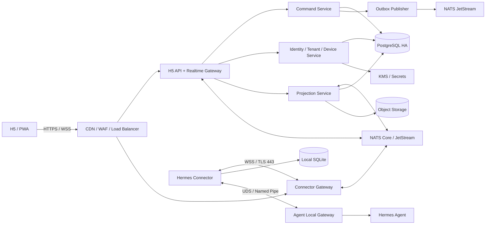
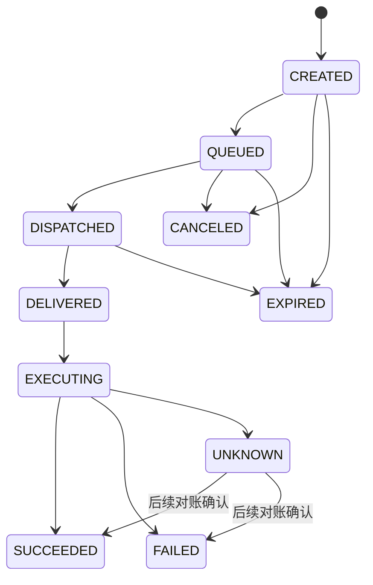

# Hermes Connector 商用首发架构设计

- 状态：已确认设计基线
- 日期：2026-07-28
- 首发地域：中国大陆
- 首发云服务商：阿里云（初步选定）
- 首发规模：A 级，按 10,000 个在线 Connector 设计
- 扩展目标：架构可平滑扩展到 B 级，约 100,000 个在线 Connector
- 适用范围：H5/PWA、Hermes Remote Server、Hermes Connector、Hermes Agent Local Gateway

未来企业 AI 工作台、公司核心 Skill、权限感知知识库和工作协同的扩展设计见
[`2026-07-28-enterprise-ai-workbench-expansion-design.md`](2026-07-28-enterprise-ai-workbench-expansion-design.md)。

## 1. 摘要

Hermes 的商用远程访问产品采用以下主链路：

```text
H5 / PWA
  -> HTTPS / WSS
Hermes Remote Server
  -> Hermes WSS Gateway
  -> NATS Core / JetStream
  -> PostgreSQL / Object Storage / KMS
  -> WSS / TLS 443
Hermes Connector
  -> Unix Domain Socket / Windows Named Pipe
Hermes Agent Local Gateway
  -> Hermes Agent
```

Hermes Connector 是独立 Python 服务。它与 Hermes Agent 使用独立运行环境和独立发布周期，不导入 Agent 内部模块，不读取 Agent SessionDB，也不要求 Agent 对公网开放端口。

Connector 只认识 Hermes 自有 WSS 协议。NATS、PostgreSQL、对象存储和 KMS 均属于 Remote Server 内部实现，不能成为 Connector 的外部依赖。由此确保服务端消息基础设施调整时，不要求同步升级用户设备上的 Connector。

系统采用“至少一次投递、业务效果幂等”的可靠性模型。PostgreSQL 是远程命令、租户、设备和审计的事实源；Hermes Agent 是本地会话及执行结果的事实源；JetStream 是可恢复的交付层，不承担最终业务状态。

## 2. 已确认决策

| 决策项 | 选择 |
|---|---|
| 首发容量 | A 级商用高可用 |
| 扩展策略 | B-ready A，首发保留集群化边界 |
| Connector—Server 外部协议 | Hermes WSS Connector Protocol |
| Server 内部消息系统 | NATS Core + JetStream |
| Redis | 不进入核心链路；未来仅可作为可替换缓存或限流实现 |
| 离线命令 | 按风险分级 |
| Cloud 会话内容 | 加密、可删除、带保留期的近期读取投影 |
| 会话事实源 | Hermes Agent |
| 租户模型 | 个人空间也是标准 Tenant |
| 首发地域 | 中国大陆 |
| 首发云服务商 | 阿里云，产品选型保持可迁移边界 |
| Agent、Connector、Server 发布 | 三条独立发布列车 |
| 公开可用性目标 | 月度 SLA 99.9% |
| 内部可用性目标 | 月度 SLO 99.95% |

## 3. 目标与非目标

### 3.1 目标

1. H5/PWA 可以安全观察和控制用户授权的 Hermes Agent。
2. Connector 主动通过 TLS 443 建立出站连接，不要求本机公网入口。
3. Agent 更新、Connector 更新和 Server 发布可以独立进行。
4. Gateway 节点故障、网络闪断和 Agent 重启不会导致已确认命令无状态可查。
5. 同一命令被重复投递时，不产生重复业务效果。
6. 从首发起建立 Tenant、设备、权限、审计、订阅配额、数据导出与删除边界。
7. A 级部署可以通过增加节点和容量升级到 B 级，不改变 Connector 协议和核心数据模型。

### 3.2 非目标

1. Remote Server 不成为第二个 Hermes Agent。
2. Remote Server 不复制或直接读取 Agent SessionDB。
3. Connector 不直接连接 NATS、Redis、PostgreSQL 或对象存储。
4. H5 不直接访问本地 Dashboard。
5. 首发不建设跨国或境外数据域。
6. 首发不承诺中国大陆多地域业务双活。
7. JetStream 不作为长期会话存储或审计事实源。

## 4. 当前实现与迁移边界

当前项目文档仍包含 Android App 经 HTTPS/WSS、WireGuard 或反向隧道直达本地 Hermes Web 服务的方案。该方式适合早期验证，但不作为商用目标架构，原因包括：

- 暴露面与本地 Dashboard 强耦合；
- 隧道和 Agent 生命周期耦合；
- 缺少独立设备身份、命令事实状态和服务端多节点路由；
- Agent 升级窗口内无法区分 Connector 在线与 Agent 暂不可用；
- 无法为 H5 提供稳定的跨版本协议。

迁移后的公开入口只保留 Hermes Remote Server。现有隧道只能在过渡期用于内部验证，正式商用切换完成后必须关闭公网 Dashboard 映射。

当前 Hermes Agent 中已经存在 Observer、Control Lease、Command Ledger、Unix Socket Relay 和 WebSocket Ticket 等 Python 实现。这些能力应作为 Local Gateway v1 的实现基础，但必须先完成以下安全收口：

1. 将“协议保留方法”与“当前启用方法”拆分。
2. `session.steer`、`session.redirect`、`sudo.respond`、`secret.respond`、`terminal.read.respond` 等方法在完成租约和会话绑定包装前必须返回 `method_not_available`。
3. 所有控制方法必须二次校验 session、runtime generation、client instance、control lease 和 pending input revision。
4. Agent 内存中的命令账本不能继续承担跨重启幂等事实源；Connector SQLite 与 Server PostgreSQL 共同保存可恢复状态。

## 5. 总体架构



### 5.1 用户端

#### H5/PWA

- 用户登录、设备配对、Agent 列表、会话观察和控制；
- 展示命令的真实状态，而不是将网络发送成功误认为 Agent 执行成功；
- 根据 Server 返回的 capability 决定是否显示操作入口；
- 检测事件序列缺口并请求快照；
- 不保存 Connector 设备私钥、Agent 模型密钥或 sudo/secret 明文。

#### Hermes Connector

- 独立 Python 包、虚拟环境、服务进程和发布渠道；
- 维护 Cloud WSS、心跳、协议协商和指数退避重连；
- 维护本地 SQLite Inbox、Outbox 和游标；
- 发现 Agent Local Gateway；
- 将 Cloud Command 转换为 Local Gateway RPC；
- 将 Agent 状态和安全裁剪后的事件转换为 Connector Protocol；
- Agent 不可用时仍保持 Cloud 在线，报告精确状态；
- 不解析 Agent SessionDB，不导入 Agent 私有 Python 模块。

#### Agent Local Gateway

- 提供版本化的本地协议；
- 负责 Observer、Control Lease、Allowlist、会话绑定和运行代次校验；
- 只返回允许远程观察的安全投影；
- 不允许 Connector 取代 Agent 的 owner transport；
- Unix 使用 0600 UDS；Windows 使用 ACL 受保护的 Named Pipe。

### 5.2 Remote Server

#### Connector Gateway

- 终止 Connector WSS；
- 校验设备身份、租户、地域和令牌；
- 执行协议协商、帧限制、速率限制、心跳和背压；
- 维护当前进程内的连接对象；
- 通过 NATS 将跨节点命令路由到持有目标连接的 Gateway；
- 本身无业务最终状态，可以滚动替换。

#### H5 API 与 Realtime Gateway

- 用户身份、Tenant 权限和控制租约入口；
- 创建命令并返回 `command_id`；
- 将实时事件推送给授权 H5；
- 不直接向 Connector 发送未经持久化的业务命令。

#### Command Service

- 在同一 PostgreSQL 事务写入 `commands` 与 `command_outbox`；
- 实施命令 TTL、风险分类、状态机和取消策略；
- 消费 Connector ACK 与结果；
- 对 `UNKNOWN` 命令禁止自动重试；
- 使用 `tenant_id + message_id` 保证命令唯一性。

#### Projection Service

- 保存近期会话的加密读取投影；
- 将高频 delta 合并成稳定段落或快照；
- 识别 `(runtime_generation, session_id, event_sequence)` 缺口；
- 实施租户保留策略、清除和导出；
- 不成为 Agent 会话写入权威。

#### Presence Service

- 维护 Connector、Agent 和 Session 的在线状态；
- 区分 `connector_online`、`agent_unavailable`、`draining`、`reconciling` 和 `ready`；
- Presence 是临时状态，不替代设备与 Agent 的持久记录。

## 6. 协议边界

系统定义三个独立协议：

| 协议 | 双方 | 职责 |
|---|---|---|
| Cloud API v1 | H5 ↔ Remote Server | 用户业务 API 与 H5 实时事件 |
| Connector Protocol v1 | Connector ↔ Connector Gateway | 设备连接、命令、ACK、事件和状态 |
| Local Gateway Protocol v1 | Connector ↔ Hermes Agent | 本地 Observer、Control 与能力发现 |

任何一方只能依赖相邻协议，不能依赖相邻组件的内部数据库或代码实现。

### 6.1 Connector 握手

Connector 建立 TLS/WSS 后发送：

```json
{
  "type": "connector.hello",
  "protocol_min": 1,
  "protocol_max": 1,
  "connector_version": "1.0.0",
  "device_id": "dev_01...",
  "agent_state": "ready",
  "agent_id": "agt_01...",
  "agent_version": "0.9.3",
  "local_gateway_version": 1,
  "runtime_generation": "run_01...",
  "capabilities": [
    "session.observe.v1",
    "session.control.v1"
  ],
  "resume_cursor": 1038
}
```

Server 返回：

```json
{
  "type": "server.welcome",
  "connection_id": "con_01...",
  "selected_protocol": 1,
  "required_connector_version": "1.0.0",
  "recommended_connector_version": "1.1.0",
  "heartbeat_interval_seconds": 20,
  "max_frame_bytes": 262144,
  "resume_from": 1039,
  "feature_flags": {}
}
```

`tenant_id` 和 `realm_id` 由 Server 根据设备身份注入连接上下文，不能信任 Connector 自报值。
Agent 暂不可用时，Connector 仍发送 `connector.hello`，但将
`agent_state` 设为 `unavailable`，Agent 版本、运行代次和 capability
字段可以为空。

### 6.2 通用消息信封

```json
{
  "protocol_version": 1,
  "message_id": "msg_01...",
  "type": "command.prompt.submit",
  "agent_id": "agt_01...",
  "session_id": "ses_01...",
  "runtime_generation": "run_01...",
  "sequence": 1039,
  "reply_to": null,
  "expires_at": "2026-07-28T10:05:00Z",
  "payload_digest": "sha256:...",
  "payload": {}
}
```

规则：

1. `message_id` 全局唯一且不可重用。
2. 同一 `message_id` 的 `payload_digest` 不同，必须拒绝并触发安全告警。
3. 命令必须包含 `expires_at`。
4. 控制命令必须绑定 `agent_id`、`session_id` 和 `runtime_generation`。
5. 未知字段必须忽略；未知消息类型必须返回明确错误，不能猜测处理。
6. 帧大小超过协商限制时立即拒绝。

## 7. NATS 与持久化职责

### 7.1 NATS 使用范围

建议主题空间：

```text
cmd.v1.<realm>.<tenant>.<agent>
cmd.ack.v1.<realm>.<tenant>.<agent>
event.durable.v1.<realm>.<tenant>.<agent>
event.live.v1.<realm>.<tenant>.<agent>
presence.v1.<realm>.<tenant>.<agent>
gateway.control.v1.<gateway_node>
```

建议 Stream：

| Stream | 内容 | 保留原则 |
|---|---|---|
| COMMAND_DELIVERY | 待投递命令 | 有界保留，不超过业务 TTL |
| COMMAND_RESULTS | ACK、执行状态、最终结果 | 至少覆盖 PostgreSQL 消费恢复窗口 |
| DURABLE_EVENTS | 会话生命周期、审批、安全事件 | 有界时间和容量 |
| AUDIT_INGEST | 待持久化审计事件 | 持久化完成后可清理 |

NATS Core 只承载可以通过快照恢复的在线流，例如文本 delta、推理 delta、心跳和 Presence。JetStream 承载需要 ACK、重放和消费者游标的消息。

### 7.2 PostgreSQL 事实表

核心数据对象：

- `realms`
- `tenants`
- `users`
- `memberships`
- `devices`
- `device_keys`
- `agents`
- `connector_connections`
- `control_leases`
- `commands`
- `command_attempts`
- `command_outbox`
- `session_projections`
- `event_cursors`
- `pending_inputs`
- `audit_events`
- `retention_jobs`
- `subscription_entitlements`

关键约束：

- 所有业务表包含 `tenant_id`；
- 中国大陆首发使用固定 `realm_id`；
- `(tenant_id, message_id)` 唯一；
- `(tenant_id, device_id)` 唯一；
- 命令状态变化采用乐观版本号；
- Server 端数据库操作启用 Tenant 范围校验，并使用 PostgreSQL RLS 作为纵深防御。

### 7.3 Connector SQLite

Connector 本地数据库只保存运行所需状态：

- `cloud_inbox`：已收到命令、payload digest、执行状态和结果摘要；
- `local_outbox`：尚未得到 Server ACK 的事件和命令结果；
- `sequence_cursors`：上行和下行游标；
- `agent_runtime`：最近 Agent endpoint、runtime generation 和 capability；
- `connector_meta`：Schema 版本和升级状态。

敏感命令正文不得进入常规 SQLite 明文列。临时密文消费完成后立即删除。

## 8. 命令可靠性与状态机



状态含义：

- `CREATED`：授权通过，命令和 Outbox 已在同一事务提交；
- `QUEUED`：已进入交付层；
- `DISPATCHED`：已发往持有 Connector 连接的 Gateway；
- `DELIVERED`：Connector 已持久写入 SQLite Inbox；
- `EXECUTING`：Agent Local Gateway 已受理；
- `SUCCEEDED` / `FAILED`：最终结果；
- `CANCELED`：执行前取消；
- `EXPIRED`：超过 TTL，禁止继续下发；
- `UNKNOWN`：执行边界中断，不能安全判断是否已经产生效果。

命令重投规则：

1. 未达到 `DELIVERED` 可以在 TTL 内重投。
2. Connector 对重复 `message_id` 返回已保存状态，不重新执行。
3. `EXECUTING` 后失联的命令进入 `UNKNOWN`，不能自动再次提交。
4. 只有通过 Agent 事实状态、client turn ID 或本地命令记录完成对账后，才能关闭 `UNKNOWN`。

### 8.1 风险分级

| 命令 | 离线策略 | 默认 TTL | 前置条件 |
|---|---|---:|---|
| `prompt.submit` | 短期排队 | 5 分钟 | 会话未切代，控制租约有效 |
| `session.interrupt` | 不排队 | 10 秒 | 目标运行仍为 active |
| `approval.respond` | 不排队 | 60 秒 | pending input ID 与 revision 一致 |
| `clarify.respond` | 不排队 | 60 秒 | pending input ID 与 revision 一致 |
| `sudo.respond` | 不保存 Cloud 明文 | 30 秒 | 临时端到端密文，一次性消费 |
| `secret.respond` | 不保存 Cloud 明文 | 30 秒 | 临时端到端密文，一次性消费 |
| `terminal.read.respond` | 不保存 Cloud 明文 | 30 秒 | 临时端到端密文，一次性消费 |
| 配置变更 | 允许排队 | 24 小时 | `expected_version` 匹配 |

TTL 是服务端默认值。业务可以缩短，但不能由客户端任意延长到超过服务端上限。

## 9. 事件、快照与 Cloud 投影

### 9.1 必须持久化

- 命令状态变化与最终结果；
- 会话生命周期与 runtime generation；
- 审批、澄清和敏感输入请求的创建与消费结果；
- 设备注册、吊销和权限变化；
- 安全和管理审计事件。

### 9.2 仅实时传输

- 文本与推理高频 delta；
- 工具执行的重复进度帧；
- 心跳和临时 Presence。

H5 和 Projection Service 使用以下游标判断缺口：

```text
(runtime_generation, session_id, event_sequence)
```

发现缺口时不能凭客户端缓存补猜，必须请求 Agent 快照或 Cloud 近期投影。Cloud 默认保存 30 天加密读取投影，用户可以选择关闭、缩短或立即清除。清除任务需要覆盖数据库、对象存储缓存和密钥材料。

## 10. 设备身份与安全

### 10.1 首次配对

1. Connector 本地生成 Ed25519 设备身份密钥。
2. 私钥写入 macOS Keychain、Windows DPAPI 或 Linux Secret Service。
3. Connector 显示有效期 5 分钟的一次性配对码。
4. 用户在已登录 H5 中确认设备名称、平台和密钥指纹。
5. Server 将设备公钥绑定到 Tenant、中国大陆 Realm 和用户授权。
6. Connector 使用随机 Challenge 签名证明私钥持有权，换取短期连接令牌。

安全存储不可用时，Connector 不得降级为明文长期密钥，必须拒绝持久配对和远程访问，仅提供明确诊断。

### 10.2 命令授权

每条控制命令必须依次通过：

1. 用户身份和 Tenant membership；
2. 订阅权益与资源配额；
3. `client_instance_id` 和控制租约；
4. agent、session、runtime generation 绑定；
5. Server 方法 Allowlist 和风险策略；
6. Connector 消息信封和签名校验；
7. Agent Local Gateway 的租约、Allowlist 和 pending revision 校验。

Connector 不是授权事实源，不能自行扩大权限。

### 10.3 密钥分层

| 密钥 | 保存位置 | 用途 |
|---|---|---|
| Release Signing Key | 离线或 HSM | Connector 安装包和版本清单签名 |
| Server Signing Key | Cloud KMS | 短期令牌与命令信封签名 |
| Device Identity Key | OS 安全存储 | Connector 身份 Challenge |
| Tenant Data Encryption Key | 信封加密 | Cloud 读取投影 |
| Sensitive Session Key | H5 与 Connector 内存 | sudo、secret、terminal input 临时密文 |

Server Signing Key 按季度轮换，并通过 Key ID 保留旧签名验证窗口。Release Signing Key 使用独立权限和双人发布审批。

敏感输入使用经过审计的密码库实施临时端到端加密。Connector 提供签名的临时加密公钥，H5 使用会话级密钥加密正文，Server 只转发密文。租户、命令、会话、过期时间和 payload digest 作为 AEAD 附加认证数据。

### 10.4 设备生命周期

```text
UNPAIRED -> PENDING -> ACTIVE -> SUSPENDED -> REVOKED / RETIRED
```

设备吊销后：

- 立即关闭现有 WSS；
- 拒绝新的 Challenge；
- 清除未执行敏感命令；
- 保留不含正文的安全审计；
- H5 显示吊销操作者和时间。

## 11. 版本与升级治理

### 11.1 兼容规则

1. 同一 Major 版本只允许增量字段和 capability。
2. 未知字段必须忽略；未知能力默认关闭。
3. 功能按 capability 开启，不能根据版本字符串猜测。
4. Server 支持当前与前两代稳定 Connector，且迁移窗口不少于 180 天。
5. 破坏性变更通过并行 v2 endpoint 发布。
6. 数据库变更采用 expand → migrate → contract。

### 11.2 Agent 更新

```text
READY
  -> DRAINING
  -> AGENT_UNAVAILABLE
  -> RECONCILING
  -> READY
```

- `DRAINING` 后停止接受新控制命令；
- Connector 继续保持 Cloud WSS；
- 新 Agent 启动后生成新 `runtime_generation`；
- 旧代次控制租约、pending input 和事件订阅全部失效；
- Connector 完成 Local Gateway 握手和快照对账后恢复 `READY`。

### 11.3 Connector 更新

- 使用签名版本清单与安装包摘要；
- 采用 internal → 1% → 10% → 50% → 100% 灰度；
- 使用双槽安装或平台等价的可回滚机制；
- 新版本启动、Cloud 握手或 Local Gateway 健康检查失败时自动回滚；
- 强制升级只能用于已确认的安全阻断版本，并提供用户可见原因。

### 11.4 Server 更新

- Gateway 先进入 drain，不再接受新连接；
- Connector 收到服务重启信号后使用指数退避和随机抖动重连；
- 发布期间旧、新服务同时支持当前协议；
- 错误预算耗尽或 `UNKNOWN` 命令比例异常时暂停发布。

## 12. 生产拓扑、SLA 与灾备

### 12.1 首发拓扑

- 阿里云 WAF 3.0 与 ALB；
- ACK Pro 托管集群，业务节点池跨可用区；
- H5 API / Realtime Gateway 至少 2 副本；
- Connector Gateway 至少 2 副本；
- NATS JetStream 3 节点，跨可用区；
- ApsaraDB RDS for PostgreSQL 高可用版，多可用区部署并启用 PITR；
- OSS 启用版本、生命周期、服务端加密和跨区域复制；
- KMS 与 Secrets Manager；
- 第二个中国大陆地域部署数据库灾备实例并保存 OSS 加密副本。

#### 12.1.1 阿里云产品映射

| 架构能力 | 阿里云初选产品 | 设计约束 |
|---|---|---|
| 域名与证书 | Alibaba Cloud DNS、Certificate Management Service | 域名、证书和服务实例分离管理 |
| H5 静态资源 | OSS + CDN | Bucket 不允许公共列举；发布制品版本化 |
| 公网接入 | WAF 3.0 Cloud Native Mode + ALB | WAF 规则、连接限速和 WebSocket 超时纳入版本化配置 |
| 容器运行 | ACK Pro | 跨可用区节点池、Pod Topology Spread、PDB 和滚动 drain |
| 容器制品 | ACR Enterprise Edition（镜像签名使用 Advanced Edition） | 镜像摘要固定；使用 KMS 签名并在 ACK 阻止未签名镜像 |
| NATS | ACK 内自建 3 节点 NATS JetStream | 独立节点池、跨可用区反亲和、独立 ESSD 云盘、定期恢复演练 |
| 业务数据库 | ApsaraDB RDS for PostgreSQL 高可用版 | 多可用区、SSL、白名单、PITR；应用必须处理连接重建 |
| 区域灾备 | RDS 跨区域灾备实例 / DTS | 异步复制；切换需要更新连接配置并执行受控 Runbook |
| Cloud 投影和附件 | OSS | 信封加密、版本控制、生命周期、CRR 和最小权限 RAM Role |
| 密钥与秘密 | KMS、Secrets Manager | 应用使用 RAM Role 获取；禁止长期 AccessKey 写入配置 |
| 日志与指标 | SLS、ARMS、CloudMonitor | 正文脱敏；指标、Trace 和审计日志分库分权限 |
| 云控制审计 | ActionTrail | RAM、KMS、OSS、RDS 和 ACK 管理操作进入独立审计保留 |
| 基础网络 | VPC、vSwitch、Security Group、NAT Gateway | 数据层无公网入口；服务通过私网访问 RDS、OSS 和 KMS |

NATS 保持标准协议和独立数据卷，不使用阿里云专有消息协议替代
Connector Protocol。ACK、RDS、OSS 和 KMS 的接入均通过基础设施适配层
和标准接口封装，避免业务域代码直接依赖云厂商 SDK。

主地域必须同时满足目标用户网络质量、WAF/ALB/ACK/RDS/KMS 产品可用性、
至少三个可用区和成本预算。正式购买页面是地域与规格可用性的最终依据。
第二地域限定在中国大陆，用于 RDS 灾备和 OSS CRR，不作为首发业务双活入口。

### 12.2 服务目标

| 指标 | 目标 |
|---|---|
| 公开月度可用性 SLA | 99.9% |
| 内部月度可用性 SLO | 99.95% |
| 在线命令从 Server 接受至 Connector 持久 ACK | P95 < 1 秒 |
| Gateway 故障后 Connector 重连 | P95 < 30 秒 |
| 可用区故障 | RPO 0，RTO < 5 分钟 |
| 主区域灾难恢复 | RPO ≤ 15 分钟，RTO ≤ 4 小时 |

中国大陆首发不承诺主区域灾难下的无缝切换。公开 SLA、赔付边界和免责事项必须在正式服务条款中由专业法律和商业团队确认。

### 12.3 备份

- PostgreSQL 连续归档和 PITR；
- RDS 跨区域灾备实例或等价的异步复制链路；
- 每日快照与第二大陆地域加密副本；
- OSS CRR、版本控制、生命周期和删除标记；
- 每季度执行数据库恢复、设备吊销和密钥轮换演练；
- JetStream 数据不是长期备份，命令事实可由 PostgreSQL Outbox 恢复。

OSS 灾备 Bucket 默认不复制永久删除操作，避免主 Bucket 的误删除同步摧毁
灾备副本。KMS 加密对象的 CRR 使用专用最小权限 RAM Role，不能直接授予
账户级 OSS 或 KMS 全权限。

### 12.4 阿里云资料基线

- [ACK 产品说明](https://www.alibabacloud.com/help/en/ack/product-overview/product-introduction)
- [RDS 高可用与灾备](https://www.alibabacloud.com/help/en/rds/product-overview/high-availability-and-disaster-recovery)
- [RDS 跨区域灾备](https://www.alibabacloud.com/help/en/rds/support/instance-disaster-recovery)
- [WAF 3.0 接入 ALB](https://www.alibabacloud.com/help/en/waf/web-application-firewall-3-0/user-guide/add-an-alb-instance-to-waf)
- [OSS 跨区域复制](https://www.alibabacloud.com/help/en/oss/user-guide/cross-region-replication-overview/)
- [KMS Secrets Manager](https://www.alibabacloud.com/help/en/kms/key-management-service/user-guide/secret-management-overview)
- [ACR 镜像签名](https://www.alibabacloud.com/help/en/acr/user-guide/use-container-image-to-sign)

## 13. 可观测性与运营

### 13.1 指标

- 在线 Connector 数、连接时长和版本分布；
- 握手失败原因、心跳超时和重连率；
- Outbox 最老消息年龄；
- JetStream consumer lag、pending 和 redelivery；
- 命令各状态耗时；
- `EXPIRED`、`UNKNOWN` 和重复消息比例；
- 投影延迟、事件序列缺口和快照回退次数；
- 配对失败、设备吊销、权限拒绝和异常租户访问；
- Connector/Agent capability 分布和升级阻断比例。

日志与 Trace 只记录必要标识、哈希、错误码和关联 ID，不记录提示词正文、模型密钥、sudo、secret 或终端敏感输入。

### 13.2 故障手册

必须建立并演练：

- Gateway 节点故障与重连风暴；
- NATS quorum 丢失和消费积压；
- PostgreSQL 主备切换与 Outbox 恢复；
- Agent/Connector 不兼容和灰度回滚；
- 设备密钥或 Server 签名密钥疑似泄露；
- 误删除、租户导出和账户清除；
- 磁盘满、时钟漂移和网络分区。

### 13.3 客户可见运营面

- 公共状态页；
- 设备中心：在线状态、版本、最后连接和吊销；
- 命令时间线：排队、送达、执行、失败、过期和未知；
- 用户授权后上传的脱敏诊断包；
- 订阅与资源配额；
- Cloud 投影导出和删除；
- 账户关闭时撤销全部设备和令牌。

## 14. 订阅、配额与商业边界

服务端订阅权益至少控制：

- Tenant 可注册 Agent 数；
- 可绑定 H5 和 Connector 设备数；
- 并发观察与控制连接数；
- Cloud 投影保留天数；
- 每月事件流量和对象存储容量；
- 审计保留和高级诊断能力。

权益由 Server 下发并在 Server 强制执行。Connector 可以显示限制，但不能作为计费或授权事实源。支付供应商、具体价格和退款规则属于商业实施选择，不改变 Connector Protocol。

## 15. 测试体系

### 15.1 协议和组件

- JSON Schema 与 Golden Fixture；
- 未知字段、未知 capability 和跨版本兼容；
- 命令状态机、TTL、幂等、租约与 pending revision；
- Local Gateway 方法 Allowlist；
- SQLite Inbox/Outbox 崩溃恢复；
- PostgreSQL Outbox 与 JetStream 重投；
- 快照、序列缺口和 Projection 对账。

### 15.2 兼容矩阵

每次发布验证：

```text
Agent:     N / N-1 / N-2
Connector: N / N-1 / N-2
Server:    Current / Canary
```

### 15.3 安全

- 跨 Tenant、Agent、Session 越权；
- IDOR、重放、伪造签名和 payload digest 冲突；
- 过期令牌、吊销设备和无租约控制；
- WebSocket 洪泛、超大帧、压缩炸弹和协议 Fuzz；
- 日志、Trace、诊断包和错误信息的秘密扫描；
- SBOM、依赖漏洞、安装包签名和独立渗透测试。

### 15.4 容量

| 场景 | 验证规模 | 通过条件 |
|---|---:|---|
| 稳定在线 | 10,000 Connector × 72 小时 | 无连接泄漏，SLO 稳定 |
| 峰值裕量 | 20,000 Connector × 1 小时 | 不丢已提交命令，P95 投递 < 1 秒 |
| 重连风暴 | 10,000 连接 / 5 分钟 | 无认证雪崩，恢复受控 |
| 活动会话流 | 500 活跃会话、5,000 events/s | 投影延迟受控，可回退快照 |
| B 路径验证 | 100,000 空闲连接 | 不改变协议和数据模型即可扩展 |

### 15.5 Chaos

- 随机终止 Gateway；
- NATS Leader 和节点故障；
- PostgreSQL 主备切换；
- Agent 与 Connector 崩溃；
- 网络分区、高延迟和丢包；
- 时钟漂移；
- 磁盘满和只读；
- 密钥吊销。

## 16. 商用上线门禁

以下条件必须全部满足：

1. 兼容矩阵、端到端、容量和 Chaos 测试通过。
2. 跨租户越权为 0。
3. 已提交命令丢失为 0。
4. 重复投递导致重复业务效果为 0。
5. 没有未关闭的 P0/P1 安全问题。
6. 备份恢复、密钥吊销和版本回滚已完成演练。
7. 状态页、告警、值班和故障手册可用。
8. 订阅配额、账单异常和退款流程经过验证。
9. 数据导出、删除和账户关闭可以完成。
10. 隐私政策、用户协议、域名备案和适用合规清单完成专业审查。

## 17. 代码与仓库边界

建议拆分为：

| 项目 | 所有权 |
|---|---|
| `hermes-agent` | Local Gateway Protocol 与 Agent 内部安全实现 |
| `hermes-connector` | 独立 Python Connector、SQLite、系统服务与更新器 |
| `hermes-remote` | Gateway、NATS 集成、领域服务、数据库和生产基础设施 |
| `hermes-web` | H5/PWA |
| `hermesmobile` | 已确认协议文档、兼容 Fixture 和现有 Android 参考实现 |

协议 Schema 和 Golden Fixture 需要有单一发布源，并以版本化制品供各仓库消费。不得通过复制粘贴维护多个不受校验的协议定义。

## 18. 实施前置顺序

1. 修复现有 Hermes Agent 控制方法授权缺口。
2. 冻结 Local Gateway Protocol v1 与 Connector Protocol v1。
3. 建立跨仓库 Schema、Fixture 和兼容测试。
4. 建立 Connector SQLite Inbox/Outbox 与 Agent 发现。
5. 建立 Remote Server 命令事实表、Outbox、NATS 和 Gateway。
6. 建立 H5 配对、设备中心、会话观察和命令时间线。
7. 建立 Control、敏感输入临时加密和审计。
8. 建立升级器、灰度、监控、灾备和容量模拟器。
9. 通过全部上线门禁后切断公网 Dashboard 隧道。

本节只定义依赖顺序。任务拆分、里程碑和人员安排由后续实施计划给出。

## 19. 已接受的开放风险

以下事项不会改变总体架构，但必须在实施计划中完成选型和验证：

1. 阿里云主地域、第二灾备地域、实例规格、产品版本和正式商务报价。
2. NATS 已初选 ACK 内自建；上线前仍需完成托管替代方案和迁移演练评估。
3. 手机号、邮箱、Passkey 和第三方登录的首发组合。
4. 支付、发票、退款和订阅管理供应商。
5. Cloud 投影默认 30 天之外的套餐档位。
6. 中国大陆域名、备案、隐私、数据处理和安全制度的正式法律意见。

这些选择必须满足本文的 Tenant 隔离、数据删除、密钥管理、SLA、可迁移性和中国大陆数据驻留边界。

## 20. 设计结论

### Summary

Hermes 商用远程访问需要同时解决实时连接、可靠命令、Agent 升级、设备身份、多租户、安全留存、灾备和客户运营。单纯通过公网隧道暴露 Dashboard 或让 Connector 直接连接 Redis，无法形成稳定商用边界。

### Chosen approach

采用独立 Python Hermes Connector，通过自有 WSS Connector Protocol 连接无状态 Remote Gateway；Remote Server 内部使用 NATS Core/JetStream 处理路由和交付，PostgreSQL 保存业务事实，Agent 保持会话事实权威。

该方案相较 Connector 直连 MQTT Broker，保留了 Hermes 对外协议所有权；相较 WSS + Redis，自带更明确的消息路由、ACK、重放和集群扩展边界；A 扩展到 B 时只增加节点和容量，不改变 Connector。

### Open risks

阿里云具体地域与规格、NATS 运维细节、身份供应商、支付供应商和正式合规清单仍需在实施计划前完成选择，但不得改变本文的协议、数据、安全和升级边界。

### Next skill

`$superpower-writing-plans`
