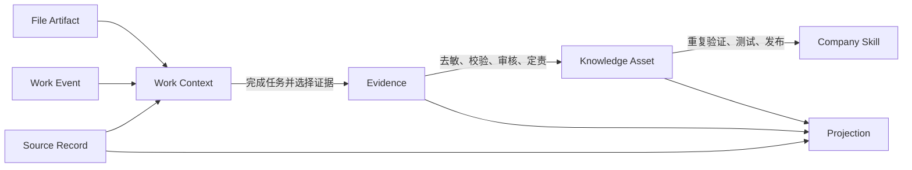
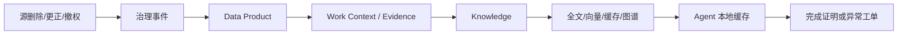
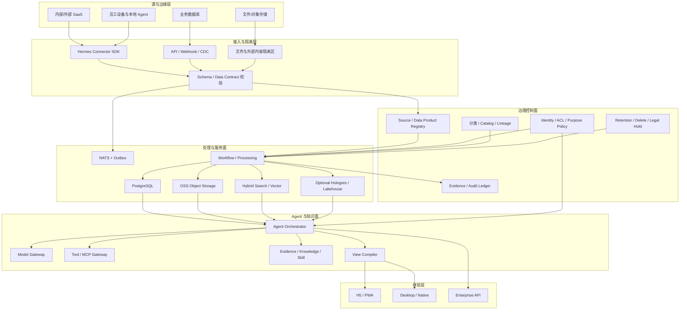

# Hermes Agent 原生企业数据治理与 AI 数据平台技术设计

- 状态：未来产品数据与技术架构基线
- 文档版本：1.0
- 日期：2026-07-29
- 适用范围：Hermes H5/PWA、Remote Server、Connector、员工专属 Agent、
  企业协作 Agent、知识与 Skill 平台
- 目标部署：中国大陆企业 SaaS、专属数据平面、联网私有化、离线私有化
- 依赖：
  - [Hermes Connector 商用首发架构](2026-07-28-hermes-connector-commercial-architecture-design.md)
  - [Hermes 企业 AI 工作台扩展设计](2026-07-28-enterprise-ai-workbench-expansion-design.md)
  - [Hermes Agent 原生企业工作模式设计](2026-07-28-hermes-agent-native-enterprise-operating-model-design.md)

## 1. 执行结论

Hermes 要适应员工专属 Agent、Agent 间协作、动态工作台和公司级能力沉淀，
不能把所有员工工作内容集中复制到一个“企业大脑数据库”。这种做法短期看似方便，
长期会同时制造四个问题：

1. 原系统与企业大脑出现多份事实，无法判断哪一份有效；
2. 员工权限被复制过程放大，删除、离职和组织变更无法可靠传播；
3. 文件、聊天、模型输出和正式经营数据混在一起，可信度无法区分；
4. 搜索、向量库、缓存和数据仓库不断生成派生副本，维护成本持续上升。

正确方向是建设一个 **Enterprise Data Governance Kernel**
（企业数据治理内核）：

```text
源系统继续负责业务事实
Hermes 负责受控引用、工作上下文、证据、知识、Skill 和协作
任何内容都不能因为“被 AI 看过”就自动成为公司资产
```

这意味着 Hermes 的核心资产不是“尽可能多的数据副本”，而是以下能力：

- 知道数据来自哪里、由谁负责、当前是否有效；
- 在员工、Agent、工具和模型之间持续执行同一套权限；
- 把一次工作逐步晋升为证据、知识和 Skill；
- 在源数据变更、撤权或删除时找到并处理所有派生结果；
- 让前端按任务动态组织页面，但只能使用经过批准的数据和组件；
- 让底层存储、模型、搜索和云产品可以替换，而不改变经营语义。

### 1.1 本设计的明确技术选择

首期核心栈采用：

- 前端：TypeScript、React、Vite、PWA、ECharts、Vega-Lite；
- Agent 界面：Hermes View Schema 为内部权威协议，兼容 A2UI 的声明式思想，
  通过适配器接入 AG-UI 事件流；
- 后端：Python、FastAPI、Pydantic、PostgreSQL；
- 消息：NATS Core / JetStream，配合 PostgreSQL Transactional Outbox；
- 文件：阿里云 OSS、KMS、版本与生命周期策略；
- 搜索：OpenSearch 混合检索；小规模场景可先用 PostgreSQL 向量扩展；
- 数据接入：官方 API、Webhook 优先，阿里云规模化场景使用 DTS / DataWorks；
- 可观测：OpenTelemetry + 阿里云 SLS；
- 数据安全：Hermes Policy Service、OPA 边界策略、阿里云 DSC、KMS；
- 文档处理：Docling 为主，Tika / PyMuPDF / PaddleOCR 作为格式或 OCR 补充。

首期明确不引入：

- Kafka、Flink、Iceberg、Trino、Milvus、图数据库、全量数据湖；
- 允许模型直接生成并执行任意 HTML、JavaScript 或 SQL；
- 以 Redis 作为 Connector 与 Remote Server 的可靠消息、事实记录或权限来源；
- 把模型隐藏推理过程、员工屏幕、键鼠轨迹和全部个人会话作为公司资产。

这些不是永远不用，而是在业务量、实时性和维护收益达到本设计的启用门槛后再引入。

## 2. 设计目标与非目标

### 2.1 设计目标

本平台需要同时完成六件事：

1. **数据可用**：员工 Agent 能在当前任务中找到所需信息；
2. **数据可信**：每个结果都能解释来源、时间、口径和责任人；
3. **权限不扩散**：Agent 协作不会绕过源系统权限；
4. **资产可沉淀**：高质量工作可以变成证据、知识和公司核心 Skill；
5. **界面可重组**：员工按任务生成视图，但组件、数据与动作均受控；
6. **系统可持续**：先形成小而完整的闭环，再按量级替换专业组件。

### 2.2 非目标

本设计不建设：

- 员工监控、工时监控或全设备行为采集系统；
- 替代 ERP、CRM、财务和合同系统的第二套业务事实库；
- 无数据责任人的“万能知识库”；
- 无权限继承、无删除传播的向量数据库；
- 由大模型自由生成代码并在浏览器执行的页面平台；
- 要求所有企业一次性建设完整大数据中台的重型方案。

## 3. 设计原则

### 3.1 源系统仍是事实权威

订单、客户、合同、财务凭证、人事记录、工单等业务事实由原系统负责。Hermes
优先保存引用、版本、摘要、权限快照和工作证据。只有下列情况才复制数据正文：

- 当前任务离线或低延迟执行确有必要；
- 需要保留当时决策所依据的证据快照；
- 已形成经过审核的正式知识资产；
- 已取得数据 Owner 的明确授权并配置保留期。

### 3.2 引用优先，复制例外

Agent 给另一个 Agent 发送数据时，默认传递 `resource_ref`、版本、用途和访问授权，
而不是复制正文。接收方使用自己的身份重新读取源数据。

### 3.3 原始数据与派生数据分离

原始文件、解析文本、摘要、向量、知识条目、视图和模型答案属于不同对象。它们可以
相互关联，但不能覆盖彼此，也不能共享一个无法追踪的生命周期。

### 3.4 权限随数据传播

数据经过解析、汇总、向量化或生成图表后，默认权限不得扩大。派生结果的有效权限为：

```text
主体身份
∩ 委托范围
∩ 源对象 ACL
∩ 数据分级
∩ 工作空间/项目范围
∩ 使用目的
∩ 有效时间
∩ 设备与风险条件
```

### 3.5 事实、证据、知识和 Skill 分层

一次会话、一个文件或一次成功执行不能直接成为公司知识，更不能直接成为公司核心
Skill。必须通过明确的晋升门禁。

### 3.6 契约先于中间件

先进性首先来自稳定的数据契约、事件契约、权限契约和血缘契约，而不是组件数量。
底层实现可以从 PostgreSQL 升级到 Hologres，从轻量批处理升级到 Flink，但上层
对象语义不能随产品更换。

## 4. 数据状态模型

Hermes 将信息划分为七种状态。状态不同，可信度、权限、保留期和责任人也不同。

| 状态 | 定义 | 权威来源 | 默认可否跨 Agent | 是否可用于正式决策 |
| --- | --- | --- | --- | --- |
| Source Record | 外部或内部系统中的原始业务记录 | 源系统 | 仅引用和重新鉴权 | 取决于源系统状态 |
| Work Event | 人或 Agent 在工作中发生的结构化事件 | Hermes 事件账本 | 可按任务范围共享 | 否，需关联证据 |
| Work Context | 当前任务临时使用的上下文集合 | 任务所有者 | 默认不可跨任务 | 否 |
| File Artifact | 原文件及其派生物 | 文件 Owner / 源系统 | 受 ACL 与用途限制 | 原件可作为证据来源 |
| Evidence | 对决定、执行和结果的不可混淆记录 | 证据 Owner | 按案件/任务授权 | 是 |
| Knowledge Asset | 审核、定责、定期复核后的正式知识 | Knowledge Owner | 按企业知识政策 | 是 |
| Projection | 搜索索引、向量、缓存、报表和视图 | 上游对象 | 不独立授权 | 不能脱离上游 |

状态转换必须是显式事件：



禁止以下隐式转换：

- 会话自动变知识；
- 被频繁检索的内容自动变正式口径；
- 模型总结自动覆盖原文件；
- 员工个人记忆自动进入企业知识；
- 一次成功执行自动发布企业核心 Skill。

## 5. 统一治理信封

所有可被 Hermes 引用、处理或派生的数据对象都必须携带统一治理信封。首期最小字段为：

```json
{
  "tenant_id": "tenant_01",
  "workspace_id": "workspace_sales_cn",
  "owner_id": "user_or_team_id",
  "source_system": "crm",
  "source_object_id": "customer_123",
  "source_version": "42",
  "classification": "CONFIDENTIAL",
  "personal_scope": "WORK_ONLY",
  "acl_ref": "acl_987",
  "purpose_tags": ["customer_service"],
  "retention_policy": "case_plus_3y",
  "residency": "CN_MAINLAND",
  "trust_level": "VERIFIED_SOURCE",
  "effective_at": "2026-07-29T00:00:00Z",
  "expires_at": null,
  "content_hash": "sha256:...",
  "lineage_refs": ["lineage_001"],
  "legal_hold": false
}
```

### 5.1 六个治理维度

| 维度 | 典型值 | 作用 |
| --- | --- | --- |
| 敏感等级 | PUBLIC / INTERNAL / CONFIDENTIAL / RESTRICTED | 决定展示、导出、模型和存储限制 |
| 所有权 | PERSONAL / TEAM / PROJECT / ENTERPRISE | 决定谁可管理和晋升 |
| 用途 | 服务客户、财务核对、招聘等 | 防止“有权限但用途不符” |
| 保留期 | 临时、项目期、法定期、永久资产 | 决定清理与归档 |
| 可信度 | 未验证、已验证、冲突、过期、撤销 | 决定能否支持行动 |
| 驻留地 | 中国大陆、专属区域、客户本地 | 决定处理和模型路由 |

敏感等级和所有权不能合并成一个标签。例如，员工个人草稿可能属于 `PERSONAL`
但仍是 `CONFIDENTIAL`；公开市场资料属于 `PUBLIC`，但可信度可能是
`UNVERIFIED`。

## 6. 核心治理对象

| 对象 | 关键字段 | 责任 |
| --- | --- | --- |
| Source Asset | 来源、对象类型、版本、ACL 映射、变更游标 | 描述源系统对象 |
| Data Product | 业务语义、Owner、SLO、输入输出、使用范围 | 提供稳定数据能力 |
| Data Contract | Schema、口径、质量、兼容规则、版本 | 防止接入方猜字段 |
| Access Grant | 授权人、接收人、资源、用途、过期时间 | 有界共享 |
| Work Context | 任务、参与者、引用、临时数据、过期时间 | 支持当前工作 |
| Evidence | 决定、输入版本、执行、结果、签名/哈希 | 支持审计和复盘 |
| Knowledge Asset | 主题、正文、来源、Owner、复核日 | 正式知识 |
| File Artifact | 原件、派生物、哈希、扫描状态、ACL | 文件治理 |
| AI Invocation | 模型、输入引用、输出、策略、成本、评价 | AI 可治理性 |
| View Artifact | View Schema、数据引用、口径、时间点 | 动态页面复现 |
| Lineage Edge | 上游、下游、转换、任务、版本 | 影响分析 |
| Deletion Job | 删除原因、范围、派生对象、完成证明 | 删除传播 |

这些对象全部属于平台契约，不属于某个数据库产品。

## 7. 工作过程信息治理

### 7.1 应采集的内容

Hermes 应采集与任务闭环直接相关、员工可见且可解释的信息：

- 任务创建、指派、接受、完成、取消和升级；
- 使用的数据、文件、知识和 Skill 的引用与版本；
- 经过授权的工具调用及其结构化结果；
- 人工审批、修改、拒绝、例外和原因；
- 交付物、业务结果和质量评价；
- Agent 协作请求、接受、拒绝、超时和交接；
- 错误、重试、补偿、回滚和最终状态。

### 7.2 默认不采集的内容

- 员工键盘、鼠标和连续屏幕录像；
- 与工作无关的个人文件、聊天和账号；
- 所有网页浏览记录；
- 模型隐藏的 Chain of Thought；
- 未经员工确认的个人习惯推断；
- 为未来可能用途而进行的无限期全量留存。

### 7.3 不保存隐藏推理，保存执行证据

为保证审计和复盘，平台保存：

- 任务目标和结构化执行计划摘要；
- 使用过的数据引用、工具、Skill 和模型；
- 策略决策、人工决策和批准链；
- 输出、错误、重试与补偿；
- 关键结果的输入版本和时间点。

平台不要求模型披露或存储隐藏推理过程。这既降低隐私风险，也避免把不可稳定复现的
内部推理误当成经营证据。

## 8. 文件治理

### 8.1 三层文件对象

每个文件至少拆成三类对象：

1. **Original**：原始字节、文件名、媒体类型、哈希、版本、来源 ACL；
2. **Parsed Derivative**：文本、表格、OCR、页码、结构、解析器版本；
3. **AI Derivative**：摘要、标签、实体、向量、知识候选、模型版本。

原始文件不可被解析结果覆盖。AI 派生物必须指向原件和解析版本。

### 8.2 文件进入平台的处理链


任何扫描失败、格式异常、Owner 不明或 ACL 不可映射的文件进入 `QUARANTINED`，
不能被模型、搜索或其他 Agent 使用。

### 8.3 本地文件

Connector 不得默认扫描员工硬盘。Agent 使用本地文件必须满足：

- 员工对文件或目录进行显式授权；
- 授权有用途、工作空间和有效期；
- Connector 在本机计算哈希和元数据；
- 是否上传原件由数据策略决定；
- 授权撤销后停止读取，并触发云端派生物处置。

### 8.4 删除与更正传播

原件被删除、更正或撤权时，必须处理：

- 解析文本；
- OCR 和表格；
- 摘要、标签和实体；
- 向量与全文索引；
- 搜索缓存和浏览器缓存；
- 知识候选与正式知识引用；
- 基于该内容生成但仍在有效期内的视图；
- Agent 本地缓存。

审计账本可以保留最小化墓碑记录，例如对象 ID、删除时间、删除原因和执行者，但不应
保留已经要求删除的正文，法律保全除外。

## 9. 内部系统数据接入

### 9.1 接入顺序

按维护成本和语义稳定性，采用以下优先级：

1. 官方 API；
2. Webhook 或领域事件；
3. CDC；
4. 云厂商托管同步；
5. 受控文件导入；
6. 最后才是数据库只读直连。

不允许 Agent 直接连接生产数据库并自由生成 SQL。即使是只读访问，也必须经过
Data Product、查询模板、行列权限、查询预算和审计。

### 9.2 Connector 需要实现的契约

每个数据 Connector 必须声明：

- 服务身份与最小权限；
- 源对象、主键和版本映射；
- Schema 版本和兼容级别；
- 源 ACL 到 Hermes ACL 的映射；
- 增量游标与断点续传；
- 删除、更正和撤权事件；
- 新鲜度与质量状态；
- 限流、退避和熔断；
- 数据驻留与可用模型范围；
- 回放、对账和停用方法。

### 9.3 Data Product，而不是默认全量复制

内部系统通过 Data Product 提供稳定能力。例如：

```text
customer.current_profile
customer.service_history
order.fulfillment_status
finance.receivable_summary
marketing.campaign_performance
```

Data Product 必须有 Owner、业务定义、字段合同、权限、质量 SLO、刷新频率和废弃策略。
Agent 面向 Data Product 工作，不依赖源系统的内部表结构。

## 10. 外部数据治理

互联网、第三方报告、客户上传文件和合作伙伴接口先进入外部数据隔离域，不得直接进入
公司知识库。

每份外部内容必须记录：

- 来源 URL、供应商或提交方；
- 获取时间和内容哈希；
- 许可条款和允许用途；
- 数据驻留与跨境限制；
- PII 和商业秘密检测结果；
- 内容可信度和新鲜度；
- 是否允许发送给外部模型；
- 是否允许成为知识候选；
- 间接 Prompt Injection 风险。

外部数据可信状态为：

```text
UNVERIFIED
VERIFIED_SOURCE
VERIFIED_CONTENT
CONFLICTED
STALE
REVOKED
```

外部内容中的“忽略规则”“调用工具”“发送数据”等指令一律按不可信数据处理，不能
进入系统提示或自动触发工具。

## 11. 员工 Agent 与 Agent 间的数据交换

### 11.1 引用优先的数据包

Agent 到 Agent 的协作消息采用：

```json
{
  "collaboration_id": "collab_01",
  "sender_agent_id": "agent_sales_01",
  "receiver_agent_id": "agent_finance_03",
  "task_type": "receivable_confirmation",
  "purpose": "close_month",
  "resource_refs": [
    {
      "resource_id": "invoice_827",
      "version": "9",
      "acl_ref": "acl_827",
      "required_freshness": "PT15M"
    }
  ],
  "delegation_ref": "grant_03",
  "expires_at": "2026-07-30T12:00:00Z",
  "reply_contract": "schema://finance/receivable-confirmation/v2"
}
```

正文只用于无法重新获取且经过批准的证据快照。

### 11.2 接收方重新鉴权

Remote Server 负责消息路由，但不能因为消息来自另一个 Agent 就自动授予访问权。
接收 Agent 读取资源时使用自己的主体身份和协作委托重新鉴权。

### 11.3 有界 Access Grant

跨部门显式共享使用 Access Grant：

- 授权人必须拥有授权能力；
- 只包含指定资源或字段；
- 绑定明确用途和接收对象；
- 有到期时间和撤销能力；
- 高敏数据需要审批；
- Grant 不得被接收方再次转授权，除非策略明确允许。

### 11.4 派生结果权限

由多个来源生成的总结、报表或答案，其默认 ACL 是所有输入 ACL 的交集。若要扩大
范围，必须经过：

- 数据 Owner 批准；
- 去标识或脱敏；
- DLP 检查；
- 新的分类与用途；
- 完整来源和转换记录。

员工 Agent 的 Personal Memory 永远不参加企业 Agent 网络传播，除非员工明确将某个
对象提交为工作证据。

## 12. AI 输入、输出与模型治理

### 12.1 Model Gateway

所有模型调用通过 Model Gateway，统一执行：

- 租户、地域和数据分级路由；
- 模型与版本白名单；
- Token、费用和并发预算；
- 敏感字段脱敏；
- Prompt Injection 检测；
- 工具调用策略；
- 输入引用和输出血缘；
- 失败降级和供应商切换；
- 评价、抽检和质量回放。

业务代码不能直接绑定单一模型供应商 SDK。

### 12.2 AI Invocation 记录

每次重要调用至少保存：

- `invocation_id`、任务与用户；
- 模型供应商、模型 ID、配置版本；
- 输入对象引用和版本，而非无限期复制全部正文；
- 系统指令与模板版本；
- 工具和 Skill 版本；
- 输出或输出哈希；
- 安全策略决策；
- 人工确认、修改或拒绝；
- 延迟、Token 和成本；
- 评价结果与最终业务结果。

### 12.3 结构化输出

Agent 生成以下对象时必须经过 JSON Schema 校验：

- Action 参数；
- 协作请求与回复；
- Evidence；
- Knowledge Candidate；
- View Schema；
- 指标定义和查询计划。

校验失败不得“尽力执行”，应修复、降级为只读文本或交给人工确认。

### 12.4 检索增强

企业检索默认采用：

```text
权限过滤
→ 关键词检索
→ 语义向量检索
→ 融合排序
→ 可选重排
→ 新鲜度与可信度过滤
→ 返回片段、来源、版本和可见范围
```

向量库不是权限系统。检索前和返回后都要执行策略过滤，生成答案时必须保留来源引用。

## 13. 数据质量、新鲜度与冲突

每个 Data Product 都有以下运行状态：

| 状态 | 含义 | Agent 行为 |
| --- | --- | --- |
| HEALTHY | 合同、质量和新鲜度达标 | 正常使用 |
| DEGRADED | 局部字段或延迟异常 | 展示警告，限制高风险动作 |
| STALE | 超过承诺新鲜度 | 不作为实时行动依据 |
| BLOCKED | 合同、权限或质量失败 | 禁止使用 |
| UNKNOWN | 尚未验证 | 仅探索，不执行 |

Data Product 最小 SLO：

- 新鲜度；
- 完整率；
- 唯一性；
- 合法值比例；
- 与源系统对账差异；
- 查询成功率和 P95 延迟；
- Owner 响应时间。

若多个来源冲突，不允许模型静默选择。平台生成 `DataConflict`，展示各来源、时间、
口径和 Owner，由数据责任人裁决。

## 14. 删除、更正与保留

### 14.1 必须支持的治理事件

```text
source.object.deleted
source.object.corrected
source.acl.changed
source.consent.revoked
evidence.invalidated
knowledge.asset.revoked
projection.purge.requested
projection.purge.completed
legal_hold.placed
legal_hold.released
```

### 14.2 传播顺序



删除任务必须可重试、幂等、可对账。只发送一个“删除事件”但不确认每个派生存储的结果，
不算完成。

### 14.3 建议保留基线

下表是产品建议基线，实际值必须由客户法务、行业规范和合同确认：

| 数据 | 建议默认 | 说明 |
| --- | --- | --- |
| 临时 Work Context | 任务结束后 30 天 | 可由 Owner 提前清理 |
| 原始 AI 输入正文副本 | 30 至 90 天 | 优先只存引用 |
| Work Event | 180 至 365 天 | 用于复盘和统计 |
| Evidence | 业务/法定保留期 | 不与普通会话混存 |
| Knowledge Asset | 有效期 + 定期复核 | 过期后停止检索 |
| 搜索/向量 Projection | 跟随上游 | 不独立延长 |
| 技术 Trace 正文 | 7 至 30 天 | 日志不保存敏感正文 |
| 最小审计墓碑 | 合同/法规决定 | 不包含被删除正文 |

## 15. 目标数据与 AI 架构



### 15.1 控制面和数据面分离

控制面保存：

- 身份、组织、设备和 Agent 注册；
- Data Contract 和 Schema；
- Owner、分级、用途、保留和策略；
- Source、Data Product、Knowledge 和 Skill 元数据；
- 版本、发布、撤销和删除任务状态。

数据面保存和处理：

- 业务引用与必要副本；
- 文件原件与派生物；
- 事件、工作上下文和证据；
- 索引、向量、报表和分析数据；
- 模型输入输出及其最小审计信息。

私有化或专属数据平面可替换数据面组件，但仍使用同一控制面契约。

## 16. 前端 AI 与可视化方案

### 16.1 不让模型生成任意页面代码

Hermes 采用受约束的 `Hermes View Schema`：

```text
用户任务
→ Agent 选择 Data Product / Action
→ 生成 View Schema
→ Schema 校验
→ 权限与数据契约校验
→ 客户端组件目录渲染
→ 用户动作再次鉴权
```

模型只能选择客户端批准的组件、字段、操作和布局。浏览器不执行模型生成的任意脚本。

### 16.2 协议分层

| 层 | 内部选择 | 外部标准关系 |
| --- | --- | --- |
| Agent 到界面 | Hermes View Schema | 对齐 A2UI 的声明式 Surface、Catalog 和数据绑定 |
| 前端到 Agent | Hermes Run/Event Contract | 提供 AG-UI 适配层处理流式事件和状态 |
| Agent 到工具/数据 | Tool Gateway | MCP 适配器，不让 MCP Server 直接绕过策略 |
| Agent 到 Agent | Hermes Collaboration Contract | 未来通过 A2A Gateway 进行跨厂商联邦 |

当前 A2UI 仍在演进，因此不直接把内部产品模型绑定到其某个候选版本。Hermes 保留
稳定内部 Schema，并建立版本化适配器。

### 16.3 前端技术栈

| 能力 | 选择 | 使用方式 |
| --- | --- | --- |
| 应用框架 | React + TypeScript + Vite | H5/PWA 主客户端 |
| PWA | Service Worker + Workbox | 缓存应用外壳，敏感数据默认不离线缓存 |
| 服务端状态 | TanStack Query 类查询层 | 统一缓存失效、重试和请求取消 |
| 表格 | TanStack Table 类 Headless Table | 大横表、排序、筛选和虚拟滚动 |
| 经营图表 | Apache ECharts | 大多数运营图、地图、关系图和高密度图 |
| 可生成图表 | Vega-Lite | Agent 生成可校验的声明式图表规范 |
| 本地分析 | Apache Arrow + DuckDB-Wasm | 仅处理经过授权的有界数据集 |
| 协同草稿 | Yjs 类 CRDT | 仅用于草稿共同编辑，不作为业务事实 |

ECharts 负责产品化图表和复杂交互，Vega-Lite 负责由 Agent 安全生成的分析图。
两者不是重复建设。

### 16.4 可视化必须携带经营语义

每张图和每个指标卡必须附带：

- 指标定义与口径版本；
- 数据来源和最后更新时间；
- 当前筛选、时间范围和组织范围；
- 分母、单位、币种和时区；
- 缺失、估算和异常状态；
- 可下钻的数据引用；
- 生成它的 View Schema 版本。

Agent 不能只输出“销售下降明显”，必须允许用户下钻到口径、分组和证据。

### 16.5 PWA 离线边界

PWA 离线缓存默认只包括：

- 应用外壳和静态资源；
- 当前用户明确标记的低敏任务摘要；
- 尚未提交的本地草稿；
- 可重放且幂等的待提交命令。

默认不缓存：

- RESTRICTED 数据；
- 长期 Access Token；
- 完整知识库；
- 大批量客户、财务和人事数据；
- 其他员工 Agent 的协作正文。

离线命令恢复联网后仍要重新鉴权、验证租约和检查资源版本。

## 17. 后端 AI 方案

### 17.1 Python 作为主实现语言

Hermes Agent 已采用 Python。Remote Server 的 Agent、数据和治理服务继续采用
Python，可以复用类型模型、AI 生态、文档处理和评测工具，同时通过独立进程、API
和事件契约保持 Connector 与 Agent 解耦。

推荐基础：

- FastAPI：控制 API、SSE / WebSocket 和 OpenAPI；
- Pydantic：领域对象、JSON Schema 和边界验证；
- SQLAlchemy / 原生异步驱动：PostgreSQL；
- NATS Python Client：命令和事件；
- Polars / DuckDB：中小规模批处理；
- OpenTelemetry：Trace、Metric 和 Log 关联。

同源语言不等于同一发布单元。Connector、Remote Server 和 Hermes Agent 仍需独立
包、独立进程、独立协议版本和独立升级。

### 17.2 后端服务边界

| 服务 | 职责 | 不负责 |
| --- | --- | --- |
| Agent Orchestrator | 计划、委托、恢复、人工中断 | 直接持有业务库凭证 |
| Model Gateway | 模型路由、策略、成本、评价 | 业务事实 |
| Tool Gateway | Action / Skill / MCP 适配 | 绕过用户身份执行 |
| Policy Service | 身份、ACL、用途、分级决策 | 存储业务正文 |
| Data Query Service | 受控查询 Data Product | 任意生产 SQL |
| Evidence Service | 决策和执行证据 | 普通聊天归档 |
| Knowledge Service | 候选、审核、发布、撤销 | 自动把答案变知识 |
| View Compiler | 校验并编译动态工作台 | 执行任意前端代码 |
| File Pipeline | 隔离、解析、OCR、派生 | 改写原件 |
| Governance Worker | 删除、保留、血缘、对账 | 代替数据 Owner |

### 17.3 长流程

首期使用 PostgreSQL 状态机、Outbox 和幂等 Worker。出现以下情况后引入 Temporal
一类 Durable Execution 引擎：

- 流程跨越多天并包含大量人工等待；
- 单流程跨越三个以上独立服务；
- 补偿和恢复逻辑成为主要故障来源；
- 需要按流程版本安全恢复；
- 运行中升级和大规模回放成为常态。

这类启用门槛是 Hermes 的架构治理建议，不是产品性能承诺。

## 18. 数据集成、处理与分发

### 18.1 统一契约

- HTTP API：OpenAPI；
- 对象与消息载荷：JSON Schema；
- 异步事件：AsyncAPI；
- 数据作业血缘：OpenLineage；
- 列式批量交换：Apache Arrow / Parquet；
- 工具与上下文：MCP；
- 外部 Agent 联邦：A2A。

内部协议可以扩展字段，但不能绕过租户、身份、用途、来源和版本。

### 18.2 Transactional Outbox

任何关键命令或业务状态更新先与事实记录在同一 PostgreSQL 事务中写入 Outbox，
再由 Worker 发布到 JetStream。消费者必须按 `event_id` 幂等。

这样避免：

- 数据库已提交但消息未发送；
- 消息已发送但事实未提交；
- 网络重试造成重复执行；
- 仅依赖消息队列保存最终业务状态。

### 18.3 NATS 与 Kafka 的边界

首期选择 NATS Core / JetStream，因为它能够覆盖：

- Agent 在线请求/响应；
- Connector 命令和状态；
- 工作事件与异步任务；
- 有界持久化、回放和消费者；
- 边缘到云的统一通信模型。

只有在下列条件出现时评估 Kafka / Redpanda：

- 大量数据库 CDC 已成为主数据流；
- 需要长期保存高吞吐事件日志供多个独立团队重放；
- 已有成熟 Kafka 运维能力；
- Flink 与 Kafka 生态连接器成为核心依赖；
- NATS 与对象存储归档无法满足吞吐或保留成本。

### 18.4 Redis 的位置

Redis 可以用于：

- 秒级可丢失缓存；
- 限流计数；
- 短期去重和会话加速；
- 非关键分布式协调。

Redis 不用于：

- Connector 与 Remote Server 的可靠传输；
- 命令事实和最终状态；
- 数据 ACL、Access Grant 和审批事实；
- Evidence、Knowledge 或审计账本；
- 需要长期回放的事件源。

首期如果 PostgreSQL、NATS 和本地进程缓存已经满足延迟，不部署 Redis。

### 18.5 批处理与实时处理

| 场景 | 首选 | 何时升级 |
| --- | --- | --- |
| 单文件/单任务分析 | DuckDB / Polars | 不升级为分布式系统 |
| 定时 SQL 转换 | dbt 类 SQL 工程 + 调度 | 作业数量和依赖明显复杂时 |
| 增量 API / Webhook | Python Worker + NATS | 有事件时间和大状态需求时 |
| 数据库 CDC | 阿里 DTS / DataWorks | 私有化采用 Debezium |
| 状态化实时计算 | 暂不引入 | 达到 Flink 启用门槛 |
| 多引擎历史分析 | PostgreSQL / Hologres | 达到 Lakehouse 启用门槛 |

Flink 的建议启用门槛：

- 经营场景要求分钟内或秒级新鲜度；
- 需要事件时间、水位线、窗口、Join 或可恢复状态；
- 多条流必须一致处理；
- 简单 Worker 已无法稳定回放和扩缩容。

## 19. 存储、检索与分析

### 19.1 PostgreSQL

作为首期权威存储，保存：

- 租户、身份、设备、Agent 和组织；
- Session、Task、Work Event、Collaboration；
- Source、Data Product、Data Contract；
- ACL、Access Grant、Policy Decision；
- Evidence、Knowledge 元数据和 Skill 元数据；
- Outbox、幂等键和删除任务；
- 小规模向量或全文索引的元数据。

大文件、长文本正文和海量分析明细不直接堆入主库。

### 19.2 OSS

OSS 保存：

- 文件原件和版本；
- 解析与 AI 派生物；
- 大型事件归档；
- 证据附件；
- 分析数据文件和未来 Iceberg 表；
- 模型与评测产物。

启用 KMS 加密、分桶/前缀隔离、版本、生命周期和按需 WORM。OSS 对象键不得包含
客户敏感明文。

### 19.3 搜索与向量

首期优先 OpenSearch，因为同一引擎可以组合：

- 精确关键词；
- 语义向量；
- 属性过滤；
- 混合排序；
- 聚合与审计查询。

小规模项目可先用 PostgreSQL 向量扩展，减少组件。仅在向量规模、QPS、索引类型、
多租户隔离或水平扩展明确成为瓶颈后引入 Milvus。

建议评估 Milvus 的起点，而非强制阈值：

- 向量数量进入数千万并持续快速增长；
- 向量检索 QPS 达到数百且延迟 SLO 受影响；
- 需要独立扩展查询和写入节点；
- OpenSearch 同时承担全文、日志和向量导致资源冲突。

### 19.4 实时分析

阿里云规模化场景优先评估 Hologres：

- PostgreSQL 协议降低接入成本；
- 可承接实时写入、交互分析和在线服务；
- 与 DataWorks、Flink、OSS/湖仓集成；
- 避免同时维护多个重复服务层。

首期不要用 Hologres 代替交易主库。它承担分析和数据服务，不承担核心控制事务。

### 19.5 Lakehouse

OSS + Apache Iceberg + Trino 是未来跨系统历史分析和多引擎访问的开放方案。出现以下
需求后才建立：

- 分析数据达到多 TB 并持续增长；
- 多个计算引擎需要共享同一数据副本；
- 需要 Snapshot、Schema Evolution、Time Travel 或行级变更；
- 原系统历史快照和重算成为经营刚需；
- Hologres 或单库的成本、隔离和容量无法满足。

Iceberg 只管理分析表，不成为 Agent 权限和知识治理的替代品。

## 20. 元数据、血缘与 Data Contract

### 20.1 Hermes Registry

首期先建设轻量 Registry，覆盖：

- Source；
- Data Product；
- Metric；
- Action；
- Skill；
- Knowledge；
- Schema 与版本；
- Owner、SLO、分类和生命周期。

不要在首期引入一个比业务系统还复杂的数据目录平台。

### 20.2 OpenLineage

数据作业、模型处理和文件派生统一发送 OpenLineage 兼容事件，至少描述：

- Job；
- Run；
- Input Dataset；
- Output Dataset；
- Schema；
- 数据质量；
- Hermes 自定义的 Policy、Model、Knowledge 和 View Facet。

### 20.3 何时引入 OpenMetadata

私有化或多云客户出现以下情况时评估 OpenMetadata：

- 数据源超过十个且由多个团队维护；
- Data Product 超过一百个；
- 表、字段、报表和模型的影响分析已无法人工维护；
- 数据质量、Glossary、Owner 和 Lineage 需要统一门户。

阿里云单云客户优先评估 DataWorks Data Map / Data Asset Governance，避免重复运维。

## 21. 安全、隐私与员工权益

### 21.1 零信任执行

每次数据访问和 Action 执行都要重新判断主体、资源、用途和环境。API Gateway 的一次
登录鉴权不能替代对象级授权。

Policy Enforcement Point 至少存在于：

- H5/PWA API；
- Agent Orchestrator；
- Tool / MCP Gateway；
- Data Query Service；
- Search Service；
- Connector；
- 文件下载与导出；
- Agent 到 Agent 路由。

### 21.2 策略实现

Hermes Policy Service 保存业务语义和最终解释；OPA 可用于：

- API 和服务间策略；
- 基础设施和部署策略；
- 结构化请求的统一决策；
- 策略测试和版本发布。

Owner、用途、知识状态和业务例外仍由 Hermes 领域对象表达，不把所有经营语义硬塞入
Rego。

### 21.3 员工可见与可纠正

员工必须可以查看：

- 本人 Agent 当前使用了哪些企业数据；
- 哪些工作内容被提交为证据或知识候选；
- 谁批准了晋升；
- 本人的个人记忆和企业资产边界；
- 数据或知识错误的申诉与更正状态。

企业不能以“AI 优化”为由无限扩大采集范围。

## 22. 三套技术栈配置

### 22.1 首期商用闭环

| 层 | 技术选择 |
| --- | --- |
| H5/PWA | React、TypeScript、Vite、Workbox |
| 可视化 | ECharts、Vega-Lite |
| Agent UI | Hermes View Schema、AG-UI Adapter |
| API | Python、FastAPI、Pydantic |
| 事务 | RDS PostgreSQL |
| 消息 | NATS Core / JetStream、Transactional Outbox |
| 文件 | OSS、KMS、生命周期 |
| 搜索 | OpenSearch；小规模可先 PostgreSQL 向量 |
| 文档 | Docling、Tika/PyMuPDF、PaddleOCR |
| 模型 | Model Gateway + 合规云模型 API |
| 安全 | RAM、KMS、DSC、Hermes Policy |
| 可观测 | OpenTelemetry、SLS |
| 运行 | ACK 或成熟容器运行环境 |

目标是用最少组件完成数据进入、授权使用、Agent 协作、证据沉淀、知识晋升和删除传播。

### 22.2 阿里云规模化配置

在首期栈基础上按需增加：

- DTS / DataWorks Data Integration：托管同步和 CDC；
- DataWorks Data Map / Data Asset Governance：元数据和治理；
- Realtime Compute for Apache Flink：状态化实时处理；
- Hologres：实时仓库、交互分析和高并发数据服务；
- OSS + Iceberg：大规模开放分析存储；
- DSC：结构化和非结构化数据发现、分类与审计；
- Temporal：复杂长流程；
- 专属 ACK 集群和租户数据平面。

### 22.3 私有化与混合云配置

| 阿里云能力 | 私有化替代 |
| --- | --- |
| RDS PostgreSQL | PostgreSQL 高可用集群 |
| OSS | S3 兼容对象存储 / MinIO |
| DataWorks / DTS | Debezium、dbt、调度器 |
| Hologres | ClickHouse 或 Trino + Iceberg |
| OpenSearch 服务 | 自建 OpenSearch |
| DSC | DLP、分类扫描和审计组合 |
| SLS | OpenTelemetry + Prometheus/Grafana/日志后端 |
| 云模型 API | vLLM；Kubernetes 规模化时增加 KServe |
| RAM / KMS | 企业 IAM + Vault/KMS |

私有化不是复制所有云产品，而是保持治理契约不变，替换数据面实现。

## 23. 关键技术取舍

### 23.1 A2UI 与 Hermes View Schema

选择：内部以 Hermes View Schema 为准，对齐 A2UI 并提供转换器。

原因：

- A2UI 的声明式、组件目录和无任意代码思想正确；
- 当前协议仍有生产版与候选版并行演进；
- Hermes 需要增加 Data Product、Metric、Evidence、ACL 和 Action 语义；
- 内部协议可以保障 H5、Desktop 和未来小程序的稳定升级。

### 23.2 AG-UI

选择：作为前后端 Agent 事件适配层，不直接替代 Hermes 任务事实模型。

原因：

- 适合流式文本、工具调用、状态变化和人工中断；
- 传输可使用 SSE 或 WebSocket；
- Hermes 仍需保存自己的 Task、Run、Evidence 和授权对象。

### 23.3 MCP

选择：用于工具和上下文生态接入，所有 MCP Server 经 Tool Gateway。

原因：

- MCP 定义资源、Prompt 和工具；
- MCP 本身不能替代企业 Data Product、对象 ACL、用途限制和审计；
- 外部 Server 返回内容必须按不可信输入处理。

### 23.4 A2A

选择：内部员工 Agent 协作先使用 Hermes Collaboration Contract；跨厂商或跨组织
联邦时通过 A2A Gateway。

原因：

- 内部需要强组织、权限、证据和经营对象语义；
- A2A 适合独立、异构 Agent 之间发现能力和协作任务；
- 适配器隔离 A2A 版本变化，不影响内部 Agent 升级。

### 23.5 NATS 与 Redis

选择：NATS 负责消息；PostgreSQL 负责事实；Redis 只作可选缓存。

原因：

- 这三个职责不同；
- 用 Redis Stream 同时承担命令、审计和缓存会放大恢复与治理复杂度；
- Connector 只连接公开 WSS Gateway，不直接连接任何内部中间件。

### 23.6 OpenSearch 与 Milvus

选择：先 OpenSearch 混合检索，规模证明后再引入 Milvus。

原因：

- 企业检索不能只靠向量，精确词、字段过滤和权限过滤同样重要；
- 首期减少一个独立分布式系统；
- Milvus 在大规模专用向量负载下再体现独立扩展价值。

### 23.7 PostgreSQL、Hologres 与 Lakehouse

选择：

- PostgreSQL：控制事务和核心事实；
- Hologres：阿里云规模化实时分析与数据服务；
- Iceberg / Trino：开放历史分析和多引擎共享。

三者不是互相替代，而是分别服务交易、实时分析和长期开放存储。

## 24. 双层 Hermes Agent 迭代中的数据闭环

员工 Agent 的改进循环：

```text
任务执行
→ Work Event / Evidence
→ 员工反馈与业务结果
→ 个人偏好或团队候选
→ 在本地/小范围验证
```

公司级迭代循环：

```text
多个员工的去标识化模式
→ Knowledge / Skill Candidate
→ Owner 审核
→ 评测、权限与安全测试
→ 灰度发布
→ 经营结果验证
→ 回滚或全量发布
```

公司级循环不能读取员工 Personal Memory 正文，只能使用经过授权的工作证据和
去标识化统计。Bootstrap Kernel 初始化员工 Agent 时下发：

- 身份、角色和组织；
- 可见 Data Product、Knowledge、Action 和 Skill 的引用；
- Policy、预算和模型范围；
- 版本和撤销信息。

它不下发整个企业数据副本。

## 25. 治理责任

| 角色 | 必须承担的责任 |
| --- | --- |
| System Owner | 源系统真实性、接口和变更通知 |
| Data Owner | 数据定义、共享范围、保留与例外批准 |
| Data Steward | 质量、分类、元数据和冲突处理 |
| Work Owner | 任务边界、参与者、证据选择和关闭 |
| Knowledge Owner | 知识审核、复核、过期和撤销 |
| Skill Owner | Skill 测试、版本、权限和经营效果 |
| Security/Privacy | 安全基线、隐私、事件和合规 |
| Employee | 明确提交工作证据、纠错和用途遵守 |
| Platform Owner | 契约、SLO、删除传播和平台演进 |

没有 Owner 的数据、知识、指标和 Skill 不得进入正式发布状态。

## 26. 分阶段落地

### Phase 0：数据宪法与契约

交付：

- 数据状态、分级、用途、Owner 和保留制度；
- 统一治理信封；
- Source、Data Product、Evidence、Knowledge、Skill 契约；
- 删除、更正、撤权和审计事件；
- 员工告知、查看、申诉和纠错机制。

门禁：选择任意一个对象，能回答“来自哪里、谁负责、谁能看、为何能用、何时删除”。

### Phase 1：核心治理内核

交付：

- PostgreSQL Registry、Policy、Outbox；
- NATS 消息；
- OSS 文件原件与隔离区；
- Connector SDK；
- OpenTelemetry；
- H5/PWA 权限可见性。

门禁：关键事实不依赖消息队列，消息可重放，Connector 断网可恢复。

### Phase 2：文件与系统接入

交付：

- 首批三个高价值 Data Product；
- 文件隔离、解析、OCR、索引和删除传播；
- API/Webhook 接入；
- 质量、新鲜度和 Owner 页面。

门禁：源 ACL 变化能传播到搜索、向量、文件和 Agent 缓存。

### Phase 3：工作证据与 Agent 协作

交付：

- Work Context、Evidence；
- Collaboration Request / Reply；
- Access Grant；
- 人工审批、中断、恢复和补偿；
- 经营结果关联。

门禁：跨部门 Agent 不能通过消息转发扩大权限。

### Phase 4：知识和 Skill 闭环

交付：

- Knowledge Candidate、审核、复核、撤销；
- Skill Candidate、评测、灰度、回滚；
- Bootstrap Kernel；
- 双层 Agent 迭代。

门禁：任何公司级知识和 Skill 都有来源、Owner、版本、测试和效果。

### Phase 5：规模化数据平台

按真实瓶颈选择：

- Hologres；
- Flink；
- Iceberg / Trino；
- OpenMetadata；
- Milvus；
- Temporal；
- 私有模型服务。

门禁：每个新增组件都有明确负载证据、SLO 改善目标、退出方案和三年 TCO。

## 27. 验收指标

### 27.1 治理

- 100% 正式 Data Product 有 Owner、Contract、SLO 和分类；
- 100% 正式知识有来源、复核日和撤销能力；
- 100% 高风险 Action 有策略决策和人工门禁；
- 删除/撤权传播完成率达到合同 SLO；
- 无 Owner 资产数量持续为零。

### 27.2 数据

- Data Product 新鲜度达标率；
- 合同破坏性变更拦截率；
- 源系统与投影对账差异；
- STALE 数据触发高风险动作的次数为零；
- 检索结果权限误放行为零容忍。

### 27.3 Agent 与经营

- 有来源引用的关键回答比例；
- Agent 协作一次完成率；
- 人工纠正率和错误复发率；
- Evidence 到 Knowledge 的有效晋升率；
- Knowledge / Skill 对周期、质量、转化、成本的实际改善；
- 无法解释来源或口径的经营结论数量。

### 27.4 维护成本

- 每个 Connector 的月均故障和人工处理时间；
- 每个新增 Data Product 的交付周期；
- 每万次 Agent 任务的平台成本；
- 每个中间件的专职运维成本；
- 因重复复制导致的存储和删除处理成本。

## 28. 当前应立即确认的产品决策

1. 正式确认“源系统负责事实，Hermes 负责受控引用和资产晋升”；
2. 正式禁止会话自动进入公司知识库；
3. 正式禁止 Connector 直连 NATS、Redis、PostgreSQL 和本地 Agent 内部实现；
4. 正式确定 Hermes View Schema 为内部界面契约，并建设 A2UI / AG-UI 适配层；
5. 正式确定 PostgreSQL + OSS + NATS + OpenSearch 为首期数据闭环；
6. 正式把 Redis 定义为可选缓存，不列为首期必备；
7. 正式建立删除、更正和 ACL 变化的端到端传播验收；
8. 正式要求所有 Knowledge、Metric、Action 和 Skill 都有 Owner；
9. 正式把 Hologres、Flink、Iceberg、Milvus 等放入“按门槛启用”清单；
10. 正式将员工查看、纠错、申诉和个人记忆边界纳入产品能力。

## 29. 官方技术调研依据

调研时间为 2026-07-29。版本信息用于说明当时的标准成熟度，不构成对未来版本的
永久绑定。

### 29.1 Agent 与界面协议

- [A2UI：声明式、跨端、非任意代码的 Agent 界面协议](https://a2ui.org/)
  （当前生产版本 v0.9.1，v1.0 为候选版）；
- [AG-UI：Agent 与用户界面的双向事件协议](https://docs.ag-ui.com/)；
- [A2A v0.3：独立异构 Agent 的发现与任务协作](https://a2a-protocol.org/v0.3.0/specification/)；
- [MCP 2025-06-18：资源、Prompt、工具和生命周期](https://modelcontextprotocol.io/specification/2025-06-18/basic/index)。

### 29.2 前端与可视化

- [React 当前版本说明](https://react.dev/versions)；
- [Apache ECharts](https://echarts.apache.org/en/)；
- [Vega-Lite 声明式可视化语法](https://vega.github.io/vega-lite/)；
- [Workbox PWA 工具](https://developer.chrome.com/docs/workbox)；
- [DuckDB-Wasm 浏览器内分析及其内存限制](https://duckdb.org/docs/stable/clients/wasm/overview)；
- [Apache Arrow 列式数据交换](https://arrow.apache.org/docs/index.html)。

### 29.3 数据契约、消息与流程

- [JSON Schema 2020-12](https://json-schema.org/specification)；
- [OpenAPI 3.2](https://spec.openapis.org/oas/latest.html)；
- [AsyncAPI 3.0](https://www.asyncapi.com/docs/reference/specification/v3.0.0)；
- [NATS JetStream 持久化、回放和消费者](https://docs.nats.io/nats-concepts/jetstream)；
- [Debezium CDC](https://debezium.io/documentation/reference/stable/index.html)；
- [Temporal Durable Execution](https://docs.temporal.io/)。

### 29.4 数据平台、血缘与搜索

- [OpenLineage](https://openlineage.io/)；
- [OpenMetadata Lineage](https://docs.open-metadata.org/v1.12.x/how-to-guides/data-lineage)；
- [Apache Iceberg Table Spec](https://iceberg.apache.org/spec/)；
- [Apache Flink](https://nightlies.apache.org/flink/flink-docs-stable/index.html)；
- [Trino](https://trino.io/docs/current/overview.html)；
- [OpenSearch 混合检索](https://docs.opensearch.org/latest/vector-search/ai-search/hybrid-search/index/)；
- [Milvus](https://milvus.io/docs/overview.md)。

### 29.5 AI、文档、安全与阿里云

- [FastAPI 的 OpenAPI、JSON Schema 与 WebSocket 能力](https://fastapi.tiangolo.com/features/)；
- [Docling 文档转换](https://docling-project.github.io/docling/)；
- [KServe 模型服务](https://kserve.github.io/website/docs/model-serving/predictive-inference/frameworks/overview)；
- [Open Policy Agent](https://www.openpolicyagent.org/docs)；
- [OpenTelemetry](https://opentelemetry.io/docs/what-is-opentelemetry/)；
- [NIST Zero Trust Architecture](https://csrc.nist.gov/pubs/sp/800/207/final)；
- [NIST AI Risk Management Framework](https://airc.nist.gov/airmf-resources/airmf/5-sec-core/)；
- [NIST Privacy Framework](https://www.nist.gov/privacy-framework/getting-started-0)；
- [Alibaba Cloud DataWorks 模块](https://www.alibabacloud.com/help/en/dataworks/user-guide/dataworks-modules-guide/)；
- [Alibaba Cloud Data Security Center](https://www.alibabacloud.com/help/en/dsc/data-security-center/product-overview/what-is-data-security-center)；
- [Alibaba Cloud Hologres](https://www.alibabacloud.com/help/en/hologres/product-overview/what-is-hologres)。

## 30. 最终判断

Hermes 未来的竞争力不在于保存更多员工数据，而在于把企业中分散的数据、文件、经验、
决策和能力变成一套可以被 Agent 安全调用、可以被员工理解、可以被老板衡量、可以被
系统撤销的经营基础设施。

最重要的工程顺序是：

```text
先定义数据状态和权威来源
→ 再建立权限、用途、血缘和删除传播
→ 再完成文件、系统和 Agent 协作闭环
→ 再形成知识和 Skill
→ 最后按真实规模引入实时仓库、流处理和湖仓
```

这样建设，前端可以持续变得更智能，后端模型和组件可以持续升级，Hermes Agent 也可
独立迭代，但企业的事实、权限、证据和经营语义不会随技术变化而失控。
