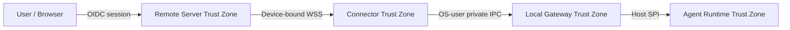

# 01 Hermes Connector 产品边界与责任

- 状态：规范
- 基线版本：1.0
- 更新日期：2026-07-30

## 1. 执行结论

Hermes Connector 不是 Hermes Agent 的网络模式，也不是把本地 Dashboard 暴露到
公网的隧道。它是独立于 Agent 的边缘连接服务，在本地稳定协议与 Hermes Cloud
协议之间完成身份、可靠交付、状态对账和安全隔离。

目标产品链路为：

```text
H5 / PWA
  -> HTTPS / WSS
Hermes Remote Server
  -> Hermes WSS Connector Protocol
Hermes Connector
  -> Local Gateway Protocol over UDS / Named Pipe
Hermes Agent Plugin / Local Gateway
  -> Stable Hermes Agent Host API
Hermes Agent
```

同源 Python 只降低开发和类型复用成本，不代表共享进程、虚拟环境、数据库或发布
周期。

## 2. 产品价值

Connector 解决跨平台推广中四个基础问题：

1. **不建设三套独立协议客户端**：当前先由 Android 完成端到端闭环；后续 H5/PWA
   与小程序复用同一 Cloud API、Realtime Contract 和 View Schema，不复制
   Connector 或 Local Gateway 能力。
2. **不暴露员工设备**：设备仅建立出站 WSS，不要求公网 IP、端口转发或长期隧道。
3. **不绑定 Agent 版本**：Agent 内部变化被稳定 Host API 与 Local Gateway
   Protocol 隔离。
4. **形成商用控制面**：设备、租户、权限、命令状态、审计、配额、删除和升级从
   首发即具备闭环。

## 3. 目标

### 3.1 Target v1

- 10,000 个在线 Connector 的 A 级商用高可用；
- 可通过扩容平滑演进到 100,000 个在线 Connector；
- H5/PWA 安全观察和控制用户明确授权的 Agent；
- Agent 离线或更新时 Connector 仍保持 Cloud 在线并报告准确状态；
- 网络闪断、Gateway 重启和重复投递不造成命令丢失或重复业务效果；
- 设备注册、吊销、诊断、灰度升级和回滚可运营；
- 个人空间也使用标准 Tenant 模型；
- 首发部署在中国大陆阿里云，保持云厂商适配边界。

### 3.2 Future

- 企业 Agent Bootstrap Manifest 下发；
- 企业 Work Event、Evidence、Knowledge 和 Skill 引用同步；
- 员工 Agent 之间的结构化 Collaboration Request；
- 共享 SaaS、企业专属数据平面、联网私有化和完全离线私有化；
- 跨组织或跨厂商 Agent 通过 A2A Gateway 联邦。

## 4. 非目标

- Remote Server 不运行第二个 Hermes Agent。
- Connector 不直接调用模型或保存模型供应商密钥。
- Connector 不解析 Agent SessionDB 或依赖其表结构。
- H5 不直连本地 Dashboard、Unix Socket 或 Named Pipe。
- NATS Subject、Redis Key、数据库表不是外部协议。
- 首发不使用 P2P 建立 Agent-to-Agent 业务信任。
- Cloud Projection 不成为会话事实源。
- Connector 不承担企业 Policy 最终判定。
- Agent Plugin 不实现 Cloud 登录、设备配对、计费或自动更新。

## 5. 组件责任矩阵

| 能力 | Agent | Agent Plugin / Local Gateway | Connector | Remote Server | H5/PWA |
|---|---|---|---|---|---|
| 本地会话和执行事实 | 权威 | 只适配 | 不保存权威 | 只保存投影 | 只展示 |
| Owner transport | 权威 | 不替换 | 不替换 | 无 | 无 |
| Observer 安全投影 | 生成 | 暴露/裁剪 | 转发/游标 | 授权分发 | 展示 |
| 控制方法执行 | 权威 | 租约与绑定校验 | 可靠投递 | 授权与命令事实 | 发起 |
| 设备身份私钥 | 无 | 无 | OS 安全存储 | 只存公钥/状态 | 无 |
| Connector WSS | 无 | 无 | 发起和维持 | 终止和路由 | 无 |
| 本地 Inbox/Outbox | 无 | 仅进程内状态 | SQLite 权威 | 无 | 无 |
| 云命令状态 | 结果来源 | 适配结果 | 同步 | PostgreSQL 权威 | 展示 |
| Cloud 读取投影 | 来源 | 安全裁剪 | 传输 | 加密保存 | 按权限读取 |
| Tenant/订阅/配额 | 无 | 无 | 只显示 | 权威 | 管理入口 |
| Agent-to-Agent 路由 | 执行/收件 | 本地交付 | 传输 | 权威路由与持久化 | 协作界面 |

## 6. 当前实现与目标产品的关系

### 6.1 Current

当前唯一的 `hermes_agent_plugin` 包已经建立 Host 注册预检与 Control Contract Adapter；
历史 `hermes_mobile_gateway` 导入包不再进入源码树或新发行物。现有 Plugin 能力包括：

- Python entry point 注册骨架；
- Observer 私有 Unix Socket 注册、发现和跨进程转发；
- Control 私有 Unix Socket、不可携带凭据的注册文件和绑定声明；
- Observer 只读方法白名单；
- Control 方法白名单和 `4200–4219` 错误码范围；
- 单控制者租约、断线宽限和单调 `control_revision`；
- 有界进程内命令幂等账本；
- Mobile Control v1 Fixture 兼容测试。
- 真实 Hermes 0.19 `PluginContext` 与 entry point 发现测试；
- 缺少 `gateway-extension/1` 时明确 fail closed，不启动 Local Gateway。

### 6.2 Missing for Target v1

当前尚缺：

- Hermes Core 中真正的稳定 Agent Host SPI 和完整、可注销的插件安装逻辑；
- 跨平台 Local Gateway（Windows Named Pipe、Linux/macOS UDS）；
- 独立 Connector daemon、系统服务和生命周期管理；
- 设备密钥、配对、吊销和短期连接令牌；
- Cloud WSS 握手、协议协商、心跳、背压和重连；
- SQLite Inbox、Outbox、游标、迁移和崩溃恢复；
- Connector Protocol v1 Schema 与 Golden Fixture；
- Agent 发现、状态机、更新 drain 和重连对账；
- 签名更新器、双槽回滚和诊断包；
- Remote Server Gateway、Command Service、Projection Service；
- 跨端和跨版本端到端兼容测试。

因此当前包只能称为 **Local Gateway Plugin Foundation**，不能对外宣称已经完成
Hermes Connector。

## 7. 信任边界



每跨越一个边界都必须重新校验，不能传递隐式信任：

- Browser → Cloud：用户、Tenant、Membership、Purpose、CSRF/Origin；
- Cloud → Connector：设备状态、连接令牌、签名、消息 TTL、Agent 绑定；
- Connector → Local Gateway：本机用户、IPC 权限、协议版本、目标运行代次；
- Local Gateway → Agent：连接角色、控制租约、方法 Allowlist、pending revision；
- Agent → 数据/工具：员工与 Agent 双身份、Purpose、资源 ACL、Action 风险。

## 8. 事实归属

| 事实 | 权威来源 | 缓存/投影 |
|---|---|---|
| Agent 会话正文、执行和工具结果 | Hermes Agent | Cloud 近期读取投影 |
| 命令生命周期和审计 | Remote PostgreSQL | JetStream、Connector SQLite |
| Connector 已收命令和待发事件 | Connector SQLite | 进程内队列 |
| 设备、公钥、吊销和订阅 | Remote PostgreSQL | Gateway 缓存 |
| 控制租约 | 当前 Agent Runtime | Server 只保存关联状态 |
| 企业业务事实 | 原业务系统 / Data Product | Hermes Fact Plane |
| Collaboration Request | Collaboration Service PostgreSQL | JetStream、Connector SQLite |

## 9. 禁止的捷径

- [PROHIBITED] 让 Connector 直接连接 Redis/NATS，以减少 Remote Gateway 开发。
- [PROHIBITED] 通过 WireGuard/SSH 暴露 Dashboard 作为正式商用路径。
- [PROHIBITED] 在 Plugin 中导入 `tui_gateway` 等私有模块作为长期 Host Contract。
- [PROHIBITED] 用内存账本承担 Agent/Connector 重启后的最终幂等。
- [PROHIBITED] 把 WebSocket 发送成功显示为 Agent 已执行成功。
- [PROHIBITED] 在 Connector 日志记录 Token、Lease ID、完整审批载荷或工具输出。
- [PROHIBITED] 因为发送方 Agent 有权限，就把同样权限传给接收方 Agent。

## 10. 成功判定

Connector v1 只有在以下条件同时成立时才算完成：

- Agent 更新后，无需修改 Connector 即可恢复连接；
- Connector 更新失败可以自动回滚，Agent 仍可本地使用；
- Gateway 或网络故障后，已提交命令状态可以被查询和对账；
- 重复消息不会产生重复业务效果；
- 被吊销设备不能重新连接或继续执行缓存命令；
- H5 显示的在线、排队、送达、执行、失败、过期和未知状态与事实一致；
- 删除、撤权和数据保留能传播到投影、缓存和诊断制品；
- 不依赖公网 Dashboard、Redis 核心事实或设备间 P2P。
