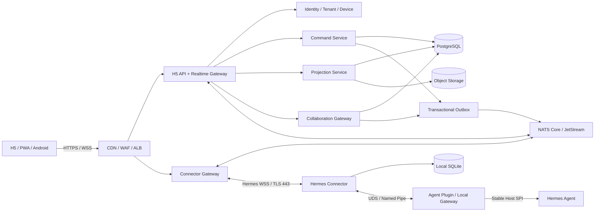
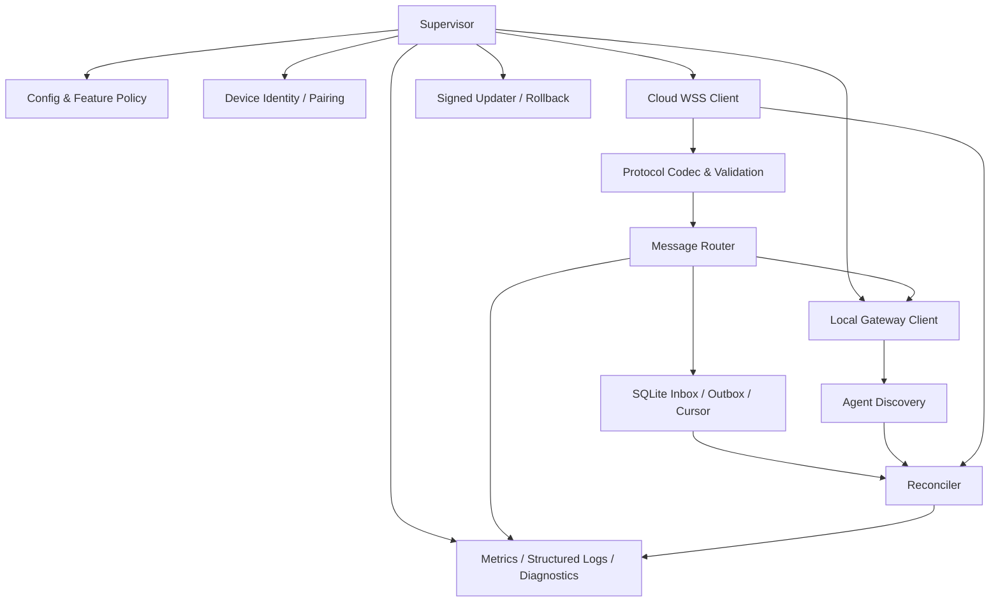

# 02 Hermes Connector 目标架构

- 状态：规范
- 基线版本：1.0
- 更新日期：2026-07-30
- 首发容量：10,000 在线 Connector
- 扩展目标：100,000 在线 Connector

## 1. 总体架构



外部稳定边界只有 Cloud API、Connector Protocol 和 Local Gateway Protocol。
Remote Server 内部可以调整服务合并方式、NATS 拓扑和阿里云产品，但不得把内部
实现泄露为 Connector 依赖。

代码分层、依赖方向、进程并发、SQLite 单写者、Remote Server 模块化单体和前端
特性切片的强制规则见
[14 软件架构与工程约束](14-software-architecture-and-engineering-constraints.md)。

## 2. 部署单元

| 单元 | 进程/运行环境 | 发布节奏 | 故障影响 |
|---|---|---|---|
| Hermes Agent | 独立 Python 环境 | Agent 发布列车 | 本地执行暂不可用 |
| Agent Plugin | Agent Host 加载或受控 sidecar | 随 Host API 兼容发布 | Local Gateway 不可用 |
| Hermes Connector | 独立 Python 环境和系统服务 | Connector 发布列车 | 远程连接不可用，本地 Agent 可用 |
| Connector Gateway | Kubernetes 无状态 Pod | Server 发布列车 | Connector 重连 |
| Domain Services | Kubernetes 服务/模块化单体 | Server 发布列车 | 对应功能降级 |
| H5/PWA | 静态制品 + API | Experience 发布列车 | 本地和 Connector 不受影响 |

首期 Remote Server 可以采用模块化单体加独立 Gateway/Worker，避免过早拆成大量
微服务。服务职责和数据库事实边界必须先分开，物理拆分由容量和团队边界触发。

## 3. Connector 内部模块



### 3.1 Supervisor

- 维护进程生命周期和子组件健康；
- 根据依赖状态推进 Connector 状态机；
- 捕获不可恢复错误并进入安全降级；
- 不承担业务消息解析。

### 3.2 Device Identity

- 首次启动生成 Ed25519 设备密钥；
- 私钥保存在 macOS Keychain、Windows DPAPI 或 Linux Secret Service；
- 完成一次性配对码、Challenge 签名和短期令牌刷新；
- 处理暂停、吊销、退休和重新配对；
- 安全存储不可用时拒绝持久配对，不降级到明文文件。

### 3.3 Cloud WSS Client

- 仅向配置的 Remote Gateway 建立 TLS 443 出站连接；
- 完成协议协商、设备认证、心跳、帧限制和压缩策略；
- 指数退避加随机抖动重连；
- 实施应用层流量窗口和背压；
- 不理解 NATS Subject、数据库表或云厂商 SDK。

### 3.4 Protocol Codec

- 使用冻结的 Schema 验证全部入站帧；
- 计算和校验 canonical payload digest；
- 忽略同 Major 版本的未知字段；
- 对未知消息类型、过期消息和超大帧显式拒绝；
- 将敏感字段标为不可落盘、不可日志和一次性消费。

### 3.5 Local Gateway Client

- 发现兼容 Agent endpoint；
- 协商 Host/Local Gateway capability；
- 建立独立 Observer 与 Control IPC；
- 转换 Cloud Command 为本地 RPC；
- 对 Agent 重启和 runtime generation 变化执行对账；
- 不读取 SessionDB，不调用私有 Python 对象。

### 3.6 Reliable Store

SQLite 只保存 Connector 运行事实：

| 表 | 内容 | 关键约束 |
|---|---|---|
| `cloud_inbox` | 已收到命令、摘要、状态、结果摘要 | `message_id` 唯一 |
| `local_outbox` | 未获 Cloud ACK 的事件/结果 | 有序 sequence |
| `sequence_cursors` | 上下行与协作游标 | 单调更新 |
| `agent_runtime` | 最近 Agent endpoint/capability/generation | 非会话正文 |
| `connector_meta` | Schema、迁移和安装槽状态 | 原子迁移 |

默认使用 WAL、`FULL` 或经过故障注入验证的同步级别、短事务和单写者队列。秘密正文
不得进入常规列；临时密文消费后立即删除。

### 3.7 Reconciler

- Cloud 重连后恢复 Server cursor；
- Agent 重启后拉取 capability、当前会话快照和 pending state；
- 对 `DELIVERED/EXECUTING/UNKNOWN` 命令查询最终状态；
- 发现序列缺口时请求快照，不用本地缓存猜测；
- 阻止旧 runtime generation 的租约和命令继续执行。

### 3.8 Updater

- 验证离线 Release Signing Key 签名和制品摘要；
- internal → 1% → 10% → 50% → 100% 灰度；
- 双槽安装或平台等价回滚；
- 新版启动、Cloud 握手或 Local Gateway 健康检查失败则回滚；
- 强制升级仅用于安全阻断版本，且不删除用户状态。

## 4. Agent Plugin / Local Gateway

Plugin 必须薄且稳定，只包含：

- Host SPI 注册与 capability 暴露；
- Observer 安全投影；
- Control role、租约、方法 Allowlist 和 pending revision；
- 本地 IPC 生命周期；
- owner action adapter；
- 连接清理和审计钩子。

以下能力不应进入 Plugin：

- Cloud WSS、配对和设备密钥；
- SQLite Cloud Inbox/Outbox；
- NATS、PostgreSQL、Redis 或 OSS 客户端；
- 自动更新器和订阅计费；
- 企业业务对象或具体 Skill 逻辑。

## 5. Remote Server 职责

### 5.1 Connector Gateway

- 终止 WSS、认证设备、协商协议；
- 维护本进程连接对象、心跳、速率和背压；
- 将连接注册到可替换的在线索引；
- 把外部 Hermes 消息转换为内部命令/事件；
- 无最终业务状态，可 drain 和滚动替换。

### 5.2 Command Service

- 在同一 PostgreSQL 事务写入 `commands` 与 `command_outbox`；
- 校验 Tenant、用户、设备、Agent、Session、Generation、Lease 和 TTL；
- 管理命令状态机和取消策略；
- 消费 ACK/结果并对 `UNKNOWN` 发起对账；
- 不把网络 ACK 当作业务完成。

### 5.3 Projection Service

- 保存近期、加密、可删除的读取投影；
- 合并高频 delta 为稳定段落/快照；
- 发现 `(runtime_generation, session_id, event_sequence)` 缺口；
- 执行保留、导出、更正和删除传播；
- 不向 Agent 回写会话事实。

### 5.4 Identity / Tenant / Device

- Tenant、Membership、设备公钥、状态和吊销；
- 短期连接令牌、Challenge 和密钥轮换；
- 订阅权益与配额；
- 个人空间也使用同一 Tenant 隔离模型。

### 5.5 Collaboration Gateway

- [FUTURE] 路由员工 Agent 的结构化协作消息；
- 校验 Agent 身份、员工委托、Purpose、ACL 和循环预算；
- PostgreSQL 保存消息/Work Item 事实；
- 在线使用 NATS 通知，离线使用 JetStream 恢复；
- Connector 仍只认识 Hermes WSS，不直连消息系统。

## 6. 生命周期状态

Connector 对外报告组合状态，不用一个 `online` 掩盖问题：

```text
UNPAIRED
  -> PAIRING
  -> CLOUD_CONNECTING
  -> AGENT_DISCOVERING
  -> RECONCILING
  -> READY

READY
  -> DRAINING
  -> AGENT_UNAVAILABLE
  -> RECONCILING
  -> READY

任何状态
  -> SUSPENDED / REVOKED / UPDATE_REQUIRED / DEGRADED
```

状态至少包含：

- `connector_state`；
- `cloud_connection_state`；
- `agent_state`；
- `agent_version`；
- `runtime_generation`；
- `capabilities`；
- `outbox_oldest_age`；
- `last_reconciled_at`；
- `degraded_reason_code`。

## 7. 关键数据流

### 7.1 观察会话

```text
Agent event
-> Plugin 生成安全投影
-> Connector 写入必要 Outbox/实时缓冲
-> WSS Gateway
-> Projection / Realtime
-> H5
```

高频文本 delta 可只走实时流；生命周期、安全、审批和命令状态必须走可恢复流。

### 7.2 控制命令

```text
H5 发起
-> Server 授权并事务写入 Command + Outbox
-> Gateway 投递
-> Connector 先写 SQLite Inbox
-> 返回 DELIVERED
-> Local Gateway 再次校验租约/代次/方法
-> Agent 执行
-> Connector 写 Outbox
-> Server 更新最终状态
-> H5 展示
```

### 7.3 Agent 更新

```text
Connector 收到/检测更新
-> DRAINING
-> 停止新控制
-> Agent 停止
-> Connector 保持 Cloud WSS
-> AGENT_UNAVAILABLE
-> 新 Agent 启动并产生新 generation
-> capability handshake
-> 快照和命令对账
-> READY
```

## 8. 技术栈

### 8.1 Connector

| 关注点 | 选择 |
|---|---|
| 语言 | Python 3.11+ |
| 数据模型 | Pydantic / 标准 dataclass，边界输出 JSON Schema |
| Cloud 传输 | 标准 WebSocket over TLS |
| Local IPC | macOS/Linux UDS；Windows Named Pipe |
| 可靠存储 | SQLite |
| 加密 | 成熟密码库 + OS 安全存储 |
| 包与环境 | 独立 wheel/venv，平台安装器 |
| 可观测 | OpenTelemetry 语义 + 本地脱敏日志 |
| 测试 | pytest、契约 Fixture、故障注入、跨版本 E2E |

### 8.2 Remote Server

| 关注点 | 首期选择 |
|---|---|
| API/Gateway | Python、FastAPI、Pydantic |
| 事务事实 | PostgreSQL |
| 消息 | NATS Core / JetStream |
| 对象 | OSS/S3 Adapter |
| 密钥 | KMS/HSM Adapter |
| 可观测 | OpenTelemetry、SLS/ARMS |
| 运行 | ACK Pro / Kubernetes |
| Redis | 默认不部署；仅在有证据时作可替换缓存 |

## 9. 扩容路径

从 10,000 到 100,000 在线 Connector 不改变协议和事实模型：

1. Connector Gateway 水平扩容；
2. 连接索引分片并保持可替换；
3. NATS Stream/Consumer 按 realm/tenant/agent 分区；
4. PostgreSQL 先优化索引、连接池和分区，再评估读副本/拆域；
5. Projection Worker 按 Tenant 或 Agent 分片；
6. 对象和高频 delta 分离；
7. 用连接模拟器验证 100,000 空闲连接和重连风暴。

只有实际负载证明 PostgreSQL、NATS 或 Gateway 已达到边界时才增加 Kafka、Flink、
Hologres、Temporal 或独立向量数据库，新增组件必须同时给出三年 TCO 和退出方案。
