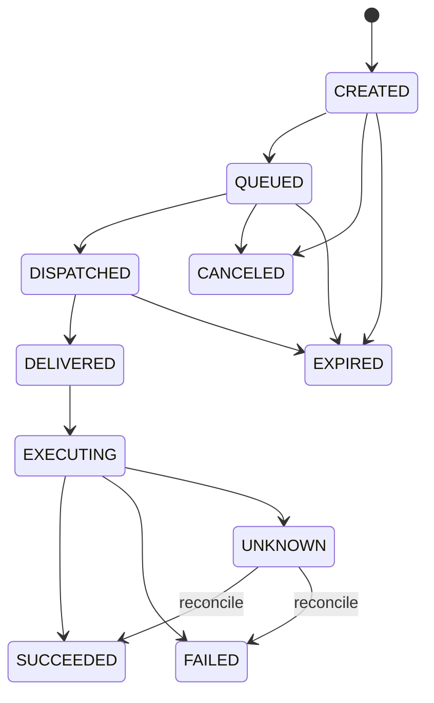

# 03 协议与可靠性设计

- 状态：规范
- 基线版本：1.0
- 更新日期：2026-07-30

## 1. 协议分层

系统存在三个独立协议，不允许跨层依赖：

| 协议 | 双方 | 职责 |
|---|---|---|
| Cloud API v1 | H5/PWA ↔ Remote Server | 用户身份、设备管理、会话读取、命令与协作界面 |
| Connector Protocol v1 | Connector ↔ Connector Gateway | 设备连接、命令、ACK、事件、Presence、协作消息 |
| Local Gateway Protocol v1 | Connector ↔ Agent Plugin | Observer、Control、能力发现、快照和本地执行 |

协议版本与产品版本分开。`connector_version=1.4.2` 不代表
`connector_protocol=1` 之外的任何能力；功能必须通过 capability 协商。

## 2. 通用设计规则

1. 所有外部载荷使用版本化 Schema。
2. 同一 Major 版本只允许增加可选字段和 capability。
3. 未知字段忽略，未知消息类型显式拒绝，未知 capability 默认关闭。
4. 所有 ID 是不透明字符串，客户端不能从一个 ID 推导另一个 ID。
5. 控制消息必须同时绑定 Agent、Durable Session、Runtime Session、Generation、
   Client Instance 和 Lease。
6. 时间以 UTC RFC 3339 表示；TTL 的最终上限由 Server 决定。
7. 字符串、数组、对象深度和帧大小均有协议上限。
8. 压缩只对允许的内容类型开启，并限制解压后大小。
9. 错误必须包含稳定 code、可重试标志和 trace ID，不返回内部堆栈。
10. 日志只记录 ID、摘要、状态和错误码，不记录秘密或默认完整正文。

## 3. Connector 握手

### 3.1 Hello

Connector 建立 TLS/WSS 后发送：

```json
{
  "type": "connector.hello",
  "protocol_min": 1,
  "protocol_max": 1,
  "connector_version": "1.0.0",
  "device_id": "dev_01...",
  "device_key_id": "key_01...",
  "agent_state": "ready",
  "agent_id": "agt_01...",
  "agent_version": "0.20.0",
  "local_gateway_protocol": 1,
  "host_api_version": 1,
  "runtime_generation": "run_01...",
  "capabilities": [
    "session.observe.v1",
    "session.control.v1"
  ],
  "resume": {
    "server_cursor": 1038,
    "client_cursor": 552
  }
}
```

`tenant_id`、`realm_id` 和授权范围由 Server 根据设备身份写入连接上下文，不信任
Connector 自报。Agent 不可用时仍允许 Connector 连接，但 Agent 相关字段可以为空。

### 3.2 Welcome

```json
{
  "type": "server.welcome",
  "connection_id": "con_01...",
  "selected_protocol": 1,
  "required_connector_version": "1.0.0",
  "recommended_connector_version": "1.1.0",
  "heartbeat_interval_seconds": 20,
  "max_frame_bytes": 262144,
  "inflight_window": 128,
  "resume_from": {
    "server_cursor": 1039,
    "client_cursor": 553
  },
  "feature_flags": {}
}
```

协商失败必须区分：

- `protocol_unsupported`；
- `connector_update_required`；
- `device_suspended`；
- `device_revoked`；
- `tenant_disabled`；
- `clock_skew_exceeded`；
- `rate_limited`。

## 4. Connector Protocol 消息信封

```json
{
  "protocol_version": 1,
  "message_id": "msg_01...",
  "idempotency_key": "idem_01...",
  "type": "command.prompt.submit",
  "agent_id": "agt_01...",
  "session_key": "durable-root-1",
  "runtime_session_id": "runtime-session-7",
  "runtime_generation": "run_01...",
  "sequence": 1039,
  "reply_to": null,
  "trace_id": "trc_01...",
  "issued_at": "2026-07-30T08:00:00Z",
  "expires_at": "2026-07-30T08:05:00Z",
  "payload_digest": "sha256:...",
  "payload": {}
}
```

约束：

- `message_id` 全局唯一；
- `(tenant_id, message_id)` 在 Server 事实库唯一；
- 同一 `message_id` 或 `idempotency_key` 的 payload digest 不同必须拒绝并告警；
- 命令过期后 Connector 即使离线缓存中仍存在也不得执行；
- 控制消息缺少任何绑定字段时必须 fail closed；
- `sequence` 在方向和逻辑流内单调，不承诺跨所有消息全局连续；
- payload digest 使用规范化 JSON，不包含传输层签名字段。

## 5. 消息类型

### 5.1 连接与状态

```text
connector.hello
server.welcome
connector.heartbeat
server.heartbeat
connector.status
agent.capabilities
agent.snapshot.request
agent.snapshot
stream.ack
stream.nack
```

### 5.2 会话观察

```text
session.observe.open
session.observe.close
session.event
session.snapshot
session.gap.detected
```

`session.event` 至少携带：

```text
(agent_id, runtime_generation, runtime_session_id, event_sequence)
```

发现缺口时必须请求 `session.snapshot`，不能用浏览器缓存补猜。

### 5.3 控制命令

Connector Protocol 的命令类型映射到 Local Gateway RPC，但两层 ID 不得混用：

| Cloud command | Local RPC | Target v1 |
|---|---|---|
| `command.prompt.submit` | `prompt.submit` | 是 |
| `command.session.interrupt` | `session.interrupt` | 是 |
| `command.session.steer` | `session.steer` | 是，需 capability |
| `command.approval.respond` | `approval.respond` | 是，需 pending revision |
| `command.clarify.respond` | `clarify.respond` | 是，需 pending revision |
| `command.session.redirect` | `session.redirect` | 否，保留 |
| `command.sudo.respond` | `sudo.respond` | 否，完成端到端密文后开放 |
| `command.secret.respond` | `secret.respond` | 否，完成端到端密文后开放 |
| `command.terminal.read.respond` | `terminal.read.respond` | 否，完成端到端密文后开放 |

协议保留名称不等于方法已经可执行。Local Gateway capability 和 Server Allowlist
必须同时允许。

## 6. Local Gateway Protocol

### 6.1 传输

- macOS/Linux：当前用户私有 UDS；
- Windows：仅当前服务账户和授权用户可访问的 Named Pipe；
- 注册目录权限 `0700`，endpoint 元数据文件 `0600`；
- endpoint 注册只含版本、PID、profile、socket/pipe 路径和 instance ID；
- 注册文件严禁包含 Token、Lease、内部 WebSocket URL 或长期凭据；
- 对失效 PID、越界路径和旧格式注册自动清理。

### 6.2 连接角色

Observer 与 Control 是不可变、独立连接角色：

- Observer 只允许 `session.observe.subscribe/unsubscribe`；
- Control 只允许冻结契约中当前 `available` 的方法；
- 一个连接不能从 Observer 升级为 Control；
- Control 必须在首个业务 RPC 前完成不可变身份和目标绑定；
- Plugin 不替换 Agent owner transport。

### 6.3 当前 Mobile Control v1

[CURRENT] 已冻结：

```text
session.control.acquire
session.control.renew
session.control.release
session.control.status
session.command.status
prompt.submit
session.interrupt
session.steer
session.redirect
approval.respond
clarify.respond
sudo.respond
secret.respond
terminal.read.respond
```

[CURRENT] 当前允许执行的安全子集：

```text
session.control.acquire
session.control.renew
session.control.release
session.control.status
session.command.status
prompt.submit
session.interrupt
session.steer
approval.respond
clarify.respond
```

其他方法返回 `4209 method_not_allowed`，不能落入原始 Desktop handler。

### 6.4 Control 绑定

控制身份至少包含：

```text
session_key
profile
runtime_session_id
user_id
provider
client_instance_id
transport_id
lease_id
```

`client_instance_id` 使用规范小写连字符 UUID。Lease 必须用常量时间比较，不能出现在
`repr`、错误、注册文件、Trace 或诊断包中。

### 6.5 Control Revision

- acquire、renew、release、expiry、pending enqueue/resolve/expiry 都推进
  `control_revision`；
- 客户端收到小于等于当前 revision 的事件时忽略；
- 发现 revision 缺口时使用 `session.control.status` 完整替换；
- Agent runtime generation 变化后旧 lease 和 pending state 全部失效。

## 7. 命令事实状态机



| 状态 | 权威含义 |
|---|---|
| `CREATED` | Server 已在事务中保存命令和 Outbox |
| `QUEUED` | 已进入持久交付层 |
| `DISPATCHED` | 已发往持有连接的 Gateway |
| `DELIVERED` | Connector 已写入 SQLite Inbox |
| `EXECUTING` | Local Gateway/Agent 已受理 |
| `SUCCEEDED` | Agent 权威结果确认成功 |
| `FAILED` | Agent 权威结果确认失败 |
| `CANCELED` | 在可取消边界前取消 |
| `EXPIRED` | 超过 TTL，禁止继续执行 |
| `UNKNOWN` | 已越过副作用边界但最终结果暂不可知 |

## 8. 至少一次投递与业务幂等

### 8.1 Server

- 同一事务写 Command 和 Outbox；
- Outbox Worker 可以重复发布；
- Consumer 按 `message_id` 幂等；
- 状态转换使用版本号或 compare-and-set；
- JetStream 不是最终状态数据库。

### 8.2 Connector

收到命令后的顺序：

1. 验证 Schema、签名/会话完整性、TTL 和绑定；
2. 计算 payload digest；
3. 在 SQLite Inbox 原子插入或读取旧记录；
4. 持久化成功后返回 `DELIVERED`；
5. 仅首次记录进入本地执行；
6. 结果先写 Local Outbox，再向 Cloud 发送；
7. Cloud ACK 后清理或按保留策略压缩。

同一 ID 同一 digest 返回旧状态；同一 ID 不同 digest 返回安全冲突并停止执行。

### 8.3 Agent Plugin

当前进程内 Command Ledger 只提供运行期去重。Target v1 必须由 Connector SQLite
承担跨重启投递幂等，Agent 对已进入业务副作用边界的命令还需提供可查询 Action/
Turn ID。

### 8.4 Unknown 规则

- 未达到 `DELIVERED`：TTL 内可重投；
- 已 `DELIVERED` 但未开始：Connector 按 Inbox 状态决定；
- 已 `EXECUTING` 后失联：进入 `UNKNOWN`；
- `UNKNOWN` 只允许查询、对账或人工决定，不自动再次执行；
- UI 必须显示“不确定”，不能伪装为失败或成功。

## 9. 风险和 TTL

| 命令 | 离线策略 | 默认 TTL | 自动重试 |
|---|---|---:|---|
| `prompt.submit` | 短期排队 | 5 分钟 | 未送达前可以 |
| `session.interrupt` | 不排队 | 10 秒 | 否 |
| `session.steer` | 不排队 | 15 秒 | 否 |
| `approval.respond` | 不排队 | 60 秒 | 仅同 ID 查询旧结果 |
| `clarify.respond` | 不排队 | 60 秒 | 仅同 ID 查询旧结果 |
| 敏感输入 | 不保存 Cloud 明文 | 30 秒 | 否 |
| 配置变更 | 允许排队 | 24 小时 | `expected_version` 匹配时 |

## 10. 背压和流量控制

- Server 下发每连接 inflight window；
- Connector 只有在 SQLite 可用且本地队列未超过水位时继续接收 durable command；
- 高频 delta 在拥塞时可以合并或丢弃并触发快照回退；
- durable event、命令结果和审计不能静默丢弃；
- 超过 Tenant 配额时返回明确限流和恢复时间；
- Outbox oldest age、队列深度和磁盘余量进入状态与告警。

## 11. 错误分类

| 类别 | 示例 | 重试策略 |
|---|---|---|
| 协议永久错误 | Schema、未知方法、版本不兼容 | 不重试 |
| 授权永久错误 | 吊销、越权、绑定不匹配 | 不重试，重新授权 |
| 状态冲突 | revision、pending、generation | 刷新快照后重决策 |
| 临时基础设施 | Gateway 503、网络中断 | 指数退避 |
| 资源限制 | rate limit、disk pressure | 按 retry-after/人工处理 |
| 执行未知 | 副作用边界后断线 | 查询和对账，绝不自动重做 |

Local Gateway 的 `4200–4219` 错误范围保持冻结。Cloud API 使用独立命名错误码，
不能把本地数字错误直接暴露为跨版本产品契约。

## 12. Schema 发布与兼容

- Schema 和 Golden Fixture 只有一个发布源；
- Python、TypeScript、Kotlin 模型从制品生成或通过 Fixture 校验；
- CI 校验破坏性字段、枚举和错误码变更；
- Server 支持当前及前两代稳定 Connector，迁移窗口不少于 180 天；
- 破坏性变更通过并行 v2 endpoint 和双写/双读迁移；
- 数据库 Schema 使用 expand → migrate → contract；
- 每次发布验证 Agent N/N-1/N-2 × Connector N/N-1/N-2 × Server Current/Canary。
