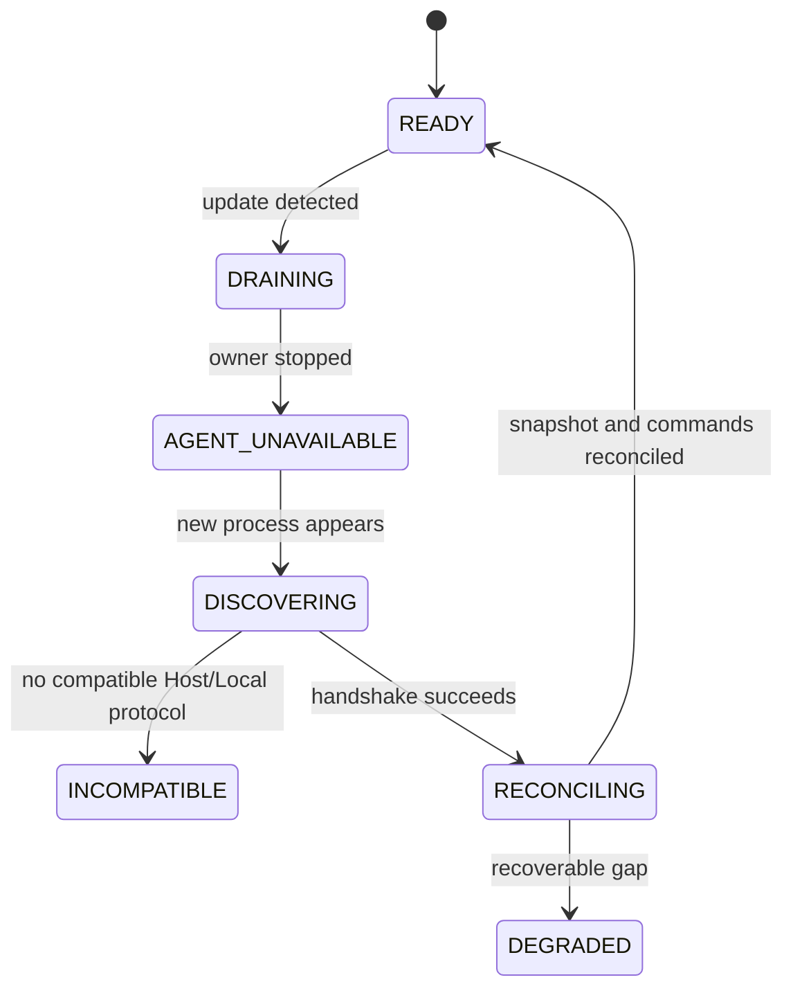
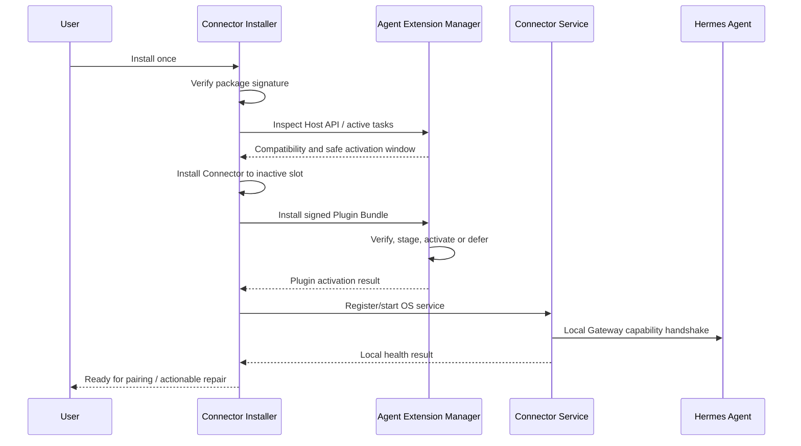

# 04 Hermes Agent 集成与独立升级设计

- 状态：规范
- 基线版本：1.0
- 更新日期：2026-07-30

## 1. 目标

Hermes Agent 更新不能要求 Connector 同步更新，也不能因 Connector 故障影响本地
Agent 使用。实现这一点依赖四层隔离：

```text
Agent internals
  <- Stable Host SPI ->
Agent Plugin
  <- Local Gateway Protocol ->
Connector
  <- Connector Protocol ->
Remote Server
```

每层只依赖相邻层的版本化契约和 capability，不依赖文件布局、Python 私有模块、
数据库 Schema 或对象内存结构。

## 2. 当前接入机制

[CURRENT] 插件包通过 Python entry point 声明：

```toml
[project.entry-points."hermes_agent.plugins"]
hermes-agent-plugin = "hermes_agent_plugin"
```

Hermes 的通用插件发现器只加载 `hermes_agent_plugin` 模块，再调用模块级
`register(context)`。历史
`hermes_mobile_gateway` 与 `HermesMobileGatewayExtension` 已从新发行物移除；
停止 Host 后执行的外部升级事务仍能识别、卸载和回滚旧发行版。
真实 Hermes 0.19 `PluginContext` 不存在 `register_gateway_extension`，因此当前
Plugin 会在版本/capability 预检阶段明确 fail closed，不会调用 extension 的
`install(host)`，也不会启动 Local/Control/Observer 资源。完整阻断证据和 Core
接口提案见
[15 Hermes 0.19 Host SPI 阻断与 v1 Core 契约](15-hermes-019-host-spi-gap-and-v1-core-contract.md)。

Plugin 不提供第二套可启动运行时。历史 `bootstrap.runtime` 名称仅保留为兼容性
tombstone，任何构造或工厂调用都会在目录、线程、socket 和 relay 创建前稳定拒绝。
测试所需的本地生命周期 harness 位于 `tests/`，不会进入 wheel 或生产导入面。

[CURRENT] Local Gateway 基础通过私有 UDS 完成跨进程 Observer/Control relay，
已有以下安全属性：

- endpoint 注册目录和文件为当前用户私有；
- 注册信息不含 credential；
- 非法路径、死 PID 和旧 URL 注册被拒绝/清理；
- Observer 只读；
- Control 首帧绑定经过裁剪的不可变 claims；
- 一个下游 Control transport 复用一个上游连接；
- 上游意外断开会强制下游重连；
- 并发 owner action 使用有界线程池，避免单 RPC 阻塞全部控制。

## 3. 当前耦合风险

当前实现仍存在必须在 Target v1 前消除的耦合：

1. Hermes 0.19 未提供 Extension Host SPI；Plugin 侧设计目标尚未进入 Core；
2. Local Gateway 只有 Unix Socket 实现；
3. Plugin 侧已经冻结 capability、runtime generation 和 owner action DTO，但
   Hermes Core 尚未输出相同的公共模块和真实实现；
4. 进程内租约和账本在 Agent 重启后自然丢失，但外部对账机制尚未完整接入。

这些是迁移清单，不等于当前代码不安全；它们说明现有实现仍是 Local Gateway
Foundation。

## 4. Stable Host SPI v1

Agent 应提供最小、版本化、面向能力的 Host SPI。建议逻辑接口如下：

```python
class GatewayExtensionHostV1(Protocol):
    host_api_version: int

    def runtime_descriptor(self) -> RuntimeDescriptor: ...
    def register_local_endpoint(self, endpoint: EndpointDescriptor) -> Registration: ...
    def prepare_observer(
        self,
        request: ObserverRequest,
        sink: EventSink,
    ) -> PreparedObserver: ...
    def control_snapshot(self, scope: ControlScope) -> ControlSnapshot: ...
    def invoke_owner_action(self, request: OwnerActionRequest) -> OwnerActionResult: ...
    def add_runtime_listener(self, listener: RuntimeListener) -> Registration: ...
    def audit(self, event: SafeAuditEvent) -> None: ...
```

Plugin 侧已有可导入的 v1 Protocol、DTO、聚合 Registration 和测试 Fixture；
Hermes Core 0.19 尚未实现该接口，因此真实 Host 仍 fail closed。Core 正式实现
必须输出同版本公共类型并通过跨发布 wheel 的契约测试。

### 4.1 Host 必须保证

- `runtime_descriptor` 返回 Agent ID、版本、generation、profile 和 capability；
- Observer 输出已经安全裁剪的事件，不暴露原始内部对象；
- owner action 只通过受控枚举调用；
- Action request 绑定当前 runtime generation；
- Host 负责维护会话权威和 pending input 权威；
- Plugin 卸载时可以注销 endpoint、subscription 和 listener；
- Host 更新在不支持 Plugin 时 fail closed，不影响 Agent 主运行。

### 4.2 Plugin 必须保证

- 安装前检查 Host API version 和 required capability；
- 不通过反射、monkey patch 或私有 import 获取 Host 内部状态；
- 不保存 Host 对象到跨重启状态；
- 所有回调有超时、取消和关闭语义；
- Plugin 异常被隔离，不能终止 Agent；
- 不在 Host 线程执行网络、磁盘长操作；
- 卸载后不留下 socket、线程或租约。
- Observer 必须在 snapshot response 成功写出后才激活；写失败、超时或取消时关闭
  PreparedObserver，不能恢复成立即投递 live event 的 `open_observer`。

## 5. Capability 协商

能力示例：

```json
{
  "host_api": 1,
  "local_gateway_protocol_min": 1,
  "local_gateway_protocol_max": 1,
  "runtime_generation": "run_01...",
  "capabilities": {
    "session.observe": 1,
    "session.control": 1,
    "prompt.submit": 1,
    "session.interrupt": 1,
    "session.steer": 1,
    "approval.respond": 1,
    "clarify.respond": 1,
    "sensitive_input_e2ee": 0
  }
}
```

规则：

- capability 为零或缺失即不可用；
- Connector 不根据 Agent 版本字符串猜测能力；
- Server 只下发 Agent、Connector、Policy 三方共同允许的能力；
- Plugin 可以支持更高能力，但未被 Server/Policy 开启时仍不可调用；
- 安全阻断 capability 可以通过签名策略立即关闭。

## 6. 四条独立发布列车

| 发布列车 | 内容 | 兼容边界 | 回滚单位 |
|---|---|---|---|
| Agent Runtime | 执行内核、会话、工具 | Host SPI | Agent 版本 |
| Agent Plugin | Host 适配、本地 IPC | Host SPI + Local Protocol | Plugin 版本 |
| Connector | Cloud WSS、SQLite、设备、更新器 | Local + Connector Protocol | Connector 版本 |
| Remote Server/H5 | Gateway、服务、体验 | Connector + Cloud API | Server/H5 版本 |

企业 Skill、View 和 Bootstrap Package 另走能力发布轨道，不进入 Connector 二进制。

## 7. Agent 更新流程



步骤：

1. Connector/Plugin 收到 Agent update intent 或进程结束信号；
2. 进入 `DRAINING`，停止接受新控制命令；
3. 保留 Cloud WSS，报告 `agent_unavailable`；
4. runtime listener 检测到 generation 变化后，立即撤销旧 generation 的控制租约，
   并严格一次关闭 prepared/active Observer；旧代际后续 mutation、renew、activate
   和 subscribe 均 fail closed；Host 获得的是 Plugin 持有的 generation-aware sink gate，
   generation 失配或撤销在线性化点先关闭外部投递权，再尝试关闭底层 Observer，
   因而底层 close 失败后继续发出的 snapshot/event 也不会到达业务 sink；
5. 新 Agent 通过 Host SPI 注册新 endpoint；
6. Connector 读取动态反映当前 profile/generation 的 runtime descriptor 和 capability；
7. 获取 Observer/Control 快照；
8. 对 SQLite 中 `DELIVERED/EXECUTING/UNKNOWN` 命令查询；
9. 对 Cloud cursor 和本地 event sequence 对账；
10. 完成后进入 `READY`；不兼容时保持 Cloud 在线并显示可执行修复。

Control generation fence 与 lease `acquire/renew/authorize/release` 共享同一线性化锁。
即使旧代际请求已经通过外层 validator 但尚未进入 lease 临界区，只要 authoritative
rollover 已先完成，该请求就不得 mint 或使用 lease。Observer 清理只有在底层 close
成功后才移除句柄或标记 closed；单个失败不跳过其他资源，失败句柄保留并允许后续
runtime notification 或显式 close 重试，成功资源不重复清理。

## 8. Connector 更新流程

Connector 更新不停止 Agent：

1. 写入 `DRAINING` 状态并暂停接收新命令；
2. 将 Outbox 刷盘；
3. 关闭 Local Gateway 和 Cloud 连接；
4. 安装到备用槽；
5. 新槽打开 SQLite 只读预检并执行向前兼容迁移；
6. 验证 Cloud handshake 和 Local capability；
7. 成功后切换 active slot；
8. 失败时回到旧槽和旧 Schema；
9. 恢复 cursor 并对账。

数据库迁移必须支持旧版本回滚所需的兼容窗口。不可逆清理只能在灰度稳定后执行。

## 9. Server 更新流程

- Gateway 先 drain，不接新连接；
- 已连接 Connector 收到可重连提示或自然重连；
- 新旧 Server 同时支持当前协议；
- Connection ID 变化不改变 Device ID、Agent ID 和 cursor；
- Outbox 保证发布期间命令不丢；
- `UNKNOWN` 比例、重连失败和协议拒绝异常时自动暂停发布。

## 10. 兼容策略

### 10.1 支持窗口

- Server：支持当前与前两代稳定 Connector，至少 180 天迁移窗口；
- Connector：支持 Local Gateway Protocol 当前与前一代；
- Plugin：声明 Host API 的最小/最大 Major，不绑定 Agent Patch；
- 安全阻断版本可以缩短窗口，但必须给出原因、修复和离线升级路径。

### 10.2 兼容矩阵

每次发布必须验证：

```text
Agent:     N / N-1 / N-2
Plugin:    Current / Previous
Connector: N / N-1 / N-2
Server:    Current / Canary
```

测试覆盖：

- 新 Agent + 旧 Connector；
- 旧 Agent + 新 Connector；
- Agent 在命令各状态更新；
- Connector 在 SQLite 写入前后崩溃；
- Server 在 Command/Outbox 提交前后崩溃；
- capability 增加、关闭和未知字段；
- Plugin 不兼容时 Agent 仍能本地启动。

## 11. 版本清单

Connector 向 Server 上报：

```json
{
  "agent_runtime": "0.20.0",
  "host_api": 1,
  "plugin": "0.1.0",
  "local_gateway_protocol": 1,
  "connector": "1.0.0",
  "connector_protocol": 1,
  "platform": "macos-arm64",
  "capability_digest": "sha256:..."
}
```

诊断界面必须展示“安装版本、运行版本、协议版本、能力”和升级阻断原因，不能只显示
一个笼统的 Hermes 版本号。

## 12. 防止更新覆盖本地修复

商用发布不依赖用户工作区中的本地补丁：

- 修复必须进入正式源代码、测试和签名制品；
- 安装器只替换自身发布单元；
- Agent 更新器不覆盖 Connector 环境；
- Connector 更新器不修改 Agent 源码或用户配置；
- 发布前以全新机器/干净环境验证安装；
- 运行制品摘要与发布清单可核对；
- 更新后执行 Local Gateway、Cloud WSS 和实际用户路径验收。

源代码仍在不等于正在运行的安装包仍包含修复；运维必须验证实际进程和制品摘要。

## 13. 失败隔离

| 故障 | 预期行为 |
|---|---|
| Plugin 安装失败 | Agent 本地可用；远程能力禁用 |
| Local Gateway 崩溃 | Connector 保持 Cloud 在线，报告 Agent 不可用 |
| Connector 崩溃 | Agent 本地可用；系统服务重启 Connector |
| Connector 数据库损坏 | 隔离数据库、只读诊断，禁止猜测重发 |
| Agent 版本不兼容 | 显示升级建议，不降级绕过安全 |
| Server 不兼容 | Connector 停止业务流量，保留诊断/更新通道 |
| 更新器失败 | 自动回滚旧槽 |

## 14. 完成门禁

只有以下证据齐全才认为“Agent 更新不影响 Connector”：

- 无私有 Agent 模块导入的静态检查；
- Host SPI 契约和兼容 Fixture；
- Agent N/N-1/N-2 兼容测试；
- 更新中断和崩溃故障注入；
- Agent 更新后旧 lease 确实失效；
- `UNKNOWN` 命令没有自动重复执行；
- Connector Cloud 连接在 Agent 更新期间保持；
- 本地 Agent 在 Plugin/Connector 故障时仍可使用；
- 签名安装包的端到端升级与回滚演练。

## 15. 统一安装与 Agent 集成

### 15.1 用户体验原则

用户不应分别理解和安装 Agent Plugin 与 Connector。产品对外只有一个安装入口：

```text
Hermes Connector Installer
  ├─ Connector Runtime
  ├─ Signed Agent Plugin Bundle
  ├─ Compatibility Manifest
  ├─ Service Definition
  └─ Repair / Uninstall Tools
```

“一个安装器”不等于“一个运行单元”。安装后仍保持：

- Connector 是独立常驻服务；
- Plugin 由 Agent Host 管理和加载；
- Connector 与 Plugin 有独立版本；
- Connector/Plugin 任一失败都不能阻止 Agent 本地运行；
- 用户只看到一次安装、一次配对和统一状态诊断。

### 15.2 安装所有权

为避免 Agent Updater 与 Connector Updater 同时修改同一目录，所有权必须固定：

| 对象 | 写入所有者 | 验证/加载者 |
|---|---|---|
| Agent Runtime | Agent Installer/Updater | Agent |
| Extension Registry | Agent Host Extension Manager | Agent Host |
| Plugin Bundle 下载槽 | Connector Installer/Updater | Connector Updater |
| Plugin 激活版本 | Agent Host Extension Manager | Agent Host |
| Connector Runtime | Connector Installer/Updater | OS Service Manager |
| Connector SQLite/Device Key | Connector | Connector |

Connector Installer 不直接复制文件到 Agent 包或 venv。它调用稳定管理接口：

```text
hermes extension inspect
hermes extension install --bundle <signed-bundle> --scope user
hermes extension activate <plugin-id> --version <version>
hermes extension rollback <plugin-id>
hermes extension remove <plugin-id>
```

命令名称是目标契约示例；正式实现可以提供等价的本地管理 API，但必须具备相同的
签名验证、幂等、回滚和结果查询语义。

### 15.3 Extension Store

Agent Host 维护独立于 Agent 安装包和 Python venv 的 Extension Store。默认逻辑位置
可以位于 `HERMES_HOME/extensions`，但实际路径必须由 Host 管理接口返回，安装器
不能猜测。

每个 Plugin Bundle 包含：

```text
plugin.yaml
plugin wheel / isolated payload
contract fixtures
SBOM
checksums
signature
compatibility manifest
```

Compatibility Manifest 至少声明：

```json
{
  "plugin_id": "hermes-connector-bridge",
  "plugin_version": "1.0.0",
  "host_api_min": 1,
  "host_api_max": 1,
  "local_gateway_protocol_min": 1,
  "local_gateway_protocol_max": 1,
  "connector_min": "1.0.0",
  "platforms": ["macos-arm64", "macos-x64", "windows-x64", "linux-x64"],
  "capabilities": ["session.observe.v1", "session.control.v1"],
  "payload_digest": "sha256:...",
  "key_id": "release-key-2026-01"
}
```

### 15.4 一次安装流程



约束：

1. 不在 Agent 正执行任务时强制重启；
2. Host 支持热加载时原子切换 Plugin；
3. 需要重启时进入待激活状态，由用户确认安全窗口；
4. 安装过程幂等，重复运行等价于检查和修复；
5. 任一步失败都回滚相应 inactive slot，不删除 Agent 会话和用户配置；
6. 完成页只显示“已连接、等待 Agent、需要重启、版本不兼容、配对”等可执行状态。

### 15.5 Agent 未安装或未运行

如果 Agent 尚未安装：

- Connector 和 Plugin Bundle 可以先完成本地部署；
- Plugin 进入 `PENDING_HOST_REGISTRATION`；
- Connector 进入 `WAITING_FOR_AGENT`；
- 不默认替用户安装或升级 Agent；
- 用户明确选择后，可以从官方签名渠道安装 Agent；
- Agent 首次出现时由 Extension Manager 完成签名和兼容检查。

如果 Agent 已安装但未运行：

- Extension Manager 的离线管理接口可以安装到 inactive slot；
- Connector 保持 Cloud/本地状态页可用；
- Agent 启动后自动完成 handshake 和对账。

### 15.6 更新协调

Connector Updater 可以下载包含 Connector 与 Plugin 的兼容发布集合，但不能直接决定
Plugin 激活：

1. Updater 验证发布集合签名；
2. Connector 安装到备用槽；
3. Plugin Bundle 安装到 Extension Store 备用槽；
4. Agent Host 校验 Host API、签名和当前任务；
5. Host 原子激活 Plugin；
6. 新 Connector 启动并执行 Local/Cloud 健康检查；
7. 任一检查失败，Host 与 Connector 分别回滚到上一兼容组合；
8. 兼容组合和实际运行摘要写入诊断状态。

Agent 更新时：

- Agent Installer 不删除 Extension Store；
- 新 Agent 启动先校验已安装 Plugin；
- 不兼容 Plugin 被禁用而不是阻止 Agent 启动；
- Connector 根据 capability 选择降级、提示 Plugin 更新或等待；
- 禁止 Agent Updater 静默覆盖 Connector 安装目录。

### 15.7 Repair 和卸载

Repair 是一等能力：

- 检查 Agent、Host API、Plugin、Connector Service、IPC、SQLite 和 Cloud；
- 只修复缺失或损坏的自身制品；
- 不重置 Agent 会话、不删除 `HERMES_HOME`、不覆盖用户设置；
- 输出稳定错误码和建议。

卸载顺序：

1. Connector drain，停止接收新命令；
2. Outbox 刷盘并关闭设备会话；
3. 停止和注销 OS 服务；
4. 请求 Agent Extension Manager 停用/移除 Plugin；
5. 删除程序制品；
6. 明确询问是否保留本地 Connector 状态和设备绑定；
7. 清除设备时通知 Server 吊销，不能只删除本地文件。
