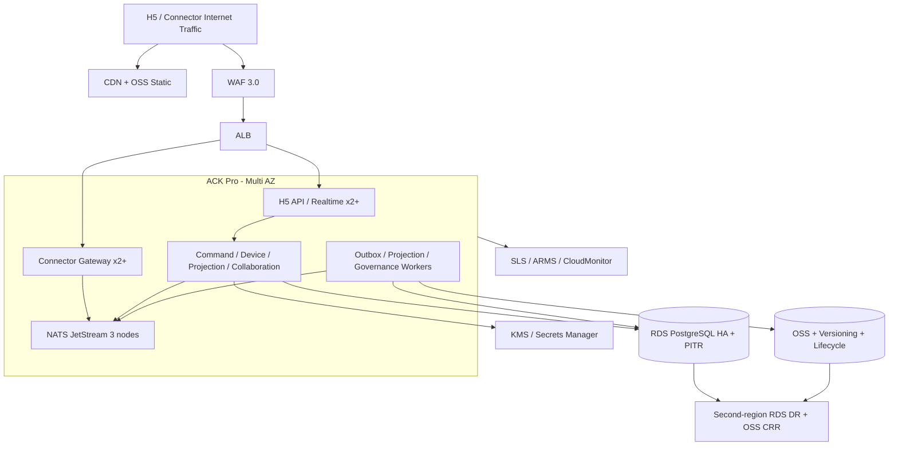

# 06 部署、可观测性与运维设计

- 状态：规范
- 基线版本：1.0
- 更新日期：2026-07-30
- 首发云：阿里云中国大陆

## 1. 运维目标

商用闭环必须做到：

- Connector 可自动安装、启动、诊断、升级和回滚；
- Agent 不在线时，用户能看到准确原因而不是统一显示“离线”；
- Server 单节点或单可用区故障不丢已提交命令；
- 绝大多数问题由指标、告警和 Runbook 定位，不依赖读取用户正文；
- 新版本通过小流量验证，不在全量用户设备上直接试错；
- 关键状态可以备份、恢复、导出和删除；
- 组件数量遵循“有负载证据才增加”，控制三年维护成本。

## 2. Connector 平台部署

### 2.1 macOS

- 签名和公证的 `.pkg`/应用制品；
- 独立 venv 或自包含运行时；
- `launchd` 用户级服务；
- Device Key 使用 Keychain；
- UDS 仅当前用户访问；
- 更新采用双槽或带回滚的原子替换。

### 2.2 Windows

- 签名 MSI/MSIX；
- 用户服务或明确权限的 Windows Service；
- Device Key 使用 DPAPI/CNG；
- Local Gateway 使用带用户 ACL 的 Named Pipe；
- 更新不能要求开放本机入站防火墙。

### 2.3 Linux

- 签名 deb/rpm 或可验证安装包；
- user-level systemd service；
- Device Key 使用 Secret Service，服务器场景使用受控 Vault/KMS；
- UDS 和运行目录限制到服务账户；
- 无图形环境时通过一次性配对码或管理员预注册。

### 2.4 本地目录

建议逻辑目录，不强制所有平台使用相同绝对路径：

```text
config/           非秘密配置和服务端地址
state/            SQLite、迁移和 active slot
runtime/          socket、pid、临时锁
logs/             脱敏、滚动日志
updates/          签名清单和备用槽
diagnostics/      用户明确生成、自动过期
```

Device Private Key 不进入上述普通文件目录。

#### macOS Local Gateway 六路径契约

Plugin 一次解析一个 `MacOSLocalGatewayPaths`，但三种 role 保持独立目录，避免不同
descriptor schema、socket protocol 或清理生命周期混放：

| 配置字段 | Plugin 环境变量 | 默认目录 |
|---|---|---|
| `local_gateway_registry_directory` | `HERMES_LOCAL_GATEWAY_REGISTRY_DIR` | `$HERMES_HOME/runtime/local-gateways` |
| `local_gateway_socket_directory` | `HERMES_LOCAL_GATEWAY_SOCKET_DIR` | `/tmp/hermes-local-gateway-<uid>` |
| `control_registry_directory` | `HERMES_CONTROL_REGISTRY_DIR` | `$HERMES_HOME/runtime/control-gateways` |
| `control_socket_directory` | `HERMES_CONTROL_SOCKET_DIR` | `/tmp/hermes-control-<uid>` |
| `observer_registry_directory` | `HERMES_OBSERVER_REGISTRY_DIR` | `$HERMES_HOME/runtime/observer-gateways` |
| `observer_socket_directory` | `HERMES_OBSERVER_SOCKET_DIR` | `/tmp/hermes-observer-<uid>` |

当 `HERMES_HOME` 指向 `$ROOT/profiles/<profile>` 时，三个 registry 统一折叠到
`$ROOT/runtime`。生产 composition root 只解析一次六路径并向 Local Gateway、
Control、Observer 注入同一不可变 snapshot；list 与 connect 之间不得重读环境变量，
也不公开可绕过该 snapshot 的任意 registry/socket 配置对。

六路径必须保留用户提供的原始绝对路径逐 component 检查；任何现存 symlink（包括
leaf 和 ancestor）、显式空值、相对路径、NUL、`..`、大小写别名，以及最终
descriptor 临时文件或 Unix Socket 文件越界，都必须在任何文件系统副作用前 fail
closed，禁止先 `resolve` symlink 后接受。Plugin 内建的 macOS 系统临时目录默认值先
选取真实 canonical anchor，再拼接角色目录。长度计算覆盖最长 PID、profile hash、
instance UUID、`.tmp` 后缀和 Unix Socket 结尾 NUL。

目录建立采用两阶段合同：preflight 先完成六路径规则、既有目录信任属性和既有
`st_dev + st_ino` 互异检查；通过后才逐 component 创建，并记录仅由本次调用成功创建
的目录 identity。创建后的最终 inode 检查用于拒绝 bind mount 或竞态物理别名；任一
后续失败只按逆序移除 identity 未变化且仍为空的本次新建目录，不删除既有目录或已被
占用/替换的路径。Connector 使用同名六字段并逐项配置为相同 canonical 绝对路径；
旧的单一 `registry_directory/socket_directory` 不能用于生产。

路径预检还必须从现存祖先读取所属文件系统 `PC_NAME_MAX`，逐 component 验证目录名
以及最长最终文件名；`PATH_MAX` 使用真实多 component 最终路径验证，不能用单个超长
component 模拟。任何后序 component 越界时，六个目录均不得创建。Local、Control、
Observer descriptor 的 `instance_id` 统一为 RFC 4122 小写 canonical hyphenated UUID，
发现端拒绝 32 位无连字符、大小写变体和非 RFC 4122 variant。

### 2.5 一个安装器、两个运行单元

每个平台只发布一个用户可见的 Hermes Connector 安装包。安装包内部包含：

- Connector Runtime；
- 签名 Agent Plugin Bundle；
- Compatibility Manifest；
- OS Service 定义；
- Repair/Uninstall；
- Release Manifest、SBOM 和摘要。

安装器通过 Agent Extension Manager 安装 Plugin，不修改 Agent 源码、应用包或
Python venv。Plugin 存放在 Agent 管理的独立 Extension Store；Connector 使用独立
程序、状态和更新目录。

安装器提供图形向导或等价的非技术入口，完成：

```text
环境检查
-> Agent 发现
-> Plugin 兼容检查/安装
-> Connector Service 安装
-> Local Gateway 健康检查
-> Cloud 配对
-> 完成或 Repair
```

用户无需执行 Python、pip、uv 或编辑配置文件。企业批量部署同时提供签名的静默安装
参数、预注册设备策略和 MDM/软件分发支持。

Agent 未安装时，安装结果显示“Connector 已安装，等待 Hermes Agent”，而不是失败。
Agent 版本不兼容时保持 Agent 可用，并提供升级 Agent、升级 Plugin 或使用兼容版本
三种受控处理路径。

## 3. 阿里云首发拓扑



### 3.1 产品映射

| 能力 | 阿里云产品 | 约束 |
|---|---|---|
| 域名/证书 | DNS、Certificate Management Service | 与实例分离管理 |
| H5 静态资源 | OSS + CDN | 禁止公共列举，制品版本化 |
| 公网接入 | WAF 3.0 + ALB | WSS 超时、限速和规则纳入 IaC |
| 容器运行 | ACK Pro | 跨 AZ、PDB、Topology Spread、drain |
| 镜像 | ACR Enterprise | 固定 digest、签名、阻止未签名镜像 |
| 消息 | ACK 内 3 节点 NATS JetStream | 独立节点池/盘、跨 AZ、恢复演练 |
| 事务 | RDS PostgreSQL HA | SSL、私网、PITR、应用重连 |
| 对象 | OSS | 信封加密、版本、生命周期、CRR |
| 密钥 | KMS / Secrets Manager | RAM Role，禁止长期 AK |
| 可观测 | SLS / ARMS / CloudMonitor | 正文脱敏、权限分层 |
| 云审计 | ActionTrail | RAM/KMS/OSS/RDS/ACK 独立保留 |

数据层无公网入口。Connector 只连接 WAF/ALB 后的 WSS，不感知 ACK、RDS、NATS、
OSS 或 KMS。

## 4. 其他交付模式

| 模式 | 控制平面 | 业务正文/数据平面 | Connector 连接 |
|---|---|---|---|
| Shared SaaS | Hermes Cloud | 共享平面 Tenant 隔离 | 公网 WSS |
| Dedicated Data Plane | 共享控制面 | 企业专属 VPC | 专属 Gateway |
| Connected Private | 客户云/VPC | 客户环境 | 客户 Gateway |
| Offline Private | 企业内网 | 企业内网 | 内部 Gateway |

四种模式共用 Connector Protocol、Local Gateway Protocol、命令状态和审计语义，
不维护四套业务代码。私有化以 PostgreSQL、NATS、S3、KMS/HSM、OIDC、OpenTelemetry
等适配边界替换云产品。

## 5. 配置与秘密

### 5.1 非秘密配置

- Remote Gateway URL 和 Realm；
- Proxy、网络超时和重连上限；
- 本地日志级别和保留；
- 自动更新渠道；
- feature policy；
- 数据保留和诊断开关。

配置来源优先级必须固定，例如：

```text
signed enterprise policy
> managed machine policy
> local admin config
> user preference
> safe defaults
```

上层安全策略不能被下层覆盖。

### 5.2 秘密

- Device Key：OS 安全存储；
- 短期连接令牌：内存，必要时加密临时缓存；
- Release Root Key：只内置公钥；
- Server 凭据：KMS/Secrets Manager；
- 日志和配置导出前执行秘密扫描。

## 6. SLO、SLA 和容量

| 指标 | 目标 |
|---|---|
| 公开月度 SLA | 99.9% |
| 内部月度 SLO | 99.95% |
| Server 接受至 Connector 持久 ACK | P95 < 1 秒 |
| Gateway 故障后 Connector 重连 | P95 < 30 秒 |
| 可用区故障 | RPO 0，RTO < 5 分钟 |
| 主区域灾难 | RPO ≤ 15 分钟，RTO ≤ 4 小时 |

中国大陆首发不承诺跨地域无缝双活。公开 SLA 和赔付边界需经过正式商业和法律
审查。

### 6.1 容量门禁

| 场景 | 规模 | 通过条件 |
|---|---:|---|
| 稳定在线 | 10,000 Connector × 72 小时 | 无连接/内存泄漏，SLO 稳定 |
| 峰值裕量 | 20,000 Connector × 1 小时 | 不丢命令，持久 ACK P95 < 1 秒 |
| 重连风暴 | 10,000 / 5 分钟 | 无认证雪崩，受控恢复 |
| 活动会话 | 500、5,000 events/s | 投影延迟受控，可快照回退 |
| B 路径 | 100,000 空闲连接 | 不改协议/数据模型即可扩展 |

## 7. 指标

### 7.1 Connector

- 版本、平台和 update channel；
- Cloud WSS 状态、连接时长、重连次数和原因；
- Agent 状态、版本、generation 和 capability digest；
- SQLite migration、大小、WAL、磁盘余量；
- Inbox/Outbox 深度和 oldest age；
- 消息 ACK 延迟、重复、过期和 digest 冲突；
- Local Gateway 握手和 RPC 延迟；
- snapshot fallback 和 reconciliation 结果；
- update/rollback 成功率。

### 7.2 Server

- 在线 Connector 数和版本分布；
- WSS 握手失败、心跳超时、每节点连接数；
- NATS consumer lag、pending、redelivery 和 quorum；
- Command 各状态耗时；
- `EXPIRED`、`UNKNOWN` 和重复比例；
- Outbox oldest age；
- Projection lag、序列缺口和快照回退；
- 配对、吊销、权限拒绝和异常 Tenant 访问；
- RDS 延迟、锁、连接池和存储；
- KMS、OSS 和 Policy 依赖延迟。

## 8. 日志与 Trace

统一关联：

```text
trace_id
message_id
command_id
connection_id
device_id (safe form)
agent_id (safe form)
runtime_generation
```

日志分为：

- 运行日志：短保留、用于本机诊断；
- 安全日志：追加式、限制访问；
- 审计日志：业务授权和状态变更事实；
- 内容访问日志：原文读取和导出；
- 指标/Trace：默认无正文。

日志采样不能丢失安全拒绝、命令终态和更新回滚事件。

## 9. 告警

### P0

- 跨 Tenant 授权异常；
- Device Key/Server Signing Key 疑似泄露；
- 已提交命令系统性丢失或重复副作用；
- RDS 数据不可恢复；
- 未签名 Connector/镜像进入生产。

### P1

- `UNKNOWN` 比例超过基线；
- Gateway 大面积连接失败；
- JetStream quorum/Outbox 持续积压；
- Projection 删除传播失败；
- 更新造成显著回滚；
- 单 AZ 故障未在目标时间恢复。

### P2

- 个别版本重连率偏高；
- 队列、磁盘或连接池接近水位；
- capability 不兼容比例上升；
- 诊断/投影延迟超过 SLO。

告警应按错误预算和持续时间聚合，避免按每次客户端重连产生告警风暴。

## 10. Runbook

必须具备并季度演练：

1. Gateway 节点故障和重连风暴；
2. NATS Leader/节点故障和消费积压；
3. PostgreSQL 主备切换、Outbox 补发和连接恢复；
4. Connector 某版本协议错误和灰度回滚；
5. Agent/Plugin/Connector 版本不兼容；
6. Device Key 或 Server Signing Key 泄露；
7. 租户导出、删除和账户关闭；
8. OSS 误删除、RDS PITR 和跨区域恢复；
9. Connector 磁盘满、SQLite 损坏和只读模式；
10. 时钟漂移、网络分区、代理/证书异常；
11. P0 安全阻断 capability 和强制更新；
12. 诊断包安全导出。

每个 Runbook 包含触发条件、用户影响、只读诊断、缓解、恢复、数据对账、回滚和
复盘证据。

## 11. 备份与灾备

- RDS 连续归档、PITR 和每日快照；
- 第二中国大陆地域灾备实例或异步复制；
- OSS 版本控制、生命周期和 CRR；
- 灾备 Bucket 默认不复制永久删除；
- KMS 加密对象复制使用专用最小权限 RAM Role；
- JetStream 不是长期备份，Command 可由 PostgreSQL Outbox 恢复；
- 每季度演练数据库恢复、设备吊销、密钥轮换和区域切换。

Connector SQLite 不作为 Cloud 备份；它可从 Server 和 Agent 事实对账恢复，但涉及
`UNKNOWN` 的记录必须保留并人工/查询闭环。

## 12. 灰度与发布

```text
CI
-> Contract/Security/Compatibility
-> Internal
-> 1%
-> 10%
-> 50%
-> 100%
```

每阶段观察：

- 启动和握手成功率；
- Agent 发现与对账；
- Crash-free；
- Outbox、UNKNOWN、重复和过期；
- CPU、内存、磁盘和网络；
- 用户主动回滚/诊断；
- 安全拒绝异常。

任一错误预算耗尽立即暂停。回滚不回滚用户事实，不重复执行命令。

## 13. 低维护成本原则

1. 首期只使用 PostgreSQL、NATS、OSS、KMS 和 OpenTelemetry 等必要组件。
2. Redis 默认不部署，缓存需求由实测证明。
3. 不为每个领域建立独立微服务；先保持职责清晰的模块化部署。
4. 使用 Schema、Fixture、生成模型和兼容测试减少多端手工同步。
5. Connector 自诊断输出稳定错误码和建议，不依赖人工翻日志正文。
6. 通过签名策略和 capability 关闭风险功能，不紧急修改所有 Agent。
7. IaC、迁移、告警和 Runbook 与代码同版本评审。
8. 新增 Flink、Kafka、Hologres、Temporal、Milvus 前必须提供负载证据和退出计划。
9. 运营面向设备、命令和版本状态，不以人工远程登录用户机器为常规手段。
10. 每季度删除无 Owner、无 SLO 或无业务价值的组件与数据投影。
11. 用户侧只维护一个产品入口、一个状态页和一个 Repair 流程；内部组件复杂性不能
    转嫁给用户。
