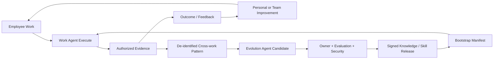

# 08 企业扩展与 Agent 协作设计

- 状态：扩展规范
- 基线版本：1.0
- 更新日期：2026-07-30
- 前置条件：Connector 商用远程闭环稳定

## 1. 定位

Hermes Connector v1 先解决“一个员工从多端安全使用自己的本地 Agent”。企业扩展
进一步解决：

- 员工专属 Agent 如何被企业基础能力初始化；
- 员工 Agent 如何代表员工参与组织协作；
- Agent 之间如何交换任务、证据和结构化交付物；
- 工作结果如何沉淀为公司 Knowledge 和 Skill；
- 公司能力如何再分发给员工 Agent，形成双层迭代。

Connector 只承载稳定协议、设备状态和可靠交付，不理解具体部门、Skill 或业务流程。

## 2. “基础大脑”正确形态

需要基础初始化能力，但不建设一个读取所有数据、替所有员工决策的中央超级 Agent。
正确形态是 **Enterprise Agent Bootstrap Kernel**：

```text
Identity + Org + Device
  -> Enterprise Baseline
  -> Role Capability Package
  -> Employee-specific Configuration
  -> Policy / Purpose / Budget
  -> Capability Resolution
  -> Signed Bootstrap Manifest
  -> Employee Work Agent
```

Bootstrap Manifest 只下发引用和授权快照：

- 员工、角色、部门、Workspace；
- 可见 Data Product、Knowledge、Action、Skill；
- 模型、预算、设备和数据驻留策略；
- Agent 自主等级；
- Delegation Policy；
- Runtime/Connector/Renderer 最低 capability；
- 版本、有效期、签名和撤销信息。

不下发整个企业数据副本，不下发其他员工 Personal Memory，不把管理员权限交给
Agent。

## 3. 双层 Hermes Agent

### 3.1 Work Agent

员工专属 Work Agent 负责日常工作：

- 理解目标；
- 读取有权数据；
- 组织动态工作台；
- 调用已批准 Skill/Action；
- 协作、请求审批和交付；
- 形成 Evidence；
- 记录结果和人工反馈。

### 3.2 Evolution Agent

企业 Evolution Agent 负责能力进化：

- 从授权 Evidence 和去标识化模式发现候选；
- 识别重复工作、知识缺口和 Skill 机会；
- 组织评测、回归、安全和经营效果分析；
- 提出 Knowledge/Skill/Policy 候选；
- 经 Owner 和治理门禁后灰度发布；
- 监控效果并回滚。

Evolution Agent 不能自行放宽 Policy、读取 Personal Memory、直接发布 Skill 或依据
私人工作活动作人事结论。

### 3.3 双层循环



## 4. 员工和 Agent 的四种关系

| 关系 | 用途 | 默认规则 |
|---|---|---|
| 员工 A → Agent A | 草拟、组织和委托 | A 的权限与个人策略 |
| 员工 A → Agent B | 查询共享事实、请求协作 | 只能使用双方共享范围 |
| Agent A → 员工 B | 补充、确认、审批、接管 | 标明由 A 的 Agent 发起 |
| Agent A → Agent B | 分工、状态、结构化交付 | 经 Collaboration Service |

Agent 是员工的数字工作代理，不是员工本人。界面和审计同时显示 Agent 身份和
`on_behalf_of` 员工。

## 5. 服务端路由

所有正式 Agent-to-Agent 消息通过部署边界内的 Collaboration Gateway：

```text
Employee A
-> Work Agent A
-> Local Gateway A
-> Connector A
-> Hermes WSS
-> Remote Gateway
-> Collaboration Gateway
-> Identity / Delegation / Policy
-> Message Store / Work Item / Outbox
-> NATS Core / JetStream
-> Delivery Session B
-> Connector B
-> Local Gateway B
-> Work Agent B
-> Employee B
```

[PROHIBITED] 设备间 P2P 不承担正式消息、授权、Receipt 或业务承诺。

服务端路由的价值：

- 统一验证 Agent、设备和员工委托；
- 统一 Tenant、Workspace、Purpose 和 ACL；
- 支持接收方离线；
- 保存消息和 Work Item 状态；
- 控制轮次、预算、超时和循环；
- 支持撤回、接管、审计和版本隔离。

## 6. 协作载体

### 6.1 Conversation

讨论、解释、提问和草拟。聊天内容不自动改变正式业务状态。

### 6.2 Collaboration Request

请求另一个员工或 Agent 完成明确工作，包含：

- 目标；
- 输入引用；
- 期望输出 Schema；
- 验收条件；
- 截止时间；
- Purpose；
- 责任人；
- 人工门禁；
- 循环/预算限制。

接受后创建或关联 Work Item。

### 6.3 Action / Approval

用于修改业务状态、批准、对外发送或形成承诺。必须使用 Action Contract；
Conversation 中的自然语言“同意”不能被模型擅自解释为正式批准。

## 7. 协作消息

```json
{
  "message_id": "msg_01...",
  "thread_id": "thr_01...",
  "work_item_id": "wrk_01...",
  "sender": {
    "type": "agent",
    "id": "agt_a",
    "on_behalf_of": "usr_a"
  },
  "recipients": [
    {
      "type": "agent",
      "id": "agt_b",
      "owner_id": "usr_b"
    }
  ],
  "message_type": "task_request",
  "authority": "request",
  "purpose": "project_delivery",
  "classification": "internal",
  "resource_refs": [
    "project://prj_01/interface-delivery"
  ],
  "expected_output": {
    "schema": "delivery-confirmation.v1"
  },
  "acceptance_criteria": [
    "给出预计完成时间",
    "列出未解决依赖"
  ],
  "human_gate": "required_before_commitment",
  "reply_policy": {
    "max_agent_turns": 4,
    "allow_partial": true
  },
  "deadline": "2026-07-31T18:00:00+08:00",
  "expires_at": "2026-07-31T18:00:00+08:00",
  "trace_id": "trc_01..."
}
```

`authority` 受控枚举：

- `inform`；
- `propose`；
- `request`；
- `delegate`；
- `approve_request`；
- `commit`。

Agent 不能通过自然语言把 `propose` 升级为 `commit`。

## 8. 状态和 Receipt

### 8.1 Collaboration Request

```text
DRAFT -> SENT -> RECEIVED -> POLICY_CHECKED
POLICY_CHECKED -> ACCEPTED / REJECTED / NEEDS_OWNER
ACCEPTED -> IN_PROGRESS -> DELIVERED -> VERIFIED -> CLOSED
IN_PROGRESS -> BLOCKED -> IN_PROGRESS / NEEDS_HUMAN
SENT/RECEIVED/ACCEPTED/IN_PROGRESS -> CANCELLED / EXPIRED
```

### 8.2 交付可见状态

- `ACCEPTED_BY_GATEWAY`：服务端已校验并持久化；
- `QUEUED`：等待接收方；
- `DELIVERED_TO_CONNECTOR`：已交给 Connector B；
- `RECEIVED_BY_AGENT`：Agent B 已确认；
- `SEEN_BY_HUMAN`：员工 B 已查看；
- `ACCEPTED/REJECTED`：正式处理；
- `DELIVERED/VERIFIED/CLOSED`：完成闭环。

UI 不能把“Gateway 已接收”显示成“对方已确认”。

## 9. Connector WSS 扩展

在 Connector Protocol v1 兼容扩展中增加：

| 消息 | 方向 | 作用 |
|---|---|---|
| `collaboration.send` | Connector A → Server | 提交幂等协作消息 |
| `collaboration.accepted` | Server → Connector A | Server 已持久化 |
| `collaboration.available` | Server → Connector B | 通知待收 |
| `collaboration.pull` | Connector B → Server | 按 cursor 拉取 |
| `collaboration.message` | Server → Connector B | 交付消息 |
| `collaboration.receipt` | Connector B → Server | Agent 已接收/拒绝 |
| `collaboration.status` | Server → A/B | 状态变化 |
| `collaboration.cancel` | Connector A → Server | 在允许状态取消 |

消息携带 Schema Version、Message ID、Idempotency Key、Agent Session、Cursor、
Trace、Digest、Expiry 和完整性信息。Server 返回 `accepted` 后 PostgreSQL 是权威
事实，Connector SQLite 只是待发/待收缓存。

## 10. 数据交换

优先发送引用：

```text
Agent A sends Resource Reference
-> Collaboration Gateway routes reference
-> Agent B requests resource with its own identity
-> Policy checks B + Agent B + Purpose
-> Data Product returns allowed fields/result
```

无权读取时：

- A 不得复制正文绕过；
- B 不得要求 A 代摘要绕过；
- 可以创建 Access Request；
- Owner 创建限定资源、字段、Purpose、接收方和有效期的 Access Grant；
- B 使用自己身份重新读取。

大文件通过 Upload Grant → 扫描 → Resource Reference → Download Grant，不放入
Agent 消息总线。

## 11. 循环与责任控制

每个请求限制：

- 最大 Agent 轮次；
- 最大总时长；
- Token/费用预算；
- 最大并行子任务；
- Skill Allowlist；
- 数据范围；
- Action 风险上限；
- 无进展/冲突检测；
- Deadline/TTL。

以下进入 `NEEDS_HUMAN`：

- 连续两轮无新增证据；
- 结论冲突；
- 目标变化；
- 需要扩大权限；
- 预算/期限临界；
- 正式承诺或员工判断；
- Action 结果 `UNKNOWN`；
- 无兼容 Skill。

## 12. Agent 自主等级

| 等级 | 能力 | Connector/Server 约束 |
|---|---|---|
| L0 Draft | 只草拟 | 不自动发送正式消息 |
| L1 Inform | 回复共享事实 | 只读、有引用 |
| L2 Collaborate | 推进低风险 Work Item | 受 Delegation/预算约束 |
| L3 Act | 执行批准的 R1/R2 Action | Action Contract、可补偿 |
| L4 Commit | 高影响承诺 | 默认关闭，逐次人工门禁 |

自主等级按场景和 Action 配置。企业 Policy 可以降低员工选择，员工不能自行超过
企业上限。

## 13. 双层升级与 Connector 边界

发布轨道保持独立：

| 轨道 | 内容 | Connector 是否理解业务 |
|---|---|---|
| Runtime | Agent 执行内核 | 否 |
| Connector | 可靠传输和状态 | 仅理解通用消息类型 |
| Capability | Skill、Action、Workflow | 否，只传版本/引用 |
| Experience | View Schema、组件 | 否，只传制品/能力元数据 |
| Bootstrap | Baseline、Role、Delegation | 否，只验证签名/兼容元数据 |

新 Skill 不能假定所有 Agent 已升级。Bootstrap/Capability Resolver 选择当前
Runtime、Connector、Renderer 和 Policy 共同兼容的版本。

## 14. 企业扩展上线门禁

- 未绑定合法员工、Agent 和设备不能加载企业能力；
- Bootstrap Manifest 签名、过期和吊销 fail closed；
- Agent A 不能转发 B 无权读取的正文；
- 委托撤销和项目退出及时生效；
- Agent-to-Agent 无进展可转人工；
- 员工接管后可恢复原 Work Item；
- 接收方离线/重连可按 cursor 恢复；
- 重复投递不产生重复业务效果；
- Agent/Connector 不直连 NATS；
- Personal Memory 不进入企业进化循环；
- Evolution 发布必须有 Owner、Evidence、Evaluation、灰度和回滚；
- 员工能查看、纠错和申诉与自己相关的工作证据。
