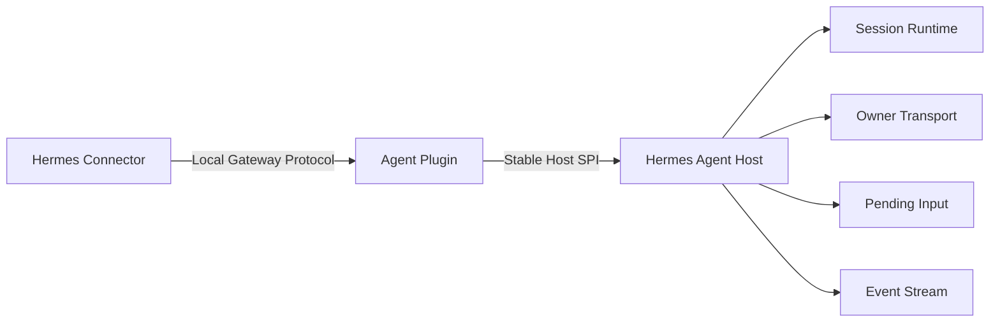
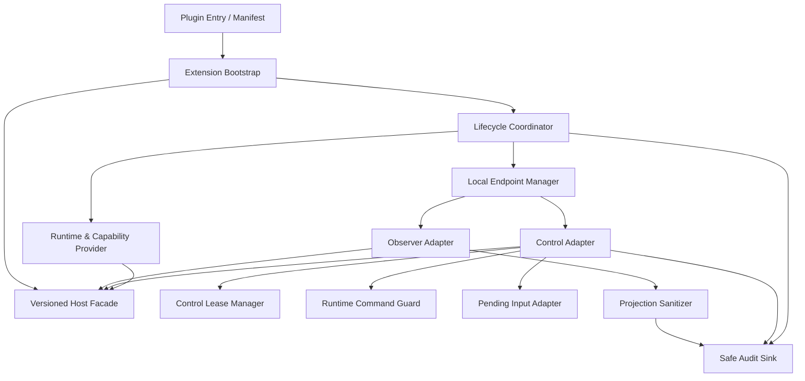
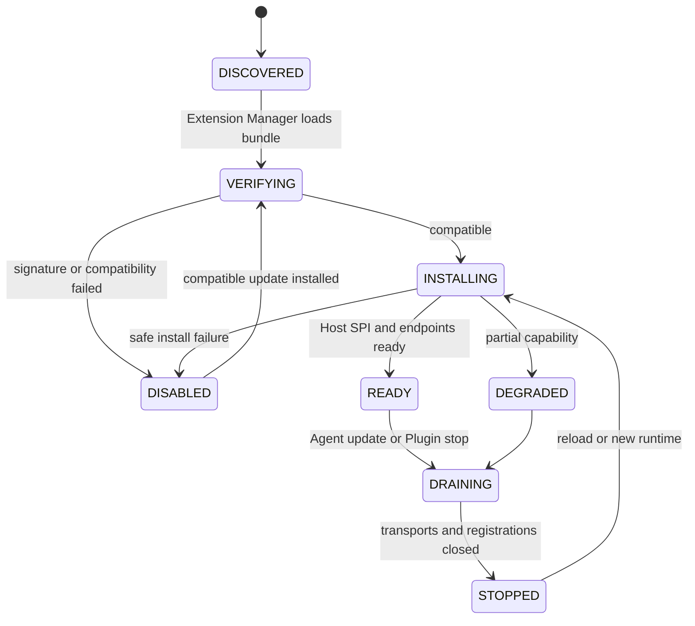
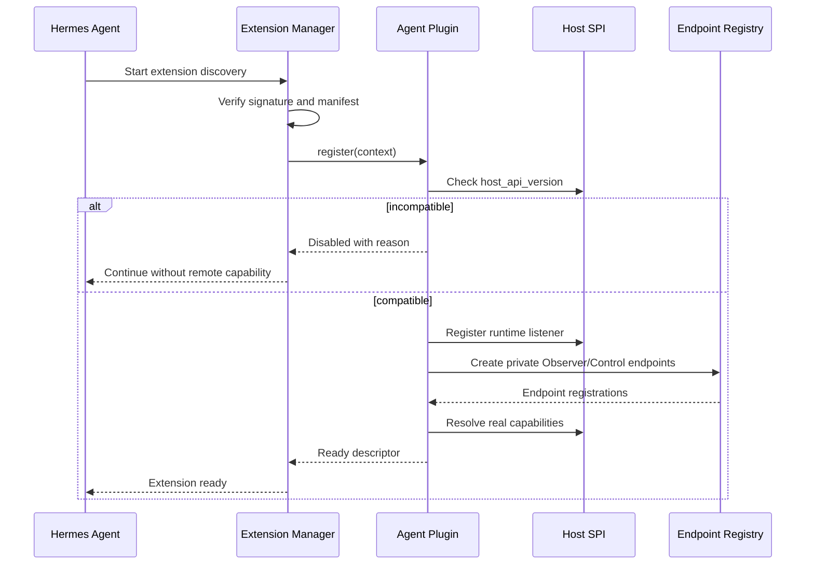
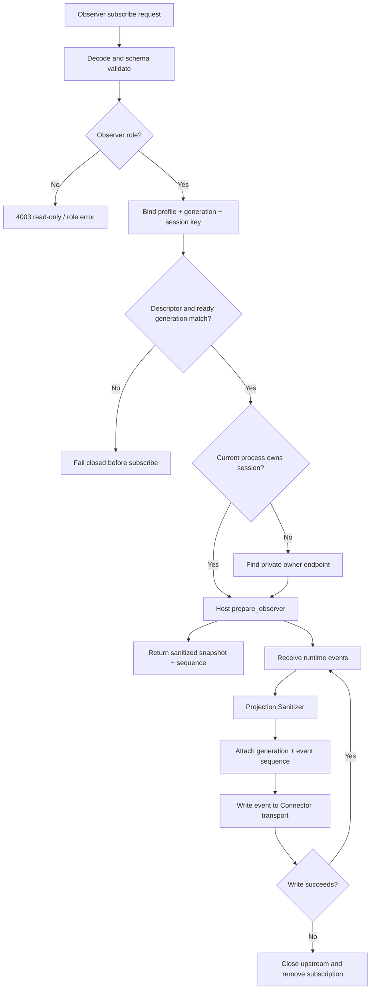
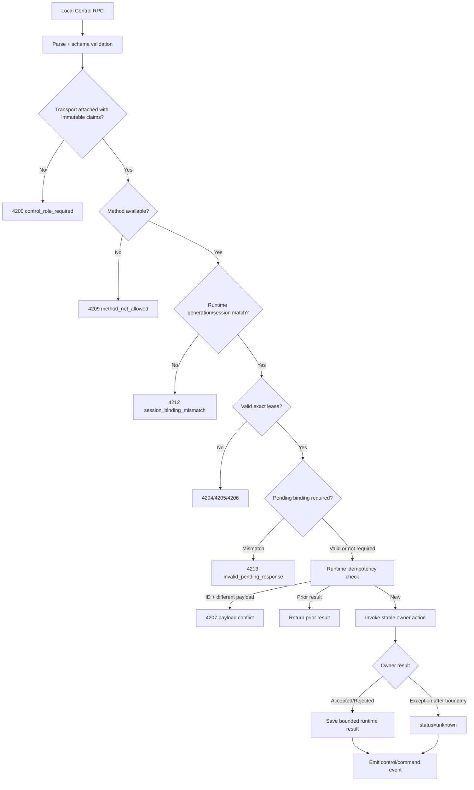
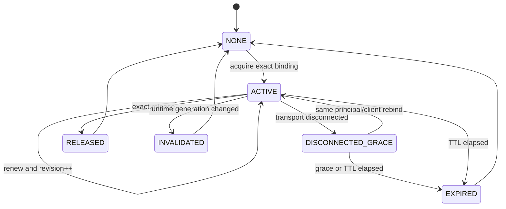
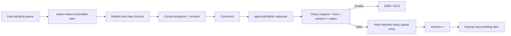
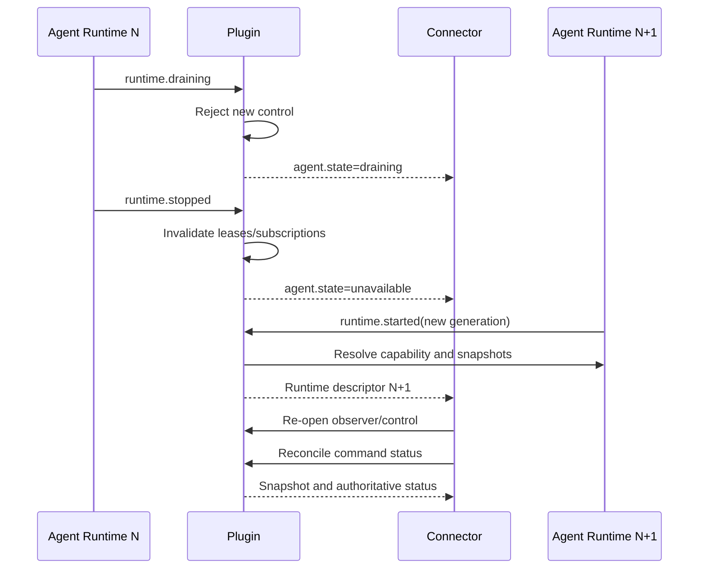

# 09 Hermes Agent Plugin 详细设计

- 状态：实现级规范
- 基线版本：1.0
- 更新日期：2026-07-31
- 组件名称：Hermes Agent Plugin
- 唯一 Python 包：`hermes_agent_plugin`
- 历史导入包：`hermes_mobile_gateway`（已退出源码和新发行物，仅供升级工具识别旧发行版）

## 1. 组件定位

Hermes Agent Plugin 是 Agent 侧的薄适配层，职责是将 Agent 的稳定能力转换为
Local Gateway Protocol。它运行在用户本地、位于 Agent 信任域内，但不拥有 Cloud
身份、远程连接、离线消息或商用业务状态。

一句话边界：

> Plugin 负责“安全暴露 Agent 能力”，不负责“把能力连接到 Cloud”。



## 2. 输入、输出与事实边界

### 2.1 输入

Plugin 只接受来自本机 Connector 的版本化本地请求：

- capability handshake；
- Observer subscribe/unsubscribe；
- Observer snapshot；
- Control acquire/renew/release/status；
- command status；
- 当前允许的 owner action；
- transport close/cancel。

### 2.2 输出

Plugin 只输出：

- Runtime Descriptor；
- Capability Descriptor；
- 已裁剪 Observer Snapshot/Event；
- Control Snapshot/Event；
- Owner Action 的接受、拒绝、失败或不确定结果；
- 稳定 Local Gateway Error；
- 不含正文和秘密的 Audit Event。

### 2.3 不拥有的事实

| 事实 | Plugin 是否权威 | 权威方 |
|---|---|---|
| 会话内容和执行结果 | 否 | Hermes Agent |
| Owner Transport | 否，不可替换 | Hermes Agent |
| Pending Input | 否，读取并校验 | Hermes Agent |
| 当前 Runtime Control Lease | 是，运行期 | Plugin/Host Runtime |
| Cloud 命令生命周期 | 否 | Remote Server |
| Connector 是否已持久接收命令 | 否 | Connector SQLite |
| 设备身份和吊销 | 否 | Remote Server/Connector |
| 企业业务权限 | 否 | Policy Service + Agent Host |

## 3. 当前代码实现映射

### 3.1 已存在模块

| 文件 | 当前职责 | 状态 |
|---|---|---|
| `src/hermes_agent_plugin/__init__.py`、`bootstrap/registration.py` | `register(context)` 正式入口、Host SPI 版本/capability 预检和 fail-closed 错误 | [CURRENT] |
| `src/hermes_agent_plugin/adapters/host/extension.py` | Extension 对象和 `install(host)` 骨架 | [CURRENT-PARTIAL] |
| `src/hermes_agent_plugin/adapters/local_protocol/control_v1.py` | Control v1 方法、错误码、UUID 校验 | [CURRENT] |
| `src/hermes_agent_plugin/adapters/local_protocol/observer_relay.py` | Observer 平台无关契约、canonical API 和 backend port 门面 | [CURRENT] |
| `src/hermes_agent_plugin/adapters/local_protocol/control_relay.py` | Control claims/错误语义、canonical API 和 backend port 门面 | [CURRENT] |
| `src/hermes_agent_plugin/adapters/platform/macos/observer_relay.py` | macOS Observer UDS 注册、发现、订阅和事件中继 | [CURRENT] |
| `src/hermes_agent_plugin/adapters/platform/macos/control_relay.py` | macOS Control UDS、claims attach 和跨进程中继 | [CURRENT] |
| `src/hermes_agent_plugin/domain/control_lease.py` | 单控制者租约、续租、过期和 revision | [CURRENT] |
| `src/hermes_agent_plugin/application/control_commands.py` | 有界进程内幂等账本 | [CURRENT] |
| `src/hermes_agent_plugin/contracts/generated/mobile-control-v1.json` | 根 Contract 权威源的正式生成副本 | [CURRENT] |

### 3.2 当前必须补齐

- `extension.install()` 尚未接入真实 Host 生命周期；
- Hermes 0.19 尚未提供 Plugin 要求的 `gateway-extension/1`；
- `register(context)` 是唯一生产入口；历史独立 runtime 只保留无副作用 fail-closed
  tombstone，测试 lifecycle harness 不进入 wheel；
- Plugin 源码已无私有 Hermes Host import，但真实 owner action 仍必须等待 Core
  注入，不能用 hook 或 `inject_message` 替代；
- Observer/Control 的通用层已通过 port 注入平台实现；macOS UDS 已验证，Linux
  与 Windows backend 显式 fail closed，Windows Named Pipe 和 Linux 本地传输尚缺；
- Runtime Descriptor、Capability Descriptor 尚无独立 Schema；
- 进程内 Command Ledger 不能承担跨 Agent 重启的持久幂等；
- Plugin Bundle、Extension Manager 和签名安装尚未实现。

## 4. 目标模块结构



依赖方向必须单向：协议入口依赖 Plugin 领域模块，Plugin 领域模块依赖 Host Facade；
Host Facade 不反向依赖 Connector 或 Cloud。

## 5. 模块功能清单

### 5.1 Plugin Entry 与 Manifest

职责：

- 声明 `plugin_id`、版本、Host API 范围和 Local Protocol 范围；
- 声明 capability；
- 声明平台和构建摘要；
- 提供 `register(context)`；
- 被 Extension Manager 验证签名后加载。

禁止：

- 在 import 阶段启动线程或监听端口；
- import Agent 私有模块；
- 读取 Cloud 配置或 Device Key；
- 修改 Agent 全局变量。

### 5.2 Extension Bootstrap

职责：

1. 接收 Host 提供的稳定 context；
2. 检查 Host API；
3. 创建 Host Facade；
4. 注册生命周期监听；
5. 创建 Observer/Control Endpoint；
6. 发布 capability；
7. 返回可关闭的 Registration。

安装失败必须返回结构化原因并让 Agent 继续启动。

[CURRENT] Plugin 已实现 `install(host) -> Registration`：只调用冻结 Facade 的
`runtime_descriptor/register_local_endpoint/prepare_observer/control_snapshot/
invoke_owner_action/add_runtime_listener/audit`，不再依赖
`register_connection_role`。聚合 Registration 幂等关闭，安装中途失败会逆序
关闭已经注册的 listener 和 endpoint。

### 5.3 Versioned Host Facade

Host Facade 是 Plugin 唯一可访问的 Agent 接口。目标逻辑能力：

```python
class GatewayExtensionHostV1(Protocol):
    host_api_version: int

    def runtime_descriptor(self) -> RuntimeDescriptor: ...
    def prepare_observer(self, request, sink) -> PreparedObserver: ...
    def control_snapshot(self, scope) -> ControlSnapshot: ...
    def invoke_owner_action(self, request) -> OwnerActionResult: ...
    def command_status(self, request) -> CommandStatus: ...
    def add_runtime_listener(self, listener) -> Registration: ...
    def audit(self, event) -> None: ...
```

这只是接口规范示例，不允许 Plugin 通过其他路径补取内部对象。

### 5.4 Lifecycle Coordinator

管理：

- Plugin install/start/ready；
- Agent runtime started/draining/stopped；
- Endpoint register/unregister；
- transport close；
- subscription close；
- lease invalidation；
- Plugin stop/uninstall。

必须满足幂等关闭：重复调用 `close()` 不抛错、不重复删除其他实例的注册文件。

### 5.5 Runtime & Capability Provider

输出：

```json
{
  "agent_id": "agt_01...",
  "agent_version": "0.20.0",
  "host_api": 1,
  "plugin_version": "1.0.0",
  "local_gateway_protocol_min": 1,
  "local_gateway_protocol_max": 1,
  "runtime_generation": "run_01...",
  "profile": "default",
  "state": "ready",
  "capabilities": {
    "session.observe": 1,
    "session.control": 1,
    "prompt.submit": 1,
    "session.interrupt": 1,
    "session.steer": 1,
    "approval.respond": 1,
    "clarify.respond": 1,
    "sensitive_input_e2ee": 0
  }
}
```

Capability 来自真实 Host 注册能力，不根据 Agent 版本字符串猜测。

### 5.6 Local Endpoint Manager

职责：

- macOS/Linux UDS；
- Windows Named Pipe；
- 当前用户/服务账户 ACL；
- endpoint instance ID；
- 原子写入注册元数据；
- 失效 PID 和越界路径清理；
- 每个 Agent/Profile 可发布 Observer 与 Control endpoint；
- 关闭时只删除属于当前 instance 的注册。

注册元数据禁止包含 Credential、Lease、Token、Session 正文和内部 WebSocket URL。

### 5.7 Observer Adapter

职责：

- 只允许 subscribe/unsubscribe/snapshot；
- 绑定 Durable Session Key、Profile、Runtime Generation 和可选 Runtime Session；
- 调用 Host Observer；
- 只转发经过 Sanitizer 的事件；
- 保持 event sequence；
- transport 关闭时移除所有订阅；
- 上游 owner 不在当前进程时通过受控本地 relay 找到 owner。

Observer wire contract 由 Host runtime descriptor 的
`session.observe.output-parity.v1` capability 及其精确版本决定。v1 的 registry
descriptor、`gateway.ready` 和 `observer.subscribe` 必须逐跳携带完全相同的
`runtime_generation`；descriptor 或 ready generation 与请求不一致时必须在发送
subscribe 前关闭连接并 fail closed。v2 Connector subscribe 采用冻结的三字段 params
`observer_contract/session_key/profile`；Plugin endpoint 只能从已绑定 Host runtime
descriptor 补入权威 `runtime_generation`，不得加入 v1 的 `relay_local_only` 字段。
Host runtime generation 或 capability 变化同时撤销旧代际 prepared/active Observer、
关闭旧 endpoint，并按新 contract 重建后才能建立新订阅。

v1 `gateway.ready` payload 必须且只能包含 `local_gateway_protocol=1`、
`observer_contract=1`、`connection_role=observer`、精确 `profile`、精确
`runtime_generation` 和 endpoint `instance_id`；后者为 RFC 4122 小写 canonical
hyphenated UUID。v2 payload 必须且只能包含 `observer_contract=2` 与
`connection_role=observer`，不得泄露 v1 identity 字段。任一版本缺字段、额外字段或
contract 不一致都必须在 subscribe 前失败。
Observer snapshot、replay event 和每个 live event 必须同时精确匹配 profile、
runtime generation、durable session key 和 runtime session id，Relay 禁止补造缺失字段。
Relay 替换上游 subscription identity 时生成的本地 `subscription_id`，以及跨进程
Control relay 为响应映射生成的 wire request ID，同样必须是 RFC 4122 小写 canonical
hyphenated UUID；32 位 `.hex` 形式不得进入 wire payload。

Observer 不能：

- resume/activate Session；
- 替换 owner transport；
- 调用 mutation；
- 获取 Control Lease；
- 获取未裁剪审批正文。

### 5.8 Control Adapter

职责：

- 首帧 `relay.control.attach`；
- 校验 immutable claims；
- 只允许 `CONTROL_AVAILABLE_METHODS`；
- 将每个 RPC 绑定到同一 transport；
- 调用 Lease Manager；
- 调用 Host owner action；
- 输出 Control Event；
- disconnect 时通知 Lease Manager。

### 5.9 Control Lease Manager

职责：

- 同一 `(profile, session_key)` 最多一个显式远程 Controller；
- Lease 与 principal、client、runtime、transport 精确绑定；
- 安全随机 Lease ID；
- 固定 TTL；
- renew/release/authorize；
- 断线宽限内允许同一身份重新绑定新 transport；
- 每次状态变化推进 revision；
- Lease 不出现在 `repr`、日志或错误。

### 5.10 Runtime Command Guard

职责：

- 校验 method available；
- 校验 canonical `client_request_id`；
- 校验 runtime generation；
- 校验 Session/Profile；
- 校验 Lease；
- 同一请求相同 payload 返回旧结果；
- 同一请求不同 payload 返回冲突；
- owner action 抛错后返回 `unknown`，不伪装为未执行。

Plugin 的账本只承担当前 runtime 的执行保护；跨重启持久交付由 Connector SQLite
负责。

Host `OwnerActionRequest.command_id` 与 Control v1 `client_request_id` 是两个身份：
前者来自 Control JSON-RPC `id` 并绑定 Host 副作用，后者保持为客户端幂等键。
Plugin 在 Host 调用前校验 profile、durable session、runtime generation、两类 ID
及 method，并只把方法业务字段放入 Host payload。Runtime listener 撤销的 owner
action capability 会立即从 endpoint 可用方法中移除，并在 Host 副作用前拒绝。

### 5.11 Pending Input Adapter

职责：

- 提供当前最早可操作 Pending Request；
- 输出 server/host 已裁剪的 title、description、choices；
- 校验 request ID、kind、revision、expiry；
- 只接受服务器提供的 choice；
- 一个 request 只允许一个响应成功；
- 解决、过期、入队时推进 control revision。

### 5.12 Projection Sanitizer

必须去除：

- Token、Lease 和 Secret；
- 未授权工具输出；
- 内部路径和堆栈；
- 原始审批对象中的隐藏字段；
- Model hidden reasoning；
- 其他用户/Session 的信息。

Sanitizer 失败时丢弃该帧并记录安全错误，不得回退为发送原始对象。

### 5.13 Safe Audit Sink

记录：

- Plugin/Host/Protocol 版本；
- endpoint register/unregister；
- observer/control connection；
- lease 状态；
- method allow/deny；
- command ID、状态和错误码；
- runtime generation 变化。

不记录正文、Lease、Secret、完整 approval、完整工具输出。

## 6. Plugin 生命周期逻辑



状态规则：

- `DISABLED` 不影响 Agent 本地启动；
- `DEGRADED` 必须声明缺失 capability；
- `DRAINING` 拒绝新 Control，允许必要状态查询；
- `STOPPED` 后不得保留线程、endpoint、lease 或 subscription。

## 7. 启动逻辑图



## 8. Observer 功能逻辑



## 9. Control 命令逻辑



## 10. Control Lease 逻辑



竞争规则：

- 两个不同 client 并发 acquire，最多一个成功；
- 同一 client 同一 transport 重复 acquire 返回当前 Lease；
- 旧 Lease ID 不能授权新身份或新 Runtime；
- disconnect grace 只允许相同 principal/client/session/runtime。

## 11. Pending Input 逻辑



## 12. Agent 更新和 Runtime 切代



Plugin 不负责保存跨切代命令。Connector 必须根据 SQLite 和 Cloud Command Fact
决定查询、过期或进入 `UNKNOWN`。

## 13. 功能设定清单

### 13.1 Current

- 插件 entry point；
- Observer UDS endpoint/registry；
- Observer subscribe/unsubscribe relay；
- Control UDS endpoint/registry；
- immutable claims attach；
- Control method allowlist；
- Control Lease 和 revision；
- bounded runtime command ledger；
- Control v1 error range；
- Android Fixture 对齐测试。

### 13.2 Target v1

- 完整 Extension Bootstrap；
- Stable Host SPI v1；
- Runtime/Capability Schema；
- Host 注入 owner action，不再私有 import；
- Windows Named Pipe；
- Plugin lifecycle 和 runtime listener；
- Observer snapshot/gap 规范；
- Control/Pending 完整 Host adapter；
- Plugin Bundle 签名安装和回滚；
- Plugin 指标、Audit 和诊断；
- Agent N/N-1/N-2 兼容矩阵。

### 13.3 Future

- 受控敏感输入 E2EE adapter；
- Bootstrap Manifest 本地 attestation；
- Collaboration Message 本地交付 adapter；
- 企业 Policy 缓存的签名快照验证；
- 额外 Local Gateway capability。

### 13.4 Prohibited

- Cloud WSS、NATS、Redis、PostgreSQL 客户端；
- Device Key、用户登录和配对；
- 读取 SessionDB；
- 导入 Agent 私有模块；
- 替换 owner transport；
- 在 Plugin 内运行模型；
- 保存 Cloud 命令事实；
- 实现具体 Skill/业务系统逻辑；
- 失败时阻止 Agent 本地启动。

## 14. 并发与资源限制

- endpoint accept 和每连接读取不得阻塞 Agent 主循环；
- owner action 使用 Host 管理的有界 executor/async scheduler；
- 同一 transport 的写入串行化；
- pending RPC 数有上限；
- 单帧、单字符串和嵌套深度有限制；
- transport 关闭取消未开始任务；
- 已越过 owner action 副作用边界的任务不能假定取消成功；
- Plugin stop 等待有界时间，超时后断开 Connector，不阻塞 Agent 退出。

## 15. 错误边界

| 错误 | Plugin 行为 | Connector 后续 |
|---|---|---|
| Host API 不兼容 | 禁用 Plugin | 显示兼容修复 |
| Session owner 不在当前进程 | 尝试受控 local relay | 换 endpoint 或稍后重连 |
| Runtime 不存在 | `4202` | 标记 Agent unavailable |
| Lease 冲突/过期 | `4203–4206` | 刷新 control snapshot |
| Request payload 冲突 | `4207` | 安全告警，不重试 |
| Pending 冲突 | `4208/4213` | 刷新 pending snapshot |
| Method unavailable | `4209` | 隐藏/禁用功能 |
| Command unknown | `4210 command_unknown` | 查询原始 `(method, client_request_id)` 对账，不自动重做 |
| Owner adapter 不存在 | `4214` | 降级 capability |
| IPC 写失败 | 关闭上下游 | Connector 重新发现 |

## 16. 测试与验收

### 单元

- claims、UUID、method allowlist；
- Lease 竞争、续租、过期和 rebind；
- idempotency、payload conflict、TTL/LRU；
- pending validation；
- sanitizer 和 safe audit。

### 集成

- Extension Manager → Plugin → Host；
- Connector → UDS/Named Pipe → Plugin；
- 多 Agent/Profile endpoint discovery；
- owner 在不同进程的 relay；
- Agent update 切代和清理。

### 安全

- 跨用户 IPC；
- 非私有路径；
- Registry credential injection；
- Observer mutation；
- Control 未 attach；
- 旧 Lease/旧 Runtime；
- 日志秘密扫描。

### 完成条件

- Plugin 无 Agent 私有 import；
- Plugin 失败不影响 Agent 启动；
- 所有 endpoint、线程、订阅和 Lease 可关闭；
- 当前/前两代 Agent 兼容测试通过；
- Connector 只能通过版本化 Local Gateway 使用 Agent；
- 实际签名 Bundle 安装、禁用和回滚通过。
