# 10 Hermes Connector 详细设计

- 状态：实现级规范
- 基线版本：1.0
- 更新日期：2026-08-02
- 当前实现状态：独立 Connector Runtime 已本地实现；Hermes 0.19 Agent 接入仍 fail closed

## 1. 组件定位

Hermes Connector 是用户本地的独立边缘服务，连接 Remote Server 与 Agent Plugin。
它拥有设备连接、本地可靠交付和跨进程恢复状态，但不拥有 Agent 会话事实、Cloud
业务事实或企业最终权限。

一句话边界：

> Connector 负责“可靠连接和状态对账”，不负责“执行 Agent 工作或决定业务权限”。

`agent_id` 是 Cloud 通用可选择身份与路由键。选择 Agent A 或 Agent B 只改变被授权
的数据记录，不改变 Connector 代码、协议或服务实例。生产源码不得识别
`android-agent` 等测试名称。

Pairing 与 Agent attachment 是正交状态。Pairing 只证明 Connector 设备凭证已绑定到
一个授权的 `workspace_id + agent_id`；只有随后发现兼容 Plugin、完成 Local Gateway
handshake 并取得实时 runtime/capability descriptor，才能声明本机 Agent 已接通。

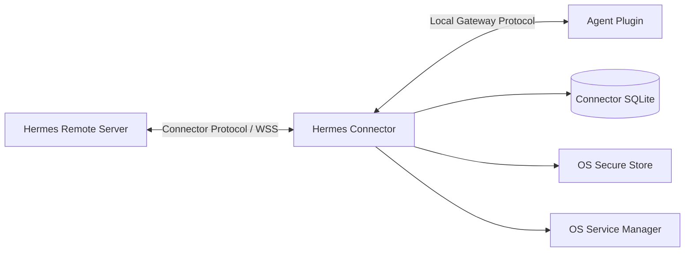

## 2. 输入、输出与事实边界

### 2.1 Cloud 输入

- Server Welcome 和运行策略；
- Command；
- Observe open/close；
- Snapshot request；
- ACK/NACK；
- Device suspend/revoke；
- Connector update policy；
- [FUTURE] Collaboration available/message/status。

### 2.2 Local 输入

- Agent Runtime Descriptor；
- Capability Descriptor；
- Observer Snapshot/Event；
- Control Snapshot/Event；
- Owner Action result；
- Agent lifecycle；
- Local Gateway Error；
- [FUTURE / SEPARATE] 只读 catalog/history record 与 cursor。

### 2.3 输出

向 Cloud：

- Hello、heartbeat、status；
- durable ACK；
- command progress/result；
- session event/snapshot；
- presence；
- capability；
- diagnostics summary；
- [FUTURE / SEPARATE] 非权威 catalog/history projection；
- [FUTURE] Collaboration send/receipt。

向 Plugin：

- capability handshake；
- observe subscription；
- control lease lifecycle；
- command RPC；
- command status；
- snapshot/reconcile。

### 2.4 事实归属

| 事实 | Connector 是否权威 | 权威方 |
|---|---|---|
| Device Private Key | 本地唯一持有者 | OS Secure Store |
| Cloud Device 状态 | 否 | Remote Server |
| 命令是否已落本机 | 是 | Connector SQLite Inbox |
| 事件是否待 Cloud ACK | 是 | Connector SQLite Outbox |
| 上下行 Cursor | 是，本地恢复用途 | Connector SQLite + Server 协商 |
| Agent Session/Action 结果 | 否 | Hermes Agent |
| Cloud Command 生命周期 | 否 | Remote Server persistence（当前 SQLite ORM，未来 PostgreSQL） |
| Control Lease | 否 | Agent Runtime/Plugin |
| Cloud Projection | 否 | Projection Service |
| Pairing 的 `workspace_id + agent_id` 绑定 | 否 | Remote Server |
| 本机 runtime 是否接通 | 否；必须实时握手 | Agent Plugin / Local Gateway |
| Catalog/history record | 否；只读、非实时 | 源 Hermes API Server，经 Plugin 规范化 |

### 2.5 只读 catalog/history lane

允许后续增加独立的只读 catalog/history lane，但它不是 Observer 或 Control 的降级
实现。Hermes API Server HTTP adapter 必须位于 Plugin 内；Connector 只通过 Local
Gateway 接收已经校验和裁剪的 catalog record，不得保存 API endpoint/key、解析原始
HTTP DTO 或绕过 Plugin 直连。

catalog lane 不接受或生成 `runtime_generation`、`runtime_session_id`、live
`running/status`、Observer `event_sequence`、Control lease 或 owner action。它不得
写入 Observer Outbox、不得发布 `session.observe`/`session.control` capability，也
不得把 `AGENT_UNAVAILABLE` 改为 `READY`。记录必须包含独立协议版本、来源、同步
cursor 和采集时间；tool call 参数、工具输出、reasoning、凭据和 token 默认丢弃。

## 3. 目标内部架构

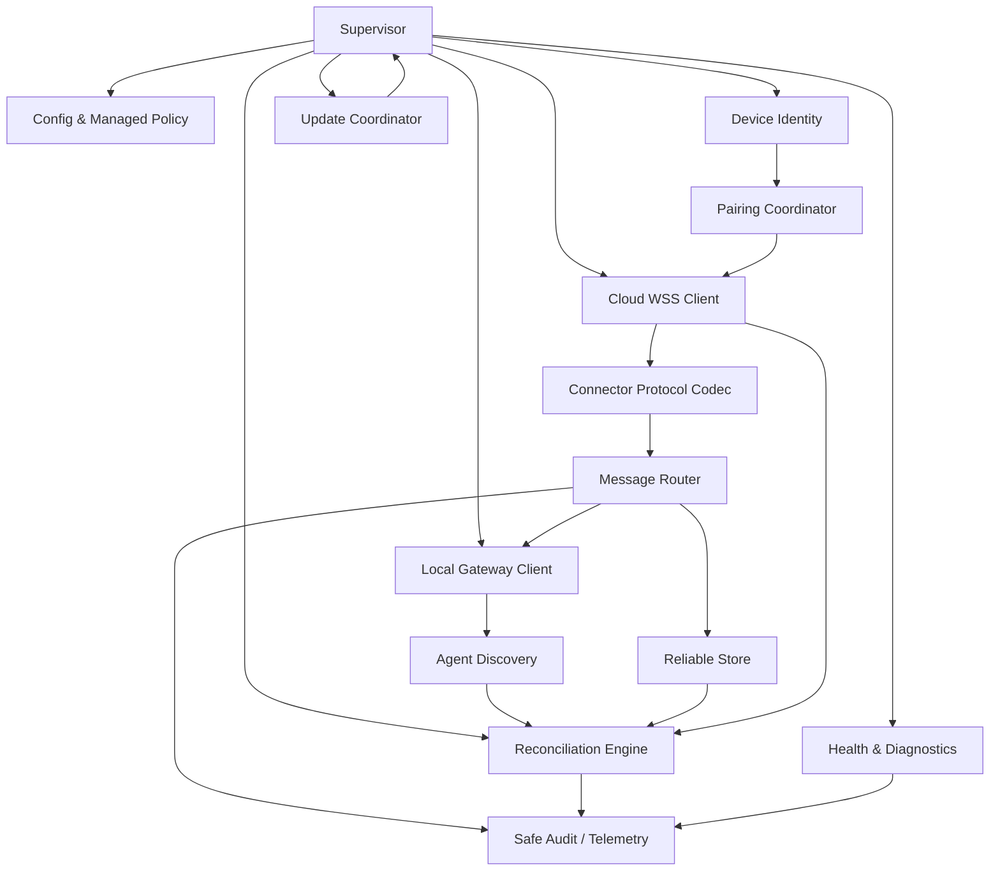

模块之间通过显式消息/接口协作。Cloud Client、Local Client 和 SQLite Writer 不得
相互直接调用私有字段。

## 4. 模块功能清单

### 4.1 Supervisor

职责：

- 进程启动和优雅退出；
- 组件依赖顺序；
- Connector 综合状态；
- fatal/degraded 分类；
- 子任务重启和退避；
- signal、service stop 和 update drain；
- 确保一次只有一个本机 Connector 主实例。

Supervisor 不解析业务 payload，也不直接操作 Device Key。

### 4.2 Config & Managed Policy

配置分层：

```text
Signed Enterprise Policy
> OS Managed Policy
> Local Admin Config
> User Preference
> Safe Default
```

管理：

- Gateway/Realm；
- Proxy 和证书策略；
- update channel；
- 日志级别/保留；
- SQLite/Outbox 水位；
- feature policy；
- pairing policy；
- data retention；
- diagnostic consent。

低层配置不能放宽高层安全策略。未知配置默认忽略并告警，非法安全配置 fail closed。

### 4.3 Device Identity

职责：

- Ed25519 Device Key 生成；
- Key ID 和公钥读取；
- Challenge 签名；
- OS Secure Store；
- device active/suspended/revoked/retired；
- key rotation；
- Connector 实例与设备身份分离。

安全存储不可用时只允许未配对诊断，不落明文私钥。

### 4.4 Pairing Coordinator

职责：

- 生成短期一次性配对会话；
- 展示 QR/Code 和 Device Fingerprint；
- 轮询/接收确认；
- 完成 Challenge；
- 获取短期连接令牌；
- 处理过期、拒绝、租户策略和重复绑定；
- 配对完成后清除一次性材料。

Authenticated owner 必须显式选择授权的 `workspace_id + agent_id`。配对码本身不能
授权设备控制；配对成功也不能证明该 `agent_id` 当前对应的 Hermes runtime 已启动或
已通过 Local Gateway handshake。

### 4.5 Cloud WSS Client

职责：

- TLS 443 出站连接；
- hello/welcome；
- token refresh；
- heartbeat；
- inflight window；
- frame limit；
- compression policy；
- ACK/NACK；
- resume cursor；
- exponential backoff + jitter；
- proxy 和网络变化；
- Gateway drain/reconnect。

Cloud Client 只认识 Connector Protocol，不认识 NATS、数据库表或云产品。

### 4.6 Connector Protocol Codec

职责：

- Schema 和版本校验；
- canonical JSON；
- payload digest；
- message/type/field limits；
- expiry/issued time；
- signature/session integrity；
- unknown field compatibility；
- sensitive field policy；
- safe error mapping。

Codec 输出不可变领域消息，Router 不接触原始未验证 JSON。

### 4.7 Message Router

职责：

- Cloud command → Inbox → Local RPC；
- Local event/result → Outbox → Cloud；
- durable/live 分流；
- message correlation；
- priority 和 TTL；
- per-Agent/session ordering；
- backpressure；
- capability/feature gating；
- 禁止未知业务类型落入通用执行器。

### 4.8 Reliable Store

SQLite 由单写者事务队列管理：

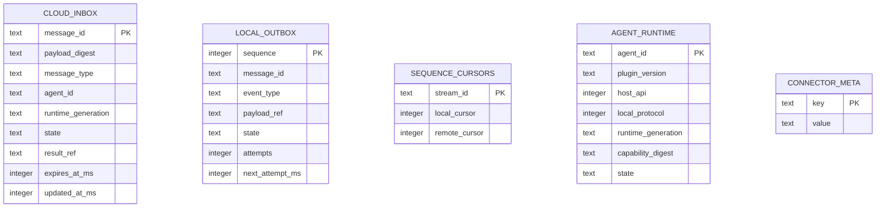

实现要求：

- 业务读取、写入和 migration 使用 SQLAlchemy ORM 或 typed migration operations；
- 仅集中式连接策略可以执行固定、已测试的 SQLite PRAGMA，Repository、Application、
  migration 和部署脚本不得使用 raw SQL；
- WAL；
- 外键和唯一约束；
- 事务内状态转换；
- schema version；
- expand/migrate/contract；
- 启动 integrity check；
- 有界正文和外部 payload reference；
- 备份不是常规恢复手段，Server/Agent 对账才是；
- 数据库损坏时隔离原文件，禁止清空后盲目重放。

### 4.9 Agent Discovery

职责：

- 通过 Agent Host 定义的 Registry/API 发现 endpoint；
- 不扫描随机端口或读取 SessionDB；
- 校验路径、PID、instance ID、owner 和权限；
- 区分 Profile 和多个 Agent；
- 过滤旧/死 endpoint；
- 监听 Agent 启停或有界轮询；
- 返回候选 endpoint，不决定最终 Session owner。

### 4.10 Local Gateway Client

职责：

- UDS/Named Pipe 连接；
- capability handshake；
- Observer/Control 分离连接；
- immutable claims attach；
- RPC correlation 和 timeout；
- event stream；
- transport cleanup；
- Local error → Connector domain error；
- 不在重连时自动重放 `UNKNOWN` command。

### 4.11 Reconciliation Engine

触发条件：

- Connector 启动；
- Cloud 重连；
- Agent/Plugin 重连；
- runtime generation 变化；
- sequence gap；
- Outbox ACK 超时；
- command `EXECUTING/UNKNOWN`；
- update/rollback 完成。

职责：

- 比较 Cloud、本地 SQLite、Plugin 和 Agent 状态；
- 获取 authoritative snapshot；
- 对 `DELIVERED/EXECUTING/UNKNOWN` 查询；
- 恢复上下行 cursor；
- 关闭过期命令；
- 使旧 generation 工作失效；
- 生成 reconciliation report。

### 4.12 Update Coordinator

职责：

- 获取签名 Release Manifest；
- 下载 Connector 与 Plugin 兼容发布集合；
- 校验签名、摘要和 SBOM；
- staging/inactive slot；
- 请求 Agent Extension Manager 安装/激活 Plugin；
- Connector 自身切槽；
- Local/Cloud health；
- 自动回滚；
- 强制安全更新和用户可见原因。

Updater 不直接写 Agent Extension Store 的 active pointer。

### 4.13 Health & Diagnostics

统一状态：

- Connector service；
- Cloud；
- Device；
- Agent；
- Plugin；
- Local Protocol；
- SQLite；
- Queue；
- Version Compatibility；
- Update；
- Data pressure。

Repair 只修复 Connector/Plugin 制品和注册，不删除 Agent 会话或整个
`HERMES_HOME`。

### 4.14 Safe Audit & Telemetry

记录：

- version/capability；
- connection/reconnect；
- pairing/revoke；
- message state；
- queue/latency；
- reconciliation；
- update/rollback；
- error code。

默认不记录 prompt、secret、lease、完整 approval、文件或工具正文。

## 5. Connector 综合状态机

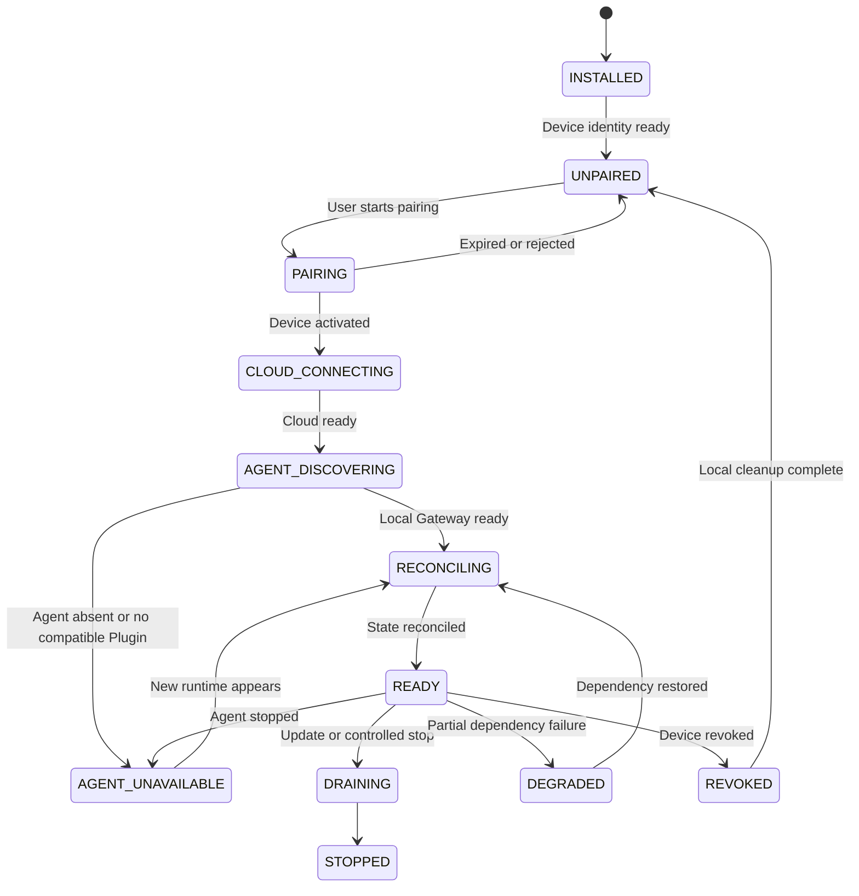

综合状态必须保留 pairing、Cloud connection 和 Agent attachment 三个正交子状态，
不能仅输出 `online/offline`。设备可以已配对且 Cloud 在线，同时保持
`AGENT_UNAVAILABLE`；不得把 paired 映射为 Agent ready。

## 6. 一次安装和启动逻辑

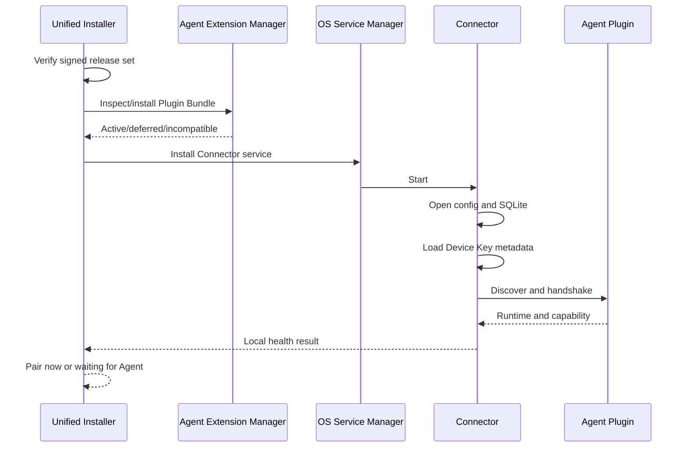

启动依赖顺序：

1. 进程单实例锁；
2. 配置和管理策略；
3. SQLite migration/integrity；
4. Device Identity；
5. Local discovery 与 Cloud connection 可并行；
6. 双侧 ready 后 reconciliation；
7. 只有完成对账才进入 `READY`。

## 7. 配对功能逻辑

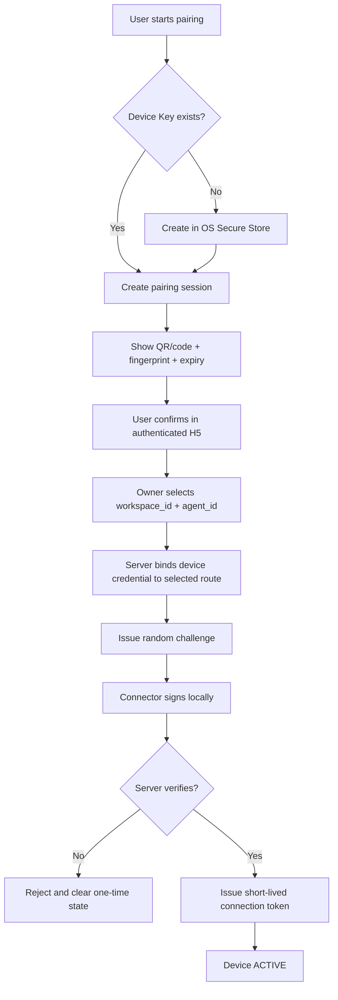

`agent_id` 来自同一 Cloud Agent catalog。A/B 切换是 owner 选择不同 `agent_id` 的
数据操作，仍使用同一 pairing、token、Gateway 和 Local Gateway 实现；没有 A/B
专用代码。`ACTIVE` 仅表示设备授权状态，后续仍需独立 Agent discovery/handshake。

## 8. Cloud 连接逻辑

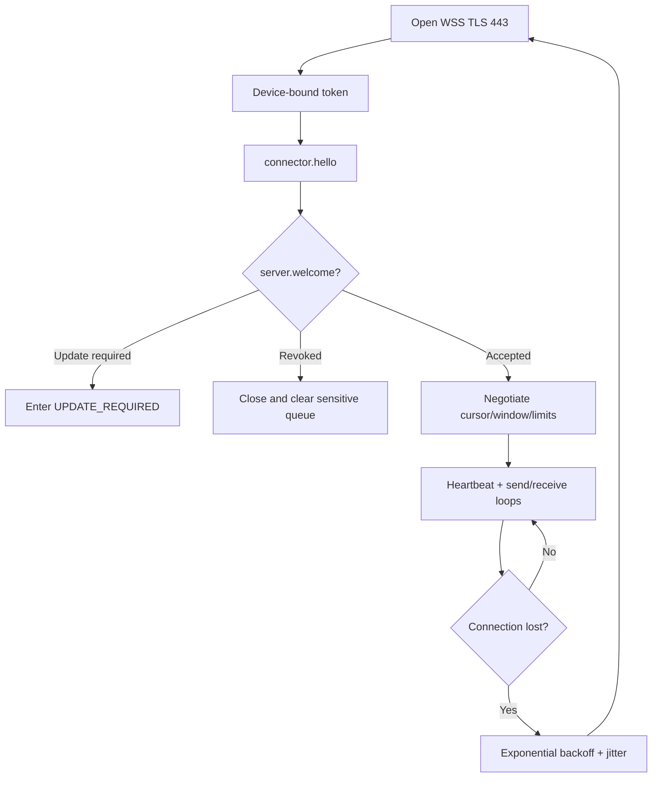

连接重建不等于业务命令重试；命令必须根据 Inbox/Command Fact 决策。

## 9. Cloud 命令下行逻辑

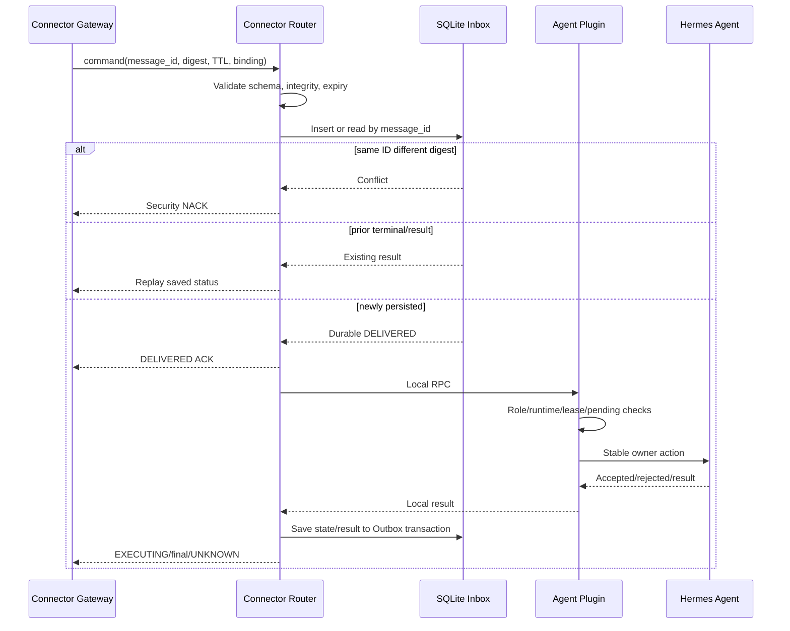

关键顺序：先写 Inbox，再报告 `DELIVERED`；先写 Outbox，再发送结果。

## 10. Agent 事件上行逻辑

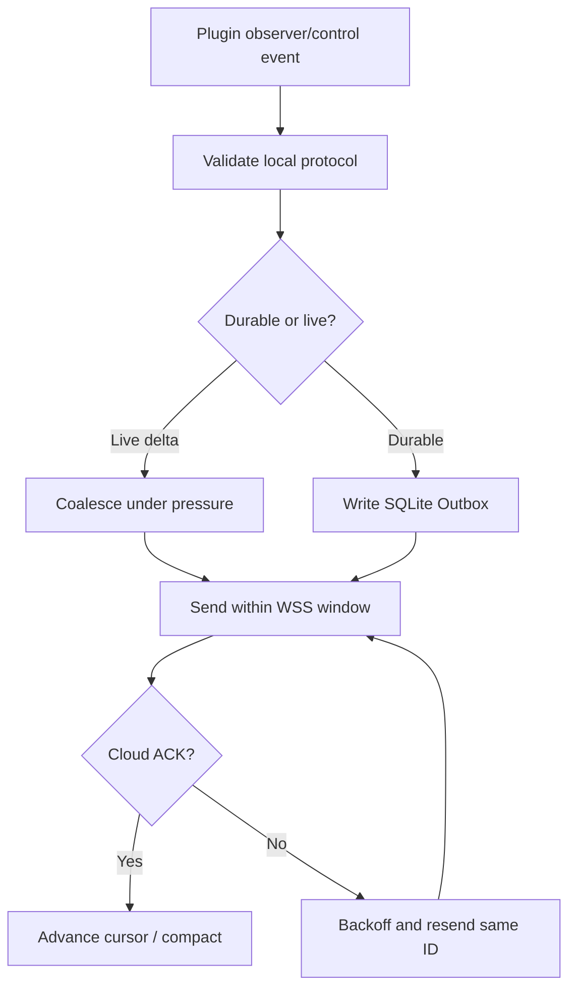

文本/推理 delta 可以合并并通过快照恢复；命令状态、生命周期、审批和安全事件不得
静默丢弃。

## 11. Agent 发现逻辑

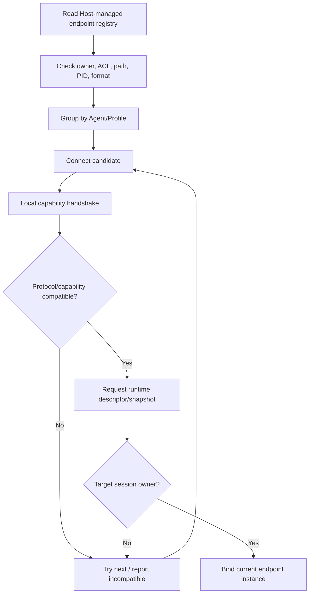

候选列表每次调用有界快照，避免 endpoint 不断变化造成无限重试。

## 12. 重连与对账逻辑

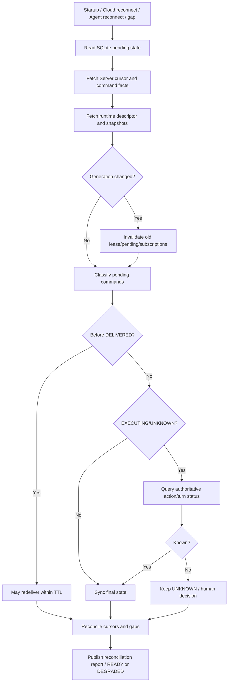

## 13. 更新逻辑

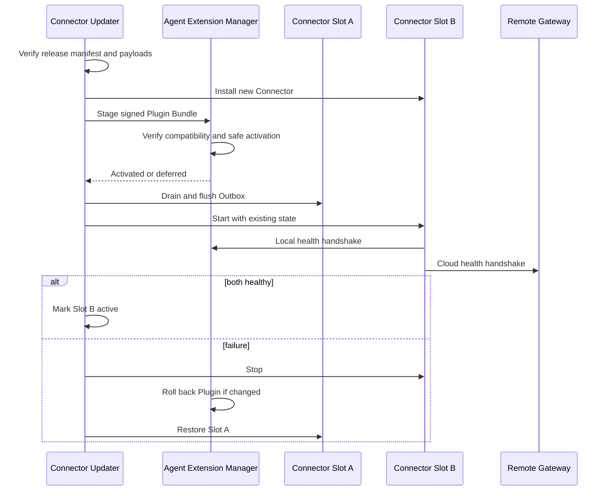

## 14. 功能设定清单

### 14.1 Target v1

- 独立 OS service；
- 单实例 Supervisor；
- 分层配置；
- Device Identity；
- pairing/challenge/token；
- Cloud WSS；
- Connector Protocol codec；
- Agent discovery；
- Local Gateway client；
- SQLite Inbox/Outbox/Cursor；
- message routing；
- command status；
- Observer event/snapshot；
- reconciliation；
- update/rollback；
- health/repair/diagnostics；
- safe telemetry；
- proxy/enterprise network；
- macOS/Windows/Linux 安装。

### 14.2 Future

- Collaboration WSS 消息；
- Bootstrap Manifest attestation；
- 企业 Policy 签名快照；
- 离线私有化 license/update；
- 多 Agent 路由；
- 受控大文件 reference 协调；
- 高敏 E2EE 临时通道。

### 14.3 Prohibited

- 读取 SessionDB；
- import Agent 私有模块；
- 替换 owner transport；
- 运行模型或具体 Skill；
- 保存模型密钥；
- 自行决定 Tenant/业务权限；
- 直连 NATS、Redis、PostgreSQL、OSS、KMS；
- 把内存队列当持久交付；
- 自动重试 `UNKNOWN`；
- 在日志记录正文、Lease、Secret；
- 修改 Agent 安装包或 venv。

## 15. 状态与用户展示

Connector 对 UI 输出结构化状态：

```json
{
  "connector": "ready",
  "cloud": "connected",
  "device": "active",
  "agent": "ready",
  "plugin": "ready",
  "runtime_generation": "run_01...",
  "capabilities": ["session.observe.v1", "session.control.v1"],
  "queue": {
    "inbox_pending": 0,
    "outbox_pending": 2,
    "oldest_age_ms": 412
  },
  "compatibility": "supported",
  "action_required": null
}
```

用户状态必须给出可执行下一步：

- 等待 Agent；
- 启动 Agent；
- 安装/启用 Plugin；
- 更新 Connector；
- 重新配对；
- 修复本地状态；
- 联系管理员解除策略阻断。

## 16. 性能与资源边界

- 空闲 Connector 常驻内存和 CPU 设预算并持续回归；
- SQLite 单写者、读快照；
- 每连接 inflight window；
- durable/live 独立队列；
- Outbox 有磁盘水位和拒绝新 durable command 的安全阈值；
- 重连使用 jitter；
- 每 Agent/Session 有公平队列；
- 单消息、附件引用和批量上限；
- 不在 event loop 执行阻塞文件/加密操作；
- 诊断采样不能丢命令终态和安全拒绝。

## 17. 错误与降级

| 故障 | Connector 状态 | 行为 |
|---|---|---|
| Agent 未安装 | `WAITING_FOR_AGENT` | Cloud/设置可用，等待 |
| Plugin 缺失 | `AGENT_UNAVAILABLE` | 提供安装/Repair |
| Local protocol 不兼容 | `DEGRADED` | 禁止控制，保留诊断 |
| Cloud 断线 | `CLOUD_CONNECTING` | SQLite 保留待发，退避重连 |
| Device revoked | `REVOKED` | 关闭连接，清敏感队列 |
| SQLite 磁盘满 | `DEGRADED` | 停收 durable command |
| SQLite 损坏 | `DEGRADED` | 隔离、只读诊断、对账 |
| Agent generation changed | `RECONCILING` | 旧控制失效 |
| Update incompatible | `UPDATE_REQUIRED` | 停业务流，保留修复通道 |
| Command outcome unknown | Command=`UNKNOWN` | 查询/人工，不重做 |

## 18. 测试与验收

### 单元

- state machine；
- config precedence；
- codec/digest/expiry；
- SQLite transitions/migrations；
- retry/backoff/jitter；
- capability gating；
- error mapping。

### 契约

- Connector Protocol Schema/Fixture；
- Local Gateway Schema/Fixture；
- unknown fields/types；
- payload limits；
- Python/Kotlin/TypeScript compatibility。

### 集成

- one-click installer；
- Extension Manager；
- Cloud Gateway simulator；
- real Plugin/Agent；
- pairing/revoke；
- proxy/network changes；
- update/rollback。

### 故障注入

- SQLite 写前/写后；
- Local RPC 前/执行边界后；
- Outbox 写后/Cloud ACK 前；
- Agent/Connector/Gateway 随机终止；
- network partition、clock skew、disk full；
- old generation、duplicate delivery、digest conflict。

### 完成条件

- 一次安装完成 Plugin + Connector；
- Connector/Plugin 故障不影响 Agent 本地使用；
- 已持久命令不丢；
- 重复投递不产生重复业务效果；
- `UNKNOWN` 不自动重试；
- Agent 更新后自动对账；
- Device revoke 及时生效；
- 签名更新和回滚通过；
- 10,000 在线和重连风暴容量门禁通过。
