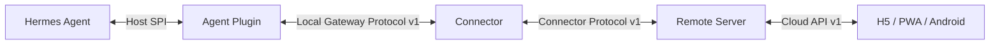

# 11 Local Gateway 与 Connector 数据协议

- 状态：规范性协议设计
- 基线版本：1.0
- 更新日期：2026-07-30
- 编码：UTF-8 JSON

## 1. 协议权威边界



本规范详细定义中间两层：

- Local Gateway Protocol v1：Plugin ↔ Connector；
- Connector Protocol v1：Connector ↔ Remote Server。

Host SPI 和 Cloud API 只作为相邻边界引用，不在本文定义。

## 2. 全局协议原则

1. 协议版本与产品版本分离。
2. 同一 Major 只允许增加可选字段、消息类型和 capability。
3. 未知顶层字段和未知消息类型显式拒绝；可忽略的前向扩展只能进入受命名空间约束的
   `extensions`，且不得改变核心字段语义。
4. 所有 ID 是不透明字符串，不允许互相推导。
5. 枚举未知值不得映射为默认高权限行为。
6. 时间使用 UTC RFC 3339；本地 lease epoch 可使用毫秒整数。
7. 外部输入必须限制帧、字符串、数组和嵌套深度。
8. `null`、字段缺失和空字符串具有不同语义。
9. Payload 在签名/摘要前使用规范化 JSON。
10. 协议保留名称不代表 capability 已开放。
11. Server 注入的 Tenant/Realm 上下文不能由 Connector 自报覆盖。
12. 每个协议错误包含稳定 machine reason，UI 不解析自然语言 message。
13. JSON 对象成员名不得重复；Decoder 必须在 Schema 和业务校验前拒绝重复键，
    禁止采用 first-wins 或 last-wins。

## 3. ID 与作用域模型

| 字段 | 含义 | 生成方 | 是否跨重启稳定 |
|---|---|---|---|
| `device_id` | Connector 设备 | Server | 是 |
| `agent_id` | Agent 安装/身份 | Agent/Server 注册 | 是 |
| `session_key` | 会话谱系根 | Agent | 是 |
| `runtime_session_id` | 当前运行会话 | Agent | 否 |
| `runtime_generation` | Agent 运行代次 | Agent | 否 |
| `client_instance_id` | H5/移动端实例 | Client | 是，安装范围 |
| `transport_id` | 本地 Control 连接 | Plugin | 否 |
| `lease_id` | 当前 Control Lease | Plugin | 否、秘密 |
| `message_id` | 传输消息 | 发送方 | 是，幂等窗口 |
| `command_id` | Cloud 命令事实 | Server | 是 |
| `client_request_id` | Client mutation 幂等 | Client | 是，幂等窗口 |
| `client_turn_id` | Prompt 用户轮次 | Client | 是 |
| `server_turn_id` | Agent 接受后的轮次 | Agent | 是 |
| `event_sequence` | Runtime Session 事件顺序 | Agent/Plugin | 当前 generation |
| `stream_cursor` | Connector 方向流游标 | Server/Connector | 是 |
| `control_revision` | Control/Pending 状态版本 | Plugin | 当前 runtime |

禁止：

- 用 `runtime_session_id` 替代 `session_key`；
- 从 PID 推导 `agent_id`；
- 用 WebSocket connection ID 替代 Device ID；
- 将旧 generation 的 Lease 带到新 generation；
- 把 `message_id` 当业务 `command_id`。

## 4. 数据敏感性元规则

每个字段在 Schema 中声明：

```text
classification
persist
log
trace
redaction
max_length
```

建议枚举：

| 分类 | 持久化 | 日志 | 示例 |
|---|---|---|---|
| `public_metadata` | 允许 | 允许 | protocol version |
| `internal_identifier` | 允许 | 受控/哈希 | agent/message ID |
| `business_content` | 按保留策略 | 默认禁止 | prompt、event text |
| `credential` | OS/KMS 专用 | 禁止 | token、device private key |
| `ephemeral_secret` | 仅内存 | 禁止 | sudo、secret input |
| `security_evidence` | 审计存储 | 受限 | revoke、digest conflict |

## 5. Local Gateway Protocol v1

### 5.1 传输

- macOS/Linux：UDS；
- Windows：Named Pipe；
- 应用帧：JSON-RPC 2.0；
- 每个逻辑连接角色固定为 Observer 或 Control；
- Local Protocol 不依赖 HTTP Cookie、Cloud Token 或 NATS；
- Connector 与 Plugin 在同一 OS 用户/服务账户安全边界。

目标限制基线：

| 限制 | 建议值 |
|---|---:|
| 单帧编码后 | 256 KiB |
| JSON 嵌套深度 | 32 |
| 单字符串 | 128 KiB |
| 单连接 pending RPC | 64 |
| 单 Observer transport active + in-flight subscription | 64 |
| 单 Plugin Observer controller active + in-flight subscription | 1024 |
| RPC 默认超时 | 3 秒 |
| Control owner action 并发 | 8 |

正式值由握手 capability、Schema 或 Host adapter 的公开资源预算常量固定，不能由调用方任意
扩大。

### 5.2 Endpoint Registry

```json
{
  "version": 1,
  "pid": 12345,
  "profile": "default",
  "socket_path": "/private/runtime/c-12345-a1b2c3d4.sock",
  "instance_id": "a1b2c3d4..."
}
```

规则：

- Registry 目录仅当前用户；
- 文件和 Socket 等价 `0600`；
- 通过临时文件 + fsync + atomic replace 发布；
- 路径必须位于 Host 规定目录；
- PID 失效或 Socket 不存在时清理；
- 禁止字段：`token`、`credential`、`lease_id`、`ws_url`、`session_content`。

### 5.3 Ready Event

Observer：

```json
{
  "jsonrpc": "2.0",
  "method": "event",
  "params": {
    "type": "gateway.ready",
    "payload": {
      "local_gateway_protocol": 1,
      "observer_contract": 1,
      "connection_role": "observer",
      "profile": "default",
      "runtime_generation": "<runtime-generation>",
      "instance_id": "<canonical-uuid>"
    }
  }
}
```

协商 output-parity v2 时，Observer ready 不复用上述 v1 身份字段，payload 必须精确为：

```json
{
  "observer_contract": 2,
  "connection_role": "observer"
}
```

Control 在 attach 成功后返回：

```json
{
  "jsonrpc": "2.0",
  "id": "attach-1",
  "result": {
    "attached": true,
    "connection_role": "control",
    "control_contract": 1,
    "local_gateway_protocol": 1
  }
}
```

### 5.4 Runtime Descriptor

目标方法：

```text
gateway.runtime.describe
```

结果：

```json
{
  "agent_id": "agt_01...",
  "agent_version": "0.20.0",
  "plugin_id": "hermes-connector-bridge",
  "plugin_version": "1.0.0",
  "host_api": 1,
  "local_gateway_protocol": 1,
  "runtime_generation": "run_01...",
  "profile": "default",
  "state": "ready",
  "capabilities": {
    "session.observe": 1,
    "session.control": 1,
    "prompt.submit": 1,
    "session.interrupt": 1,
    "session.steer": 1,
    "approval.respond": 1,
    "clarify.respond": 1,
    "sensitive_input_e2ee": 0
  }
}
```

### 5.5 Observer Subscribe

请求：

```json
{
  "jsonrpc": "2.0",
  "id": "obs-1",
  "method": "session.observe.subscribe",
  "params": {
    "session_key": "durable-root-1",
    "profile": "default",
    "runtime_session_id": "optional-runtime-id"
  }
}
```

结果：

```json
{
  "jsonrpc": "2.0",
  "id": "obs-1",
  "result": {
    "subscription_id": "sub-local-1",
    "session_key": "durable-root-1",
    "runtime_session_id": "runtime-7",
    "runtime_generation": "run_01...",
    "snapshot_sequence": 104,
    "snapshot": {}
  }
}
```

`subscription_id` 只在当前 Connector transport 有效。

### 5.6 Observer Event

```json
{
  "jsonrpc": "2.0",
  "method": "event",
  "params": {
    "type": "session.event",
    "payload": {
      "subscription_id": "sub-local-1",
      "session_key": "durable-root-1",
      "runtime_session_id": "runtime-7",
      "runtime_generation": "run_01...",
      "event_sequence": 105,
      "event_type": "assistant.delta",
      "content": {}
    }
  }
}
```

Connector 检测：

```text
(runtime_generation, runtime_session_id, event_sequence)
```

缺口时请求快照，不能填补猜测内容。

### 5.7 Observer Unsubscribe

```json
{
  "jsonrpc": "2.0",
  "id": "obs-2",
  "method": "session.observe.unsubscribe",
  "params": {
    "subscription_id": "sub-local-1"
  }
}
```

只有创建该 subscription 的 transport 可以取消。

## 6. Local Control Protocol

### 6.1 Attach

```json
{
  "jsonrpc": "2.0",
  "id": "attach-1",
  "method": "relay.control.attach",
  "params": {
    "claims": {
      "user_id": "usr_01...",
      "provider": "hermes-cloud",
      "connection_role": "control",
      "client_instance_id": "11111111-1111-4111-8111-111111111111",
      "session_key": "durable-root-1",
      "profile": "default"
    }
  }
}
```

Claims 在连接生命周期不可变。`client_instance_id` 使用规范小写连字符 UUID。
Tenant/Device 等 Cloud 事实由 Connector 的已认证进程和 Server 审计关联，不作为
Plugin 自行信任的用户输入。

### 6.2 Acquire

请求：

```json
{
  "jsonrpc": "2.0",
  "id": "ctl-1",
  "method": "session.control.acquire",
  "params": {
    "session_key": "durable-root-1",
    "profile": "default",
    "runtime_session_id": "runtime-7",
    "client_instance_id": "11111111-1111-4111-8111-111111111111"
  }
}
```

结果：

```json
{
  "jsonrpc": "2.0",
  "id": "ctl-1",
  "result": {
    "lease_id": "opaque-secret",
    "expires_at_epoch_ms": 1785400000000,
    "control_revision": 3,
    "controller_kind": "mobile",
    "controller_label": "Hermes Mobile",
    "pending_input": null
  }
}
```

Lease 只返回给已认证 Control transport，不进入日志、诊断或 Observer。

### 6.3 Renew / Release / Status

共同 Scope：

```json
{
  "session_key": "durable-root-1",
  "profile": "default",
  "runtime_session_id": "runtime-7",
  "lease_id": "opaque-secret"
}
```

`status` 不返回可复用 Lease：

```json
{
  "controller_kind": "mobile",
  "controller_label": "Hermes Mobile",
  "control_revision": 4,
  "lease_expires_at_epoch_ms": 1785400000000,
  "pending_input": null
}
```

### 6.4 Mutation Common Scope

```json
{
  "session_key": "durable-root-1",
  "runtime_session_id": "runtime-7",
  "runtime_generation": "run_01...",
  "lease_id": "opaque-secret",
  "client_request_id": "req-client-01"
}
```

本地幂等身份：

```text
(session_key, authenticated principal, method, client_request_id)
```

### 6.5 Prompt Submit

```json
{
  "jsonrpc": "2.0",
  "id": "cmd-1",
  "method": "prompt.submit",
  "params": {
    "session_key": "durable-root-1",
    "runtime_session_id": "runtime-7",
    "runtime_generation": "run_01...",
    "lease_id": "opaque-secret",
    "client_request_id": "req-client-01",
    "client_turn_id": "turn-client-01",
    "text": "请继续整理本次会议事项"
  }
}
```

结果：

```json
{
  "status": "accepted",
  "client_request_id": "req-client-01",
  "client_turn_id": "turn-client-01",
  "server_turn_id": "turn-server-09"
}
```

`accepted` 表示 Agent 已接受，不表示任务完成。

### 6.6 Interrupt

```json
{
  "method": "session.interrupt",
  "params": {
    "session_key": "durable-root-1",
    "runtime_session_id": "runtime-7",
    "runtime_generation": "run_01...",
    "lease_id": "opaque-secret",
    "client_request_id": "req-client-02"
  }
}
```

Interrupt 不离线排队，目标执行已变化时拒绝。

### 6.7 Steer

```json
{
  "method": "session.steer",
  "params": {
    "session_key": "durable-root-1",
    "runtime_session_id": "runtime-7",
    "runtime_generation": "run_01...",
    "lease_id": "opaque-secret",
    "client_request_id": "req-client-03",
    "text": "优先处理合同风险部分"
  }
}
```

Steer 影响当前执行，不创建 `client_turn_id`，不进入忙时 Prompt Queue。

### 6.8 Approval Respond

```json
{
  "method": "approval.respond",
  "params": {
    "session_key": "durable-root-1",
    "runtime_session_id": "runtime-7",
    "runtime_generation": "run_01...",
    "lease_id": "opaque-secret",
    "client_request_id": "req-client-04",
    "request_id": "approval-07",
    "control_revision": 12,
    "choice": "allow_once"
  }
}
```

`choice` 必须在精确 Pending Snapshot 中存在。

### 6.9 Clarify Respond

二选一：

```json
{
  "request_id": "clarify-08",
  "control_revision": 13,
  "choice_id": "choice-2"
}
```

或在 `allow_other=true` 时：

```json
{
  "request_id": "clarify-08",
  "control_revision": 13,
  "other_text": "使用第二季度已确认口径"
}
```

不能同时发送 `choice_id` 和 `other_text`。

### 6.10 Command Status

```json
{
  "method": "session.command.status",
  "params": {
    "session_key": "durable-root-1",
    "client_request_id": "req-client-01",
    "method": "prompt.submit"
  }
}
```

同一 principal/client/session 可以在 Lease 失效后查询，但不能因此重新执行。

## 7. Local Error Range

| Code | Reason | 语义 |
|---:|---|---|
| 4200 | `control_role_required` | 需要 Control 角色 |
| 4201 | `control_contract_unsupported` | Control 协议不支持 |
| 4202 | `live_runtime_unavailable` | 当前 Runtime 不可用 |
| 4203 | `controller_conflict` | 其他 Controller 持有 Lease |
| 4204 | `lease_required` | 缺少 Lease |
| 4205 | `lease_expired` | Lease 已过期 |
| 4206 | `lease_mismatch` | Lease/身份/transport 不匹配 |
| 4207 | `request_id_payload_conflict` | 同 ID 不同 payload |
| 4208 | `pending_request_conflict` | Pending 已处理/过期 |
| 4209 | `method_not_allowed` | 方法未开放 |
| 4210 | `command_unknown` | 状态不可确定 |
| 4211 | `revision_conflict` | Revision 冲突 |
| 4212 | `session_binding_mismatch` | Session/Runtime/Profile 不匹配 |
| 4213 | `invalid_pending_response` | Pending 响应非法 |
| 4214 | `owner_adapter_unavailable` | Host Adapter 不存在 |
| 4215–4219 | Reserved | 不得未更新契约使用 |

目标错误结构：

```json
{
  "jsonrpc": "2.0",
  "id": "cmd-1",
  "error": {
    "code": 4212,
    "message": "session binding mismatch",
    "data": {
      "reason": "session_binding_mismatch",
      "retryable": false,
      "trace_id": "trc_01..."
    }
  }
}
```

## 8. Connector Protocol v1

### 8.1 传输

- WSS/TLS 443；
- Connector 主动出站；
- Device-bound short-lived token；
- UTF-8 JSON；
- Cloud Envelope 最大 262144 bytes，严格拒绝非法 UTF-8、重复 key 和未知字段；
- `connector.welcome` 决定 heartbeat interval、`max_in_flight` 和 resume；
- Tenant/Device 必须与认证连接上下文一致。

### 8.2 Hello

Hello 必须包在根 `contracts/schemas/cloud/connector-envelope-v1.schema.json`
定义的 Cloud Envelope 中：

```json
{
  "contract_version": 1,
  "message_id": "22222222-2222-4222-8222-222222222222",
  "message_type": "connector.hello",
  "tenant_id": "tenant-test",
  "device_id": "device-test",
  "sequence": 0,
  "sent_at": "2026-07-30T00:00:00Z",
  "payload": {
    "connector_instance_id": "11111111-1111-4111-8111-111111111111",
    "connector_version": "1.0.0",
    "runtime_generation": "runtime-20260730-01",
    "required_capabilities": [
      "session.observe"
    ],
    "optional_capabilities": [
      "session.control",
      "view.card"
    ],
    "resume": {
      "mode": "fresh",
      "next_outbound_sequence": 0,
      "next_inbound_sequence": 0
    }
  }
}
```

恢复连接时 `resume.mode` 为 `resume`，并且必须携带 durable
`previous_connection_id`。`next_outbound_sequence` 和
`next_inbound_sequence` 始终来自 Connector SQLite checkpoint。当前 Schema
没有 `agent_state`、`agent_id`、`device_key_id`、平台或 Host API 字段，消费者
不得自行加入。

### 8.3 Welcome

```json
{
  "contract_version": 1,
  "message_id": "33333333-3333-4333-8333-333333333333",
  "message_type": "connector.welcome",
  "tenant_id": "tenant-test",
  "device_id": "device-test",
  "sequence": 0,
  "sent_at": "2026-07-30T12:00:00Z",
  "payload": {
    "connection_id": "44444444-4444-4444-8444-444444444444",
    "server_generation": "cloud-20260730-01",
    "server_time": "2026-07-30T12:00:00Z",
    "accepted_capabilities": [
      "session.observe",
      "view.card"
    ],
    "unavailable_optional_capabilities": [
      "session.control"
    ],
    "resume_decision": "fresh",
    "next_connector_sequence": 0,
    "next_cloud_sequence": 0,
    "heartbeat_interval_ms": 20000,
    "max_in_flight": 64
  }
}
```

`connector.welcome` 对 connection ID、heartbeat、window 和 resume decision
具有权威性。`reset_required` 进入 durable reconciliation，不能触发命令重试、
授权结论或业务成功。它只表示同一 Connector instance/runtime epoch 内的权威
cursor rewind，并返回 Cloud durable pair；当该 pair 落后时，Connector 必须重放
截至本地 checkpoint 的 durable pending/ACKed/NACKed frame，包括 sequence 0。
`fresh` 只表示新 epoch `(0, 0)`，不得重放旧 epoch settled frame。只有合法的初始
`fresh (0, 0)` hello/welcome 计入新 epoch；resume 或非零 fresh 被切换到新 epoch 时，
旧 epoch 握手不计入，新 epoch 首个 active frame 从 sequence 0 开始。

### 8.4 Heartbeat 与 durable cursor

`connector.heartbeat` 由 Connector 和 Cloud 双向使用，通过 `sender_role` 区分
发送方。它交换双方下一条期望 sequence，但不是 durable ACK、授权结论、审计记录
或命令执行证明。Connector 对 hello、heartbeat、replay 和未来业务帧使用同一个
outbound sequencer，在一个异步临界区内完成 checkpoint 读取、编码、发送和 CAS；
发送失败不得推进 durable cursor。

## 9. Connector 通用消息信封

```json
{
  "contract_version": 1,
  "message_id": "55555555-5555-4555-8555-555555555555",
  "message_type": "connector.heartbeat",
  "tenant_id": "tenant-test",
  "device_id": "device-test",
  "sequence": 1,
  "sent_at": "2026-07-30T12:00:20Z",
  "payload": {}
}
```

字段规则：

| 字段 | 必须 | 规则 |
|---|---|---|
| `contract_version` | 是 | 当前固定为 1 |
| `message_id` | 是 | canonical UUID，不复用 |
| `message_type` | 是 | 根 catalog allowlist |
| `tenant_id` | 是 | 与认证连接上下文一致 |
| `device_id` | 是 | 与认证连接上下文一致 |
| `sequence` | 是 | 方向内非负 durable cursor |
| `sent_at` | 是 | UTC RFC 3339，必须以 `Z` 结束 |
| `traceparent` | 否 | W3C 固定格式，不包含秘密 |
| `idempotency_key` | 否 | 1..128 字符；仅在有 payload 契约时使用 |
| `payload` | 是 | 必须由该 message type 的 payload Schema 约束 |
| `extensions` | 否 | 反向域名命名空间，不能改变核心语义 |

## 10. Connector 消息类型

根 `contracts/message-types-v1.json` 当前只允许以下类型：

| message type | 状态 | 当前 effect |
|---|---|---|
| `connector.hello` | available | session negotiation |
| `connector.welcome` | available | session negotiation |
| `connector.heartbeat` | available | liveness/cursor observation |
| `command.deliver` | available | command persist and dispatch |
| `command.receipt` | available | durable delivery receipt |
| `command.result` | available | durable terminal result |
| `file.transfer` | reserved | none |
| `a2a.message` | reserved | none |
| `view.card.invalidate` | reserved | none |

其余 Reserved 类型没有可执行 payload contract，不得触发 persistence、routing、
rendering、authorization 或其他业务 effect。`drain`、`revoked`、
`update_required` 当前只存在于 Connector 的本地 directive；Server signal wire
mapping 尚待根 contract 冻结，不得发明 `server.*` message 或私有关闭码。

第 11、12、16、17 节中标明的 command lane 规则已经由根 catalog 与 payload
Schema 冻结。第 13 至 15、19、20 节仍是后续业务协议设计输入。Connector 当前只
完成本地持久状态机与 Plugin UDS 执行端口；Cloud command router 与 receipt/result
ACK 尚未落地，因此待发消息必须留在 SQLite，不能据此声明 Cloud 业务闭环完成。

## 11. Command Payload（v1 冻结）

下行命令示例：

```json
{
  "command_id": "aaaaaaaa-aaaa-4aaa-8aaa-aaaaaaaaaaaa",
  "connector_instance_id": "bbbbbbbb-bbbb-4bbb-8bbb-bbbbbbbbbbbb",
  "client_instance_id": "cccccccc-cccc-4ccc-8ccc-cccccccccccc",
  "session_key": "durable-root-1",
  "profile": "default",
  "client_request_id": "req-client-01",
  "method": "prompt.submit",
  "params": {
    "runtime_session_id": "runtime-7",
    "runtime_generation": "run-7",
    "client_turn_id": "turn-client-01",
    "text": "请生成今日项目进展摘要"
  },
  "issued_at": "2026-07-30T08:00:00Z",
  "expires_at": "2026-07-30T08:05:00Z",
  "revision": 1
}
```

`command.deliver` 只开放 `prompt.submit` 与 `session.interrupt`。两者都要求
`runtime_session_id` 与 `runtime_generation`；前者额外要求 `client_turn_id` 和
`text`。所有对象拒绝未知字段，三个 ID 使用 canonical UUID，时间使用 UTC。
Connector 必须在写 SQLite 前验证 Envelope tenant/device、目标
connector/session/profile、方法和 TTL。

Cloud 不发送 Local `lease_id`、`control_lease_ref` 或其他可复用本地秘密。
Connector 通过受保护的 Plugin control socket 获取短期 Lease，只在同一 UDS
连接的 RPC 参数内使用，不写 command ledger、receipt 或 result。
command ledger 只保存 canonical delivery digest、无 `params` 的调度投影和精确
receipt/result；prompt 正文只在本次内存执行路径使用，不复制到普通 SQLite 列。

## 12. Command Receipt 与 Result（v1 冻结）

Connector 原子写入 command ledger 与 receipt 后：

```json
{
  "command_id": "aaaaaaaa-aaaa-4aaa-8aaa-aaaaaaaaaaaa",
  "message_id": "dddddddd-dddd-4ddd-8ddd-dddddddddddd",
  "connector_instance_id": "bbbbbbbb-bbbb-4bbb-8bbb-bbbbbbbbbbbb",
  "client_instance_id": "cccccccc-cccc-4ccc-8ccc-cccccccccccc",
  "session_key": "durable-root-1",
  "profile": "default",
  "client_request_id": "req-client-01",
  "method": "prompt.submit",
  "state": "delivered",
  "stored_at": "2026-07-30T08:00:01Z",
  "revision": 1
}
```

Plugin 返回明确结果后写终态；若 Connector 在进入本地副作用边界后失去结果，
重启恢复为 `unknown`，禁止自动重做：

```json
{
  "command_id": "aaaaaaaa-aaaa-4aaa-8aaa-aaaaaaaaaaaa",
  "connector_instance_id": "bbbbbbbb-bbbb-4bbb-8bbb-bbbbbbbbbbbb",
  "client_instance_id": "cccccccc-cccc-4ccc-8ccc-cccccccccccc",
  "session_key": "durable-root-1",
  "profile": "default",
  "client_request_id": "req-client-01",
  "method": "prompt.submit",
  "state": "unknown",
  "completed_at": "2026-07-30T08:00:02Z",
  "revision": 2,
  "error": {
    "code": "command_unknown",
    "message": "The command outcome is unknown.",
    "retryable": false
  }
}
```

`succeeded` 必须且只能带 `result`；`failed | unknown` 必须且只能带标准化
`error`。Connector 不把本地数字错误码、异常详情、Lease、token 或完整工具输出
复制到 Cloud payload 或日志。receipt/result 在 Cloud 明确 ACK 前保持 pending；
当前 Cloud router 未实现该 ACK，不得在 WSS send 返回后伪造 acknowledged。

## 13. Session Event（规划草案，未冻结）

```json
{
  "type": "session.event",
  "agent_id": "agt_01...",
  "session_key": "durable-root-1",
  "runtime_session_id": "runtime-7",
  "runtime_generation": "run_01...",
  "sequence": 105,
  "payload": {
    "event_type": "assistant.delta",
    "durability": "live",
    "content": {}
  }
}
```

`durability`：

- `live`：可合并/丢弃并通过 snapshot 恢复；
- `durable`：先写 Outbox，必须 ACK；
- `audit`：进入安全/业务审计通道，默认无正文。

## 14. Connector Status（规划草案，未冻结）

```json
{
  "type": "connector.status",
  "payload": {
    "connector_state": "ready",
    "cloud_state": "connected",
    "agent_state": "ready",
    "plugin_state": "ready",
    "runtime_generation": "run_01...",
    "capability_digest": "sha256:...",
    "inbox_pending": 0,
    "outbox_pending": 2,
    "outbox_oldest_age_ms": 412,
    "degraded_reason": null
  }
}
```

Presence 可过期，不是设备、Agent 或命令的持久事实。

## 15. Stream ACK 与 Cursor（规划草案，未冻结）

ACK：

```json
{
  "type": "stream.ack",
  "payload": {
    "stream_id": "connector-up-durable",
    "through_sequence": 552,
    "received_message_ids": ["msg_552"]
  }
}
```

规则：

- Cursor 在单一方向和 stream 内单调；
- ACK 只确认持久接收，不确认业务完成；
- 重连从双方确认的最小安全 cursor 恢复；
- gap 请求 snapshot；
- 同一 sequence 不同 message/digest 是安全异常；
- live stream 不要求逐帧持久 ACK。

## 16. 幂等规则

### 16.1 Cloud

```text
(tenant_id, message_id) UNIQUE
(tenant_id, idempotency_key, operation_scope) UNIQUE
```

### 16.2 Connector

```text
cloud_inbox.message_id UNIQUE
same message_id + same digest -> prior state
same message_id + different digest -> reject and alert
```

### 16.3 Plugin

```text
(session_key, principal, method, client_request_id)
```

同 ID 同 canonical payload 返回旧结果；不同 payload 返回 `4207`。

三层幂等不等于网络 exactly-once。整体语义为“至少一次投递、业务效果幂等”。

## 17. TTL 与重试

| 操作 | 默认 TTL | 离线 | 自动重投边界 |
|---|---:|---|---|
| Prompt Submit | 5 分钟 | 短期允许 | `DELIVERED` 前 |
| Interrupt | 10 秒 | 否 | 否 |
| Steer | 15 秒 | 否 | 否 |
| Approval/Clarify | 60 秒 | 否 | 只查询同 ID 旧结果 |
| Sensitive Input | 30 秒 | 否 | 否 |
| Config Change | 24 小时 | 允许 | `expected_version` 匹配 |

越过 Agent 副作用边界后断线进入 `UNKNOWN`，禁止自动重做。

## 18. Connector Protocol Error（规划草案，未冻结）

Cloud 使用命名错误，不直接暴露 Local 数字码：

```json
{
  "type": "error",
  "reply_to": "msg_01...",
  "payload": {
    "code": "session_binding_mismatch",
    "message": "The target runtime changed.",
    "retryable": false,
    "action": "refresh_agent_snapshot",
    "trace_id": "trc_01..."
  }
}
```

建议类别：

```text
protocol.*
authentication.*
authorization.*
device.*
agent.*
session.*
command.*
rate_limit.*
storage.*
update.*
internal.temporary
```

`message` 用于展示，`code/action/retryable` 用于逻辑。

## 19. 敏感输入扩展（规划草案，未冻结）

在 `sensitive_input_e2ee >= 1` 前，敏感方法不可用。

未来信封只传密文：

```json
{
  "key_id": "ephemeral-connector-key",
  "algorithm": "audited-aead-suite",
  "ciphertext": "...",
  "aad": {
    "tenant_id": "ten_01...",
    "agent_id": "agt_01...",
    "session_key": "durable-root-1",
    "runtime_generation": "run_01...",
    "command_id": "cmd_01...",
    "expires_at": "2026-07-30T08:00:30Z",
    "payload_digest": "sha256:..."
  }
}
```

Server 只路由密文；Connector 内存解密、一次性提交并销毁。

## 20. 版本协商（规划草案，未冻结）

规则：

- Protocol Major 不兼容则拒绝；
- Minor 能力通过 capability；
- Server 支持当前及前两代稳定 Connector；
- Connector 支持当前及前一代 Local Gateway；
- 功能可用性取 Server Policy、Connector、Plugin、Host 的交集；
- breaking change 使用并行 v2；
- 未知字段兼容测试必须覆盖所有语言。

兼容解析：

```text
effective_capability =
  min(
    server_policy_capability,
    connector_capability,
    plugin_capability,
    host_capability
  )
```

## 21. Schema 与制品治理

目标制品结构：

```text
contracts/
  local-gateway/v1/
    runtime-descriptor.schema.json
    observer.schema.json
    control.schema.json
    errors.json
  connector/v1/
    handshake.schema.json
    envelope.schema.json
    command.schema.json
    session-event.schema.json
    status.schema.json
    errors.json
  fixtures/
    valid/
    invalid/
    compatibility/
```

发布要求：

- 单一 Schema 源；
- `/contracts` 是唯一权威；Plugin、Connector、Cloud、Android、Web 均为消费者；
- 平台差异只进入 capability、renderer profile 和 adapter，不进入核心 Envelope；
- required capability 缺失时 fail closed，optional capability 缺失时显式降级；
- Python/Kotlin/TypeScript 生成或 Fixture 校验；
- breaking-change detector；
- error range collision test；
- canonical digest Golden Fixture；
- fuzz corpus；
- 制品签名和摘要；
- 文档示例自动通过 Schema。

## 22. 协议验收

- Local Observer 无 mutation；
- Control 未 attach 无法调用；
- 旧 runtime/lease/pending fail closed；
- 同 ID 不同 payload 被拒绝；
- Connector 写 Inbox 前不 ACK Delivered；
- Connector 写 Outbox 前不发送结果；
- 重连 cursor 不倒退；
- gap 可通过 snapshot 恢复；
- `UNKNOWN` 不自动重做；
- Tenant/Realm 不信任 Connector 自报；
- Secret 不落日志/SQLite/Cloud 明文；
- N/N-1/N-2 兼容矩阵通过；
- 文档、Schema、Fixture 和实现一致。
