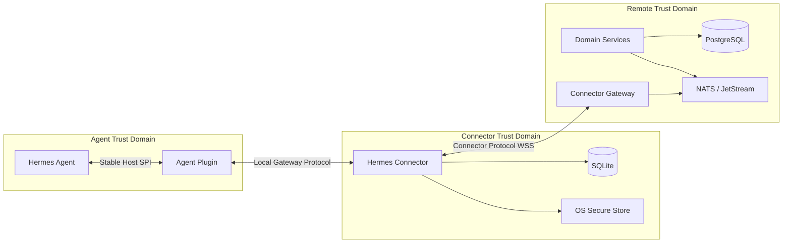
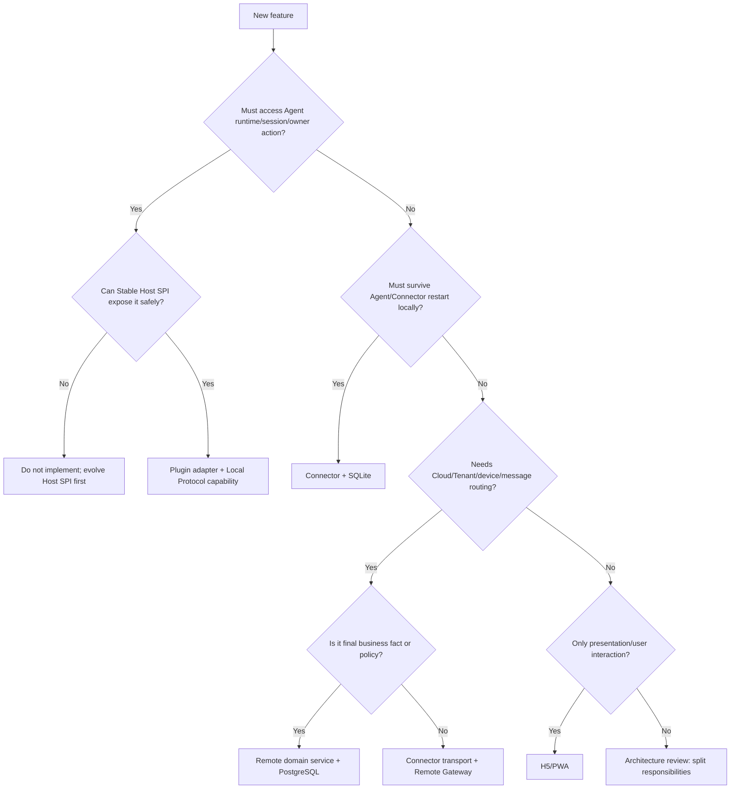
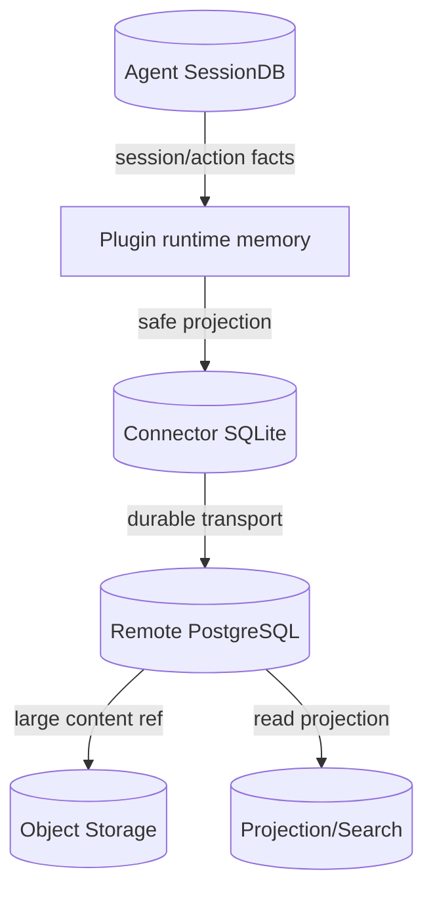
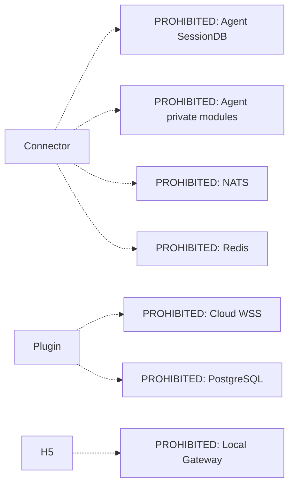

# 12 功能设定与责任边界矩阵

- 状态：规范
- 基线版本：1.0
- 更新日期：2026-07-30

## 1. 核心边界

```text
Agent        = 执行和会话事实
Plugin       = Agent 能力的安全本地协议适配
Connector    = 设备、Cloud 连接、本地可靠交付和对账
Remote       = Tenant、设备、命令、投影和协作事实
H5/PWA       = 用户交互和状态展示
```

Plugin 与 Connector 都部署在用户本地，但不能因为部署位置相同而合并职责。

## 2. 逻辑边界图



## 3. 符号

| 符号 | 含义 |
|---|---|
| A | Authority，最终事实或最终决策 |
| R | Responsible，直接执行 |
| V | Verify，再次校验 |
| P | Projection/Cache，非权威副本 |
| I | Informed，只接收状态 |
| — | 不参与 |

## 4. Agent 运行与会话功能矩阵

| 功能 | Agent | Plugin | Connector | Remote | H5 |
|---|---:|---:|---:|---:|---:|
| SessionDB | A/R | — | — | — | — |
| Durable Session Key | A | R/V | P | P | I |
| Runtime Session ID | A | R/V | P | P | I |
| Runtime Generation | A | R/V | P | P | I |
| Owner Transport | A/R | V，不替换 | — | — | — |
| Prompt 执行 | A/R | R/V Adapter | R 交付 | A 命令事实 | R 发起 |
| Interrupt 执行 | A/R | R/V Adapter | R 交付 | A 命令事实 | R 发起 |
| Steer 执行 | A/R | R/V Adapter | R 交付 | A 命令事实 | R 发起 |
| Tool 执行 | A/R | 只观察/适配 | — | — | I |
| Agent Action 最终结果 | A | R 投影 | P/转发 | P/命令状态 | I |
| Observer Snapshot | A 来源 | R/V/裁剪 | P/转发 | P | I |
| Observer Event | A 来源 | R/裁剪/顺序 | R/缓冲 | P/分发 | I |
| Event Gap 修复 | A 快照 | R 提供 | R 检测 | R 请求/协调 | I |
| Agent 本地启动 | A/R | 不得阻断 | 不得阻断 | — | — |

## 5. Control 与 Pending 功能矩阵

| 功能 | Agent | Plugin | Connector | Remote | H5 |
|---|---:|---:|---:|---:|---:|
| Control Role | Host 约束 | A/R | V/绑定 Cloud client | V | R 请求 |
| Control Lease | 运行环境 | A/R | P/短期持有 | P/关联 | I |
| 单 Controller | 运行约束 | A/R | V | V | I |
| Control Revision | 变化来源 | A/R | P | P | I |
| Pending Input Queue | A/R | R 适配 | P/转发 | P | I |
| Pending Request ID | A | V | V | V | R 响应 |
| Pending Choices | A | R/裁剪 | 透传 | 透传 | 只能选择 |
| Approval Respond | A/R | R/V | R 交付 | A 命令事实 | R 发起 |
| Clarify Respond | A/R | R/V | R 交付 | A 命令事实 | R 发起 |
| Sensitive Input | A/R | Future Adapter | Future E2EE | 只路由密文 | R 输入 |
| Lease 日志 | 禁止 | 禁止 | 禁止 | 禁止 | 不显示 |

## 6. 本地安装和进程功能矩阵

| 功能 | Agent/Extension Manager | Plugin | Connector | Unified Installer |
|---|---:|---:|---:|---:|
| Agent 安装/更新 | A/R | — | — | 不默认代办 |
| Extension Store | A/R | I | I | 通过管理接口 |
| Plugin Bundle 签名验证 | A/R | — | V 下载制品 | V 总包 |
| Plugin 激活/禁用/回滚 | A/R | 被管理 | 请求 | 协调 |
| Connector Runtime 安装 | — | — | 被管理 | A/R |
| Connector OS Service | — | — | R | A 安装 |
| Connector 双槽 | — | — | A/R | R 协调 |
| Device Key | — | — | A/R | — |
| SQLite | — | — | A/R | 不清空 |
| Repair | Host 自检 | 自检 | A/R 汇总 | 提供入口 |
| Uninstall Plugin | A/R | 关闭 | 请求 | 协调 |
| Uninstall Connector | — | — | drain | A/R |
| 删除 Agent 会话 | 仅用户/Agent流程 | 禁止 | 禁止 | 禁止 |

## 7. Cloud 连接和设备功能矩阵

| 功能 | Agent | Plugin | Connector | Remote |
|---|---:|---:|---:|---:|
| Device Key 生成 | — | — | A/R | 只存公钥 |
| Pairing Code | — | — | R | A/R |
| Challenge Sign | — | — | A/R | V |
| Device Active/Suspend/Revoke | — | — | P/执行 | A/R |
| WSS/TLS | — | — | R | R |
| Hello/Welcome | — | — | R | A/R |
| Heartbeat | — | — | R | R |
| Backoff/Jitter | — | — | A/R | I |
| WSS Frame Limit | — | — | V | A/R |
| Cloud Token | — | — | 短期持有 | A/R |
| Tenant/Realm | — | — | 不得自报授权 | A/R |
| Subscription/Quota | — | — | P/展示 | A/R |
| Gateway Connection Index | — | — | — | A/R |

## 8. 可靠性和状态功能矩阵

| 功能 | Agent | Plugin | Connector | Remote |
|---|---:|---:|---:|---:|
| Agent Action 幂等 | A/R | R Runtime Guard | V | V |
| Local Command Inbox | — | 进程内非持久 | A/R SQLite | P |
| Local Event Outbox | — | — | A/R SQLite | P |
| Cloud Command Fact | 结果来源 | — | P | A/R PostgreSQL |
| Transactional Outbox | — | — | Local transaction | A/R PostgreSQL |
| 消息交付 | — | Local IPC | R | R NATS/Gateway |
| 至少一次投递 | — | 支持重复调用 | A/R | A/R |
| 业务效果幂等 | A | R/V | R/V | R/V |
| `UNKNOWN` 判定 | A 状态来源 | R 返回 | R 保留/查询 | A 命令状态 |
| `UNKNOWN` 自动重试 | 禁止 | 禁止 | 禁止 | 禁止 |
| Event Cursor | A sequence | R | A 本地恢复 | A Cloud 恢复 |
| Snapshot 对账 | A 来源 | R 提供 | R 触发 | R 协调 |
| Cloud Projection | — | — | 传输 | A/R 非会话事实 |

## 9. 安全和权限功能矩阵

| 功能 | Agent | Plugin | Connector | Remote |
|---|---:|---:|---:|---:|
| 用户登录 | — | — | — | A/R |
| Tenant Membership | — | — | 不得决定 | A/R |
| Device 认证 | — | — | R | A/V |
| Local IPC ACL | Host 目录 | A/R | V | — |
| Method Allowlist | Host capability | A/R | V | V |
| Session/Generation 校验 | A 来源 | A/R | V | V |
| Lease 校验 | — | A/R | V | 关联校验 |
| Purpose/Classification | 执行上下文 | V | V 签名上下文 | A/R Policy |
| Resource ACL | 来源系统 | V Host | 不扩大 | A/R Policy |
| Secret 明文 | A 最终消费 | 临时内存 | 临时内存 | 禁止 |
| DLP/文件扫描 | Tool/Data Gateway | 裁剪 | 传引用 | A/R |
| 审计 | 本地执行证据 | R safe audit | R transport audit | A/R business audit |

## 10. 可观测和运维功能矩阵

| 功能 | Plugin | Connector | Remote |
|---|---:|---:|---:|
| Plugin/Host 版本 | A 来源 | P/上报 | P |
| Connector 版本 | — | A/R | P |
| Cloud 连接状态 | — | A/R | P |
| Agent/Runtime 状态 | A 来源 | P/组合 | P |
| Inbox/Outbox 指标 | — | A/R | P |
| NATS/RDS 指标 | — | — | A/R |
| Local 诊断 | R | A/R 汇总 | I |
| Remote 诊断 | — | 上报摘要 | A/R |
| 内容正文日志 | 禁止 | 禁止 | 默认禁止 |
| Update Rollback | Plugin 由 Host | A/R | 发布策略 |
| Status Page | — | I | A/R |

## 11. 企业扩展功能矩阵

| 功能 | Agent | Plugin | Connector | Remote Enterprise |
|---|---:|---:|---:|---:|
| Bootstrap Manifest 使用 | A/R | V/暴露 attestation | 传输/缓存签名元数据 | A/R 解析签发 |
| Personal Memory | A/R | 禁止传播 | 禁止传播 | 禁止读取 |
| Work Event | A 来源 | 裁剪 | 可靠传输 | A/R 治理 |
| Evidence | 来源/使用 | 引用适配 | 传引用 | A/R |
| Knowledge/Skill | 使用 | capability 适配 | 只传版本/引用 | A/R Registry |
| Collaboration Message | 执行/收件 | 本地交付 | R 可靠传输 | A/R 路由事实 |
| Work Item | 使用 | — | 透传状态 | A/R |
| Agent-to-Agent Policy | 执行 | V | V 签名上下文 | A/R |
| A2A 外部联邦 | — | — | 不直接处理 | A/R Gateway |
| Evolution Candidate | 提供受控证据 | — | 传引用 | A/R 治理 |

## 12. 功能归属判断树



## 13. 跨边界拆分规则

如果一个功能同时需要 Agent 与 Cloud，必须拆为：

```text
Remote authorization/fact
-> Connector reliable transport/state
-> Plugin local verification/adapter
-> Agent authoritative execution
```

示例：Approval Respond

| 层 | 责任 |
|---|---|
| H5 | 用户选择 Server 提供的 choice |
| Remote | 身份、Tenant、命令、TTL、审计 |
| Connector | 先落 Inbox、交付、状态同步 |
| Plugin | Lease、Session、Generation、Pending Revision |
| Agent | 精确解决 Pending Queue Entry |

任何一层不能代替下一层校验。

## 14. 数据存储边界



| 存储 | 可以保存 | 禁止保存为权威 |
|---|---|---|
| Agent SessionDB | Session、Action、Tool 事实 | Cloud Device/Subscription |
| Plugin Memory | Lease、subscription、runtime guard | 跨重启 Command Fact |
| Connector SQLite | Inbox、Outbox、Cursor、runtime metadata | SessionDB、Tenant Policy |
| PostgreSQL | Command、Device、Tenant、Audit、Collaboration | Agent Session 正文事实 |
| Object Storage | 加密附件、投影、Evidence | 权限最终决策 |
| Search | 权限过滤的索引 | 原始 ACL 和事实 |

## 15. 依赖边界

允许：

```text
Plugin -> Stable Host SPI
Connector -> Local Gateway Protocol
Connector -> Connector Protocol
Remote Gateway -> Internal Services/NATS
Domain Services -> PostgreSQL/Adapters
```

禁止：



## 16. 失败传播边界

| 故障 | Agent 本地 | Plugin | Connector | Cloud/H5 |
|---|---|---|---|---|
| Plugin load 失败 | 必须可用 | Disabled | Agent unavailable | 显示修复 |
| Local IPC 失败 | 可用 | 重建/降级 | 重发现 | 状态可见 |
| Connector 崩溃 | 可用 | 不受影响 | OS 重启 | 暂离线 |
| SQLite 损坏 | 可用 | 不受影响 | 停收 durable | 显示 degraded |
| Cloud 断线 | 可用 | 不受影响 | 本地排队/重连 | 显示断线 |
| Agent 更新 | 短暂重启 | 旧 runtime 清理 | 保持 Cloud/对账 | 显示 updating |
| Connector 更新 | 可用 | 通常不变 | drain/切槽 | 短暂重连 |
| Remote 故障 | 可用 | 不受影响 | 重连 | 服务降级 |

失败不能跨越边界扩大：Connector 故障不能杀死 Agent，Plugin 故障不能阻止 Agent
启动，Remote 故障不能删除本地会话。

## 17. 当前实现边界

当前目录已经跨入 Plugin 责任的部分：

- Observer/Control UDS；
- endpoint registry；
- Control claims/method allowlist；
- Lease/revision；
- runtime command ledger；
- Local error contract。

当前目录尚未实现 Connector 责任：

- Supervisor/service；
- Device Identity/pairing；
- Cloud WSS；
- Protocol codec；
- SQLite Inbox/Outbox；
- reconciliation；
- updater/repair。

当前 `control_relay` 已只接受显式 dispatcher 注入，不再导入私有 Hermes Host。
但 Hermes 0.19 尚无权威 Owner Action Port，因此生产注册必须 fail closed；不能用
hook、`inject_message` 或 Fake Host 把该缺口解释为已闭环。

## 18. 边界变更门禁

任何新增功能在评审时回答：

1. 最终事实在哪里？
2. 需要跨哪条协议？
3. 谁生成 ID，谁校验？
4. 是否跨重启？
5. 是否涉及 Agent owner action？
6. 是否涉及 Tenant/设备/业务 Policy？
7. 是否把内部实现泄露到相邻层？
8. 失败是否会跨边界扩大？
9. 是否有 capability 和版本协商？
10. 是否可以关闭、降级和回滚？
11. 数据是否有 persist/log/trace 规则？
12. 测试是否覆盖错误边界和旧版本？

无法明确回答时，不进入实现。

## 19. 最终边界判定

### Plugin

```text
Agent-aware
Runtime-scoped
Ephemeral
Local authorization
Stable Host adapter
```

### Connector

```text
Agent-internals-agnostic
Device-scoped
Restart-durable
Cloud/local transport
Reconciliation and update
```

### Remote

```text
Tenant-scoped
Business-fact authoritative
Cross-device routing
Policy and commercial control
```

这三组属性是长期架构约束，不随代码目录或部署方式改变。
