# 13 全链路逻辑与详细时序

- 状态：实现级规范
- 基线版本：1.0
- 更新日期：2026-07-30

## 1. 全链路组件图

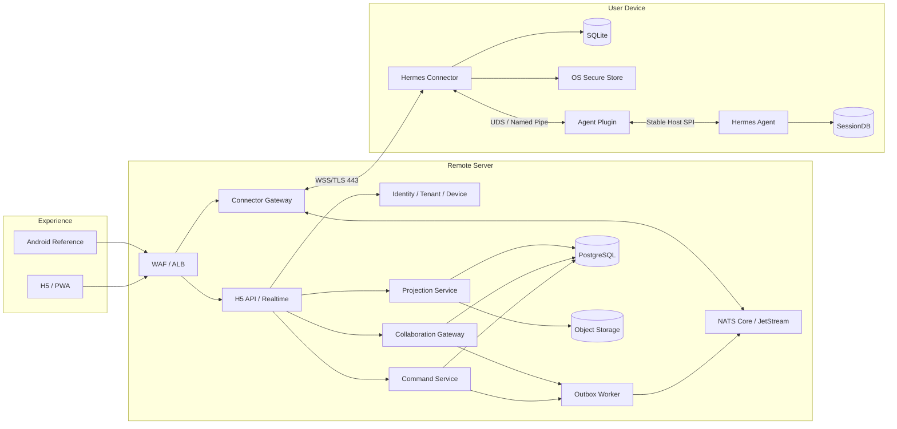

## 2. 全链路责任分层

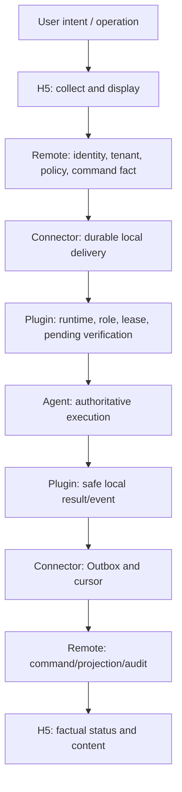

任何上层“允许”都不替代下一层校验；任何下层执行结果都必须逐层传播后才能在 H5
显示为最终状态。

## 3. 本地组件安装全链路

```mermaid
sequenceDiagram
    autonumber
    participant U as User
    participant I as Unified Installer
    participant E as Agent Extension Manager
    participant S as OS Service Manager
    participant C as Connector Slot
    participant P as Plugin Bundle
    participant A as Hermes Agent

    U->>I: Run signed installer
    I->>I: Verify release signature/digest/SBOM
    I->>E: Inspect Agent and Host API
    alt Agent absent
        E-->>I: Host unavailable
        I->>C: Install Connector and stage Plugin
        I->>S: Register/start service
        C-->>I: WAITING_FOR_AGENT
        I-->>U: Installed; waiting for Hermes Agent
    else Agent present and compatible
        E-->>I: Host API and safe activation window
        I->>C: Install Connector inactive slot
        I->>E: Install signed Plugin Bundle
        E->>P: Verify manifest/signature
        alt Agent busy and restart required
            E-->>I: PENDING_ACTIVATION
            I-->>U: Installed; activate after current task
        else can activate
            E->>P: Activate atomically
            E-->>I: Plugin active
            I->>S: Register/start Connector service
            C->>P: Local capability handshake
            P->>A: Host runtime descriptor
            A-->>P: Capabilities and generation
            P-->>C: Ready
            C-->>I: Local health passed
            I-->>U: Ready for Cloud pairing
        end
    end
```

### 安装失败逻辑

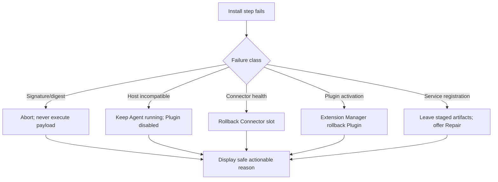

## 4. Agent 与 Plugin 启动全链路

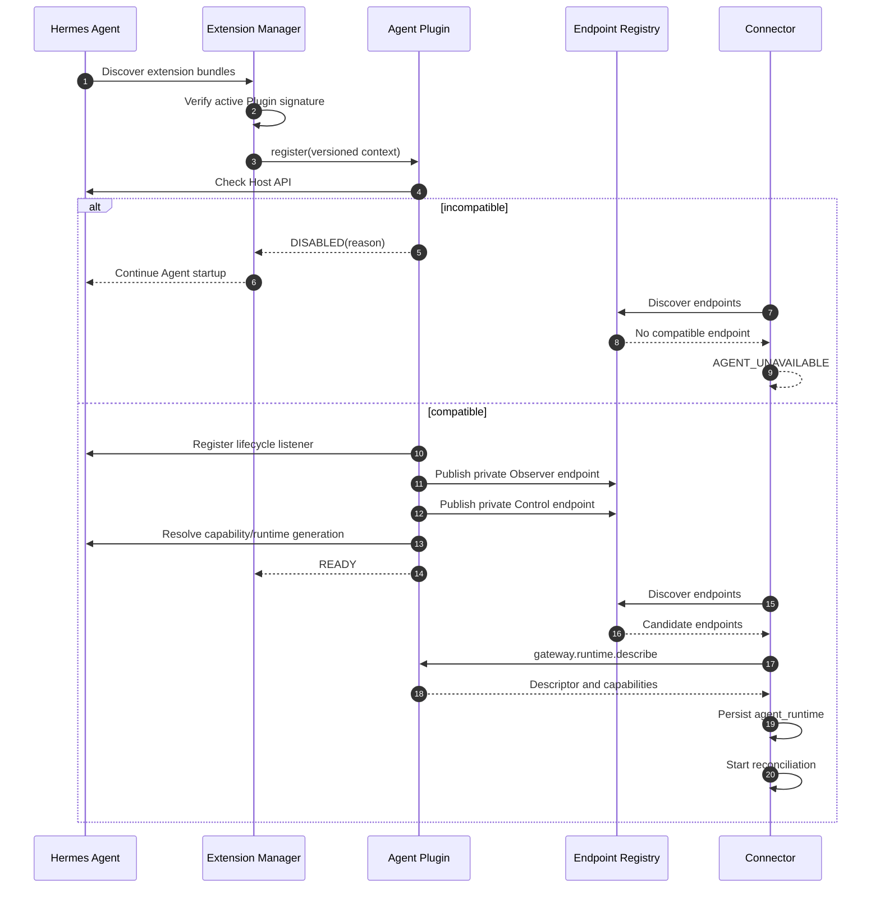

## 5. Connector 进程启动全链路

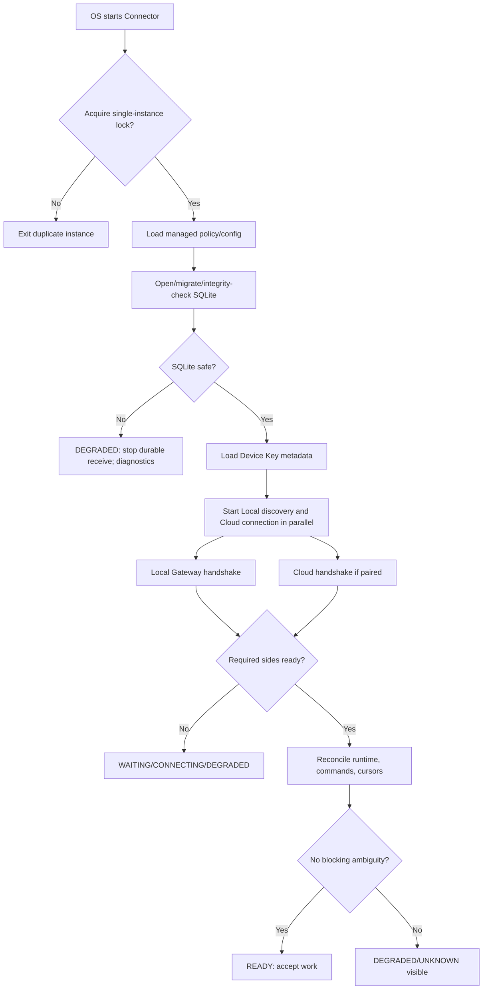

## 6. 设备配对与认证全链路

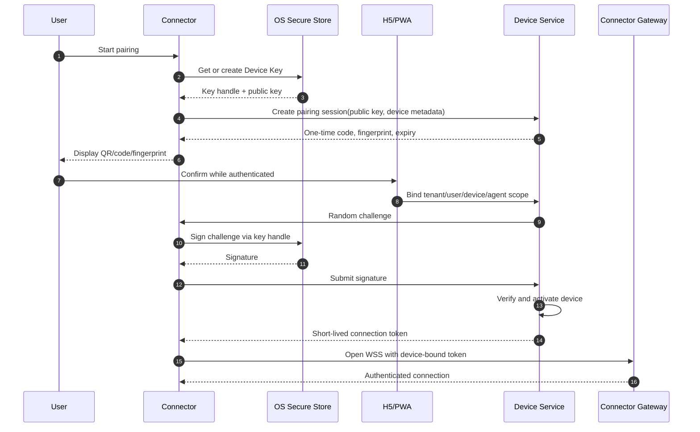

失败边界：

- Code 过期：只重新开始 pairing；
- 指纹不一致：用户拒绝；
- Secure Store 不可用：不降级保存私钥；
- Device suspended/revoked：关闭 WSS，不自动重新配对；
- Tenant policy 拒绝：显示管理员可执行原因。

## 7. Connector Cloud 握手全链路

```mermaid
sequenceDiagram
    autonumber
    participant C as Connector
    participant G as Connector Gateway
    participant D as Device Service
    participant P as Presence/Connection Index

    C->>G: WSS/TLS + short-lived token
    G->>D: Validate device/token/revocation
    D-->>G: Tenant/realm/device context
    G->>C: Request/accept connector.hello
    C->>G: Versions, agent state, capabilities, cursors
    G->>G: Negotiate protocol/window/frame/heartbeat
    alt incompatible or blocked
        G-->>C: protocol/update/device error
        C->>C: Stop business traffic; keep repair path
    else accepted
        G->>P: Register live connection
        G-->>C: server.welcome + resume cursors
        C->>C: Start heartbeat/send/receive
        C->>C: Trigger Cloud reconciliation
    end
```

Tenant/Realm 由 Gateway 认证上下文注入，不能信任 Hello 中的同名客户端字段。

## 8. 会话观察全链路

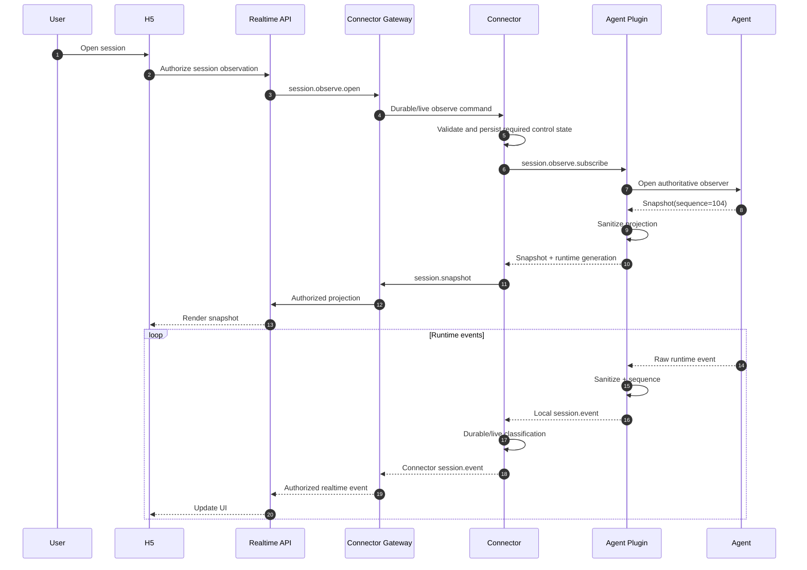

### 观察缺口恢复

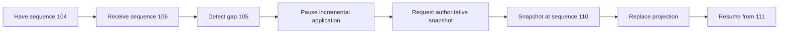

H5、Remote、Connector 都不能根据缓存猜测缺失事件。

## 9. Prompt Submit 全链路

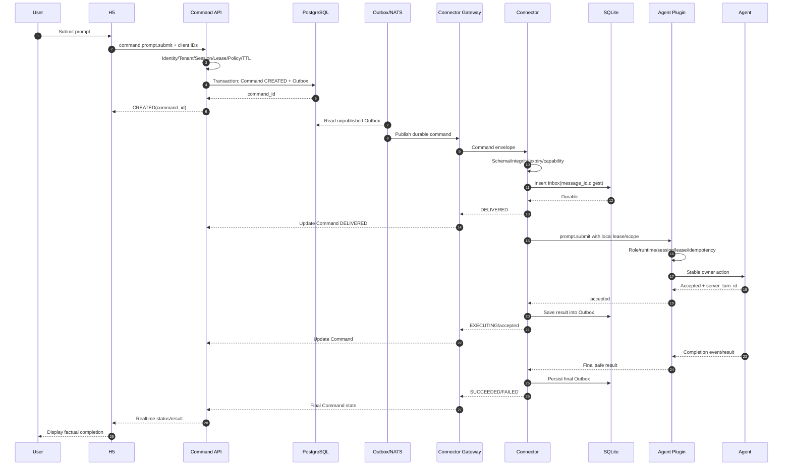

关键事实：

- API 返回 CREATED 不代表送达；
- Connector ACK DELIVERED 不代表 Agent 受理；
- Agent accepted 不代表任务完成；
- 只有 Agent 最终结果传播到 Command Service 后显示 SUCCEEDED/FAILED。

## 10. Interrupt/Steer 全链路差异

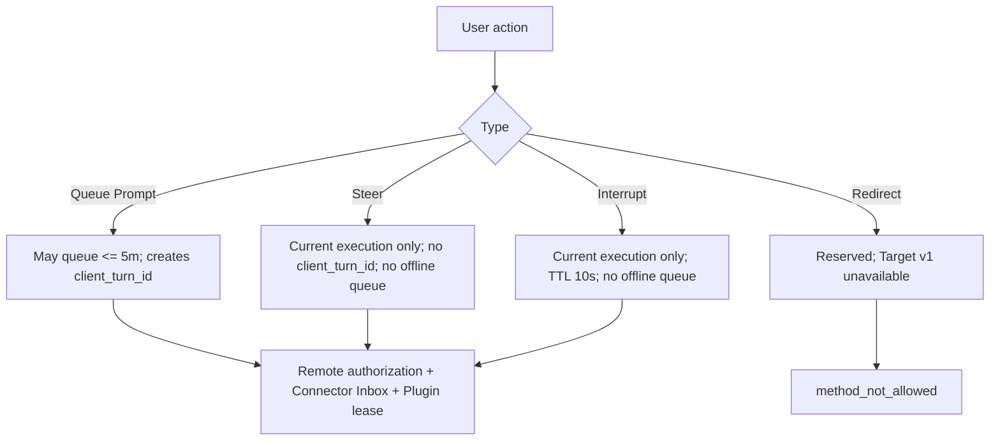

## 11. Approval/Clarify 全链路

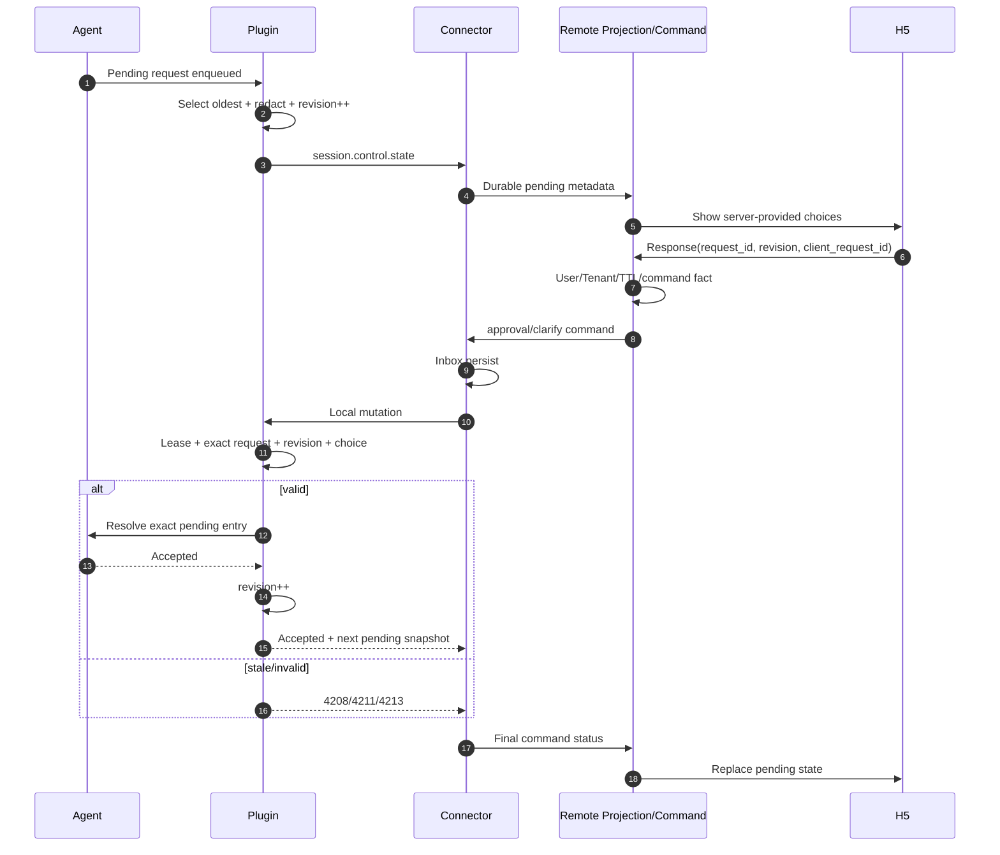

## 12. 网络中断与命令恢复

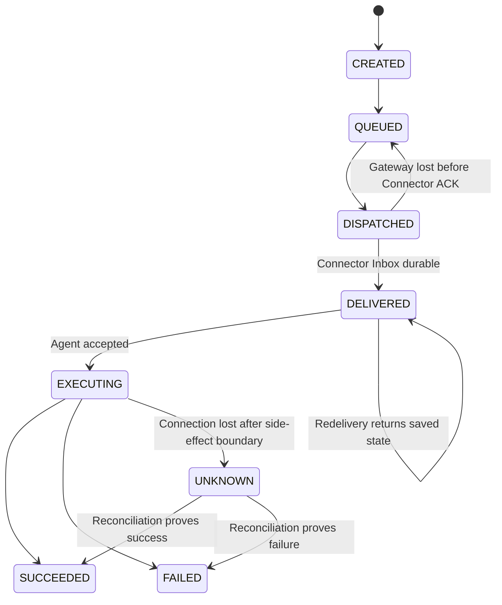

### 恢复决策

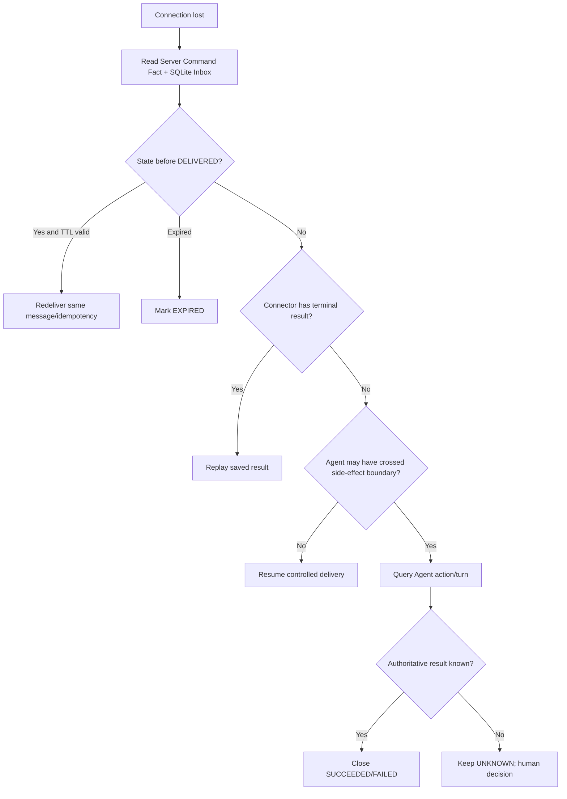

## 13. Agent 重启/更新全链路

```mermaid
sequenceDiagram
    autonumber
    participant S as Remote Server
    participant C as Connector
    participant P1 as Plugin Runtime N
    participant A1 as Agent N
    participant A2 as Agent N+1
    participant P2 as Plugin Runtime N+1

    A1->>P1: runtime.draining
    P1-->>C: agent.state=draining
    C->>C: Stop new Control; flush state
    C-->>S: connector online / agent draining
    A1->>P1: runtime.stopped
    P1->>P1: Close endpoints; invalidate lease/subscriptions
    P1-->>C: Local disconnect
    C-->>S: agent unavailable
    A2->>P2: Load compatible Plugin
    P2->>P2: Publish new endpoints/generation
    C->>P2: Discover and describe
    P2-->>C: New generation/capabilities
    C->>C: Invalidate old local bindings
    C->>P2: Snapshot + command status
    C->>S: Reconcile commands/cursors
    S-->>C: Server facts/resume
    C-->>S: agent ready + reconciliation report
```

旧 generation 的 Lease、Pending、Subscription 和实时事件全部失效。

## 14. Connector 更新全链路

```mermaid
sequenceDiagram
    autonumber
    participant S as Server Update Policy
    participant U as Connector Updater
    participant H as Agent Extension Manager
    participant C1 as Current Connector
    participant C2 as New Connector

    S->>U: Signed release manifest
    U->>U: Verify and download inactive slots
    U->>H: Stage compatible Plugin
    H-->>U: Activated/deferred/rejected
    alt Plugin ready or unchanged
        U->>C1: Drain
        C1->>C1: Flush Outbox and close WSS
        U->>C2: Start with compatible SQLite
        C2->>H: Local health
        C2->>S: Cloud health
        alt health pass
            U->>U: Commit new active slot
        else health fail
            U->>C2: Stop
            H->>H: Rollback Plugin if needed
            U->>C1: Restore
        end
    else rejected
        U->>U: Keep current version; report incompatibility
    end
```

## 15. Remote Gateway 滚动发布

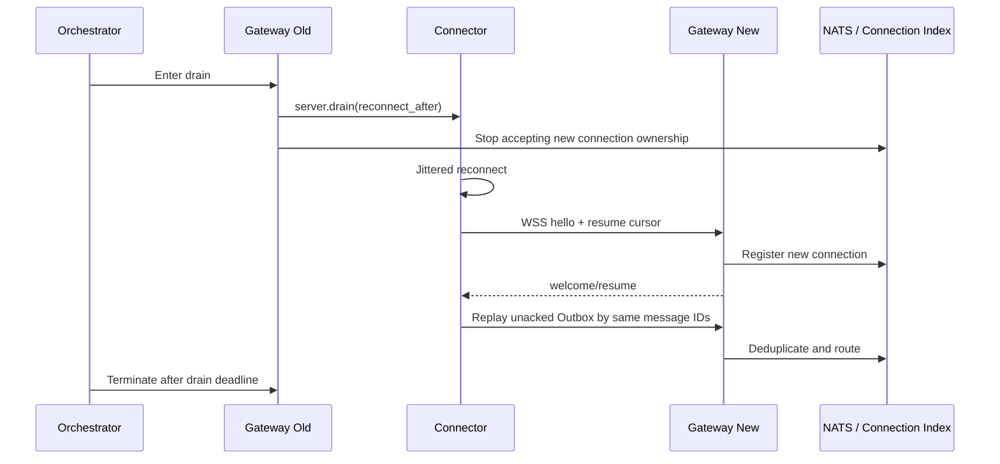

Gateway 无最终业务状态，因此发布不会要求 Connector 清空本地队列。

## 16. Device 吊销全链路

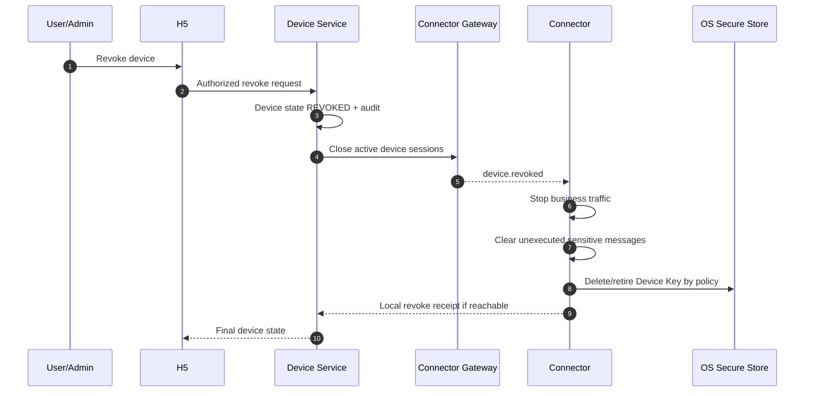

本地只删除 Key 而不通知 Server 不等于吊销；Server 仍必须将设备状态改为
`REVOKED`。

## 17. Cloud 投影删除全链路

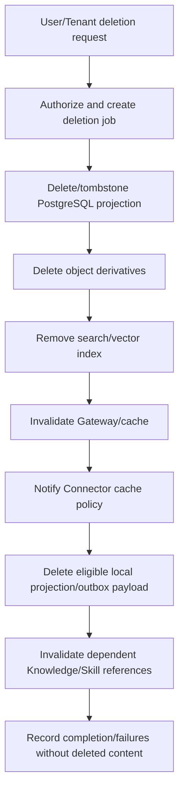

Agent SessionDB 的删除由 Agent/用户本地事实流程单独控制，Cloud 删除不能隐式删除
本地权威会话。

## 18. Repair 全链路

```mermaid
flowchart TD
    START["User selects Repair"] --> READ["Read-only inspection"]
    READ --> AGENT["Agent/Host API/version"]
    READ --> PLUGIN["Plugin bundle/active slot/endpoints"]
    READ --> CONN["Service/version/config"]
    READ --> DB["SQLite integrity/queue"]
    READ --> CLOUD["Device/WSS/certificate/proxy"]
    AGENT --> PLAN["Build bounded repair plan"]
    PLUGIN --> PLAN
    CONN --> PLAN
    DB --> PLAN
    CLOUD --> PLAN
    PLAN --> SHOW["Show actions and data impact"]
    SHOW --> APPLY["Repair only owned artifacts"]
    APPLY --> VERIFY["Local handshake + Cloud handshake + reconciliation"]
    VERIFY --> RESULT["Ready or precise remaining blocker"]
```

Repair 禁止：

- 删除整个 `HERMES_HOME`；
- 清空 SessionDB；
- 重置所有用户设置；
- 清空 SQLite 后自动重发未知命令；
- 下载未签名制品。

## 19. 完整命令各组件内部逻辑

### 19.1 H5

```text
collect intent
-> show target Agent/Session
-> require explicit confirmation when needed
-> submit client_request_id/client_turn_id
-> render authoritative state timeline
-> never infer success from WebSocket send
```

### 19.2 Remote Server

```text
authenticate user
-> resolve Tenant/device/Agent/session
-> Policy/lease/risk/TTL
-> transaction Command + Outbox
-> publish durable delivery
-> consume ACK/result idempotently
-> expose state and audit
```

### 19.3 Connector

```text
validate envelope
-> check expiry/capability
-> SQLite Inbox
-> DELIVERED ACK
-> Local RPC
-> SQLite Outbox result
-> Cloud result
-> retain/query UNKNOWN
```

### 19.4 Agent Plugin

```text
validate Local RPC
-> immutable role/claims
-> method allowlist
-> generation/session
-> lease/pending revision
-> runtime idempotency
-> Host owner action
-> safe result/event
```

### 19.5 Hermes Agent

```text
authoritative action preconditions
-> accept/reject
-> execute
-> persist session/action fact
-> emit runtime events
-> expose final status
```

## 20. Future：Agent-to-Agent 协作全链路

```mermaid
sequenceDiagram
    autonumber
    participant A as Work Agent A
    participant CA as Connector A
    participant R as Collaboration Gateway
    participant DB as Message Store/Work Item
    participant CB as Connector B
    participant B as Work Agent B
    participant HB as Employee B

    A->>CA: collaboration.send(structured refs, delegation)
    CA->>R: WSS message + idempotency
    R->>R: Identity/Delegation/Policy/TTL/loop budget
    R->>DB: Persist message + Outbox
    R-->>CA: ACCEPTED_BY_GATEWAY
    alt B offline
        DB->>DB: QUEUED until Delivery Session
    else B online
        R->>CB: collaboration.available/message
        CB->>B: Local structured request
        B->>B: Re-authorize every resource reference
        alt human gate required
            B->>HB: Request confirmation
            HB-->>B: Confirm/modify/reject
        end
        B-->>CB: receipt/status/deliverable
        CB->>R: collaboration.receipt
        R->>DB: Update authoritative state
        R-->>CA: collaboration.status
    end
```

Connector 只传结构化消息和引用，不理解具体 Skill，不建立设备间 P2P。

## 21. 全链路状态展示

```mermaid
flowchart LR
    CREATED["CREATED<br/>Server transaction"] --> QUEUED["QUEUED<br/>Delivery layer"]
    QUEUED --> DISPATCHED["DISPATCHED<br/>Gateway"]
    DISPATCHED --> DELIVERED["DELIVERED<br/>Connector SQLite"]
    DELIVERED --> EXECUTING["EXECUTING<br/>Agent accepted"]
    EXECUTING --> SUCCEEDED["SUCCEEDED<br/>Agent final"]
    EXECUTING --> FAILED["FAILED<br/>Agent final"]
    EXECUTING --> UNKNOWN["UNKNOWN<br/>Needs reconciliation"]
```

UI 文案必须匹配事实：

| 状态 | 可以显示 | 不能显示 |
|---|---|---|
| CREATED | 已创建 | 已发送给 Agent |
| QUEUED | 等待投递 | 对方已收到 |
| DISPATCHED | 正在投递 | Connector 已保存 |
| DELIVERED | 已送达设备 | Agent 正在执行 |
| EXECUTING | Agent 已受理 | 已完成 |
| UNKNOWN | 结果待确认 | 执行失败/可以重试 |
| SUCCEEDED | 已完成 | — |
| FAILED | 执行失败 | 命令未发送 |

## 22. 全链路验收场景

必须以真实安装制品验证：

1. 空白机器一次安装；
2. Agent 缺失后再安装；
3. Agent 正忙时 Plugin 延迟激活；
4. 首次配对、拒绝、过期和吊销；
5. Observer 快照、实时流和 gap；
6. Prompt、Interrupt、Steer、Approval、Clarify；
7. Connector 在 Inbox 写前/写后崩溃；
8. Agent 在执行边界前/后重启；
9. Gateway drain 和重连；
10. NATS 重投和 PostgreSQL Outbox 补发；
11. Connector/Plugin 兼容升级与回滚；
12. SQLite 磁盘满/损坏；
13. Cloud 投影删除；
14. Repair 不破坏用户数据；
15. 重复投递无重复业务效果；
16. `UNKNOWN` 全程不自动重做。
