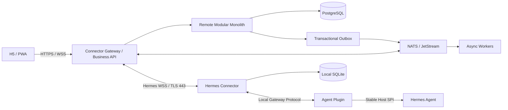
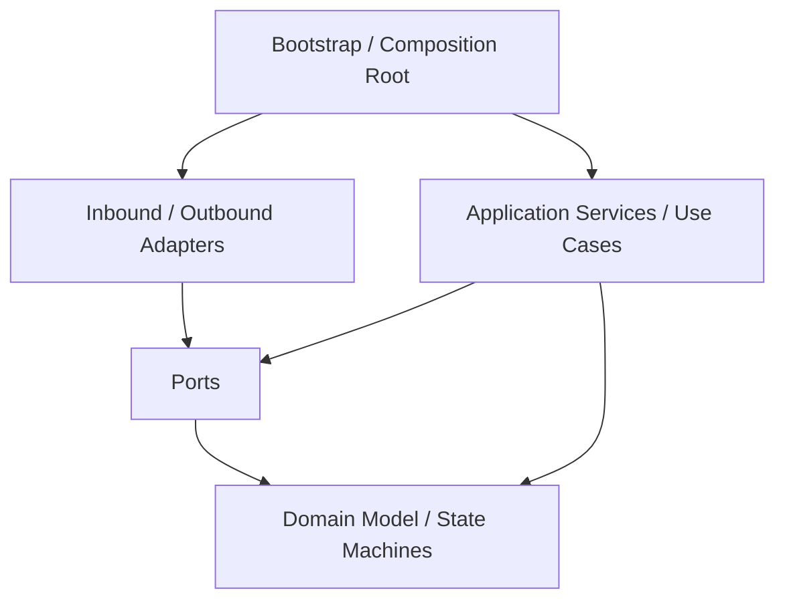
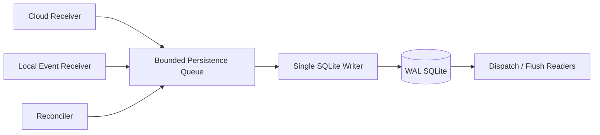
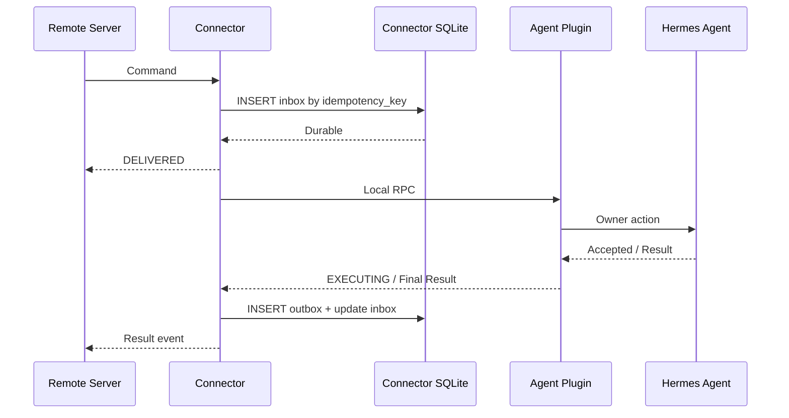

# 14 软件架构与工程约束

- 状态：规范
- 基线版本：1.0
- 更新日期：2026-07-30
- 适用范围：Hermes Agent Plugin、Hermes Connector、Hermes Remote Server、
  H5/PWA 及其共享协议制品

## 1. 目的

本文把目标架构转化为可执行的工程约束，解决以下问题：

- 每个运行单元内部采用什么代码架构；
- 哪些模块可以互相依赖，哪些依赖必须禁止；
- Plugin、Connector、Remote Server 和 H5/PWA 如何独立开发、测试和升级；
- 消息、状态、并发、存储和故障恢复采用什么统一模式；
- 首期为何不采用全微服务、全事件溯源或多套本地运行时；
- 规模扩大后，在什么条件下允许拆分或替换技术组件。

本文不重新定义产品边界和协议字段。职责归属以
[12 功能责任边界矩阵](12-feature-and-responsibility-boundary-matrix.md) 为准，
消息与状态语义以 [11 Local/Cloud 数据协议](11-local-and-cloud-data-protocols.md)
为准。

## 2. 规范用语

| 用语 | 含义 |
|---|---|
| 必须 | 合并、发布和上线前必须满足；不满足即为架构缺陷 |
| 禁止 | 不允许以临时实现、性能优化或交付压力为由绕过 |
| 应当 | 默认实现；偏离时必须在 PR 中说明理由和补偿措施 |
| 可以 | 在不破坏事实所有权、协议兼容和安全边界时可选择 |

架构图表达目标依赖关系，不表示所有模块已经实现。当前能力仍以 `[CURRENT]`、
`[TARGET-V1]` 和 `[FUTURE]` 标签及测试证据为准。

## 3. 总体软件架构决策

系统采用组合架构，而不是把一种模式套到所有组件：

| 运行单元 | 主要架构 | 核心理由 |
|---|---|---|
| Agent Plugin | 六边形架构中的薄适配器；Agent 的防腐层 | 隔离 Agent 内部变化，只暴露稳定 Host SPI |
| Hermes Connector | 单进程模块化边缘服务；六边形架构；事件驱动状态机 | 需要本地持久化、长连接、断线恢复和独立升级 |
| Connector Gateway | 无状态连接网关 | 长连接接入、认证、背压和滚动扩容 |
| Remote Business API | 模块化单体；领域模块隔离；CQRS-lite | 首期降低部署和运维复杂度，同时保留未来拆分能力 |
| Remote Worker | 异步消费者与投影处理器 | 隔离慢任务、重试和批处理 |
| H5/PWA | React 特性切片架构；Server State 与 UI State 分离 | 跨平台、可安装、弱网恢复和前端可维护性 |
| 跨单元协作 | Contract-first；Inbox/Outbox；至少一次投递 | 支持独立发布、兼容升级和可恢复交付 |

### 3.1 运行拓扑



### 3.2 不采用“一套代码架构覆盖全部组件”

Plugin 的目标是小、薄、稳定；Connector 的目标是可靠地管理本地状态和连接；
Remote Server 的目标是管理多租户业务事实和规模化路由；H5/PWA 的目标是交互体验。
四者的故障模型、发布节奏和状态所有权不同，禁止为了“代码统一”将其合并为同一
进程、同一依赖环境或同一数据库模型。

## 4. 统一的六边形依赖规则

Plugin、Connector 和 Remote Business API 内部均遵循以下依赖方向：



### 4.1 层级职责

| 层级 | 允许包含 | 禁止包含 |
|---|---|---|
| Domain | 状态机、值对象、业务不变量、纯规则 | 网络、数据库、文件系统、框架对象、全局配置 |
| Application | 用例编排、事务边界、端口调用、幂等策略 | 具体 SQL、WebSocket 客户端、云厂商 SDK |
| Ports | Host、存储、时钟、密钥、消息、网络等抽象契约 | 具体基础设施实现 |
| Adapters | JSON-RPC、WSS、SQLite、PostgreSQL、NATS、OS 服务实现 | 反向修改 Domain 规则 |
| Bootstrap | 配置装配、依赖注入、生命周期启动和关闭 | 业务决策和协议转换规则 |

### 4.2 强制依赖方向

1. Domain 必须为最内层，不依赖 Application、Adapters 或框架。
2. Application 只能依赖 Domain 和 Ports。
3. Adapters 可以依赖 Ports、Application DTO 和生成的协议类型。
4. Bootstrap 是唯一允许组装具体 Adapter 的位置。
5. 禁止在 Domain 或 Application 中读取环境变量、单例配置或全局连接。
6. 禁止通过循环导入、运行时猴子补丁或 Service Locator 绕过依赖方向。
7. 跨运行单元只能依赖发布的协议、Schema、Fixture 和公共 SDK，禁止依赖对方内部
   Python 模块、ORM Model、数据库表或配置文件布局。

### 4.3 数据对象边界

以下对象必须分开，禁止用同一个可变模型贯穿所有层：

- Protocol DTO：与版本化 Schema 对齐，只负责序列化和验证；
- Application Command/Query：表达一个具体用例；
- Domain Object：表达状态和不变量；
- Persistence Record：表达本地或云端存储结构；
- Read Projection：面向 H5/PWA 的读取模型。

映射发生在 Adapter 或 Application 边界。新增字段不得依赖“Python 对象直接透传”
实现兼容。

## 5. Agent Plugin 架构约束

### 5.1 定位

Agent Plugin 是 Hermes Agent 与 Local Gateway Protocol 之间的防腐层。它把
Connector 所需的稳定语义映射到 Agent 的公开 Host SPI，同时阻止 Agent 私有实现
泄露到 Connector。

### 5.2 必须具备

- 通过稳定、版本化 Host SPI 注册 Observer、Control 和 capability；
- 验证本地连接角色、claims、方法 Allowlist、租约和 pending revision；
- 将 Agent 事件转换为经过裁剪的 Observer 投影；
- 将已验证的控制命令转换为 owner action；
- 在 Agent 重启时生成新的 runtime generation 并使旧租约失效；
- 由 Agent Host 管理安装、启停、卸载和最终激活；
- 所有线程、任务、Socket 和回调必须绑定 Host 生命周期并可确定性关闭。

### 5.3 禁止具备

- Cloud WSS、设备配对、订阅计费或云端令牌刷新；
- SQLite Inbox/Outbox、PostgreSQL、Redis、NATS、OSS 或云厂商 SDK；
- 企业业务对象、员工协作流程或具体 Skill 逻辑；
- 读取 SessionDB、直接导入 Agent 私有模块或修改 Agent owner transport；
- 直接写入 Agent 源码目录、应用包或 venv；
- 默认监听非本机地址或暴露公网端口。

### 5.4 推荐代码结构

```text
hermes-agent-plugin/
  src/hermes_agent_plugin/
    domain/
      control_lease.py
      pending_revision.py
      capabilities.py
    application/
      observe_session.py
      execute_control_command.py
    ports/
      host_spi.py
      local_transport.py
      clock.py
    adapters/
      host/
        extension.py
      local_protocol/
        control_v1.py
      platform/
        macos/
        windows/
        linux/
    contracts/
      generated/
      fixtures/
    bootstrap/
      registration.py
  packaging/
    common/
    macos/
    windows/
    linux/
```

当前领域、应用和 relay 实现统一位于 `hermes_agent_plugin` 包和上述分层结构。
源码树和新发行物不得包含 `hermes_mobile_gateway` 导入包；外部升级事务只保留识别、
卸载和回滚旧发行版所需的历史标识。后续迁移必须保持协议测试通过，并优先移除私有
Host fallback，而不是增加新的长期兼容分支。

### 5.5 依赖约束

- Plugin 可以依赖公开的 Hermes Host SDK、协议验证库和本地 IPC 实现；
- Plugin 不得依赖 Connector 包、Remote Server SDK 或 Connector 配置；
- 第三方依赖必须最小化，并经过许可证、漏洞和可打包性检查；
- 本地 IPC 优先使用 Host 提供的跨平台 Transport Port；
- Host 暂未提供统一 Transport 时，可以保留独立的本地 UDS/Named Pipe Adapter，
  但其注册、清理和权限必须由 Plugin 生命周期控制；
- Windows 若需 loopback TCP 兼容，必须使用随机端口、进程级凭证和本机防火墙限制，
  不得作为默认公网监听方案。

## 6. Hermes Connector 架构约束

### 6.1 进程模型

Connector 首期必须是一个独立 OS 服务和一个进程内模块化应用，不拆成本机多个
微服务。一个进程负责统一生命周期，内部组件通过有界队列和显式事件协作。

允许的辅助进程仅包括：

- 安装、升级和修复工具；
- 经验证确有隔离需要的原生能力 Helper；
- 平台要求的特权 Helper。

辅助进程不得持有 Connector 业务事实，且必须使用版本化、本机认证协议。

### 6.2 并发模型

Connector 使用 Python 3.11+ 与 `asyncio` 结构化并发：

- Supervisor 是唯一顶层任务所有者；
- 长连接、心跳、Local Gateway、Outbox flush、Reconciler 和更新检查各自为受管任务；
- 使用 `TaskGroup` 或等价结构，禁止创建无法追踪生命周期的后台任务；
- 同步阻塞 I/O 必须移入有界线程池，不得阻塞事件循环；
- CPU 密集任务必须有界并测量；只有实测热点才允许引入原生扩展；
- 组件间队列必须设置容量、超时和溢出策略，禁止无界内存队列；
- 关闭顺序必须先停止接收新命令，再落盘、停止外发并释放 IPC/WSS。

### 6.3 SQLite 单写者

Connector 的 SQLite 必须采用单写者队列：



约束如下：

1. Cloud 命令必须先完成 Inbox 持久化，再向 Cloud 返回 `DELIVERED`。
2. Agent 事件和命令结果必须先写入 Outbox，再尝试 Cloud 发送。
3. `message_id`、`command_id` 或业务幂等键必须有数据库唯一约束。
4. cursor 与对应消息状态必须在同一事务内推进。
5. 禁止多个组件各自持有可写 SQLite 连接并实施隐式重试。
6. Migration 必须可重复检测、可中断恢复，并在升级前保留可回滚状态。
7. SQLite 只保存 Connector 运行事实，不保存完整 Agent 会话正文或公司知识资产。

### 6.4 内部模块边界

| 模块 | 输入 | 输出 | 不得负责 |
|---|---|---|---|
| Supervisor | 配置、生命周期事件 | 组件状态、降级决策 | 协议解析、SQL |
| Cloud Adapter | WSS Frame | 已验证 Protocol DTO | 业务授权、NATS |
| Local Adapter | Local JSON-RPC | Host capability、事件、结果 | 读取 SessionDB |
| Router/Application | Protocol DTO、状态 | 用例执行、持久化意图 | Socket 和 SQL 细节 |
| Reliable Store | Record、事务命令 | Inbox/Outbox/cursor | 业务权限判断 |
| Reconciler | Server/Agent 快照 | 差异和恢复动作 | 猜测最终状态 |
| Identity | OS Secret Store、Challenge | 设备签名、短期凭证 | 明文保存私钥 |
| Updater | 签名 Manifest | 分槽安装、健康检查、回滚 | 直接激活 Plugin |

### 6.5 Connector 禁止项

- 禁止导入 Agent 私有模块或共享 Agent venv；
- 禁止直接访问 SessionDB；
- 禁止直连 NATS、Redis、PostgreSQL、OSS 或 KMS；
- 禁止把 Cloud ACK 等同于 Agent 已执行；
- 禁止在未落盘前确认需要可靠恢复的消息；
- 禁止对 `UNKNOWN` 状态自动重放有副作用命令；
- 禁止在日志中记录令牌、秘密、完整审批正文或工具输出。

## 7. Remote Server 架构约束

### 7.1 首期部署边界

Remote Server 首期固定为三个主要部署单元：

1. **Connector Gateway**：无状态 WSS 接入、设备认证、连接背压和在线路由；
2. **Business API**：模块化单体，承载身份、Tenant、设备、命令、投影、权限和协作；
3. **Async Worker**：Outbox 发布、JetStream 消费、投影、对账、通知和保留任务。

三个部署单元可以共享同一代码仓库和公共协议制品，但必须有独立入口、健康检查、
资源配额和扩缩容策略。

### 7.2 模块化单体边界

Business API 至少按以下领域模块组织：

```text
server/
  modules/
    identity/
    tenant/
    device/
    command/
    projection/
    authorization/
    collaboration/
    audit/
  platform/
    postgres/
    messaging/
    object_storage/
    kms/
    observability/
  entrypoints/
    business_api/
    connector_gateway/
    worker/
  contracts/
```

模块约束：

- 每个领域模块拥有自己的 Application API、Domain 和表/Schema；
- 其他模块不得直接导入其 ORM Model 或修改其表；
- 同步协作通过模块公开的 Application Port；
- 异步协作通过版本化 Domain Event；
- 跨模块数据库 JOIN 只允许在只读投影层，不得成为写入不变量；
- 每个写用例必须有清晰的单数据库事务边界；
- 禁止使用分布式事务协调 PostgreSQL、NATS、OSS 或外部系统。

### 7.3 数据与消息分工

| 组件 | 定位 | 可以保存 | 禁止充当 |
|---|---|---|---|
| PostgreSQL | 云端业务事实源 | 命令、设备、权限、协作、审计、Outbox | 高频临时连接对象 |
| NATS Core | 可丢实时通知 | 在线路由、实时唤醒 | 最终业务数据库 |
| JetStream | 有界、可重放交付 | 需要 ACK 的异步任务和事件 | 永久审计库 |
| Redis | 可选临时加速 | Presence、限流、短锁、可重建缓存 | 命令、授权或审计事实源 |
| Object Storage | 大对象与内容段 | 文件、导出物、加密内容块 | 命令状态机 |

PostgreSQL 写入和事件发布必须采用 Transactional Outbox。消费者必须实现 Inbox
或等价的幂等账本。消息系统故障不得造成数据库事实丢失，重复消费不得产生重复业务
效果。

### 7.4 CQRS-lite

采用 CQRS-lite，不采用完整 Event Sourcing：

- Command Model 保存当前权威状态和必要历史；
- Read Projection 为 H5/PWA 和跨端读取优化；
- Domain Event 用于异步传播，不作为恢复全部业务状态的唯一来源；
- 审计事件不可变，但审计日志不代替业务表；
- 投影可以删除并重建，业务事实不能依赖投影反向恢复。

## 8. H5/PWA 架构约束

### 8.1 技术基线

- React + TypeScript + Vite；
- Workbox 或等价 Service Worker 工具；
- 按业务特性切片，不按组件类型堆成全局目录；
- API Client 根据 OpenAPI/Schema 生成或受契约测试约束；
- Server State、表单状态和纯 UI State 分离管理；
- IndexedDB 只保存可过期缓存、离线草稿和待同步意图，不保存最终业务事实。

### 8.2 推荐目录

```text
web/
  app/
  pages/
  widgets/
  features/
  entities/
  shared/
    api/
    ui/
    lib/
    config/
```

依赖只能由上向下：`app → pages → widgets → features → entities → shared`。同层业务
切片禁止通过内部路径互相耦合，公共能力必须通过显式 public API 暴露。

### 8.3 PWA 与弱网边界

- Service Worker 可以缓存静态资源和明确允许的只读 GET；
- 控制命令、审批、秘密输入和权限变更不得由 Service Worker 静默重放；
- 离线草稿恢复后必须重新鉴权并由用户确认提交；
- 页面显示的“已发送”“已到达设备”“Agent 已接收”“已完成”必须对应不同状态；
- H5/PWA 只连接 Remote Server，禁止直接探测用户本机 Agent、Plugin 或 Connector；
- 前端缓存失效不得改变 Server 的命令事实和权限决策。

## 9. Contract-first 约束

### 9.1 权威制品

以下内容必须版本化并作为独立制品发布：

- Local Gateway JSON-RPC Schema；
- Connector Protocol Schema；
- Cloud REST/OpenAPI；
- Cloud 异步事件 Schema；
- 错误码目录；
- capability 与兼容矩阵；
- Golden Fixture 和签名 Release Manifest Schema。

`/contracts` 中的 Schema 是跨运行单元的唯一权威边界。Python、Kotlin、
TypeScript 或其他语言类型应由 Schema 生成或通过契约测试证明一致，禁止把
Android、Web、Plugin 或其他任一端的内部类、Fixture 或能力缺口当作协议定义。
端侧能力不足时只能补 adapter/renderer、声明 capability 不可用或执行显式降级，
不能反向修改核心 Envelope、状态和授权语义。

### 9.2 版本兼容

- Major 版本不兼容，必须显式协商和拒绝；
- Minor 版本只允许向后兼容增加；
- 同一 Major 的前向扩展必须进入受命名空间约束的 `extensions`；未协商的可选
  extension 可以安全忽略，未知顶层字段和未知消息类型必须 fail closed；
- 删除字段必须先经历弃用期；
- capability 决定功能可用性，不得仅根据版本号猜测；
- 每个支持组合必须有双向 Golden Fixture 和兼容测试；
- Server 不得强制未完成灰度的 Connector 使用新字段。

### 9.3 协议与内部事件分离

外部 Hermes WSS 消息、Local Gateway RPC 和内部 NATS Event 是三套独立契约：

- Gateway 负责外部协议与内部事件之间的转换；
- Connector 永远不感知 NATS Subject；
- Plugin 永远不感知 Cloud Tenant、订阅或 Gateway 路由；
- 内部事件拓扑变化不得要求 Connector 或 Plugin 升级。

## 10. 状态、可靠性与副作用约束

### 10.1 统一交付语义

系统采用：

> 至少一次投递 + 业务效果幂等 + 显式状态机 + 对账恢复。

不承诺网络层 Exactly-once。任何“恰好一次”的对外表述必须指已经通过幂等键和事实
状态机保证的业务效果，而不是消息只出现一次。

### 10.2 命令副作用顺序



强制规则：

1. 任何有副作用操作都必须先确认身份、权限、TTL、generation 和 lease。
2. Connector 必须先持久化命令再确认 `DELIVERED`。
3. Plugin 只有在 Agent 接受 owner action 后才能报告 `EXECUTING`。
4. Connector 崩溃后必须通过 Inbox/Outbox 和 Agent/Server 查询恢复。
5. 无法确定副作用是否发生时进入 `UNKNOWN`，只允许查询和人工决策，不自动重试。
6. 所有消费者必须把重复消息视为常规情况，而不是异常情况。

### 10.3 背压

- Cloud、Local Gateway、SQLite Writer 和 Worker 均必须有显式容量限制；
- 达到高水位时优先停止接收新控制命令，Observer 可以降采样或请求快照；
- 不得丢弃审批结果、控制结果、租约变化和审计事件；
- 可以丢弃或合并的事件类型必须在 Schema 元数据中声明；
- 超载必须可观测，不能通过无限排队隐藏。

## 11. 配置、安全与可观测性约束

### 11.1 配置

- 默认配置随制品签名发布；
- 环境配置、企业策略和用户设置必须有明确优先级；
- Secret 只能来自 OS Secret Store、KMS 或短期注入，不得进入普通配置文件；
- 配置必须在启动时完成 Schema 验证，错误时进入安全降级而不是猜测默认值；
- Feature Flag 不得绕过协议版本、安全校验、审计或事实所有权。

### 11.2 日志与链路

日志必须为结构化事件，并至少携带：

- `trace_id`；
- `message_id` 或 `command_id`；
- `device_id` 的不可逆或受控标识；
- `runtime_generation`；
- 模块、状态转换、错误类别和耗时。

禁止记录：

- 设备私钥、访问令牌和配对码；
- sudo、秘密输入和完整审批正文；
- 未脱敏文件内容、个人记忆和完整工具输出；
- 可以直接识别个人的调试快照。

### 11.3 指标

至少监控：

- WSS 在线数、重连率、认证失败率；
- Connector Inbox/Outbox 深度和最老消息年龄；
- Local Gateway 发现和调用成功率；
- 命令各状态停留时间与 `UNKNOWN` 比率；
- SQLite 写入延迟、锁等待和迁移失败；
- Outbox lag、JetStream redelivery 和死信量；
- API 与 Gateway 的 p50/p95/p99 延迟；
- Plugin、Connector 和 Server 版本/兼容分布。

## 12. 安装、打包与升级约束

### 12.1 一个安装入口，两个本地运行单元

- 用户只看到一个签名安装器；
- 安装器同时部署独立 Connector Runtime 和签名 Plugin Bundle；
- Connector 作为 OS Service 独立运行；
- Plugin 由 Agent Host Extension Manager 最终激活；
- Agent 未安装时 Connector 可以安装完成并进入 `WAITING_FOR_AGENT`；
- Repair 不得删除 Agent session、配置、`HERMES_HOME` 或用户内容。

### 12.2 Python 打包

- Connector 必须携带独立、锁定的 Python Runtime，不依赖系统 Python；
- 商用默认采用可检查、可增量替换的一目录制品或平台等价包；
- 不采用每次启动自解压、难以审计和局部修复的单文件包作为默认方案；
- Plugin 以签名 Bundle/Wheel 进入独立 Extension Store，不安装进 Agent venv；
- 所有 Python 依赖必须锁版本、生成 SBOM、执行漏洞和许可证扫描；
- Native 扩展必须覆盖 macOS、Windows 和计划支持的 Linux 架构。

### 12.3 升级所有权

| 对象 | 下载/准备 | 最终激活 | 回滚 |
|---|---|---|---|
| Hermes Agent | Agent Updater | Agent Updater | Agent Updater |
| Agent Plugin | Connector Updater 可准备兼容 Bundle | Agent Host | Agent Host |
| Connector | Connector Updater | OS Service Manager | Connector Updater |
| Server/H5 | 云端发布系统 | 云端发布系统 | 云端发布系统 |

任何对象只能有一个最终写入者。禁止 Agent Updater 与 Connector Updater 同时改写
Plugin 当前槽位。

## 13. 测试架构与自动约束

### 13.1 测试分层

| 层级 | 目标 | 必须覆盖 |
|---|---|---|
| Domain Unit | 状态和不变量 | 租约、状态机、幂等、TTL、generation |
| Application Unit | 用例编排 | Port 调用、事务、失败映射、取消 |
| Adapter Contract | 协议和基础设施 | JSON-RPC、WSS、SQLite、PostgreSQL、NATS |
| Compatibility | 独立版本协作 | Schema、Golden Fixture、capability 矩阵 |
| Integration | 单个运行单元 | 生命周期、迁移、重启、降级 |
| End-to-End | 全链路业务效果 | 配对、观察、控制、断线、升级、撤销 |
| Fault Injection | 故障恢复 | 断电、重复、乱序、超时、磁盘满、消息重放 |
| Packaging | 商用制品 | 签名、安装、修复、卸载、回滚、权限 |

### 13.2 Architecture Fitness Functions

CI 必须逐步加入以下自动检查：

1. Plugin 禁止导入 Connector、Server 和 Agent 私有模块；
2. Connector 禁止导入 Agent 私有模块或云内部 SDK；
3. Domain/Application 禁止导入 Adapter 和框架层；
4. Server 领域模块禁止跨模块导入 ORM Model；
5. Connector 依赖清单不得出现 NATS、Redis、PostgreSQL、OSS 或 KMS Client；
6. Schema 与生成类型无差异；
7. Golden Fixture 可被全部受支持版本读写；
8. 数据库迁移可以从最近两个受支持版本升级；
9. 日志样本通过秘密和敏感内容扫描；
10. 所有后台任务、线程和 Socket 在生命周期测试结束时清理完毕；
11. 安装包中的 Plugin/Connector 版本组合必须出现在签名兼容 Manifest；
12. 文档中的 `[CURRENT]` 声明必须能关联测试或制品证据。

架构检查必须作为合并门禁，不能只依靠代码评审记忆。

## 14. 技术组件引入约束

新增基础组件必须先说明其要解决的可测问题、权威数据归属、故障后果、退出方案和
新增运维成本。

### 14.1 默认允许

- Connector：Python 3.11+、`asyncio`、SQLite、WSS/JSON-RPC、OS Secret Store；
- Server：Python ASGI 应用、PostgreSQL、NATS/JetStream、对象存储和 KMS；
- H5/PWA：React、TypeScript、Vite、Workbox；
- 协议：JSON Schema、OpenAPI 及版本化 Golden Fixture。

具体库可以替换，但替换不得改变协议语义和事实所有权。

### 14.2 需要证据后引入

| 组件/变化 | 允许引入的条件 |
|---|---|
| Redis | 已证明 PostgreSQL/NATS 无法经济地满足可丢缓存、Presence、限流或短锁需求 |
| 原生扩展/Rust | 性能分析定位到稳定热点，Python 优化后仍不满足容量或功耗目标 |
| 搜索/向量数据库 | PostgreSQL/对象存储无法满足已定义的召回、延迟和隔离指标 |
| 独立微服务 | 至少出现独立扩缩容、发布、团队所有权或故障隔离中的两个持续性需求 |
| Kafka 等第二消息平台 | NATS/JetStream 无法满足经压测确认的保留、吞吐或生态需求 |
| 多进程 Connector | 单进程隔离无法满足经故障注入确认的安全或稳定性目标 |

新增组件不得仅以“未来可能需要”为依据。

## 15. 演进和拆分规则

### 15.1 Remote Server 从模块化单体拆分

只有满足以下流程才允许拆分领域模块：

1. 连续两个发布周期出现可重复的独立扩缩容、发布冲突或故障隔离问题；
2. 监控和容量数据能够定位到明确模块；
3. 模块已经通过 Application Port 和 Domain Event 隔离；
4. 已定义独立数据所有权、迁移、回滚和一致性策略；
5. 拆分不改变 Connector Protocol、Local Gateway Protocol 或 H5 公共 API 语义。

拆分采用渐进替换，不允许一次性重写 Remote Server。

### 15.2 Connector 性能演进

优先顺序必须是：

1. 修复阻塞 I/O、无界队列和重复序列化；
2. 优化批处理、SQLite 事务和压缩策略；
3. 通过性能剖析定位热点；
4. 仅把稳定热点移入原生扩展或独立 Helper；
5. 保持 Python Application 和协议层不变。

禁止因预期规模直接重写 Go/Rust。语言替换必须基于实测瓶颈、总拥有成本和迁移
风险评估。

## 16. 当前实现迁移约束

当前目录代码属于 Agent Plugin 原型，不等于完整 Connector。后续实施遵循：

1. 保持现有 Observer/Control 契约和测试绿色；
2. 把 Host 调用集中到公开 Host SPI Adapter；
3. 保持 `tui_gateway.server` 等私有 fallback 为零，禁止重新增加私有依赖；
4. 将 Local JSON-RPC DTO 与状态机移入版本化 contract/application 边界；
5. 新建独立 Connector 包和独立锁文件，不在当前 Plugin 包内堆叠 Cloud 能力；
6. Connector 先建立 Supervisor、SQLite 单写者、Device Identity 和双端 Adapter；
7. Remote Server 首期按 Gateway、Business API、Worker 三单元交付；
8. H5/PWA 只在 Remote API 与命令状态机稳定后接入真实控制能力。

迁移阶段允许旧目录暂时不完全符合推荐结构，但任何新增代码必须朝目标依赖方向
收敛，不得制造新的跨边界耦合。

## 17. 合并与发布完成定义

任何涉及 Plugin、Connector、Server 或 H5/PWA 的功能，在宣称完成前必须满足：

- 功能归属没有违反责任边界矩阵；
- Domain、Application、Ports、Adapters 依赖方向正确；
- 协议变化已先更新 Schema、Fixture、兼容矩阵和文档；
- 幂等键、事务边界、ACK 含义和崩溃恢复路径明确；
- 权威事实、缓存和投影的所有者明确；
- 敏感数据的采集目的、加密、保留、删除和审计路径明确；
- 单元、契约、集成和必要的故障注入测试通过；
- 安装、升级、回滚和版本组合经过验证；
- 指标、结构化日志和告警能够识别失败位置；
- `[CURRENT]`、`[TARGET-V1]`、`[FUTURE]` 状态与实现一致。

若无法回答“谁拥有事实、何时落盘、如何幂等、崩溃后如何恢复、由谁升级”，该功能
不得进入商用发布。
